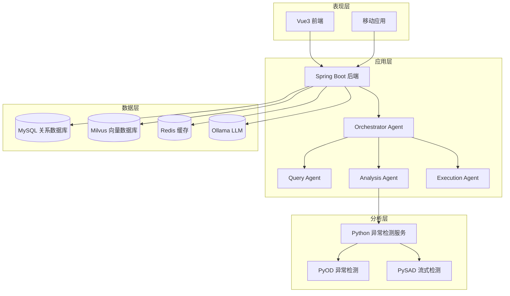
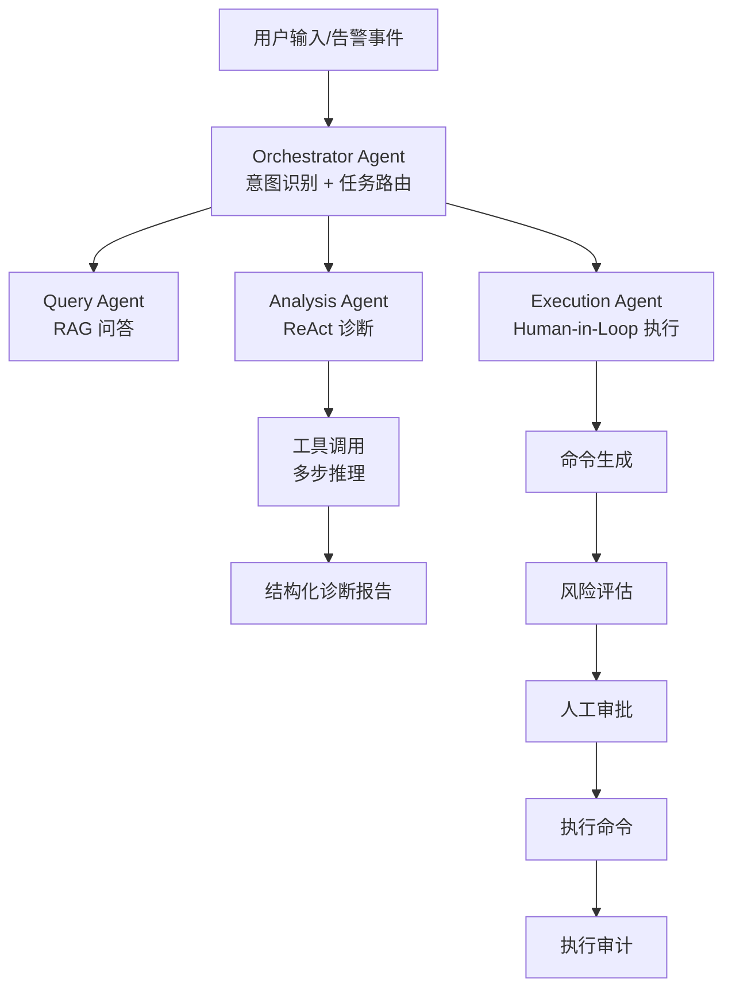
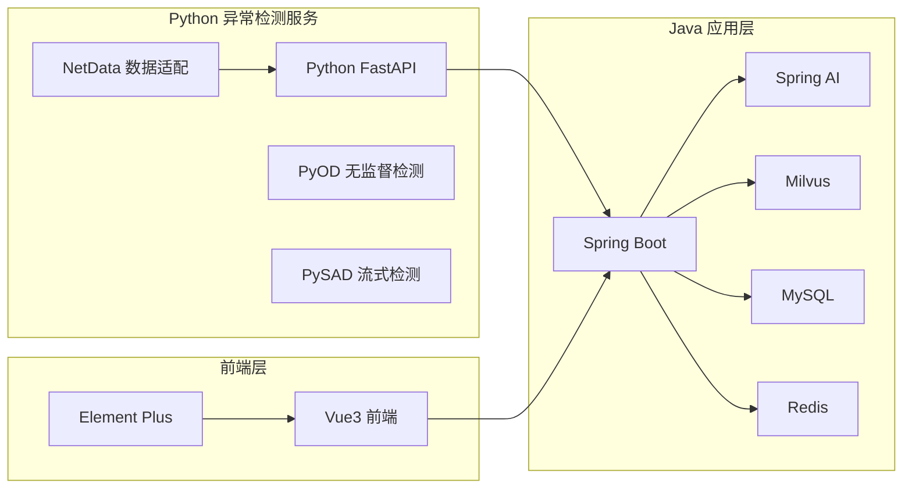
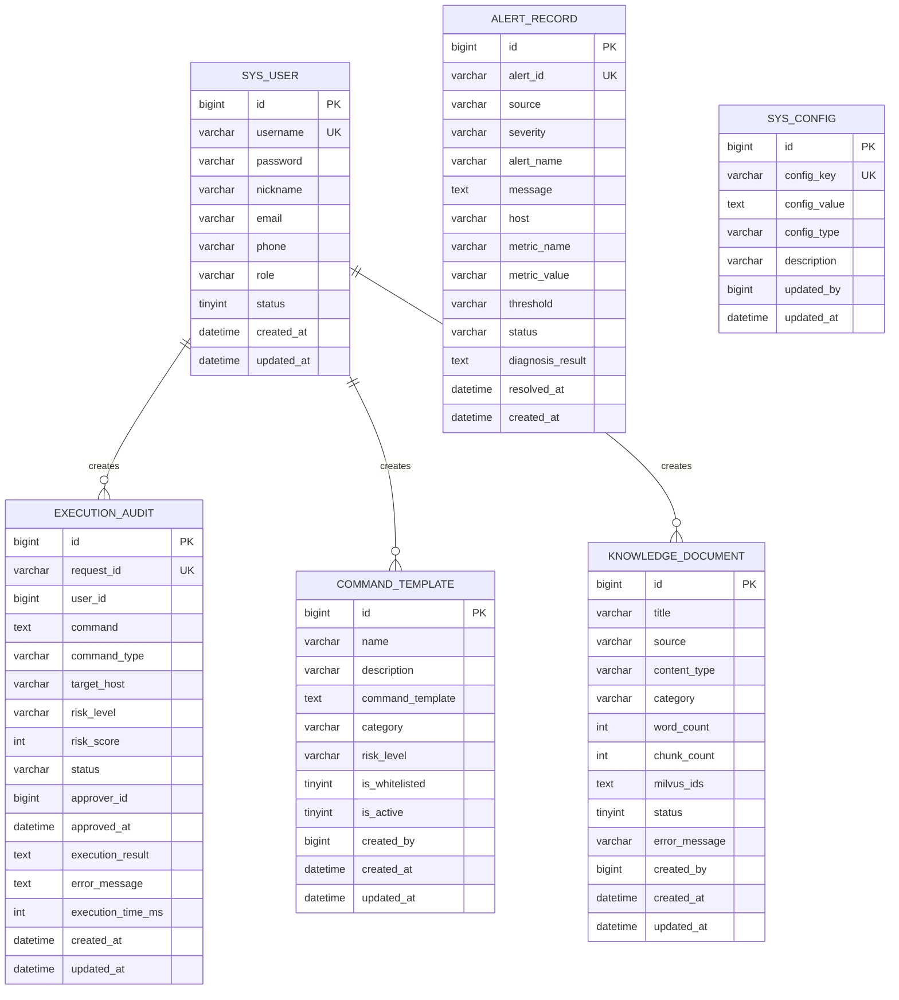
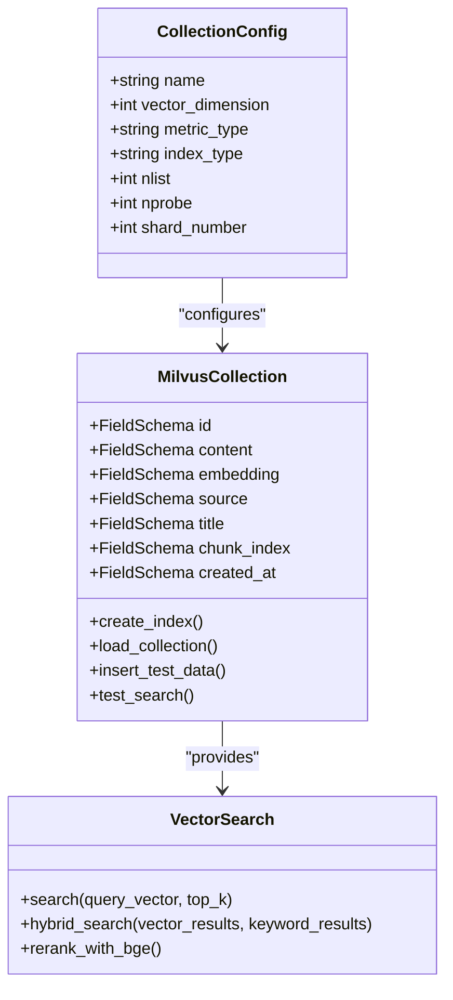
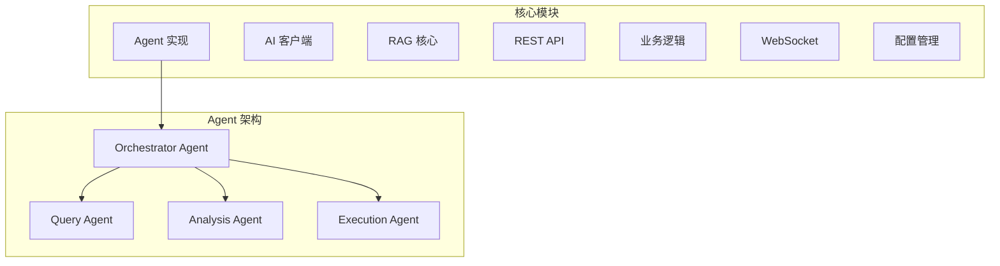
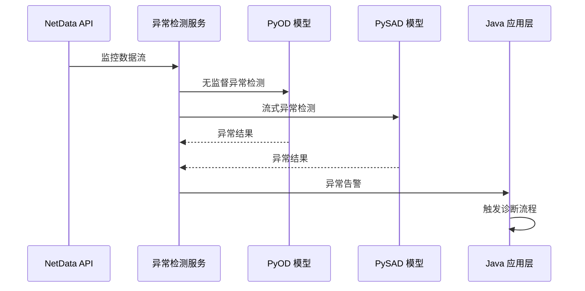
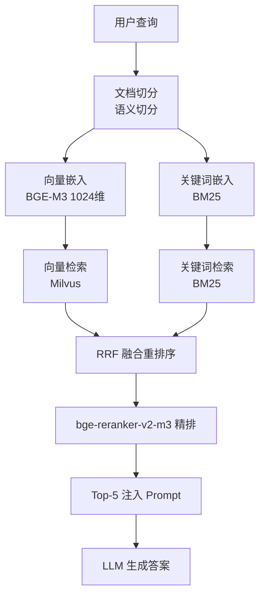
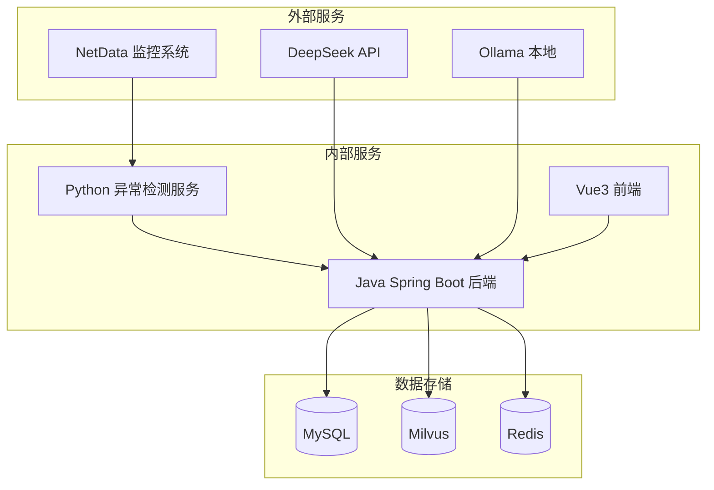
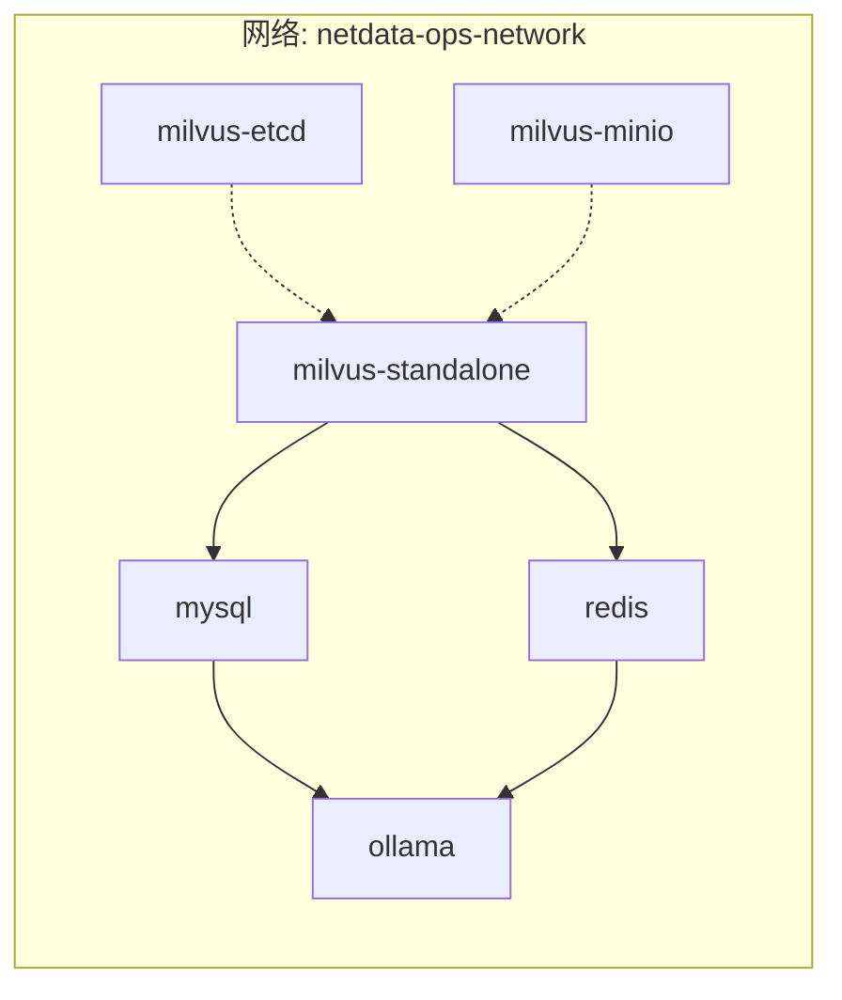

# 整体架构概览

<cite>
**本文档引用的文件**
- [PROJECT_CONTEXT.md](file://PROJECT_CONTEXT.md)
- [开题报告_精简版.md](file://开题报告_精简版.md)
- [docker-compose.yml](file://docker-compose.yml)
- [config/milvus_collection.yaml](file://config/milvus_collection.yaml)
- [sql/init.sql](file://sql/init.sql)
- [scripts/init_milvus.py](file://scripts/init_milvus.py)
- [scripts/verify-env.ps1](file://scripts/verify-env.ps1)
- [tests/test_milvus_connection.py](file://tests/test_milvus_connection.py)
</cite>

## 目录
1. [简介](#简介)
2. [项目结构](#项目结构)
3. [核心组件](#核心组件)
4. [架构总览](#架构总览)
5. [详细组件分析](#详细组件分析)
6. [依赖关系分析](#依赖关系分析)
7. [性能考虑](#性能考虑)
8. [故障排除指南](#故障排除指南)
9. [结论](#结论)

## 简介

智能运维问答系统是一个基于 NetData 监控数据的多 Agent 协同智能运维平台。该系统通过 Python 和 Java 混合技术栈，结合大语言模型（LLM）和异常检测算法，为运维人员提供智能化的故障诊断、问题解答和自动化执行能力。

系统的核心目标是通过自然语言问答、智能故障诊断和命令执行三大功能，显著提升运维效率，将平均故障定位时间从传统的 45 分钟降低到分钟级响应。

## 项目结构

系统采用分层架构设计，主要分为四个层次：



**图表来源**
- [PROJECT_CONTEXT.md:120-149](file://PROJECT_CONTEXT.md#L120-L149)
- [开题报告_精简版.md:118-152](file://开题报告_精简版.md#L118-L152)

**章节来源**
- [PROJECT_CONTEXT.md:120-149](file://PROJECT_CONTEXT.md#L120-L149)
- [开题报告_精简版.md:118-152](file://开题报告_精简版.md#L118-L152)

## 核心组件

### 技术栈概览

系统采用混合技术栈，充分发挥各技术的优势：

| 层次 | 技术 | 版本 | 用途 |
|------|------|------|------|
| 后端框架 | Spring Boot | 3.3.x | Java 主语言，微服务架构 |
| AI 框架 | Spring AI | 1.0.x | 大语言模型集成，ChatClient |
| 异常检测 | Python FastAPI + PyOD + PySAD | 最新 | 实时异常检测 |
| 向量数据库 | Milvus | 2.4 | RAG 检索，语义相似度计算 |
| LLM | DeepSeek-V3 API（主） | - | 生产环境 |
| LLM | Ollama 本地 | - | 开发调试 |
| 前端 | Vue 3 + Element Plus | 最新 | 用户界面 |
| 关系数据库 | MySQL | 8.0 | 结构化数据存储 |
| 缓存 | Redis | 7.x | 会话缓存，性能优化 |

### Agent 架构模式

系统采用 Orchestrator-Subagent 模式，实现智能任务路由和协调：



**图表来源**
- [PROJECT_CONTEXT.md:43-61](file://PROJECT_CONTEXT.md#L43-L61)

**章节来源**
- [PROJECT_CONTEXT.md:25-40](file://PROJECT_CONTEXT.md#L25-L40)
- [PROJECT_CONTEXT.md:43-61](file://PROJECT_CONTEXT.md#L43-L61)

## 架构总览

### 系统边界定义

系统边界清晰，专注于 NetData 监控数据的智能分析和自动化处置：

**系统不做 NetData 已做的功能**：
- 高频数据采集（1 秒级）
- 实时监控展示
- 基础告警通知

**本系统要做的功能**：
- 异常检测与根因分析（PyOD/PySAD）
- 智能运维问答（LLM+RAG）
- 自动化修复执行（安全范围内）

### 微服务架构设计理念

系统采用微服务架构，通过 Python 和 Java 的协同工作实现专业化分工：



**图表来源**
- [开题报告_精简版.md:118-152](file://开题报告_精简版.md#L118-L152)

**章节来源**
- [开题报告_精简版.md:71-92](file://开题报告_精简版.md#L71-L92)
- [开题报告_精简版.md:118-152](file://开题报告_精简版.md#L118-L152)

## 详细组件分析

### 数据层组件

#### MySQL 关系数据库

MySQL 作为关系数据库，承担以下关键职责：



**图表来源**
- [sql/init.sql:25-274](file://sql/init.sql#L25-L274)

#### Milvus 向量数据库

Milvus 作为向量数据库，支持高效的语义相似度检索：



**图表来源**
- [config/milvus_collection.yaml:22-140](file://config/milvus_collection.yaml#L22-L140)
- [scripts/init_milvus.py:75-104](file://scripts/init_milvus.py#L75-L104)

#### Redis 缓存系统

Redis 提供多层缓存支持：

- 会话缓存：用户登录状态管理
- RAG 检索结果缓存：提升检索性能
- 分布式锁：防止重复执行
- 实时告警去重：避免重复告警

**章节来源**
- [sql/init.sql:25-274](file://sql/init.sql#L25-L274)
- [config/milvus_collection.yaml:22-140](file://config/milvus_collection.yaml#L22-L140)
- [scripts/init_milvus.py:75-104](file://scripts/init_milvus.py#L75-L104)

### 应用层组件

#### Spring Boot 后端服务

应用层采用 Spring Boot 3.x 微服务架构，包含以下核心模块：



**图表来源**
- [PROJECT_CONTEXT.md:124-133](file://PROJECT_CONTEXT.md#L124-L133)

#### Spring AI 集成

Spring AI 提供统一的大语言模型集成接口：

- 使用 ChatClient 替代废弃的 AiClient
- 支持多种 LLM 提供商（DeepSeek API、Ollama）
- 统一的 Prompt 管理机制
- 工具调用和函数调用支持

**章节来源**
- [PROJECT_CONTEXT.md:124-133](file://PROJECT_CONTEXT.md#L124-L133)

### 分析层组件

#### Python 异常检测服务

异常检测服务采用 FastAPI 构建，支持实时异常检测：



**图表来源**
- [开题报告_精简版.md:163-189](file://开题报告_精简版.md#L163-L189)

#### RAG 检索流程

系统采用混合检索 RAG 方案：



**图表来源**
- [PROJECT_CONTEXT.md:64-82](file://PROJECT_CONTEXT.md#L64-L82)

**章节来源**
- [开题报告_精简版.md:163-189](file://开题报告_精简版.md#L163-L189)
- [PROJECT_CONTEXT.md:64-82](file://PROJECT_CONTEXT.md#L64-L82)

### 前端组件

#### Vue3 前端界面

前端采用 Vue3 + Element Plus 构建现代化用户界面：

- 聊天界面：自然语言运维问答
- 告警仪表板：实时告警监控
- 知识库界面：运维知识浏览
- 执行审批界面：命令审批流程

**章节来源**
- [PROJECT_CONTEXT.md:141-144](file://PROJECT_CONTEXT.md#L141-L144)

## 依赖关系分析

### 服务依赖图



**图表来源**
- [docker-compose.yml:23-357](file://docker-compose.yml#L23-L357)

### Docker Compose 服务编排

系统通过 Docker Compose 实现服务编排：



**图表来源**
- [docker-compose.yml:23-357](file://docker-compose.yml#L23-L357)

**章节来源**
- [docker-compose.yml:23-357](file://docker-compose.yml#L23-L357)

## 性能考虑

### 系统性能指标

系统性能目标：
- 端到端延迟控制在 3 分钟以内
- 数据采集延迟控制在 1 秒以内
- 异常检测实时性要求高
- RAG 检索响应时间优化

### 性能优化策略

1. **向量数据库优化**
   - Milvus 采用 IVF_FLAT 索引，平衡精度和性能
   - nlist 参数根据数据量动态调整
   - 内存分配充足，确保检索性能

2. **缓存策略**
   - Redis 缓存热点数据
   - RAG 检索结果缓存
   - 会话状态缓存

3. **异步处理**
   - 异常检测结果异步传输
   - 大数据处理异步执行
   - WebSocket 实时通信

4. **资源分配**
   - Milvus 分配 4G 内存
   - Ollama 分配 8G 内存
   - MySQL 分配 1G 内存

**章节来源**
- [开题报告_精简版.md:337-348](file://开题报告_精简版.md#L337-L348)
- [docker-compose.yml:147-289](file://docker-compose.yml#L147-L289)

## 故障排除指南

### 环境检查

使用 PowerShell 脚本进行环境验证：

```powershell
# 检查 Docker 环境
.\scripts\verify-env.ps1

# 常见检查项目
- Docker 安装状态
- Docker Compose 版本
- 端口占用情况
- 配置文件完整性
- 数据目录权限
- 服务健康状态
```

### Milvus 连接测试

```python
# 连接测试
python tests/test_milvus_connection.py

# 健康检查
curl http://localhost:9091/healthz
```

### 常见问题解决

1. **Milvus 连接失败**
   - 检查 etcd 服务状态
   - 验证 MinIO 配置
   - 确认内存分配足够

2. **Python 依赖问题**
   - 安装 pymilvus>=2.4.0
   - 检查 Python 环境
   - 验证网络连接

3. **端口冲突**
   - 修改 .env 中的端口配置
   - 关闭占用端口的应用程序
   - 使用不同的端口范围

**章节来源**
- [scripts/verify-env.ps1:1-251](file://scripts/verify-env.ps1#L1-L251)
- [tests/test_milvus_connection.py:1-148](file://tests/test_milvus_connection.py#L1-L148)

## 结论

智能运维问答系统通过 Python 和 Java 的混合架构设计，实现了高性能的智能运维能力。系统采用 Orchestrator-Subagent 模式，结合 RAG 检索和异常检测技术，为运维人员提供了完整的智能化解决方案。

### 核心优势

1. **技术架构先进**：采用微服务架构和 Agent 协作模式
2. **性能表现优异**：端到端延迟控制在分钟级
3. **扩展性强**：模块化设计便于功能扩展
4. **部署灵活**：Docker 化部署，易于维护

### 发展前景

系统为后续的功能扩展奠定了坚实基础，包括：
- Graph RAG 的知识图谱集成
- 更多 Agent 的协作机制
- 自动化执行能力的进一步完善
- 多云环境的支持

通过持续的优化和扩展，该系统将成为企业级智能运维的重要基础设施。