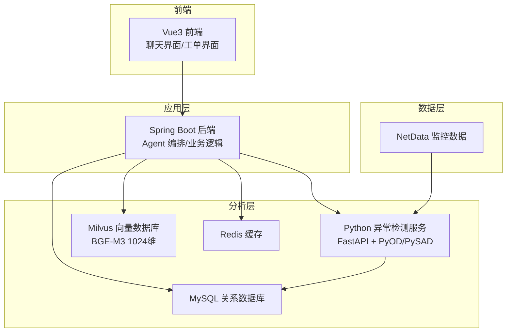
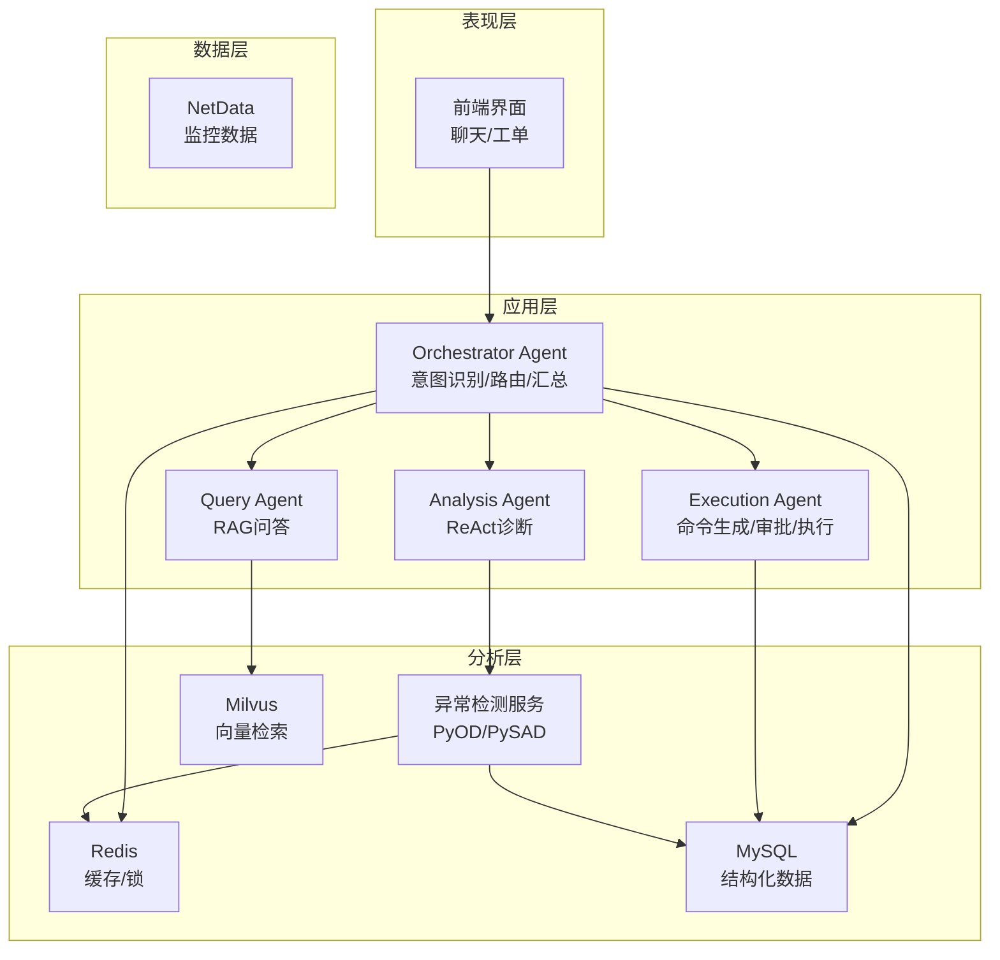
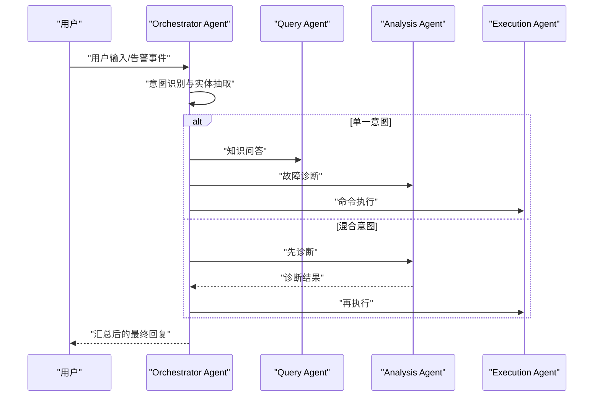
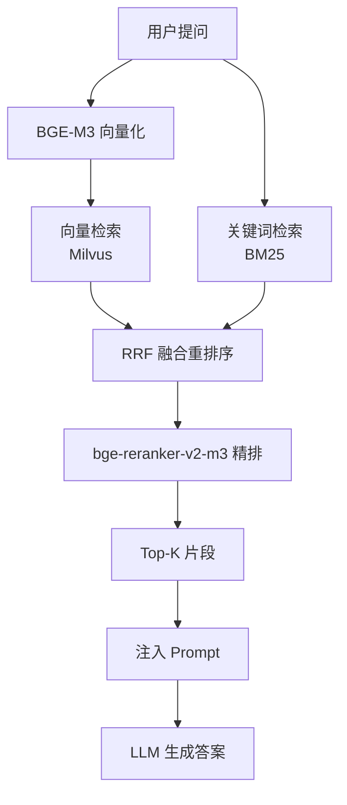
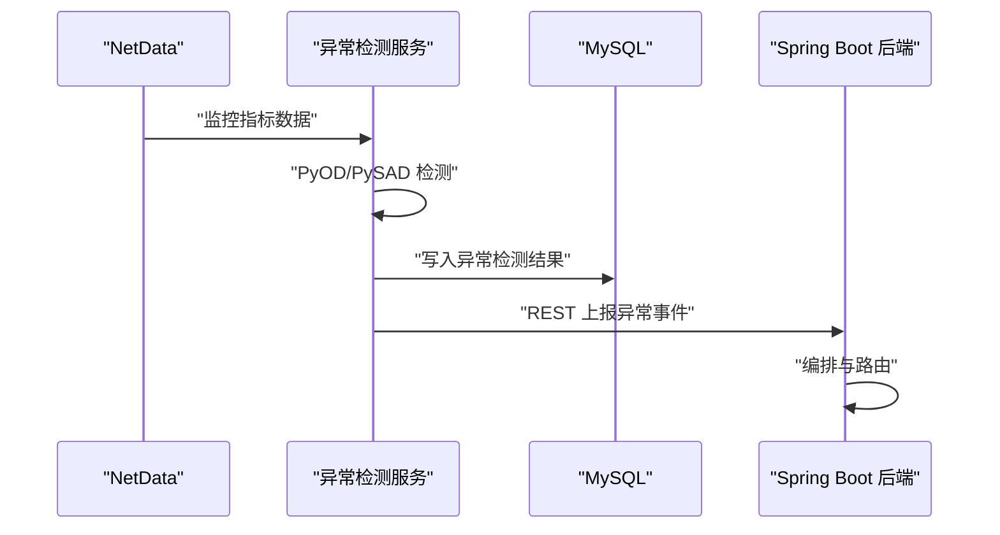
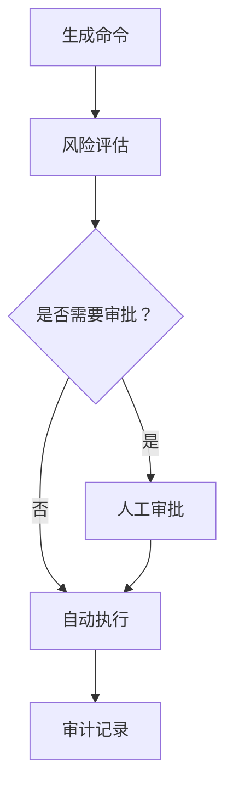
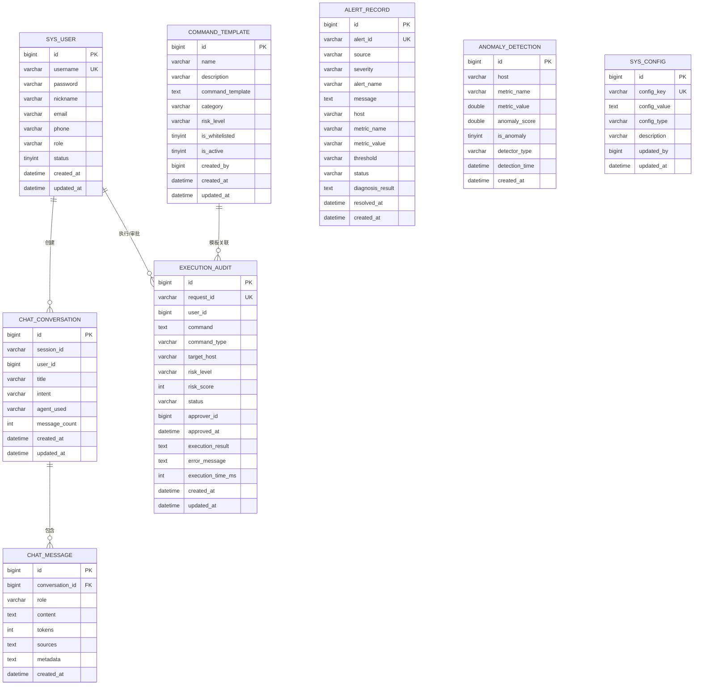
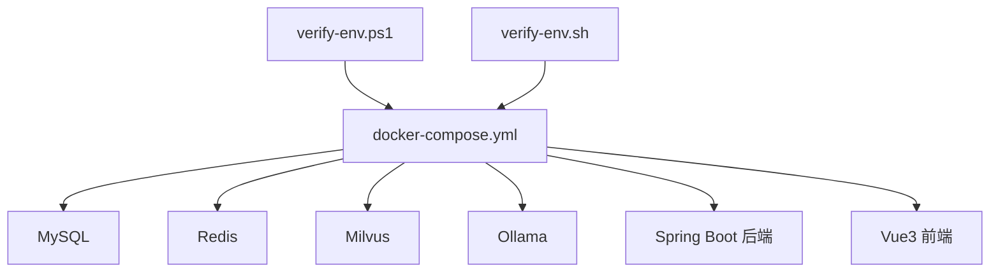

# 系统架构设计

<cite>
**本文档引用的文件**
- [PROJECT_CONTEXT.md](file://PROJECT_CONTEXT.md)
- [开题报告_精简版.md](file://开题报告_精简版.md)
- [docker-compose.yml](file://docker-compose.yml)
- [config/milvus_collection.yaml](file://config/milvus_collection.yaml)
- [scripts/init_milvus.py](file://scripts/init_milvus.py)
- [sql/init.sql](file://sql/init.sql)
- [docs/prompts/orchestrator-system-prompt.md](file://docs/prompts/orchestrator-system-prompt.md)
- [docs/prompts/shared-safety-constraints.md](file://docs/prompts/shared-safety-constraints.md)
- [scripts/verify-env.ps1](file://scripts/verify-env.ps1)
- [scripts/verify-env.sh](file://scripts/verify-env.sh)
</cite>

## 目录
1. [简介](#简介)
2. [项目结构](#项目结构)
3. [核心组件](#核心组件)
4. [架构总览](#架构总览)
5. [详细组件分析](#详细组件分析)
6. [依赖关系分析](#依赖关系分析)
7. [性能考虑](#性能考虑)
8. [故障排查指南](#故障排查指南)
9. [结论](#结论)
10. [附录](#附录)

## 简介
本系统面向 NetData 监控数据，构建“Orchestrator-Subagent 多 Agent 协同”的智能运维问答与执行平台。系统通过分层架构与微服务理念，将异常检测、RAG 知识检索、智能问答与执行审批等能力解耦为独立服务，实现“自然语言问答、智能故障诊断、命令执行”的一体化闭环。系统边界明确：不重复实现 NetData 的采集与展示，专注于在 NetData 数据基础上提供智能分析与自动化执行能力。

## 项目结构
系统采用多模块分层组织，包含后端 Java Spring Boot 应用、Python 异常检测服务、Vue3 前端以及 Milvus 向量数据库等基础设施。开发阶段规划清晰，当前处于 Phase 0 环境搭建阶段。

图表来源
- [PROJECT_CONTEXT.md:120-149](file://PROJECT_CONTEXT.md#L120-L149)
- [开题报告_精简版.md:118-152](file://开题报告_精简版.md#L118-L152)

章节来源
- [PROJECT_CONTEXT.md:120-149](file://PROJECT_CONTEXT.md#L120-L149)
- [开题报告_精简版.md:118-152](file://开题报告_精简版.md#L118-L152)

## 核心组件
- Orchestrator Agent：意图识别、任务路由、结果汇总，遵循严格的安全约束与紧急程度评估。
- Query Agent：基于混合检索（向量+关键词）与 rerank 的 RAG 流程，回答运维知识问题。
- Analysis Agent：ReAct 模式，多步工具调用，输出结构化诊断报告。
- Execution Agent：生成命令 → 风险评估 → 人工审批 → 执行 → 记录，支持白名单与分级审批。
- Python 异常检测服务：使用 PyOD/PySAD 实时检测异常，通过 REST 接口上报 Java 层。
- Milvus：向量数据库，存储运维知识库，支持 COSINE 相似度与 IVF_FLAT 索引。
- MySQL：存储用户、对话、命令审计、告警、配置等结构化数据。
- Redis：会话缓存、RAG 结果缓存、分布式锁、实时告警去重。
- Ollama：本地 LLM 推理服务，作为 DeepSeek API 的离线/隐私替代。

章节来源
- [PROJECT_CONTEXT.md:43-61](file://PROJECT_CONTEXT.md#L43-L61)
- [开题报告_精简版.md:191-301](file://开题报告_精简版.md#L191-L301)

## 架构总览
系统采用分层架构与微服务理念：
- 表现层：Vue3 前端，提供聊天与工单界面。
- 应用层：Spring Boot 后端，统一接入 Orchestrator Agent，协调各子 Agent。
- 分析层：Python 异常检测服务、Milvus、Redis、MySQL。
- 数据层：NetData 提供高频监控数据。

图表来源
- [开题报告_精简版.md:118-152](file://开题报告_精简版.md#L118-L152)
- [PROJECT_CONTEXT.md:43-61](file://PROJECT_CONTEXT.md#L43-L61)

## 详细组件分析

### Orchestrator-Subagent 协同模式
- 意图识别：根据关键词与上下文判断用户意图（知识问答、故障诊断、命令执行、混合意图）。
- 任务路由：单一意图直接路由，混合意图按优先级串行执行；严格限制涉及删除/修改/重启的操作必须进入 Execution Agent。
- 结果汇总：整合子 Agent 输出，生成连贯回复；对低置信度请求引导用户提供更多信息。

图表来源
- [docs/prompts/orchestrator-system-prompt.md:16-106](file://docs/prompts/orchestrator-system-prompt.md#L16-L106)
- [docs/prompts/orchestrator-system-prompt.md:37-57](file://docs/prompts/orchestrator-system-prompt.md#L37-L57)

章节来源
- [docs/prompts/orchestrator-system-prompt.md:1-291](file://docs/prompts/orchestrator-system-prompt.md#L1-L291)

### RAG 检索与混合检索
- 文档切分：采用语义切分（Semantic Chunking），避免固定长度带来的语义割裂。
- 检索策略：向量检索（Milvus，BGE-M3 1024 维）与关键词检索（BM25）融合，RRF 融合重排序，bge-reranker-v2-m3 精排，Top-K 注入 Prompt。
- 索引配置：IVF_FLAT，nlist 与 nprobe 根据数据规模调优，COSINE 相似度。

图表来源
- [开题报告_精简版.md:191-221](file://开题报告_精简版.md#L191-L221)
- [config/milvus_collection.yaml:70-101](file://config/milvus_collection.yaml#L70-L101)
- [scripts/init_milvus.py:244-294](file://scripts/init_milvus.py#L244-L294)

章节来源
- [开题报告_精简版.md:191-221](file://开题报告_精简版.md#L191-L221)
- [config/milvus_collection.yaml:19-101](file://config/milvus_collection.yaml#L19-L101)
- [scripts/init_milvus.py:244-294](file://scripts/init_milvus.py#L244-L294)

### 异常检测服务（Python）
- 检测算法：PyOD（无监督）、PySAD（流式）。
- 通信协议：REST API，将异常事件上报 Java 后端。
- 数据落库：MySQL 异常检测结果表，便于后续诊断与审计。

图表来源
- [开题报告_精简版.md:163-169](file://开题报告_精简版.md#L163-L169)
- [开题报告_精简版.md:191-221](file://开题报告_精简版.md#L191-L221)

章节来源
- [开题报告_精简版.md:163-169](file://开题报告_精简版.md#L163-L169)

### 命令执行与审批（Human-in-the-Loop）
- 命令模板：白名单命令与风险等级分类，支持变量替换。
- 风险评估：自动/人工分级审批，高风险需人工确认。
- 审计追踪：执行审计表记录全过程，支持回滚与异常恢复。

图表来源
- [开题报告_精简版.md:268-301](file://开题报告_精简版.md#L268-L301)
- [sql/init.sql:112-159](file://sql/init.sql#L112-L159)

章节来源
- [开题报告_精简版.md:268-301](file://开题报告_精简版.md#L268-L301)
- [sql/init.sql:112-159](file://sql/init.sql#L112-L159)

### 数据库与缓存
- MySQL：用户、对话、命令审计、告警、配置等结构化数据，提供视图用于统计分析。
- Redis：会话缓存、RAG 结果缓存、分布式锁、实时告警去重。

图表来源
- [sql/init.sql:23-274](file://sql/init.sql#L23-L274)

章节来源
- [sql/init.sql:23-274](file://sql/init.sql#L23-L274)

### 安全约束与审计
- 命令黑名单：绝对禁止的危险命令。
- 需审批命令：服务操作、进程操作、配置修改、数据操作、网络操作等。
- 自动执行命令：信息查询、日志查看、服务状态、临时文件清理等。
- 数据脱敏：密码、API 密钥、数据库连接串等敏感信息脱敏处理。
- 审计日志：记录用户登录/登出、命令生成、风险评估、审批决策、命令执行、配置变更、数据访问等。

章节来源
- [docs/prompts/shared-safety-constraints.md:1-396](file://docs/prompts/shared-safety-constraints.md#L1-L396)

## 依赖关系分析
系统采用 Docker Compose 编排，服务间通过容器网络互通，端口映射便于外部访问与调试。环境验证脚本提供跨平台的健康检查与端口占用检测。

图表来源
- [docker-compose.yml:23-357](file://docker-compose.yml#L23-L357)
- [scripts/verify-env.ps1:1-251](file://scripts/verify-env.ps1#L1-L251)
- [scripts/verify-env.sh:1-318](file://scripts/verify-env.sh#L1-L318)

章节来源
- [docker-compose.yml:23-357](file://docker-compose.yml#L23-L357)
- [scripts/verify-env.ps1:1-251](file://scripts/verify-env.ps1#L1-L251)
- [scripts/verify-env.sh:1-318](file://scripts/verify-env.sh#L1-L318)

## 性能考虑
- 向量检索性能：Milvus 使用 IVF_FLAT 索引，nlist 与 nprobe 根据数据规模调优；COSINE 相似度适合文本语义检索。
- 检索融合：向量与关键词检索通过 RRF 融合，再经 reranker 精排，平衡召回与精度。
- 缓存策略：Redis 缓存对话与检索结果，减少重复计算与数据库压力。
- 异常检测：Python 服务与 Java 后端通过 REST 通信，注意合理设置超时与重试，避免大数据量下的超时问题。
- LLM 切换：通过配置文件切换 DeepSeek API 与 Ollama，避免硬编码，便于不同环境灵活切换。

章节来源
- [开题报告_精简版.md:191-221](file://开题报告_精简版.md#L191-L221)
- [PROJECT_CONTEXT.md:110-117](file://PROJECT_CONTEXT.md#L110-L117)

## 故障排查指南
- 环境检查：使用 verify-env.ps1（Windows）或 verify-env.sh（Linux/macOS）检查 Docker、端口占用、配置文件与数据目录。
- 服务健康：通过 docker-compose ps 查看容器状态，使用健康检查端口验证服务可用性。
- 数据库初始化：首次启动自动执行 init.sql，确保数据库表结构与默认数据正确创建。
- Milvus 初始化：使用 init_milvus.py 创建 Collection、索引并插入测试数据，验证向量检索功能。
- 日志查看：使用 docker-compose logs -f 查看各服务日志，定位问题根因。

章节来源
- [scripts/verify-env.ps1:1-251](file://scripts/verify-env.ps1#L1-L251)
- [scripts/verify-env.sh:1-318](file://scripts/verify-env.sh#L1-L318)
- [sql/init.sql:1-274](file://sql/init.sql#L1-L274)
- [scripts/init_milvus.py:457-516](file://scripts/init_milvus.py#L457-L516)

## 结论
本系统通过 Orchestrator-Subagent 多 Agent 协同模式，结合混合检索 RAG、ReAct 诊断与 Human-in-the-Loop 执行流程，形成从 NetData 监控数据到最终响应用户的完整链路。系统采用分层架构与微服务理念，组件职责清晰、边界明确，具备良好的扩展性与安全性。当前 Phase 0 环境搭建完成后，将按计划推进异常检测、RAG 知识库、Multi-Agent 与前端集成等阶段任务。

## 附录
- 系统边界：不重复实现 NetData 的采集与展示，专注于智能问答与自动化执行。
- 开发阶段：Phase 0（环境搭建）→ Phase 1（异常检测）→ Phase 2（RAG 知识库）→ Phase 3（Multi-Agent）→ Phase 4（执行审批）→ Phase 5（前端集成）→ Phase 6（测试与论文）。
- 技术决策：Spring AI ChatClient、Milvus 2.4、BGE-M3 1024 维、IVF_FLAT 索引、RAG 混合检索、安全约束与审计日志。

章节来源
- [PROJECT_CONTEXT.md:85-107](file://PROJECT_CONTEXT.md#L85-L107)
- [开题报告_精简版.md:71-92](file://开题报告_精简版.md#L71-L92)