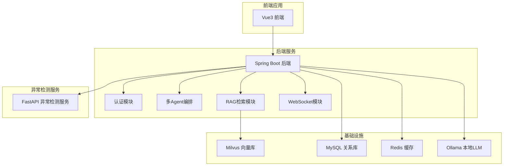
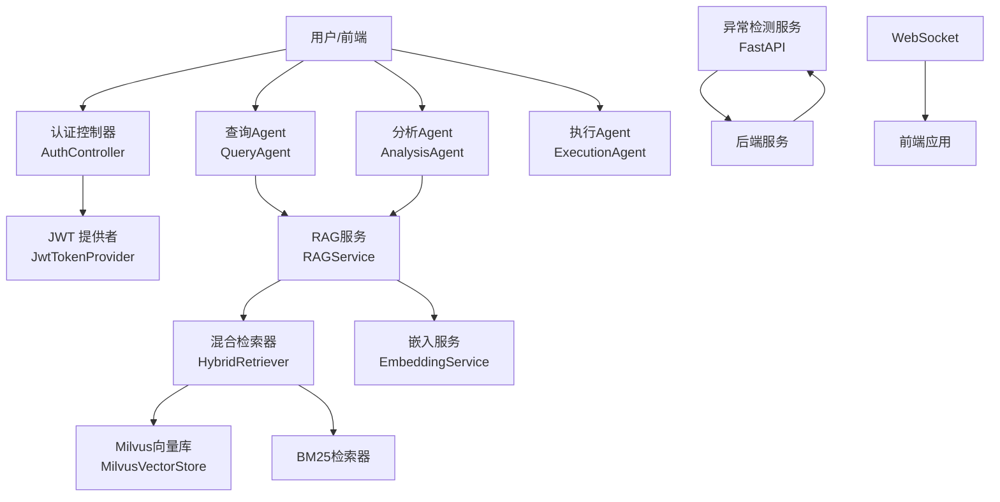
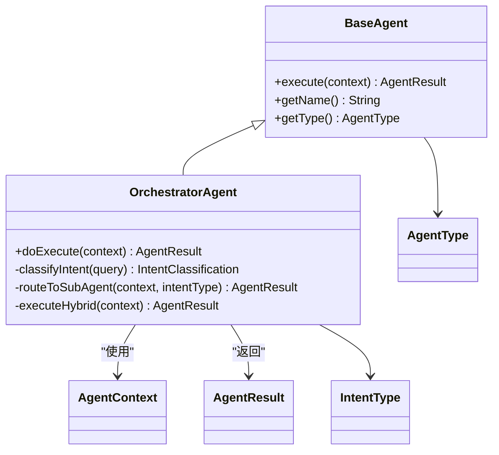
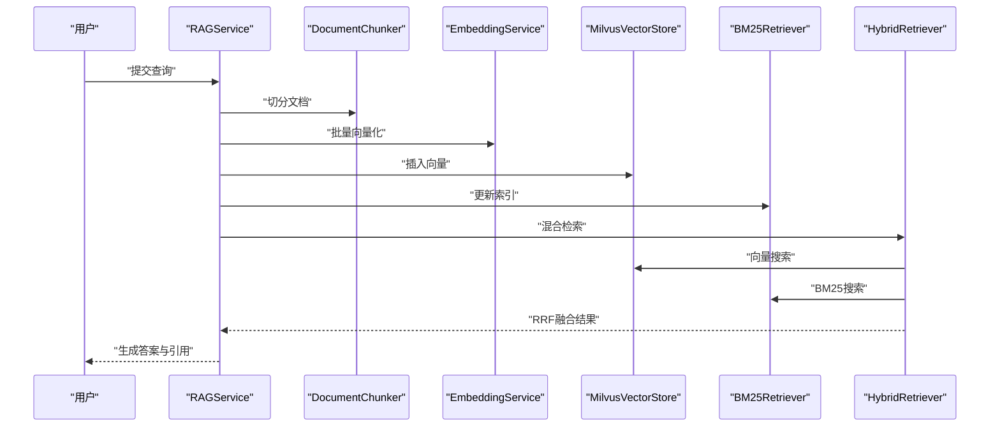
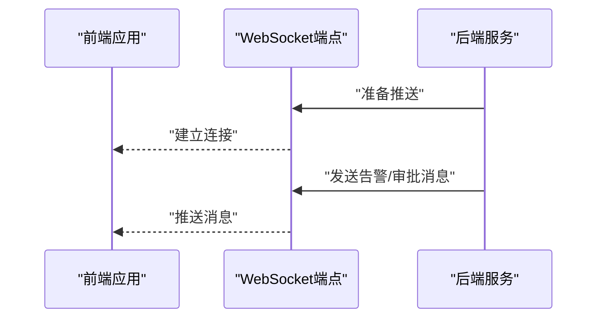
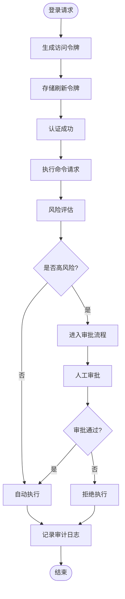
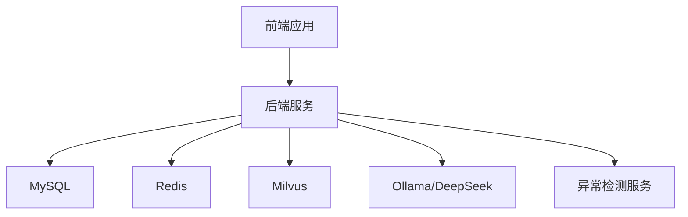

# 系统架构设计

<cite>
**本文引用的文件**   
- [NetDataOpsApplication.java](file://netdata-ai-backend/src/main/java/com/netdata/ops/NetDataOpsApplication.java)
- [application.yml](file://netdata-ai-backend/src/main/resources/application.yml)
- [docker-compose.yml](file://docker-compose.yml)
- [PROJECT_CONTEXT.md](file://PROJECT_CONTEXT.md)
- [OrchestratorAgent.java](file://netdata-ai-backend/src/main/java/com/netdata/ops/core/agent/OrchestratorAgent.java)
- [BaseAgent.java](file://netdata-ai-backend/src/main/java/com/netdata/ops/core/agent/BaseAgent.java)
- [RAGService.java](file://netdata-ai-backend/src/main/java/com/netdata/ops/core/rag/RAGService.java)
- [HybridRetriever.java](file://netdata-ai-backend/src/main/java/com/netdata/ops/core/rag/HybridRetriever.java)
- [MilvusVectorStore.java](file://netdata-ai-backend/src/main/java/com/netdata/ops/core/rag/MilvusVectorStore.java)
- [main.py](file://anomaly-detection-service/app/main.py)
- [AuthController.java](file://netdata-ai-backend/src/main/java/com/netdata/ops/controller/AuthController.java)
- [JwtTokenProvider.java](file://netdata-ai-backend/src/main/java/com/netdata/ops/security/JwtTokenProvider.java)
</cite>

## 目录
1. [简介](#简介)
2. [项目结构](#项目结构)
3. [核心组件](#核心组件)
4. [架构总览](#架构总览)
5. [详细组件分析](#详细组件分析)
6. [依赖关系分析](#依赖关系分析)
7. [性能考量](#性能考量)
8. [故障排查指南](#故障排查指南)
9. [结论](#结论)
10. [附录](#附录)

## 简介
本系统是一个面向 NetData 监控数据的智能运维问答与执行平台，采用微服务架构，包含后端服务、异常检测服务、前端应用三大部分。系统以“编排器-子Agent”模式实现多Agent协同，结合RAG检索增强系统提供知识问答能力，并通过WebSocket实现实时通信。安全方面采用JWT认证与权限控制，命令执行具备风险评估与人工审批流程。

## 项目结构
系统采用分层与模块化组织方式：
- 后端服务（Spring Boot）：负责认证授权、业务逻辑、RAG检索、WebSocket实时通信、异常检测服务集成等。
- 异常检测服务（Python FastAPI）：独立微服务，提供异常检测能力并与后端通过HTTP通信。
- 前端应用（Vue 3）：提供聊天对话、告警看板、知识库、执行审批等视图。
- 基础设施（Docker Compose）：统一编排 Milvus、MySQL、Redis、Ollama 等依赖服务。

图表来源
- [docker-compose.yml:23-358](file://docker-compose.yml#L23-L358)
- [PROJECT_CONTEXT.md:120-149](file://PROJECT_CONTEXT.md#L120-L149)

章节来源
- [PROJECT_CONTEXT.md:120-149](file://PROJECT_CONTEXT.md#L120-L149)
- [docker-compose.yml:23-358](file://docker-compose.yml#L23-L358)

## 核心组件
- 编排器 Agent：负责意图识别与任务路由，将用户输入分派给查询、分析或执行子Agent。
- 查询 Agent：基于RAG的问答Agent，提供知识检索与答案生成。
- 分析 Agent：ReAct模式的诊断Agent，进行多步工具调用与结构化报告生成。
- 执行 Agent：命令生成、风险评估、人工审批与执行记录。
- RAG服务：文档入库、混合检索（向量+BM25）、RRF融合与上下文构建。
- 异常检测服务：独立FastAPI服务，提供异常检测能力并与后端集成。
- 认证与安全：JWT令牌签发与校验、权限拦截、速率限制、命令黑名单白名单与风险阈值控制。
- 实时通信：WebSocket通道用于告警与审批通知推送。

章节来源
- [OrchestratorAgent.java:10-28](file://netdata-ai-backend/src/main/java/com/netdata/ops/core/agent/OrchestratorAgent.java#L10-L28)
- [BaseAgent.java:24-41](file://netdata-ai-backend/src/main/java/com/netdata/ops/core/agent/BaseAgent.java#L24-L41)
- [RAGService.java:11-31](file://netdata-ai-backend/src/main/java/com/netdata/ops/core/rag/RAGService.java#L11-L31)
- [main.py:76-102](file://anomaly-detection-service/app/main.py#L76-L102)
- [application.yml:183-194](file://netdata-ai-backend/src/main/resources/application.yml#L183-L194)

## 架构总览
系统采用“后端服务 + 异常检测服务 + 前端应用”的三层架构，后端通过RAG模块与Milvus向量库交互，通过嵌入服务与BM25检索器实现混合检索，最终将融合结果注入LLM生成答案。异常检测服务通过HTTP接口与后端交互，后端通过WebSocket向前端推送实时告警与审批通知。

图表来源
- [AuthController.java:22-26](file://netdata-ai-backend/src/main/java/com/netdata/ops/controller/AuthController.java#L22-L26)
- [JwtTokenProvider.java:23-42](file://netdata-ai-backend/src/main/java/com/netdata/ops/security/JwtTokenProvider.java#L23-L42)
- [RAGService.java:32-42](file://netdata-ai-backend/src/main/java/com/netdata/ops/core/rag/RAGService.java#L32-L42)
- [HybridRetriever.java:37-44](file://netdata-ai-backend/src/main/java/com/netdata/ops/core/rag/HybridRetriever.java#L37-L44)
- [MilvusVectorStore.java:40-60](file://netdata-ai-backend/src/main/java/com/netdata/ops/core/rag/MilvusVectorStore.java#L40-L60)
- [main.py:76-102](file://anomaly-detection-service/app/main.py#L76-L102)

## 详细组件分析

### 多Agent协同架构
- 意图识别：编排器根据关键词与正则表达式对用户输入进行意图分类，支持知识问答、故障诊断、命令执行与混合意图。
- 任务路由：根据意图类型将请求分发至对应子Agent；对于混合意图，先执行分析Agent，再汇总查询与建议命令。
- 执行流程：Agent基类提供模板方法，统一前置校验、执行核心逻辑与结果封装，便于扩展与维护。

图表来源
- [BaseAgent.java:24-167](file://netdata-ai-backend/src/main/java/com/netdata/ops/core/agent/BaseAgent.java#L24-L167)
- [OrchestratorAgent.java:31-84](file://netdata-ai-backend/src/main/java/com/netdata/ops/core/agent/OrchestratorAgent.java#L31-L84)

章节来源
- [OrchestratorAgent.java:86-175](file://netdata-ai-backend/src/main/java/com/netdata/ops/core/agent/OrchestratorAgent.java#L86-L175)
- [BaseAgent.java:50-105](file://netdata-ai-backend/src/main/java/com/netdata/ops/core/agent/BaseAgent.java#L50-L105)

### RAG检索增强系统
- 文档入库：文档切分 → 批量向量化 → Milvus存储 → 更新BM25索引。
- 知识检索：向量检索（Milvus）+ BM25检索 → RRF融合 → Top-K返回。
- 上下文构建：将检索结果格式化为提示上下文，注入LLM生成答案。
- 统计与引用：提供向量库与BM25索引统计，生成引用来源列表。

图表来源
- [RAGService.java:57-130](file://netdata-ai-backend/src/main/java/com/netdata/ops/core/rag/RAGService.java#L57-L130)
- [HybridRetriever.java:64-100](file://netdata-ai-backend/src/main/java/com/netdata/ops/core/rag/HybridRetriever.java#L64-L100)
- [MilvusVectorStore.java:217-254](file://netdata-ai-backend/src/main/java/com/netdata/ops/core/rag/MilvusVectorStore.java#L217-L254)

章节来源
- [RAGService.java:43-130](file://netdata-ai-backend/src/main/java/com/netdata/ops/core/rag/RAGService.java#L43-L130)
- [HybridRetriever.java:11-38](file://netdata-ai-backend/src/main/java/com/netdata/ops/core/rag/HybridRetriever.java#L11-L38)
- [MilvusVectorStore.java:117-209](file://netdata-ai-backend/src/main/java/com/netdata/ops/core/rag/MilvusVectorStore.java#L117-L209)

### 实时通信架构（WebSocket）
- WebSocket路径与跨域配置在后端配置文件中定义，用于实时推送告警与审批通知。
- 前端通过WebSocket连接后端，接收来自后端的事件推送，实现低延迟的运维消息通知。

图表来源
- [application.yml:219-224](file://netdata-ai-backend/src/main/resources/application.yml#L219-L224)

章节来源
- [application.yml:219-224](file://netdata-ai-backend/src/main/resources/application.yml#L219-L224)

### 安全架构设计
- JWT认证：提供访问令牌与刷新令牌生成、验证、黑名单与刷新令牌存储，支持主动注销与多设备管理。
- 权限控制：基于注解与拦截器实现权限校验与操作日志记录。
- 命令执行安全：命令黑名单与白名单策略、风险阈值分级、人工审批流程，确保高危命令不会被直接执行。

图表来源
- [JwtTokenProvider.java:47-84](file://netdata-ai-backend/src/main/java/com/netdata/ops/security/JwtTokenProvider.java#L47-L84)
- [application.yml:149-181](file://netdata-ai-backend/src/main/resources/application.yml#L149-L181)

章节来源
- [AuthController.java:28-57](file://netdata-ai-backend/src/main/java/com/netdata/ops/controller/AuthController.java#L28-L57)
- [JwtTokenProvider.java:89-107](file://netdata-ai-backend/src/main/java/com/netdata/ops/security/JwtTokenProvider.java#L89-L107)

## 依赖关系分析
- 后端服务依赖：Spring Boot、Spring AI、MyBatis-Plus、MySQL、Redis、Milvus、Ollama/DeepSeek。
- 异常检测服务依赖：FastAPI、PyOD/PySAD、NetData API。
- 前端应用依赖：Vue 3、Element Plus、Axios、Pinia 状态管理。

图表来源
- [application.yml:14-110](file://netdata-ai-backend/src/main/resources/application.yml#L14-L110)
- [docker-compose.yml:23-358](file://docker-compose.yml#L23-L358)

章节来源
- [application.yml:14-110](file://netdata-ai-backend/src/main/resources/application.yml#L14-L110)
- [docker-compose.yml:23-358](file://docker-compose.yml#L23-L358)

## 性能考量
- 向量检索：Milvus使用IVF_FLAT索引与COSINE度量，平衡准确率与性能；建议合理设置nlist与Top-K参数。
- 混合检索：向量与BM25分别检索后使用RRF融合，减少单一信号偏差；可按业务调整RRF平滑参数与最终Top-K。
- 缓存策略：Redis用于会话、RAG结果与分布式锁，建议设置合理的TTL与淘汰策略。
- 异常检测：Python服务与Java后端之间设置超时与重试，避免阻塞影响整体响应。
- LLM切换：通过Profile区分开发（Ollama）与生产（DeepSeek API），避免硬编码导致的性能与成本问题。

## 故障排查指南
- Milvus不可用：RAGService在连接失败时降级为不可用状态，不影响其他功能；检查Milvus健康状态与网络连通性。
- JWT失效：验证失败可能由于过期或已被加入黑名单；检查Redis中的黑名单与刷新令牌存储。
- 异常检测超时：Java侧应设置合理超时与重试次数；检查Python服务日志与资源占用。
- WebSocket无法连接：确认配置中的路径与跨域设置，检查后端日志与防火墙策略。

章节来源
- [MilvusVectorStore.java:98-102](file://netdata-ai-backend/src/main/java/com/netdata/ops/core/rag/MilvusVectorStore.java#L98-L102)
- [JwtTokenProvider.java:89-107](file://netdata-ai-backend/src/main/java/com/netdata/ops/security/JwtTokenProvider.java#L89-L107)
- [main.py:118-140](file://anomaly-detection-service/app/main.py#L118-L140)
- [application.yml:219-224](file://netdata-ai-backend/src/main/resources/application.yml#L219-L224)

## 结论
本系统通过清晰的微服务分层、稳定的RAG检索与多Agent协同机制，实现了从知识问答到故障诊断再到命令执行的闭环运维能力。结合JWT认证、权限控制与命令安全策略，保障了系统的安全性与可控性。Docker Compose提供了便捷的一键部署体验，适合开发与演示场景；生产部署可根据需要扩展为集群模式与更严格的安全部署策略。

## 附录
- 系统边界：后端服务、异常检测服务、前端应用三部分明确分离；RAG依赖Milvus、MySQL、Redis、LLM；异常检测服务通过HTTP与后端交互。
- 组件交互：后端通过RAG模块与Milvus交互，通过嵌入服务与BM25检索器实现混合检索；异常检测服务通过HTTP接口与后端集成；前端通过WebSocket接收实时消息。