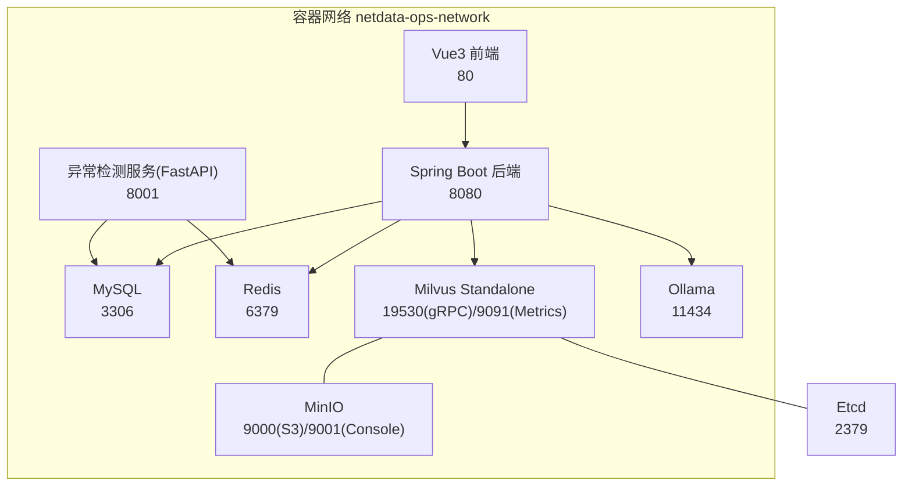
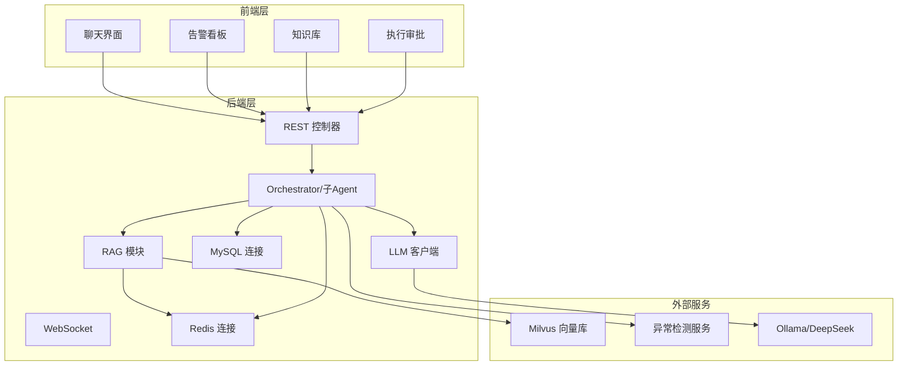
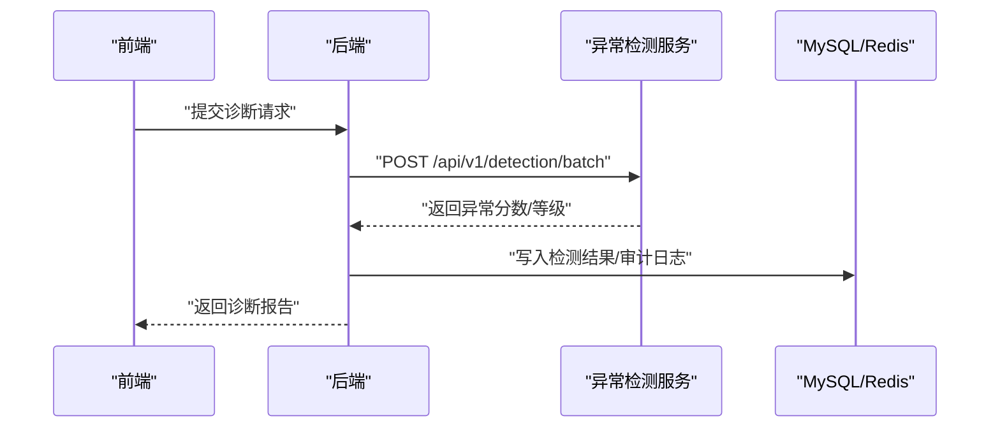
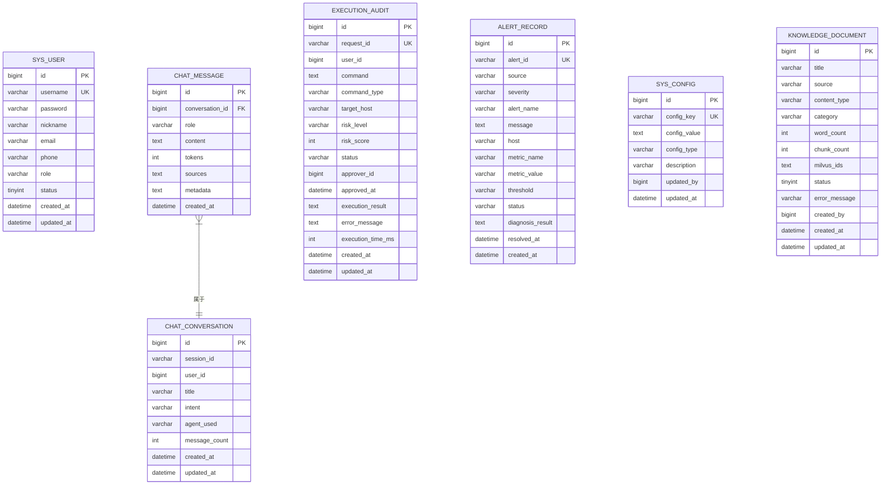
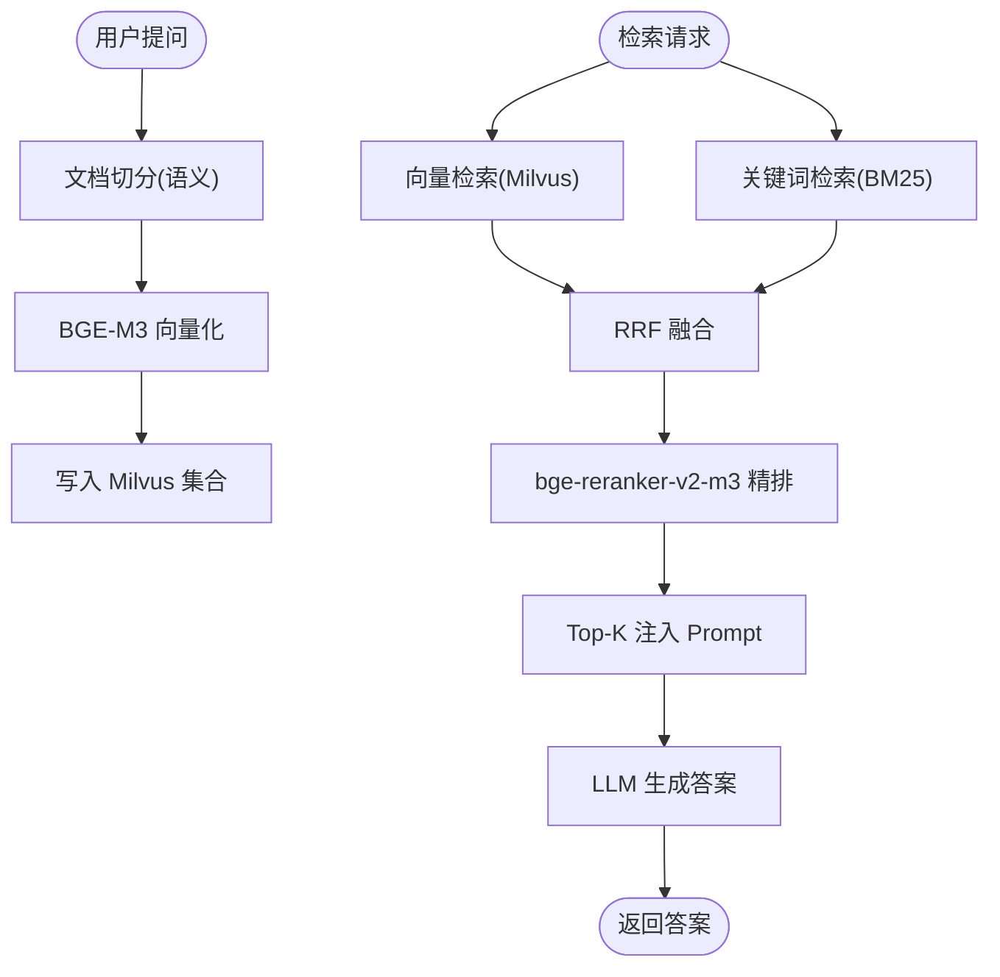
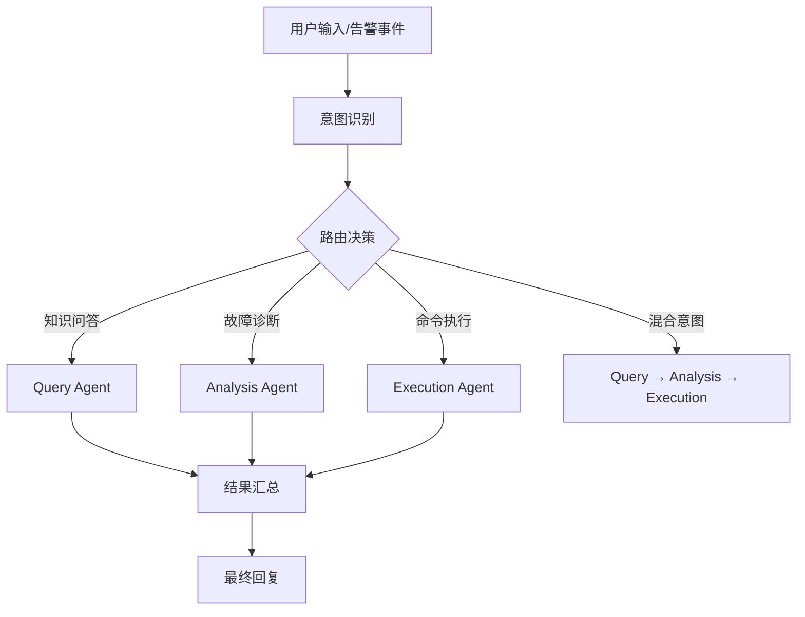
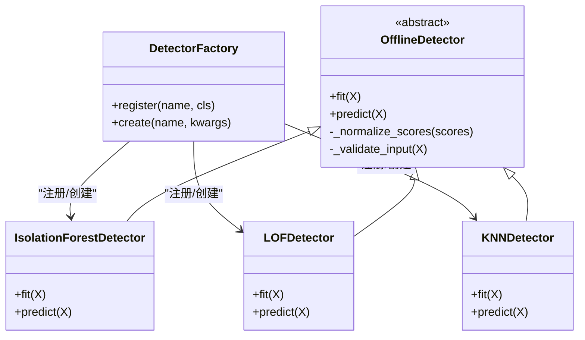
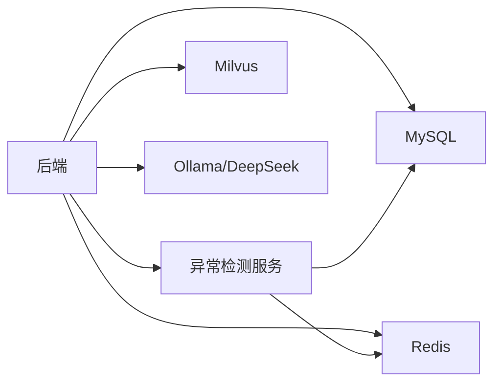

# 组件交互关系

<cite>
**本文引用的文件**
- [docker-compose.yml](file://docker-compose.yml)
- [PROJECT_CONTEXT.md](file://PROJECT_CONTEXT.md)
- [milvus_collection.yaml](file://config/milvus_collection.yaml)
- [init_milvus.py](file://scripts/init_milvus.py)
- [init.sql](file://sql/init.sql)
- [test_milvus_connection.py](file://tests/test_milvus_connection.py)
- [orchestrator-system-prompt.md](file://docs/prompts/orchestrator-system-prompt.md)
- [shared-safety-constraints.md](file://docs/prompts/shared-safety-constraints.md)
- [verify-env.sh](file://scripts/verify-env.sh)
- [verify-env.ps1](file://scripts/verify-env.ps1)
- [requirements.txt](file://anomaly-detection-service/requirements.txt)
- [app/main.py](file://anomaly-detection-service/app/main.py)
- [app/config.py](file://anomaly-detection-service/app/config.py)
- [app/api/routes/detection.py](file://anomaly-detection-service/app/api/routes/detection.py)
- [app/core/pyod_detector.py](file://anomaly-detection-service/app/core/pyod_detector.py)
</cite>

## 目录
1. [简介](#简介)
2. [项目结构](#项目结构)
3. [核心组件](#核心组件)
4. [架构总览](#架构总览)
5. [详细组件分析](#详细组件分析)
6. [依赖分析](#依赖分析)
7. [性能考虑](#性能考虑)
8. [故障排查指南](#故障排查指南)
9. [结论](#结论)
10. [附录](#附录)

## 简介
本文件聚焦“智能运维问答系统”的组件交互关系，围绕 Spring Boot 后端与 Python 异常检测服务的通信机制、前端与后端的 API 交互、后端与数据库的连接管理、向量数据库与 RAG 系统的集成等主题，系统梳理各技术组件之间的依赖关系与交互方式。文档还解释接口定义、数据格式约定、错误处理机制，并阐述分布式环境下的组件协调（服务发现、负载均衡、容错处理）思路，提供组件交互图与接口文档，帮助开发者理解系统的集成架构与扩展点。

## 项目结构
项目采用多服务容器化编排，后端（Spring Boot）、异常检测（FastAPI）、向量数据库（Milvus）、关系数据库（MySQL）、缓存（Redis）、本地推理（Ollama）等服务通过 Docker Compose 统一编排。系统采用 Orchestrator-Subagent 模式，结合 RAG 与 ReAct 诊断，支撑自然语言问答、智能故障诊断与人工参与的命令执行。

图表来源
- [docker-compose.yml:23-357](file://docker-compose.yml#L23-L357)

章节来源
- [docker-compose.yml:1-357](file://docker-compose.yml#L1-L357)
- [PROJECT_CONTEXT.md:120-149](file://PROJECT_CONTEXT.md#L120-L149)

## 核心组件
- Spring Boot 后端：提供 REST API、WebSocket 实时通信、RAG 与 Agent 协调、数据库与缓存接入。
- 异常检测服务（FastAPI + PyOD/PySAD）：提供批量/流式异常检测、训练、NetData 集成。
- 向量数据库（Milvus 2.4）：存储 BGE-M3 向量，支持 IVF_FLAT 索引与 COSINE 相似度。
- 关系数据库（MySQL 8.0）：用户、对话、命令执行审计、告警记录、系统配置。
- 缓存（Redis 7.x）：会话、RAG 检索缓存、分布式锁、实时告警去重。
- 本地推理（Ollama）：DeepSeek-V3 API 为主、Ollama 本地作为备用。
- 前端（Vue3 + Element Plus）：聊天、告警看板、知识库、执行审批界面。

章节来源
- [PROJECT_CONTEXT.md:25-40](file://PROJECT_CONTEXT.md#L25-L40)
- [docker-compose.yml:23-357](file://docker-compose.yml#L23-L357)

## 架构总览
系统采用“后端统一编排 + 多微服务协同”的架构。后端负责意图识别与任务路由（Orchestrator Agent），子 Agent（Query/Analysis/Execution）分别对接 RAG、异常检测与命令执行流程。异常检测服务独立部署，通过 HTTP 接口与后端交互；向量数据库与 RAG 系统深度耦合，提供混合检索与重排；MySQL/Redis 提供持久化与缓存能力；Ollama 作为本地推理备选。

图表来源
- [PROJECT_CONTEXT.md:43-61](file://PROJECT_CONTEXT.md#L43-L61)
- [docker-compose.yml:23-357](file://docker-compose.yml#L23-L357)

## 详细组件分析

### Spring Boot 后端与异常检测服务的通信机制
- 通信协议：HTTP/HTTPS（REST API）
- 交互流程：
  1) 后端接收用户输入或告警事件，经 Orchestrator Agent 判定意图。
  2) 若需故障诊断，后端构造请求体，调用异常检测服务的 /api/v1/detection/batch 或 /api/v1/detection/stream。
  3) 异常检测服务返回异常分数、是否异常及等级，后端据此生成诊断报告或触发执行流程。
- 请求/响应约定：
  - 批量检测：请求包含时序数据点数组、检测器类型、阈值；响应包含总数、异常数、处理耗时、结果列表（可选）。
  - 流式检测：请求包含单条数据点与检测器类型；响应包含是否异常、异常分数、等级、处理耗时。
  - 训练检测器：请求包含训练数据、检测器类型、污染率、模型名；响应包含训练状态、模型名、样本数、耗时。
  - NetData 获取并检测：请求包含图表名、时间范围、点数、主机；响应与批量检测一致。
- 错误处理：后端捕获异常检测服务的 HTTP 错误码与异常，返回统一的错误结构，包含错误类型与可读消息。
- 超时与重试：建议在后端侧设置合理的连接/读取超时与指数退避重试，避免大数据量检测导致阻塞。

图表来源
- [app/api/routes/detection.py:55-153](file://anomaly-detection-service/app/api/routes/detection.py#L55-L153)
- [app/api/routes/detection.py:158-219](file://anomaly-detection-service/app/api/routes/detection.py#L158-L219)
- [app/api/routes/detection.py:224-279](file://anomaly-detection-service/app/api/routes/detection.py#L224-L279)
- [app/api/routes/detection.py:285-378](file://anomaly-detection-service/app/api/routes/detection.py#L285-L378)
- [app/config.py:80-104](file://anomaly-detection-service/app/config.py#L80-L104)

章节来源
- [app/api/routes/detection.py:55-378](file://anomaly-detection-service/app/api/routes/detection.py#L55-L378)
- [app/config.py:80-104](file://anomaly-detection-service/app/config.py#L80-L104)

### 前端与后端的 API 交互
- 前端通过 REST API 与后端交互，典型端点包括：
  - /api/chat：发起/继续对话，支持会话管理与消息历史。
  - /api/alerts：获取/处理告警，支持状态流转与诊断结果注入。
  - /api/knowledge：知识库检索与管理。
  - /api/execution：命令生成、风险评估、审批与执行。
- WebSocket：用于实时推送告警、审批状态、执行进度。
- 数据格式：统一采用 JSON，包含消息体、元数据、引用来源等字段；后端对敏感字段进行脱敏与校验。

章节来源
- [PROJECT_CONTEXT.md:120-149](file://PROJECT_CONTEXT.md#L120-L149)

### 后端与数据库的连接管理
- MySQL：提供用户、对话、命令执行审计、告警记录、系统配置等表结构；初始化脚本包含索引与视图。
- 连接池与事务：建议使用连接池与显式事务，保证并发安全与一致性。
- 配置项：通过系统配置表动态调整 LLM 参数、RAG Top-K、阈值等。

图表来源
- [init.sql:25-274](file://sql/init.sql#L25-L274)

章节来源
- [init.sql:25-274](file://sql/init.sql#L25-L274)

### 向量数据库与 RAG 系统的集成
- Milvus 集合结构：包含主键、内容、BGE-M3 向量（1024 维）、来源、标题、片段索引、时间戳等字段。
- 索引与搜索：采用 IVF_FLAT 索引，COSINE 相似度；nlist/nprobe 可调参数平衡精度与性能。
- RAG 流程：混合检索（向量 + BM25）→ RRF 融合 → reranker 精排 → Top-K 注入 Prompt → LLM 生成答案。
- 检索参数：Top-K、输出字段、搜索参数等在配置文件中集中管理。

图表来源
- [milvus_collection.yaml:22-140](file://config/milvus_collection.yaml#L22-L140)
- [init_milvus.py:133-242](file://scripts/init_milvus.py#L133-L242)
- [init_milvus.py:244-294](file://scripts/init_milvus.py#L244-L294)
- [PROJECT_CONTEXT.md:64-82](file://PROJECT_CONTEXT.md#L64-L82)

章节来源
- [milvus_collection.yaml:22-140](file://config/milvus_collection.yaml#L22-L140)
- [init_milvus.py:133-294](file://scripts/init_milvus.py#L133-L294)
- [PROJECT_CONTEXT.md:64-82](file://PROJECT_CONTEXT.md#L64-L82)

### Agent 与 Prompt 管理
- Orchestrator Agent：意图识别（知识问答/故障诊断/命令执行/混合意图）、路由决策、紧急程度评估、结果汇总。
- Prompt 管理：通过系统 Prompt 文件集中管理，避免硬编码；支持上下文注入（活跃告警、对话历史）。
- 安全约束：共享安全约束定义命令黑名单、审批规则、数据脱敏、权限矩阵与审计日志规范。

图表来源
- [orchestrator-system-prompt.md:18-57](file://docs/prompts/orchestrator-system-prompt.md#L18-L57)
- [shared-safety-constraints.md:29-127](file://docs/prompts/shared-safety-constraints.md#L29-L127)

章节来源
- [orchestrator-system-prompt.md:18-137](file://docs/prompts/orchestrator-system-prompt.md#L18-L137)
- [shared-safety-constraints.md:29-127](file://docs/prompts/shared-safety-constraints.md#L29-L127)

### 异常检测服务（FastAPI + PyOD/PySAD）
- 检测器类型：离线（Isolation Forest、LOF、KNN）与在线（Half-Space Trees、xStream）。
- 接口：批量检测、流式检测、训练检测器、从 NetData 获取并检测。
- 配置：支持环境变量覆盖、类型安全验证、阈值与性能参数。
- NetData 集成：直接从 NetData API 拉取指标数据，自动进行异常检测。

图表来源
- [app/core/pyod_detector.py:31-287](file://anomaly-detection-service/app/core/pyod_detector.py#L31-L287)

章节来源
- [requirements.txt:17-91](file://anomaly-detection-service/requirements.txt#L17-L91)
- [app/main.py:76-102](file://anomaly-detection-service/app/main.py#L76-L102)
- [app/config.py:28-183](file://anomaly-detection-service/app/config.py#L28-L183)
- [app/api/routes/detection.py:55-378](file://anomaly-detection-service/app/api/routes/detection.py#L55-L378)
- [app/core/pyod_detector.py:31-287](file://anomaly-detection-service/app/core/pyod_detector.py#L31-L287)

## 依赖分析
- 组件耦合：
  - 后端与异常检测服务：通过 HTTP 接口耦合，数据格式与错误码约定清晰。
  - 后端与 Milvus：通过 gRPC/HTTP SDK 访问，索引与检索参数集中配置。
  - 后端与 MySQL/Redis：ORM/连接池 + 缓存键空间设计，保障一致性与性能。
- 外部依赖：
  - PyOD/PySAD：异常检测算法库，支持离线与在线检测。
  - Milvus：向量检索与索引管理。
  - Ollama/DeepSeek：LLM 推理服务，支持本地与云端切换。
- 潜在环路：当前设计为单向调用，无循环依赖；建议在网关层引入服务发现与熔断降级，避免级联故障。

图表来源
- [docker-compose.yml:23-357](file://docker-compose.yml#L23-L357)
- [app/config.py:80-104](file://anomaly-detection-service/app/config.py#L80-L104)

章节来源
- [docker-compose.yml:23-357](file://docker-compose.yml#L23-L357)
- [app/config.py:80-104](file://anomaly-detection-service/app/config.py#L80-L104)

## 性能考虑
- Milvus：根据数据规模选择 nlist/nprobe；建议使用 IVF_FLAT 平衡精度与性能；定期 compact 与备份。
- RAG：Top-K 与阈值调优；BM25 与向量检索权重可调；缓存检索结果减少重复计算。
- 异常检测：批量检测设置最大批次大小；流式检测使用滑动窗口；阈值与告警阈值分离，避免误报。
- 数据库：为高频查询列建立索引；读写分离与连接池；慢查询日志与分析。
- 缓存：Redis 使用合适过期策略与淘汰策略；分布式锁避免重复执行。

## 故障排查指南
- 环境验证：使用 verify-env.sh/verify-env.ps1 检查 Docker、端口占用、配置文件与数据目录。
- Milvus 连通性：使用 test_milvus_connection.py 验证 gRPC 连接与健康检查端点。
- 服务健康：docker-compose 健康检查配置，关注 etcd、minio、milvus、mysql、redis、ollama 的状态。
- 日志与追踪：后端与异常检测服务均配置日志轮转与异常处理器；建议引入统一日志收集与链路追踪。

章节来源
- [verify-env.sh:63-286](file://scripts/verify-env.sh#L63-L286)
- [verify-env.ps1:35-227](file://scripts/verify-env.ps1#L35-L227)
- [test_milvus_connection.py:33-144](file://tests/test_milvus_connection.py#L33-L144)
- [docker-compose.yml:47-138](file://docker-compose.yml#L47-L138)

## 结论
本系统通过容器化编排实现了多组件协同：后端统一调度、异常检测服务独立演进、Milvus 提供高效向量检索、MySQL/Redis 保障数据与缓存一致性、Ollama/DeepSeek 支持本地与云端推理。接口与配置集中管理，配合安全约束与审计日志，形成可扩展、可观测、可治理的智能运维问答体系。后续可在网关层引入服务发现、负载均衡与熔断降级，进一步提升分布式环境下的稳定性与弹性。

## 附录

### 接口文档（异常检测服务）
- 批量检测
  - 方法：POST
  - 路径：/api/v1/detection/batch
  - 请求体：包含数据点数组、检测器类型、阈值（可选）、是否返回分数
  - 响应：包含状态、检测器类型、阈值、总数、异常数、处理耗时、结果列表（可选）
- 流式检测
  - 方法：POST
  - 路径：/api/v1/detection/stream
  - 请求体：包含单条数据点与检测器类型
  - 响应：包含是否异常、异常分数、等级、检测器类型、处理耗时
- 训练检测器
  - 方法：POST
  - 路径：/api/v1/detection/train
  - 请求体：包含训练数据、检测器类型、污染率、模型名
  - 响应：包含状态、检测器类型、模型名、样本数、训练耗时
- 从 NetData 获取并检测
  - 方法：POST
  - 路径：/api/v1/detection/netdata/fetch
  - 请求体：包含图表名、时间范围、点数、主机
  - 响应：与批量检测一致

章节来源
- [app/api/routes/detection.py:55-378](file://anomaly-detection-service/app/api/routes/detection.py#L55-L378)