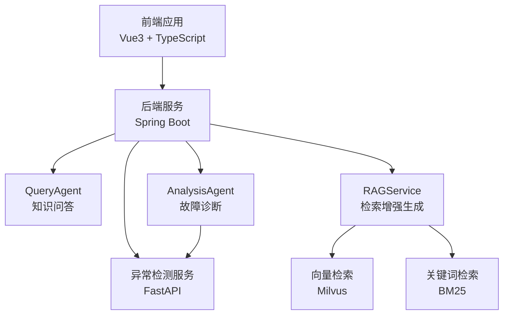
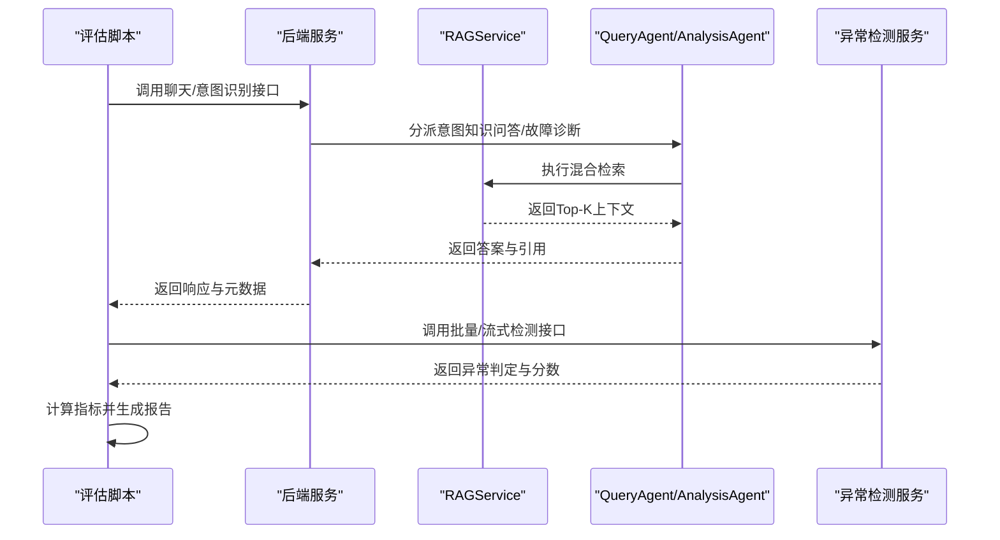
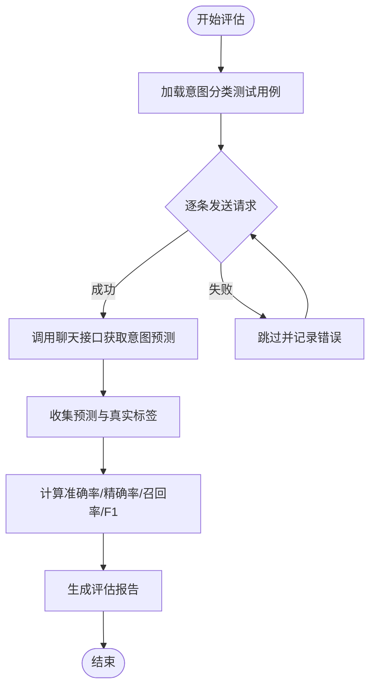
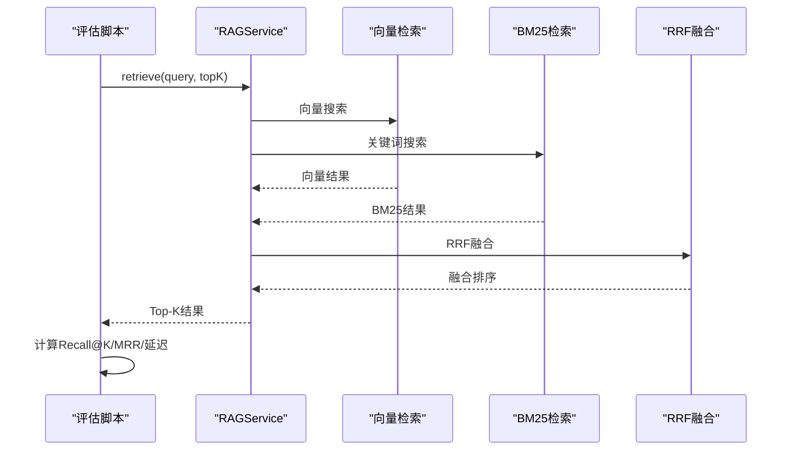
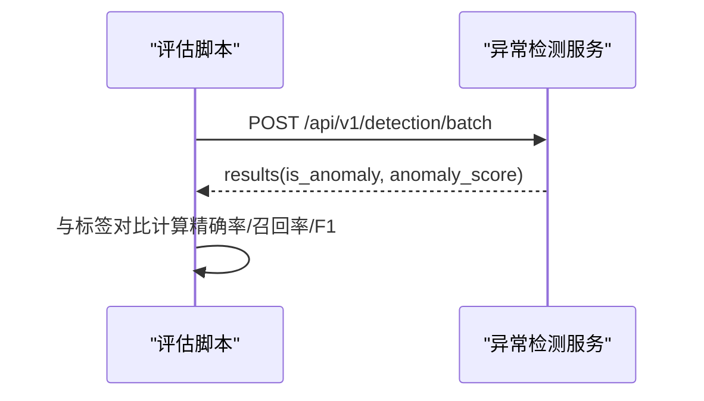
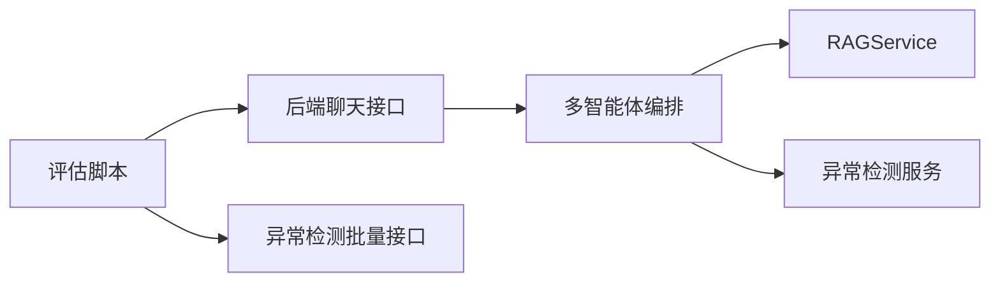

# 功能评估

<cite>
**本文引用的文件**   
- [evaluation/run_evaluation.py](file://evaluation/run_evaluation.py)
- [evaluation/test_cases.json](file://evaluation/test_cases.json)
- [anomaly-detection-service/tests/test_detectors.py](file://anomaly-detection-service/tests/test_detectors.py)
- [anomaly-detection-service/tests/test_api.py](file://anomaly-detection-service/tests/test_api.py)
- [anomaly-detection-service/app/api/routes/detection.py](file://anomaly-detection-service/app/api/routes/detection.py)
- [netdata-ai-backend/src/main/java/com/netdata/ops/core/rag/RAGService.java](file://netdata-ai-backend/src/main/java/com/netdata/ops/core/rag/RAGService.java)
- [netdata-ai-backend/src/main/java/com/netdata/ops/core/rag/HybridRetriever.java](file://netdata-ai-backend/src/main/java/com/netdata/ops/core/rag/HybridRetriever.java)
- [netdata-ai-backend/src/main/java/com/netdata/ops/core/agent/QueryAgent.java](file://netdata-ai-backend/src/main/java/com/netdata/ops/core/agent/QueryAgent.java)
- [netdata-ai-backend/src/main/java/com/netdata/ops/core/agent/AnalysisAgent.java](file://netdata-ai-backend/src/main/java/com/netdata/ops/core/agent/AnalysisAgent.java)
- [docs/evaluation_report.md](file://docs/evaluation_report.md)
- [docs/system_architecture.md](file://docs/system_architecture.md)
</cite>

## 目录
1. [简介](#简介)
2. [项目结构](#项目结构)
3. [核心组件](#核心组件)
4. [架构总览](#架构总览)
5. [详细组件分析](#详细组件分析)
6. [依赖分析](#依赖分析)
7. [性能考量](#性能考量)
8. [故障排查指南](#故障排查指南)
9. [结论](#结论)
10. [附录](#附录)

## 简介
本测试指南围绕“功能评估”目标，系统化地制定并落地一套可执行的评估方案，覆盖以下核心功能域：
- 意图识别准确率与分类指标（准确率、精确率、召回率、F1）
- RAG 检索效果（召回率、MRR、延迟）
- 异常检测精度（精确率、召回率、F1）
- 端到端流程（知识问答、故障诊断、命令执行审批）的稳定性与延迟

评估策略以自动化脚本为核心，结合测试用例与真实服务接口，形成从数据采集、指标计算到结果统计与可视化的一体化流程，并提供改进建议与优化路径。

## 项目结构
系统采用前后端分离与多服务协作的架构：
- 前端：Vue3 + TypeScript，负责用户交互与展示
- 后端：Spring Boot，提供 API 网关与多智能体编排
- 异常检测服务：FastAPI，提供批量/流式异常检测能力
- 检索与生成：RAG 混合检索 + LLM，支撑知识问答与诊断
- 评估脚本：Python，统一采集指标并生成报告

图表来源
- [docs/system_architecture.md](file://docs/system_architecture.md)
- [netdata-ai-backend/src/main/java/com/netdata/ops/core/agent/QueryAgent.java](file://netdata-ai-backend/src/main/java/com/netdata/ops/core/agent/QueryAgent.java)
- [netdata-ai-backend/src/main/java/com/netdata/ops/core/agent/AnalysisAgent.java](file://netdata-ai-backend/src/main/java/com/netdata/ops/core/agent/AnalysisAgent.java)
- [netdata-ai-backend/src/main/java/com/netdata/ops/core/rag/RAGService.java](file://netdata-ai-backend/src/main/java/com/netdata/ops/core/rag/RAGService.java)
- [anomaly-detection-service/app/api/routes/detection.py](file://anomaly-detection-service/app/api/routes/detection.py)

章节来源
- [docs/system_architecture.md](file://docs/system_architecture.md)

## 核心组件
- 评估脚本与指标
  - 评估脚本负责加载测试用例、调用后端与异常检测服务、收集延迟与结果、计算指标并生成报告。
  - 指标类包含性能指标与功能指标两类，分别用于评估延迟、吞吐量、资源占用以及意图识别、RAG 检索、异常检测、诊断准确率等。
- 测试用例
  - 包含意图分类、RAG 评估、异常检测、命令风险评估与端到端场景等多类用例，支撑功能与性能评估。
- 后端与异常检测服务
  - 后端提供聊天、RAG 检索、多智能体编排；异常检测服务提供批量/流式检测与训练接口。

章节来源
- [evaluation/run_evaluation.py](file://evaluation/run_evaluation.py)
- [evaluation/test_cases.json](file://evaluation/test_cases.json)

## 架构总览
下图展示了评估流程与系统组件的交互关系，强调评估脚本如何驱动后端与异常检测服务，采集指标并汇总为评估报告。

图表来源
- [evaluation/run_evaluation.py](file://evaluation/run_evaluation.py)
- [netdata-ai-backend/src/main/java/com/netdata/ops/core/agent/QueryAgent.java](file://netdata-ai-backend/src/main/java/com/netdata/ops/core/agent/QueryAgent.java)
- [netdata-ai-backend/src/main/java/com/netdata/ops/core/agent/AnalysisAgent.java](file://netdata-ai-backend/src/main/java/com/netdata/ops/core/agent/AnalysisAgent.java)
- [netdata-ai-backend/src/main/java/com/netdata/ops/core/rag/RAGService.java](file://netdata-ai-backend/src/main/java/com/netdata/ops/core/rag/RAGService.java)
- [anomaly-detection-service/app/api/routes/detection.py](file://anomaly-detection-service/app/api/routes/detection.py)

## 详细组件分析

### 意图识别评估
- 评估目标：计算意图识别的准确率、精确率、召回率与 F1 分数。
- 实施方法：
  - 从测试用例加载查询与期望意图，调用后端聊天接口获取系统预测意图。
  - 基于预测与真实标签计算指标（准确率、精确率、召回率、F1）。
- 指标计算要点：
  - 准确率：正确预测的样本数 / 总样本数。
  - 精确率：TP / (TP + FP)，召回率：TP / (TP + FN)，F1：2PR/(P + R)。
- 自动化流程：
  - 评估脚本并发调用接口，聚合结果后输出统计摘要与报告文件。

图表来源
- [evaluation/run_evaluation.py](file://evaluation/run_evaluation.py)
- [evaluation/test_cases.json](file://evaluation/test_cases.json)

章节来源
- [evaluation/run_evaluation.py](file://evaluation/run_evaluation.py)
- [evaluation/test_cases.json](file://evaluation/test_cases.json)

### RAG 检索评估
- 评估目标：计算召回率（Recall@K）、MRR（Mean Reciprocal Rank），并记录检索平均延迟。
- 实施方法：
  - 使用 RAGService 的检索接口，对每个查询返回 Top-K 结果。
  - 以测试用例中标注的相关文档集合为基准，计算召回与 MRR。
  - 评估脚本统计每次检索的耗时，计算平均延迟。
- 指标计算要点：
  - Recall@K：命中相关文档的查询数 / 总查询数。
  - MRR：对每个查询，取其首次命中的倒数排名的平均值。
- 检索策略：
  - 混合检索（向量 + BM25）+ RRF 融合，支持可选 rerank 精排。

图表来源
- [netdata-ai-backend/src/main/java/com/netdata/ops/core/rag/RAGService.java](file://netdata-ai-backend/src/main/java/com/netdata/ops/core/rag/RAGService.java)
- [netdata-ai-backend/src/main/java/com/netdata/ops/core/rag/HybridRetriever.java](file://netdata-ai-backend/src/main/java/com/netdata/ops/core/rag/HybridRetriever.java)
- [evaluation/run_evaluation.py](file://evaluation/run_evaluation.py)

章节来源
- [netdata-ai-backend/src/main/java/com/netdata/ops/core/rag/RAGService.java](file://netdata-ai-backend/src/main/java/com/netdata/ops/core/rag/RAGService.java)
- [netdata-ai-backend/src/main/java/com/netdata/ops/core/rag/HybridRetriever.java](file://netdata-ai-backend/src/main/java/com/netdata/ops/core/rag/HybridRetriever.java)
- [evaluation/run_evaluation.py](file://evaluation/run_evaluation.py)

### 异常检测评估
- 评估目标：计算异常检测的精确率、召回率与 F1 分数。
- 实施方法：
  - 评估脚本构造带标签的测试数据（正常/异常比例可控），调用异常检测服务的批量检测接口。
  - 解析返回的异常标记，与真实标签对比计算指标。
- 指标计算要点：
  - 基于 TP、FP、FN 计算精确率、召回率与 F1。
- 服务接口：
  - 批量检测接口支持阈值与返回分数开关，便于评估不同阈值下的性能。

图表来源
- [anomaly-detection-service/app/api/routes/detection.py](file://anomaly-detection-service/app/api/routes/detection.py)
- [evaluation/run_evaluation.py](file://evaluation/run_evaluation.py)

章节来源
- [anomaly-detection-service/app/api/routes/detection.py](file://anomaly-detection-service/app/api/routes/detection.py)
- [evaluation/run_evaluation.py](file://evaluation/run_evaluation.py)

### 端到端流程评估
- 评估目标：覆盖知识问答、故障诊断、命令执行审批的端到端延迟与成功率。
- 实施方法：
  - 使用端到端测试场景，模拟用户提问到系统响应的完整链路。
  - 后端多智能体编排（QueryAgent/AnalysisAgent）与异常检测服务协同工作。
- 关键点：
  - 分别统计各场景的端到端延迟与成功比例，作为系统稳定性与性能的综合指标。

章节来源
- [evaluation/test_cases.json](file://evaluation/test_cases.json)
- [netdata-ai-backend/src/main/java/com/netdata/ops/core/agent/QueryAgent.java](file://netdata-ai-backend/src/main/java/com/netdata/ops/core/agent/QueryAgent.java)
- [netdata-ai-backend/src/main/java/com/netdata/ops/core/agent/AnalysisAgent.java](file://netdata-ai-backend/src/main/java/com/netdata/ops/core/agent/AnalysisAgent.java)

## 依赖分析
- 组件耦合关系
  - 评估脚本依赖后端聊天接口与异常检测服务接口，二者分别由 Spring Boot 与 FastAPI 提供。
  - 后端服务内部依赖 RAG 检索组件与多智能体编排，异常检测服务提供独立的检测器工厂与服务。
- 评估脚本与后端/异常检测服务的调用关系如下：

图表来源
- [evaluation/run_evaluation.py](file://evaluation/run_evaluation.py)
- [anomaly-detection-service/app/api/routes/detection.py](file://anomaly-detection-service/app/api/routes/detection.py)
- [netdata-ai-backend/src/main/java/com/netdata/ops/core/agent/QueryAgent.java](file://netdata-ai-backend/src/main/java/com/netdata/ops/core/agent/QueryAgent.java)
- [netdata-ai-backend/src/main/java/com/netdata/ops/core/rag/RAGService.java](file://netdata-ai-backend/src/main/java/com/netdata/ops/core/rag/RAGService.java)

章节来源
- [evaluation/run_evaluation.py](file://evaluation/run_evaluation.py)
- [anomaly-detection-service/app/api/routes/detection.py](file://anomaly-detection-service/app/api/routes/detection.py)
- [netdata-ai-backend/src/main/java/com/netdata/ops/core/agent/QueryAgent.java](file://netdata-ai-backend/src/main/java/com/netdata/ops/core/agent/QueryAgent.java)
- [netdata-ai-backend/src/main/java/com/netdata/ops/core/rag/RAGService.java](file://netdata-ai-backend/src/main/java/com/netdata/ops/core/rag/RAGService.java)

## 性能考量
- 延迟与吞吐量
  - 评估脚本统计 P50/P90/P99 延迟与吞吐量，作为系统性能的关键指标。
- 资源占用
  - 可结合容器监控或系统指标，评估各服务的 CPU/内存占用，辅助容量规划。
- 检索延迟
  - RAG 检索包含向量检索、BM25 检索与 RRF 融合，评估脚本记录整体检索耗时，便于定位瓶颈。

章节来源
- [evaluation/run_evaluation.py](file://evaluation/run_evaluation.py)
- [docs/evaluation_report.md](file://docs/evaluation_report.md)

## 故障排查指南
- 常见问题与定位
  - 接口调用失败：检查后端与异常检测服务的健康状态与端口映射。
  - 检索结果为空：检查 Milvus 与 BM25 索引状态，确认文档入库与索引更新。
  - 指标异常：核对测试用例格式与标签一致性，避免误判。
- 单元测试与集成测试
  - 异常检测服务提供检测器工厂与 API 接口的单元测试与接口测试，可作为回归测试的参考。
  - 建议在评估前先运行单元测试，确保基础能力稳定。

章节来源
- [anomaly-detection-service/tests/test_detectors.py](file://anomaly-detection-service/tests/test_detectors.py)
- [anomaly-detection-service/tests/test_api.py](file://anomaly-detection-service/tests/test_api.py)

## 结论
本测试指南提供了从数据准备、自动化评估、指标计算到结果分析与优化建议的完整闭环。通过统一的评估脚本与测试用例，能够系统性地验证意图识别、RAG 检索、异常检测与端到端流程的质量与性能，为系统迭代与上线提供可靠依据。

## 附录

### 评估脚本使用与扩展
- 运行方式
  - 使用 Python 脚本运行评估，脚本会自动加载测试用例、调用服务接口、计算指标并生成报告文件。
- 扩展建议
  - 新增评估维度：如增加用户体验评分、覆盖率等。
  - 增量评估：支持按场景或模块的增量评估，减少全量评估成本。
  - 可视化：将评估结果导入可视化平台，便于趋势分析与对比。

章节来源
- [evaluation/run_evaluation.py](file://evaluation/run_evaluation.py)

### 指标计算与评估标准
- 准确率、精确率、召回率、F1 分数
  - 用于意图识别与异常检测的分类任务，衡量模型在不同类别上的综合性能。
- 召回率（Recall@K）、MRR
  - 用于 RAG 检索效果评估，关注相关文档的捕获能力与排序质量。
- 延迟与吞吐量
  - 用于性能评估，关注系统的实时性与承载能力。

章节来源
- [evaluation/run_evaluation.py](file://evaluation/run_evaluation.py)
- [docs/evaluation_report.md](file://docs/evaluation_report.md)