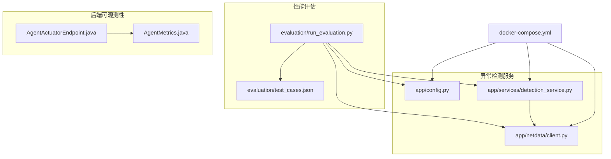
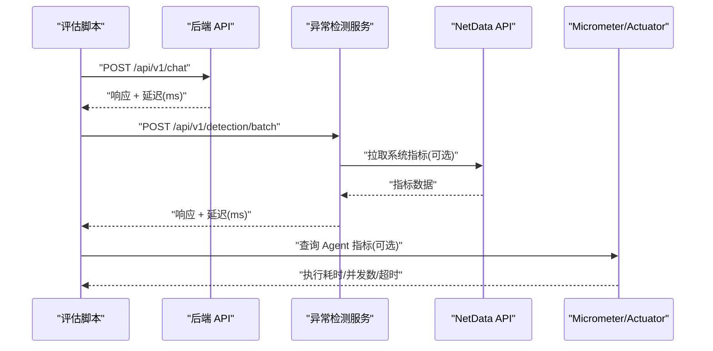
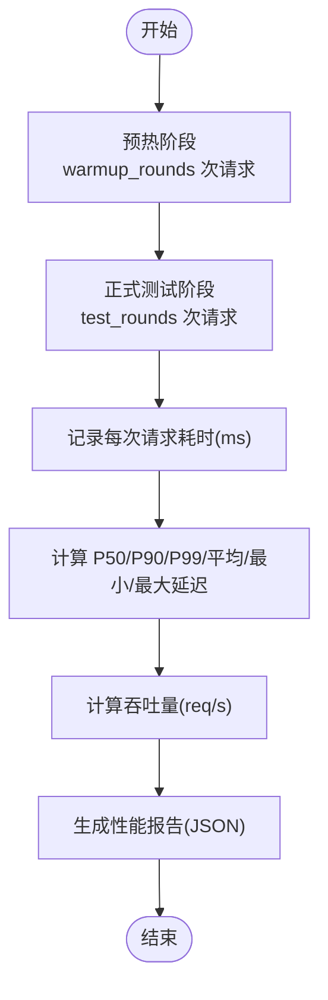
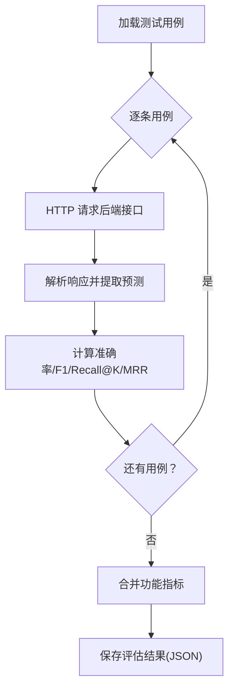
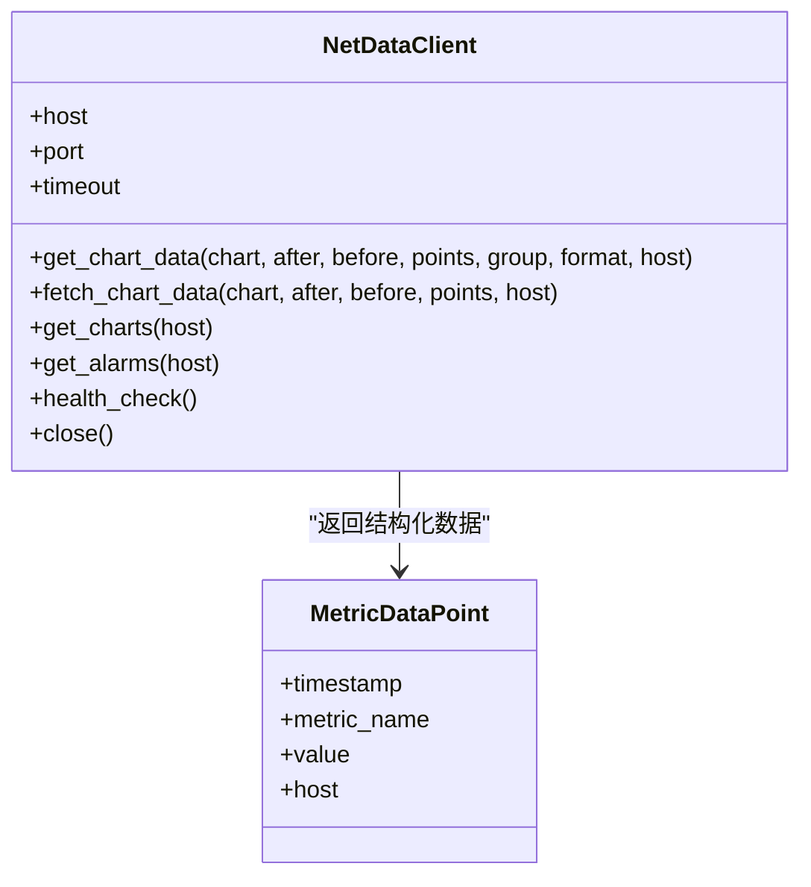
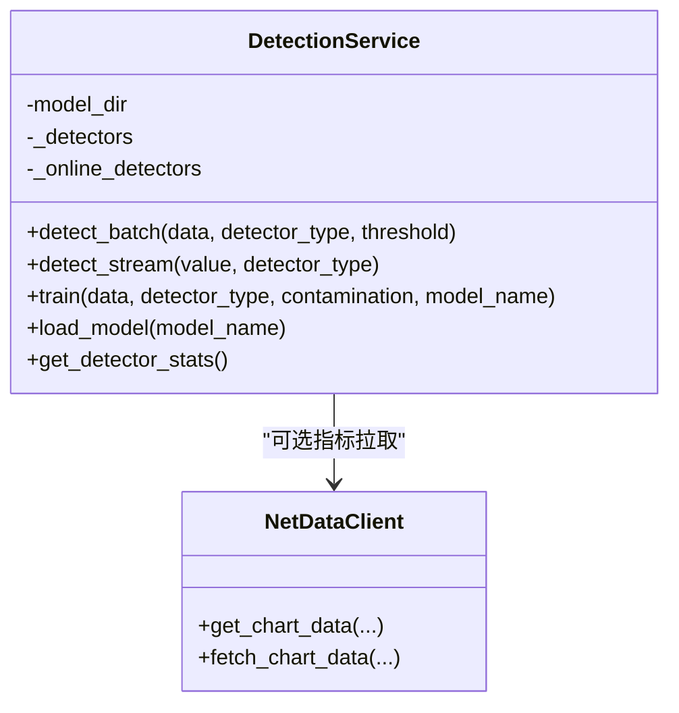
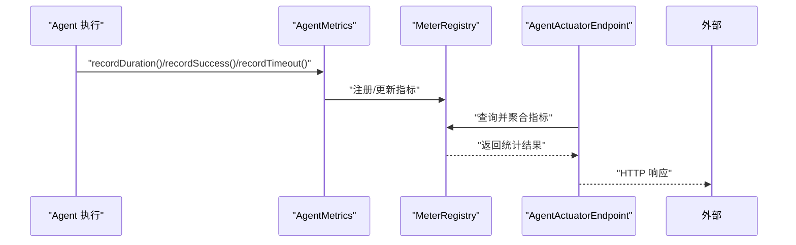
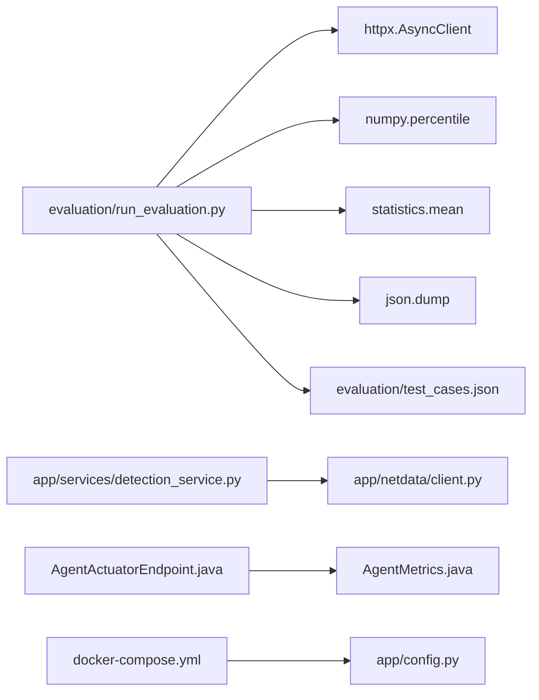

# 性能基准测试

<cite>
**本文引用的文件**
- [evaluation/run_evaluation.py](file://evaluation/run_evaluation.py)
- [evaluation/test_cases.json](file://evaluation/test_cases.json)
- [anomaly-detection-service/app/config.py](file://anomaly-detection-service/app/config.py)
- [anomaly-detection-service/app/netdata/client.py](file://anomaly-detection-service/app/netdata/client.py)
- [anomaly-detection-service/app/services/detection_service.py](file://anomaly-detection-service/app/services/detection_service.py)
- [anomaly-detection-service/tests/test_api.py](file://anomaly-detection-service/tests/test_api.py)
- [anomaly-detection-service/tests/conftest.py](file://anomaly-detection-service/tests/conftest.py)
- [docker-compose.yml](file://docker-compose.yml)
- [netdata-ai-backend/src/main/java/com/netdata/ops/core/agent/AgentActuatorEndpoint.java](file://netdata-ai-backend/src/main/java/com/netdata/ops/core/agent/AgentActuatorEndpoint.java)
- [netdata-ai-backend/src/main/java/com/netdata/ops/core/agent/AgentMetrics.java](file://netdata-ai-backend/src/main/java/com/netdata/ops/core/agent/AgentActuatorEndpoint.java)
</cite>

## 目录
1. [简介](#简介)
2. [项目结构](#项目结构)
3. [核心组件](#核心组件)
4. [架构总览](#架构总览)
5. [详细组件分析](#详细组件分析)
6. [依赖分析](#依赖分析)
7. [性能考量](#性能考量)
8. [故障排查指南](#故障排查指南)
9. [结论](#结论)
10. [附录](#附录)

## 简介
本实施方案聚焦于系统性能基准测试，围绕延迟（P50/P90/P99）、吞吐量、资源占用三大核心指标，结合异步 HTTP 客户端、测试用例与数据集、以及可观测性指标导出，构建可复现、可对比、可扩展的性能评估流程。文档同时提供执行流程、工具使用指南、基线设定与比较方法，并给出优化建议与最佳实践，帮助开发者定位瓶颈并持续改进系统性能。

## 项目结构
本项目包含前后端与异常检测服务，以及独立的性能评估脚本与测试用例。关键结构如下：
- 性能评估与测试用例：evaluation/run_evaluation.py、evaluation/test_cases.json
- 异常检测服务：anomaly-detection-service/app/*（配置、NetData 客户端、检测服务）
- 后端可观测性：netdata-ai-backend/src/main/java/com/netdata/ops/core/agent/*（Micrometer 指标与 Actuator 端点）
- 容器编排：docker-compose.yml（服务依赖与资源限制）

**图表来源**
- [evaluation/run_evaluation.py:1-528](file://evaluation/run_evaluation.py#L1-L528)
- [evaluation/test_cases.json:1-241](file://evaluation/test_cases.json#L1-L241)
- [anomaly-detection-service/app/config.py:1-183](file://anomaly-detection-service/app/config.py#L1-L183)
- [anomaly-detection-service/app/netdata/client.py:1-301](file://anomaly-detection-service/app/netdata/client.py#L1-L301)
- [anomaly-detection-service/app/services/detection_service.py:1-334](file://anomaly-detection-service/app/services/detection_service.py#L1-L334)
- [netdata-ai-backend/src/main/java/com/netdata/ops/core/agent/AgentActuatorEndpoint.java:1-208](file://netdata-ai-backend/src/main/java/com/netdata/ops/core/agent/AgentActuatorEndpoint.java#L1-L208)
- [netdata-ai-backend/src/main/java/com/netdata/ops/core/agent/AgentMetrics.java:1-112](file://netdata-ai-backend/src/main/java/com/netdata/ops/core/agent/AgentMetrics.java#L1-L112)
- [docker-compose.yml:1-358](file://docker-compose.yml#L1-L358)

**章节来源**
- [evaluation/run_evaluation.py:1-528](file://evaluation/run_evaluation.py#L1-L528)
- [docker-compose.yml:1-358](file://docker-compose.yml#L1-L358)

## 核心组件
- 性能评估器：基于异步 HTTP 客户端，对聊天 API 与异常检测 API 进行延迟测量与指标计算。
- 功能评估器：基于测试用例，评估意图识别、RAG 检索与异常检测的准确性。
- 配置与测试用例：集中管理评估配置、测试轮次、输出目录与测试数据集。
- NetData 客户端：提供异步 HTTP 接口，用于拉取系统指标数据。
- 检测服务：封装异常检测算法，支持批量与流式检测，具备实例池与在线检测器管理。
- 后端可观测性：基于 Micrometer 的 Agent 指标收集与 Actuator 端点，提供执行耗时、并发数、超时等指标。

**章节来源**
- [evaluation/run_evaluation.py:133-252](file://evaluation/run_evaluation.py#L133-L252)
- [anomaly-detection-service/app/config.py:28-183](file://anomaly-detection-service/app/config.py#L28-L183)
- [anomaly-detection-service/app/netdata/client.py:30-301](file://anomaly-detection-service/app/netdata/client.py#L30-L301)
- [anomaly-detection-service/app/services/detection_service.py:37-334](file://anomaly-detection-service/app/services/detection_service.py#L37-L334)
- [netdata-ai-backend/src/main/java/com/netdata/ops/core/agent/AgentActuatorEndpoint.java:34-208](file://netdata-ai-backend/src/main/java/com/netdata/ops/core/agent/AgentActuatorEndpoint.java#L34-L208)
- [netdata-ai-backend/src/main/java/com/netdata/ops/core/agent/AgentMetrics.java:31-112](file://netdata-ai-backend/src/main/java/com/netdata/ops/core/agent/AgentMetrics.java#L31-L112)

## 架构总览
性能基准测试由“评估脚本 + 测试用例 + 服务端 API + 可观测性”构成闭环。评估脚本通过异步 HTTP 客户端发起请求，记录延迟并计算 P50/P90/P99、平均延迟与吞吐量；同时可结合 NetData 指标与后端 Micrometer 指标，形成资源占用的综合评估。

**图表来源**
- [evaluation/run_evaluation.py:197-240](file://evaluation/run_evaluation.py#L197-L240)
- [anomaly-detection-service/app/netdata/client.py:84-198](file://anomaly-detection-service/app/netdata/client.py#L84-L198)
- [netdata-ai-backend/src/main/java/com/netdata/ops/core/agent/AgentActuatorEndpoint.java:52-202](file://netdata-ai-backend/src/main/java/com/netdata/ops/core/agent/AgentActuatorEndpoint.java#L52-L202)

## 详细组件分析

### 性能评估器（延迟与吞吐量）
- 异步 HTTP 客户端：使用 httpx.AsyncClient，支持超时配置与并发请求。
- 延迟测量：以 time.perf_counter() 记录请求开始与结束，计算毫秒级延迟列表。
- 指标计算：基于 numpy 百分位与 statistics 均值，计算 P50/P90/P99、平均延迟、最小/最大延迟与吞吐量（req/s）。
- 测试轮次：支持预热轮次与正式测试轮次，便于消除冷启动与缓存影响。

**图表来源**
- [evaluation/run_evaluation.py:140-195](file://evaluation/run_evaluation.py#L140-L195)
- [evaluation/run_evaluation.py:440-523](file://evaluation/run_evaluation.py#L440-L523)

**章节来源**
- [evaluation/run_evaluation.py:133-252](file://evaluation/run_evaluation.py#L133-L252)
- [evaluation/run_evaluation.py:440-523](file://evaluation/run_evaluation.py#L440-L523)

### 功能评估器（指标与测试用例）
- 测试用例：位于 evaluation/test_cases.json，包含意图分类、RAG 评估、异常检测场景等。
- 指标计算：意图识别准确率、RAG 召回/MRR、异常检测 F1 分数等。
- 评估流程：加载用例 → 发起请求 → 解析响应 → 计算指标 → 生成报告。

**图表来源**
- [evaluation/run_evaluation.py:264-434](file://evaluation/run_evaluation.py#L264-L434)
- [evaluation/test_cases.json:1-241](file://evaluation/test_cases.json#L1-L241)

**章节来源**
- [evaluation/run_evaluation.py:257-434](file://evaluation/run_evaluation.py#L257-L434)
- [evaluation/test_cases.json:1-241](file://evaluation/test_cases.json#L1-L241)

### NetData 客户端（指标采集）
- 异步 HTTP 客户端：支持上下文管理与超时配置。
- 图表数据：支持获取系统 CPU/内存/网络/磁盘等指标，返回结构化 MetricDataPoint。
- 健康检查：提供健康检查接口，便于评估阶段确认指标可用性。

**图表来源**
- [anomaly-detection-service/app/netdata/client.py:30-301](file://anomaly-detection-service/app/netdata/client.py#L30-L301)

**章节来源**
- [anomaly-detection-service/app/netdata/client.py:30-301](file://anomaly-detection-service/app/netdata/client.py#L30-L301)

### 检测服务（异常检测）
- 实例池与在线检测器：支持离线批量检测器与在线流式检测器，具备预热与持久化能力。
- 算法选择：支持多种检测器（Isolation Forest、LOF、KNN、Half-Space Trees、xStream）。
- 性能记录：在关键路径记录耗时，便于评估与优化。

**图表来源**
- [anomaly-detection-service/app/services/detection_service.py:37-334](file://anomaly-detection-service/app/services/detection_service.py#L37-L334)
- [anomaly-detection-service/app/netdata/client.py:30-301](file://anomaly-detection-service/app/netdata/client.py#L30-L301)

**章节来源**
- [anomaly-detection-service/app/services/detection_service.py:37-334](file://anomaly-detection-service/app/services/detection_service.py#L37-L334)

### 后端可观测性（Micrometer 指标与 Actuator）
- Agent 指标：通过 Micrometer 记录 Agent 执行耗时（Timer）、成功/失败计数（Counter）、超时计数、并发数（Gauge）。
- Actuator 端点：提供 /actuator/agents 与 /actuator/agents/{name}，聚合并导出 Agent 状态概览与详细指标。

**图表来源**
- [netdata-ai-backend/src/main/java/com/netdata/ops/core/agent/AgentMetrics.java:31-112](file://netdata-ai-backend/src/main/java/com/netdata/ops/core/agent/AgentMetrics.java#L31-L112)
- [netdata-ai-backend/src/main/java/com/netdata/ops/core/agent/AgentActuatorEndpoint.java:34-208](file://netdata-ai-backend/src/main/java/com/netdata/ops/core/agent/AgentActuatorEndpoint.java#L34-L208)

**章节来源**
- [netdata-ai-backend/src/main/java/com/netdata/ops/core/agent/AgentMetrics.java:31-112](file://netdata-ai-backend/src/main/java/com/netdata/ops/core/agent/AgentMetrics.java#L31-L112)
- [netdata-ai-backend/src/main/java/com/netdata/ops/core/agent/AgentActuatorEndpoint.java:34-208](file://netdata-ai-backend/src/main/java/com/netdata/ops/core/agent/AgentActuatorEndpoint.java#L34-L208)

## 依赖分析
- 评估脚本依赖：httpx（异步 HTTP）、numpy（百分位）、statistics（均值）、json（结果序列化）。
- 服务端依赖：FastAPI（API）、Pydantic（配置校验）、Micrometer（指标）、Docker Compose（容器编排）。
- 测试用例依赖：evaluation/test_cases.json（测试场景与期望标签）。

**图表来源**
- [evaluation/run_evaluation.py:35-36](file://evaluation/run_evaluation.py#L35-L36)
- [evaluation/run_evaluation.py:242-251](file://evaluation/run_evaluation.py#L242-L251)
- [anomaly-detection-service/app/services/detection_service.py:24-34](file://anomaly-detection-service/app/services/detection_service.py#L24-L34)
- [anomaly-detection-service/app/netdata/client.py:23-24](file://anomaly-detection-service/app/netdata/client.py#L23-L24)
- [netdata-ai-backend/src/main/java/com/netdata/ops/core/agent/AgentActuatorEndpoint.java:3-13](file://netdata-ai-backend/src/main/java/com/netdata/ops/core/agent/AgentActuatorEndpoint.java#L3-L13)
- [netdata-ai-backend/src/main/java/com/netdata/ops/core/agent/AgentMetrics.java:3-10](file://netdata-ai-backend/src/main/java/com/netdata/ops/core/agent/AgentMetrics.java#L3-L10)
- [docker-compose.yml:23-358](file://docker-compose.yml#L23-L358)

**章节来源**
- [evaluation/run_evaluation.py:1-528](file://evaluation/run_evaluation.py#L1-L528)
- [anomaly-detection-service/app/services/detection_service.py:1-334](file://anomaly-detection-service/app/services/detection_service.py#L1-L334)
- [netdata-ai-backend/src/main/java/com/netdata/ops/core/agent/AgentActuatorEndpoint.java:1-208](file://netdata-ai-backend/src/main/java/com/netdata/ops/core/agent/AgentActuatorEndpoint.java#L1-L208)
- [docker-compose.yml:1-358](file://docker-compose.yml#L1-L358)

## 性能考量
- 延迟与吞吐量
  - 延迟：P50/P90/P99 反映尾部延迟与尾部用户感受；平均延迟用于整体水平参考。
  - 吞吐量：单位时间内处理的请求数，受并发度、算法复杂度与 I/O 影响。
- 资源占用
  - CPU/内存：结合 NetData 指标与后端 Micrometer 指标，关注峰值与平均值。
  - 并发与超时：通过 Actuator 端点观察 Agent 并发数与超时次数，辅助定位瓶颈。
- 预热与稳定性
  - 预热轮次有助于消除冷启动、模型加载与缓存预热的影响。
  - 多轮次统计可减少抖动，提高指标稳定性。
- 算法与数据规模
  - 异常检测的批处理规模、在线检测器的滑动窗口大小、算法参数（如树数量、邻居数）直接影响延迟与资源占用。
- 容器资源限制
  - docker-compose 中对 Milvus、Ollama 等服务设置了内存上限，需结合实际负载评估是否合理。

**章节来源**
- [evaluation/run_evaluation.py:42-58](file://evaluation/run_evaluation.py#L42-L58)
- [anomaly-detection-service/app/config.py:108-146](file://anomaly-detection-service/app/config.py#L108-L146)
- [docker-compose.yml:57-155](file://docker-compose.yml#L57-L155)

## 故障排查指南
- 评估脚本常见问题
  - 请求失败：检查目标服务地址与端口、超时设置、网络连通性。
  - 指标为空：确认测试用例文件存在且格式正确，检查预热轮次与测试轮次配置。
- NetData 指标不可用
  - 健康检查失败：确认 NetData 服务可达、端口开放、API 版本匹配。
  - 数据为空：检查图表名称、时间范围与 points 数量。
- 后端指标缺失
  - Micrometer 未注册：确认 Agent 执行路径已调用指标记录方法。
  - Actuator 端点不可达：检查 Actuator 配置与端口映射。
- 容器资源不足
  - OOM 或启动缓慢：调整 docker-compose 中的内存限制与启动顺序。

**章节来源**
- [evaluation/run_evaluation.py:162-171](file://evaluation/run_evaluation.py#L162-L171)
- [anomaly-detection-service/app/netdata/client.py:250-271](file://anomaly-detection-service/app/netdata/client.py#L250-L271)
- [netdata-ai-backend/src/main/java/com/netdata/ops/core/agent/AgentActuatorEndpoint.java:52-67](file://netdata-ai-backend/src/main/java/com/netdata/ops/core/agent/AgentActuatorEndpoint.java#L52-L67)
- [docker-compose.yml:47-139](file://docker-compose.yml#L47-L139)

## 结论
本实施方案提供了完整的性能基准测试流程：以评估脚本为核心，结合测试用例与服务端可观测性，覆盖延迟、吞吐量与资源占用三大维度。通过预热与多轮次统计、异步 HTTP 客户端与 Micrometer 指标导出，能够稳定地量化系统性能现状，并为后续优化提供明确方向与可比基线。

## 附录

### 性能测试执行流程
- 准备阶段
  - 启动服务：docker-compose up -d
  - 准备测试用例：确保 evaluation/test_cases.json 存在
  - 配置评估参数：backend_url、anomaly_service_url、warmup_rounds、test_rounds、timeout
- 预热阶段
  - 使用 warmup_rounds 次请求预热后端与检测器实例
- 正式测试阶段
  - 使用 test_rounds 次请求分别评估聊天 API 与异常检测 API
  - 记录延迟列表并计算 P50/P90/P99、平均延迟与吞吐量
- 资源占用监控
  - 通过 NetData API 获取 CPU/内存/网络/磁盘等指标
  - 通过 Micrometer/Actuator 端点获取 Agent 执行耗时、并发数与超时
- 报告生成
  - 将性能与功能指标写入 JSON 文件，包含时间戳与配置快照

**章节来源**
- [evaluation/run_evaluation.py:440-523](file://evaluation/run_evaluation.py#L440-L523)
- [evaluation/test_cases.json:1-241](file://evaluation/test_cases.json#L1-L241)
- [docker-compose.yml:11-21](file://docker-compose.yml#L11-L21)

### 性能测试工具使用指南
- HTTP 客户端配置
  - 使用 httpx.AsyncClient，设置超时与并发
  - 通过异步 POST 请求调用后端接口
- 异步测试框架
  - 使用 asyncio.run() 运行主评估流程
  - 在评估器内部使用异步方法进行请求与指标计算
- 数据收集与分析
  - 延迟：time.perf_counter() 计时，转换为毫秒
  - 指标：numpy 百分位、statistics 均值
  - 报告：json.dump 写入文件，包含时间戳与配置

**章节来源**
- [evaluation/run_evaluation.py:138-195](file://evaluation/run_evaluation.py#L138-L195)
- [evaluation/run_evaluation.py:526-527](file://evaluation/run_evaluation.py#L526-L527)

### 基线设定与比较方法
- 基线设定
  - 在稳定环境下运行评估脚本，记录 P50/P90/P99、平均延迟与吞吐量
  - 记录资源占用（CPU/内存）与 Agent 指标（并发数、超时）
- 比较方法
  - 不同版本/配置的评估结果进行横向对比
  - 关注尾部延迟变化（P99）与吞吐量变化，判断用户体验与系统承载能力
  - 结合资源占用与并发指标，定位性能瓶颈

**章节来源**
- [evaluation/run_evaluation.py:458-464](file://evaluation/run_evaluation.py#L458-L464)
- [netdata-ai-backend/src/main/java/com/netdata/ops/core/agent/AgentActuatorEndpoint.java:124-202](file://netdata-ai-backend/src/main/java/com/netdata/ops/core/agent/AgentActuatorEndpoint.java#L124-L202)

### 性能优化建议与最佳实践
- 算法与参数
  - 调整异常检测算法参数（树数量、邻居数、窗口大小），权衡精度与性能
  - 批处理规模与阈值设置，避免过大导致延迟上升
- 缓存与预热
  - 利用预热轮次与缓存策略，减少首次请求延迟
  - 对热点数据与模型进行预加载
- 并发与资源
  - 合理设置并发度，避免过度竞争导致上下文切换开销
  - 根据 docker-compose 的资源限制，评估容器性能边界
- 指标监控
  - 持续采集 Micrometer 指标与 NetData 指标，建立性能基线
  - 关注尾部延迟与超时指标，及时发现性能退化

**章节来源**
- [anomaly-detection-service/app/config.py:108-146](file://anomaly-detection-service/app/config.py#L108-L146)
- [docker-compose.yml:57-155](file://docker-compose.yml#L57-L155)
- [netdata-ai-backend/src/main/java/com/netdata/ops/core/agent/AgentMetrics.java:66-112](file://netdata-ai-backend/src/main/java/com/netdata/ops/core/agent/AgentMetrics.java#L66-L112)