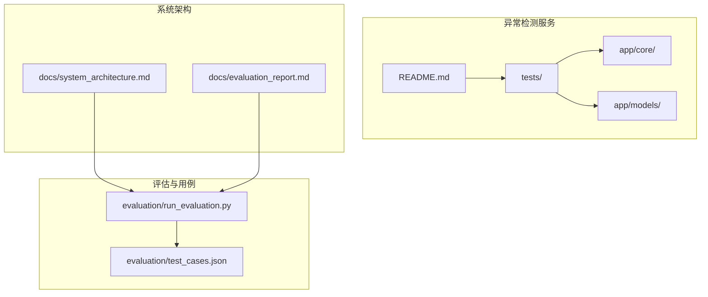
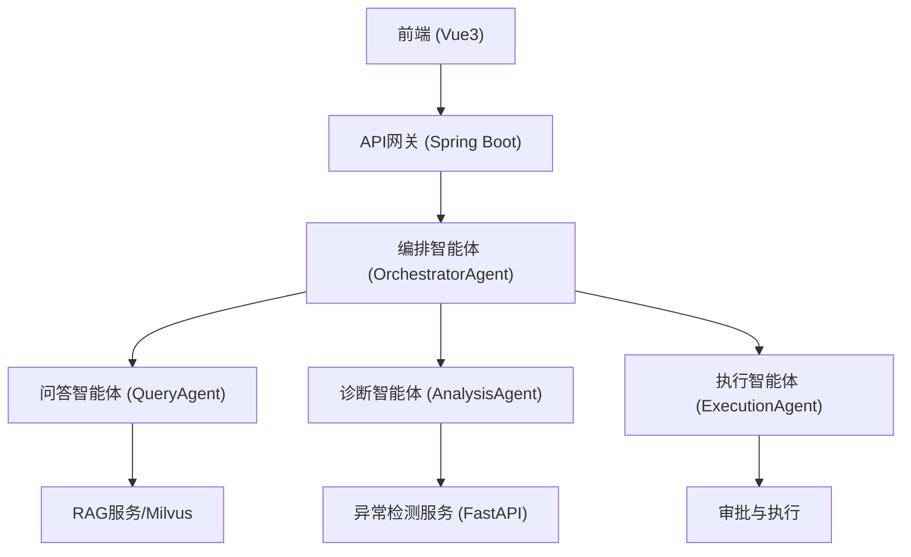
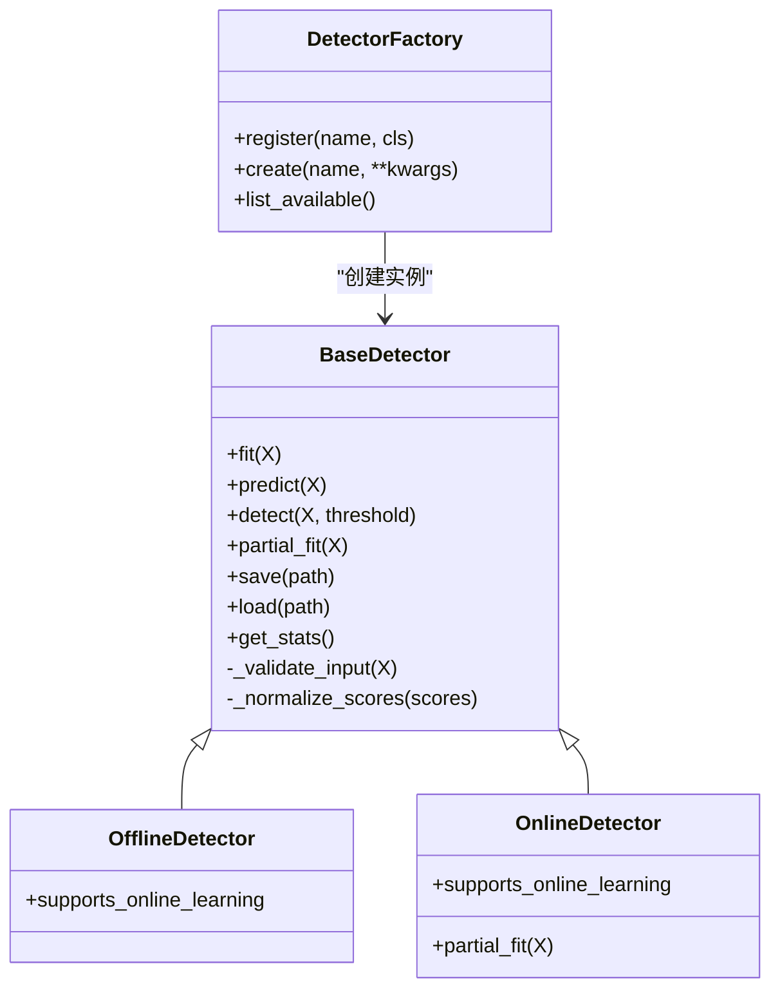
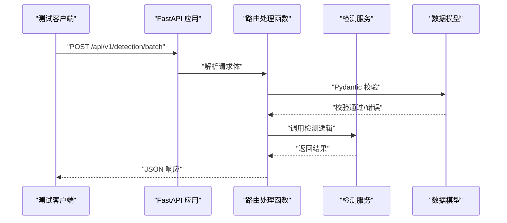
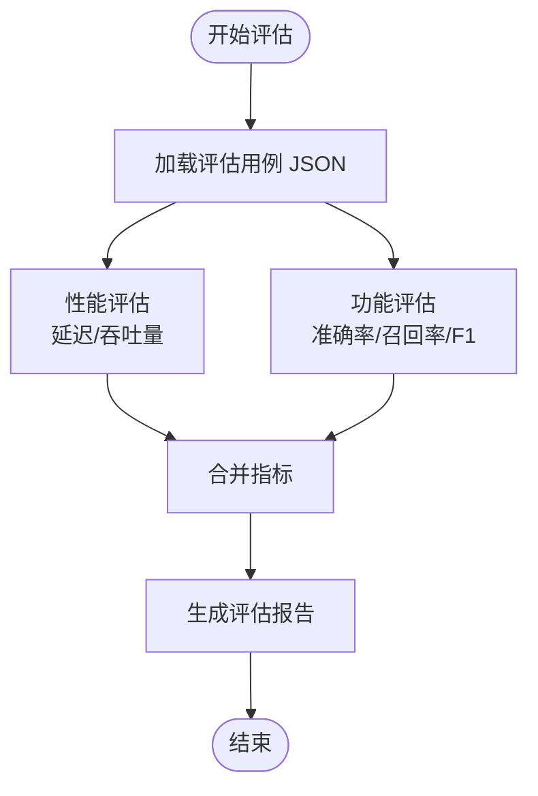
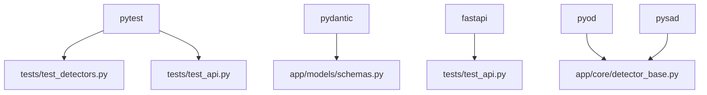

# 测试用例设计

<cite>
**本文引用的文件**
- [anomaly-detection-service/tests/test_detectors.py](file://anomaly-detection-service/tests/test_detectors.py)
- [anomaly-detection-service/tests/test_api.py](file://anomaly-detection-service/tests/test_api.py)
- [anomaly-detection-service/tests/conftest.py](file://anomaly-detection-service/tests/conftest.py)
- [anomaly-detection-service/pyproject.toml](file://anomaly-detection-service/pyproject.toml)
- [anomaly-detection-service/requirements.txt](file://anomaly-detection-service/requirements.txt)
- [anomaly-detection-service/README.md](file://anomaly-detection-service/README.md)
- [anomaly-detection-service/app/core/detector_base.py](file://anomaly-detection-service/app/core/detector_base.py)
- [anomaly-detection-service/app/models/schemas.py](file://anomaly-detection-service/app/models/schemas.py)
- [evaluation/test_cases.json](file://evaluation/test_cases.json)
- [evaluation/run_evaluation.py](file://evaluation/run_evaluation.py)
- [docs/system_architecture.md](file://docs/system_architecture.md)
- [docs/evaluation_report.md](file://docs/evaluation_report.md)
</cite>

## 目录
1. [简介](#简介)
2. [项目结构](#项目结构)
3. [核心组件](#核心组件)
4. [架构总览](#架构总览)
5. [详细组件分析](#详细组件分析)
6. [依赖分析](#依赖分析)
7. [性能考量](#性能考量)
8. [故障排查指南](#故障排查指南)
9. [结论](#结论)
10. [附录](#附录)

## 简介
本实施指南围绕测试用例设计，结合本仓库中的异常检测服务、API 接口、数据模型与评估脚本，系统化地构建测试用例分类体系与编写规范。内容涵盖：
- 测试用例分类：意图识别测试用例、RAG 评估测试用例、异常检测测试用例、命令风险评估测试用例、端到端流程测试用例
- 质量标准：覆盖范围、边界条件、异常场景、稳定性与性能指标
- 组织与管理：用例分类、优先级、版本管理与回归策略
- 维护与更新：随需求演进的迭代策略与评估报告驱动的改进闭环
- 示例与模板：基于现有测试文件与评估用例 JSON 的模板化编写方法

## 项目结构
本项目包含后端异常检测服务、前端、后端 Java 服务、评估脚本与测试用例等模块。与测试用例设计直接相关的关键位置如下：
- 异常检测服务（Python/FastAPI）：包含单元测试与 API 测试，覆盖检测器工厂、具体算法、数据模型与接口行为
- 评估脚本与评估用例：提供意图识别、RAG、异常检测、命令风险评估与端到端场景的结构化测试用例
- 系统架构文档：定义了多智能体、RAG、异常检测等模块的职责边界，便于设计端到端测试场景

**图表来源**
- [anomaly-detection-service/tests/test_detectors.py:1-231](file://anomaly-detection-service/tests/test_detectors.py#L1-L231)
- [anomaly-detection-service/tests/test_api.py:1-172](file://anomaly-detection-service/tests/test_api.py#L1-L172)
- [evaluation/run_evaluation.py:1-528](file://evaluation/run_evaluation.py#L1-L528)
- [evaluation/test_cases.json:1-241](file://evaluation/test_cases.json#L1-L241)
- [docs/system_architecture.md:1-921](file://docs/system_architecture.md#L1-L921)

**章节来源**
- [anomaly-detection-service/README.md:1-42](file://anomaly-detection-service/README.md#L1-L42)
- [docs/system_architecture.md:1-921](file://docs/system_architecture.md#L1-L921)

## 核心组件
- 异常检测器抽象基类与工厂：定义统一接口、模板方法与工厂注册机制，支撑多算法一致性测试
- 数据模型与校验：Pydantic 模型定义请求/响应结构与字段约束，保障测试输入输出的合法性
- API 接口测试：覆盖健康检查、批量/流式检测、训练接口与 OpenAPI 文档
- 评估脚本与用例：提供结构化的意图识别、RAG、异常检测、命令风险评估与端到端场景用例，并以脚本驱动自动化评估

**章节来源**
- [anomaly-detection-service/app/core/detector_base.py:1-339](file://anomaly-detection-service/app/core/detector_base.py#L1-L339)
- [anomaly-detection-service/app/models/schemas.py:1-329](file://anomaly-detection-service/app/models/schemas.py#L1-L329)
- [anomaly-detection-service/tests/test_detectors.py:1-231](file://anomaly-detection-service/tests/test_detectors.py#L1-L231)
- [anomaly-detection-service/tests/test_api.py:1-172](file://anomaly-detection-service/tests/test_api.py#L1-L172)
- [evaluation/test_cases.json:1-241](file://evaluation/test_cases.json#L1-L241)
- [evaluation/run_evaluation.py:1-528](file://evaluation/run_evaluation.py#L1-L528)

## 架构总览
系统采用前后端分离与多智能体协作架构，异常检测服务作为外部服务之一被前端与后端服务调用。测试用例需覆盖：
- 单元测试：检测器工厂、算法实现、数据模型校验
- 接口测试：健康检查、批量/流式检测、训练接口
- 功能评估：意图识别、RAG 检索、异常检测、命令风险评估
- 端到端测试：从用户输入到最终响应的完整链路

**图表来源**
- [docs/system_architecture.md:21-134](file://docs/system_architecture.md#L21-L134)

## 详细组件分析

### 测试用例分类体系与设计原则
- 意图识别测试用例
  - 目标：验证系统对用户查询的意图分类准确性（知识问答、故障诊断、命令执行、混合意图）
  - 设计原则：覆盖典型句式、边界场景（极短/极长输入）、歧义查询；与评估用例 JSON 对齐
  - 质量标准：准确率、精确率、召回率、F1 分数；混合意图场景需重点覆盖
- RAG 评估测试用例
  - 目标：验证检索召回、相关性排序与延迟
  - 设计原则：构造明确的相关文档集合，标注相关度；对比纯向量检索、BM25 与混合检索策略
  - 质量标准：Recall@K、Precision@K、MRR、平均延迟
- 异常检测测试用例
  - 目标：验证离线/在线检测算法的准确性与鲁棒性
  - 设计原则：构造正常/异常数据分布、边界阈值、小样本与噪声场景；覆盖工厂创建、训练、预测、异常分数归一化
  - 质量标准：精确率、召回率、F1 分数、处理耗时
- 命令风险评估测试用例
  - 目标：验证命令风险等级与审批需求的判定一致性
  - 设计原则：覆盖低/中/高/致命风险命令；关注影响范围、可逆性、操作频率等维度
  - 质量标准：准确率；与审批策略一致
- 端到端测试用例
  - 目标：验证从用户输入到最终响应的完整流程
  - 设计原则：覆盖知识问答、故障诊断、命令执行审批等典型场景；标注期望延迟与成功率
  - 质量标准：端到端延迟、成功率、中间步骤正确性

**章节来源**
- [evaluation/test_cases.json:1-241](file://evaluation/test_cases.json#L1-L241)
- [evaluation/run_evaluation.py:264-434](file://evaluation/run_evaluation.py#L264-L434)
- [docs/evaluation_report.md:1-224](file://docs/evaluation_report.md#L1-L224)

### 异常检测服务测试用例设计
- 工厂与枚举
  - 覆盖工厂可用类型列表、创建指定类型、未知类型抛错
  - 覆盖检测器类型枚举值与字符串转换
- 离线检测器（Isolation Forest、LOF、KNN）
  - 训练与预测：输入维度、输出分数范围、统计信息
  - 边界与异常：空数据、非有限值、未训练预测、局部密度差异检测
- 在线检测器（半空间树等）
  - 流式打分、预热与阈值比较
- API 接口
  - 健康检查、就绪/存活检查、根路径、批量/流式检测、训练接口、OpenAPI 文档

**图表来源**
- [anomaly-detection-service/app/core/detector_base.py:31-339](file://anomaly-detection-service/app/core/detector_base.py#L31-L339)

**图表来源**
- [anomaly-detection-service/tests/test_api.py:74-155](file://anomaly-detection-service/tests/test_api.py#L74-L155)
- [anomaly-detection-service/app/models/schemas.py:95-183](file://anomaly-detection-service/app/models/schemas.py#L95-L183)

**章节来源**
- [anomaly-detection-service/tests/test_detectors.py:32-231](file://anomaly-detection-service/tests/test_detectors.py#L32-L231)
- [anomaly-detection-service/tests/test_api.py:32-172](file://anomaly-detection-service/tests/test_api.py#L32-L172)
- [anomaly-detection-service/app/core/detector_base.py:31-339](file://anomaly-detection-service/app/core/detector_base.py#L31-L339)
- [anomaly-detection-service/app/models/schemas.py:95-284](file://anomaly-detection-service/app/models/schemas.py#L95-L284)

### 评估脚本与用例组织
- 评估脚本
  - 性能评估：聊天 API、异常检测 API 延迟测量与指标汇总
  - 功能评估：意图识别准确率、RAG 检索指标、异常检测 F1 分数
  - 端到端评估：基于评估用例 JSON 的场景化测试
- 评估用例 JSON
  - 结构化定义各类测试场景与期望指标，便于自动化评估与回归

**图表来源**
- [evaluation/run_evaluation.py:440-523](file://evaluation/run_evaluation.py#L440-L523)
- [evaluation/test_cases.json:1-241](file://evaluation/test_cases.json#L1-L241)

**章节来源**
- [evaluation/run_evaluation.py:1-528](file://evaluation/run_evaluation.py#L1-L528)
- [evaluation/test_cases.json:1-241](file://evaluation/test_cases.json#L1-L241)

### 测试用例编写规范与模板
- 通用模板
  - 用例 ID：唯一标识（如 IC-001、RAG-001、AD-001、CR-001、E2E-001）
  - 场景描述：简要说明测试目标与背景
  - 输入/期望输出：明确输入数据、请求体或查询，以及期望的响应/指标
  - 质量指标：准确率、延迟、F1、召回率等
  - 优先级与标签：高/中/低优先级，标记集成/慢测试等
- 意图识别模板
  - 查询文本、期望意图类型、描述
- RAG 检索模板
  - 查询、相关文档集合、描述
- 异常检测模板
  - 指标名称、正常范围、异常阈值、数据规模、异常比例
- 命令风险评估模板
  - 命令、期望风险等级、期望审批需求、描述
- 端到端模板
  - 场景名称、步骤序列、期望延迟、期望成功

**章节来源**
- [evaluation/test_cases.json:1-241](file://evaluation/test_cases.json#L1-L241)
- [anomaly-detection-service/tests/conftest.py:14-22](file://anomaly-detection-service/tests/conftest.py#L14-L22)

### 测试用例的组织与管理
- 分类与命名
  - 按功能域划分：意图识别、RAG、异常检测、命令风险评估、端到端
  - 用例 ID 前缀与编号规则统一，便于检索与追踪
- 优先级排序
  - 高优先级：核心路径、关键指标（如意图识别准确率、异常检测 F1）
  - 中优先级：边界条件、异常场景
  - 低优先级：性能优化相关、非关键路径
- 版本管理
  - 用例与评估脚本版本号同步，变更时更新评估报告
  - 用例 JSON 与评估脚本共同演进，保证一致性
- 回归策略
  - 基于评估报告的指标趋势，识别回归风险
  - 将关键用例纳入 CI/CD 的自动化执行

**章节来源**
- [evaluation/run_evaluation.py:440-523](file://evaluation/run_evaluation.py#L440-L523)
- [docs/evaluation_report.md:1-224](file://docs/evaluation_report.md#L1-L224)

### 测试用例的维护与更新策略
- 指标驱动改进
  - 依据评估报告中的指标与问题清单，补充或调整测试用例
  - 对混合意图识别、聊天 API 平均延迟等略超标的场景，增加针对性用例
- 数据与场景演进
  - 随着知识库增长与监控指标增多，扩展 RAG 与异常检测用例
  - 新增检测算法或智能体后，补充对应测试用例
- 自动化与可重复
  - 用例 JSON 与评估脚本解耦，便于独立维护与扩展
  - 使用 pytest 标记（如 integration、slow）进行选择性执行

**章节来源**
- [docs/evaluation_report.md:183-207](file://docs/evaluation_report.md#L183-L207)
- [anomaly-detection-service/tests/conftest.py:14-22](file://anomaly-detection-service/tests/conftest.py#L14-L22)

## 依赖分析
- 测试框架与工具
  - pytest、pytest-asyncio、pytest-cov、httpx（测试客户端）
  - ruff、mypy（代码质量与类型检查）
- 异常检测算法
  - PyOD（离线算法）、PySAD（在线算法），受 numpy/scipy 版本约束
- 服务与接口
  - FastAPI、Uvicorn、Pydantic（数据模型与校验）

**图表来源**
- [anomaly-detection-service/requirements.txt:17-94](file://anomaly-detection-service/requirements.txt#L17-L94)
- [anomaly-detection-service/pyproject.toml:37-54](file://anomaly-detection-service/pyproject.toml#L37-L54)

**章节来源**
- [anomaly-detection-service/requirements.txt:1-94](file://anomaly-detection-service/requirements.txt#L1-L94)
- [anomaly-detection-service/pyproject.toml:1-55](file://anomaly-detection-service/pyproject.toml#L1-L55)

## 性能考量
- 延迟与吞吐量
  - 聊天 API、异常检测 API、RAG 检索的 P50/P90/P99 延迟与 QPS
- 资源占用
  - Docker 容器内各服务的 CPU/内存/磁盘占用
- 指标达标
  - 评估报告中对各项指标的目标与状态进行对比

**章节来源**
- [docs/evaluation_report.md:123-180](file://docs/evaluation_report.md#L123-L180)

## 故障排查指南
- 常见问题
  - 输入数据为空或包含 NaN/Inf：触发数据校验异常
  - 未训练即预测：触发运行时错误
  - 未知检测器类型：工厂创建失败
  - 请求体长度不足：批量检测接口校验失败
- 定位方法
  - 查看测试断言与异常信息
  - 使用评估脚本输出的详细指标定位瓶颈
  - 对照评估报告的问题清单进行针对性修复

**章节来源**
- [anomaly-detection-service/tests/test_detectors.py:90-121](file://anomaly-detection-service/tests/test_detectors.py#L90-L121)
- [anomaly-detection-service/tests/test_api.py:100-112](file://anomaly-detection-service/tests/test_api.py#L100-L112)
- [anomaly-detection-service/app/core/detector_base.py:203-228](file://anomaly-detection-service/app/core/detector_base.py#L203-L228)

## 结论
本实施指南基于现有测试与评估实践，提出了面向意图识别、RAG、异常检测、命令风险评估与端到端场景的测试用例分类体系与编写规范。通过结构化用例、指标驱动的评估与持续维护策略，能够有效保障系统功能与性能的稳定性与可演进性。

## 附录
- 测试运行与配置
  - pytest 配置与标记
  - 项目依赖与工具链
- 参考文档
  - 系统架构与评估报告

**章节来源**
- [anomaly-detection-service/tests/conftest.py:14-22](file://anomaly-detection-service/tests/conftest.py#L14-L22)
- [anomaly-detection-service/pyproject.toml:37-54](file://anomaly-detection-service/pyproject.toml#L37-L54)
- [anomaly-detection-service/README.md:1-42](file://anomaly-detection-service/README.md#L1-L42)
- [docs/evaluation_report.md:1-224](file://docs/evaluation_report.md#L1-L224)