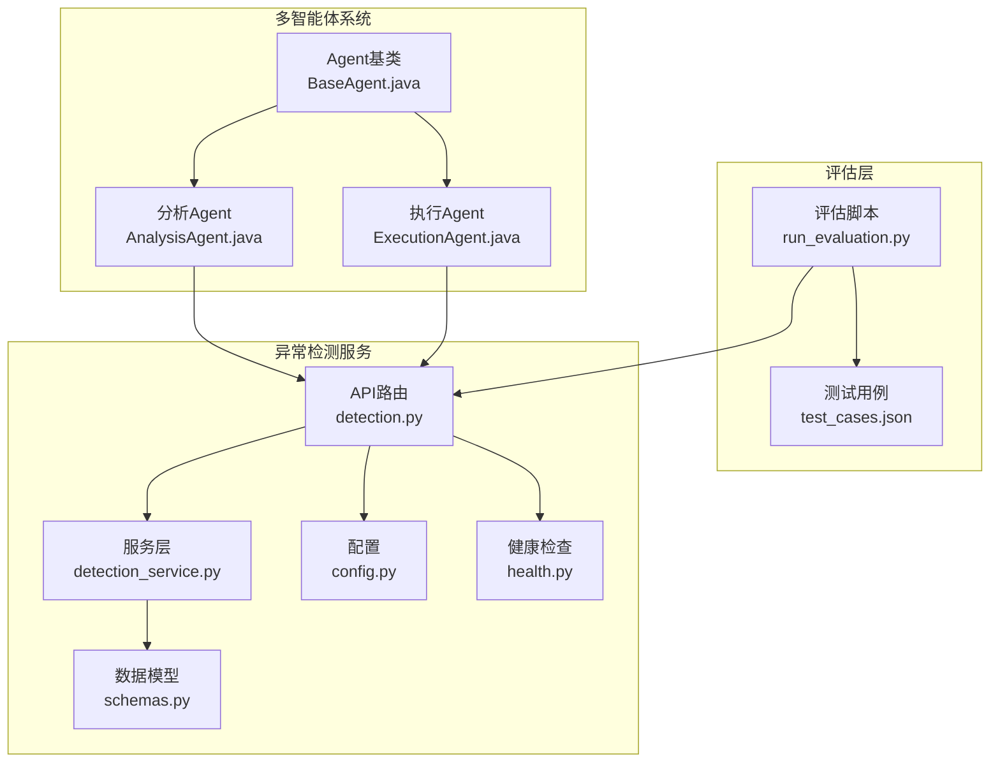
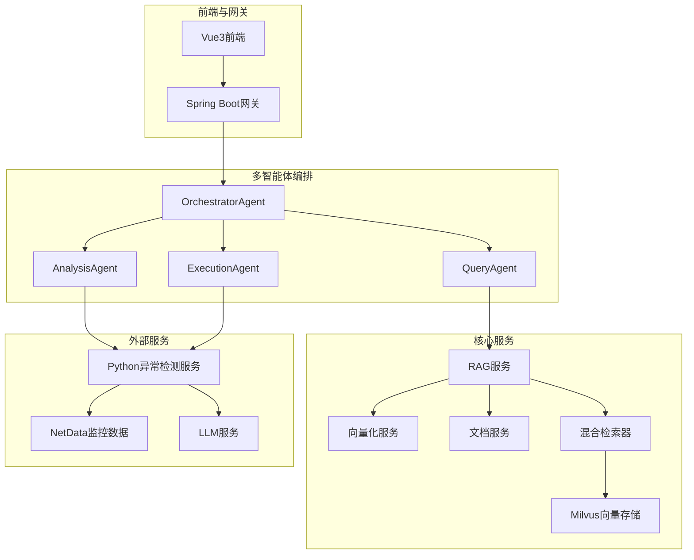
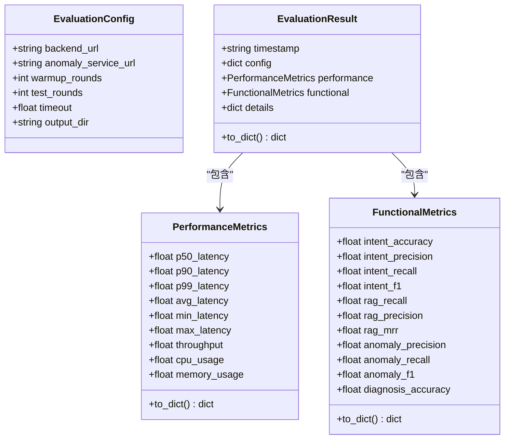
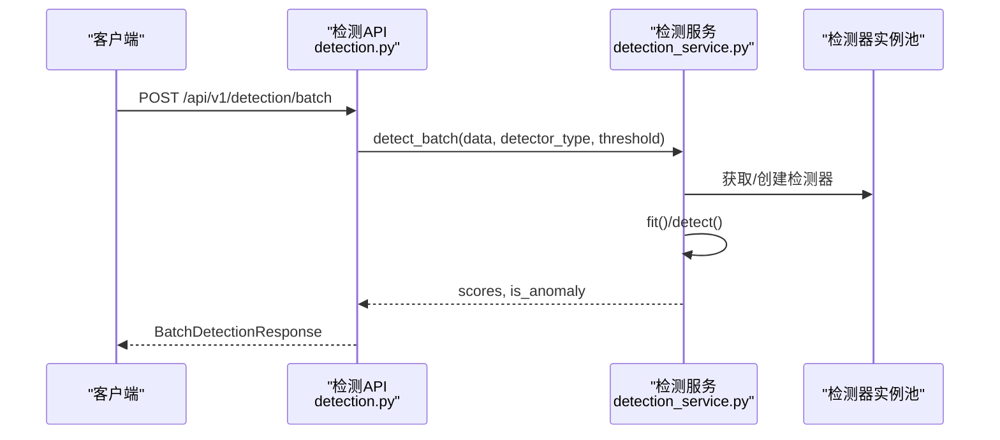
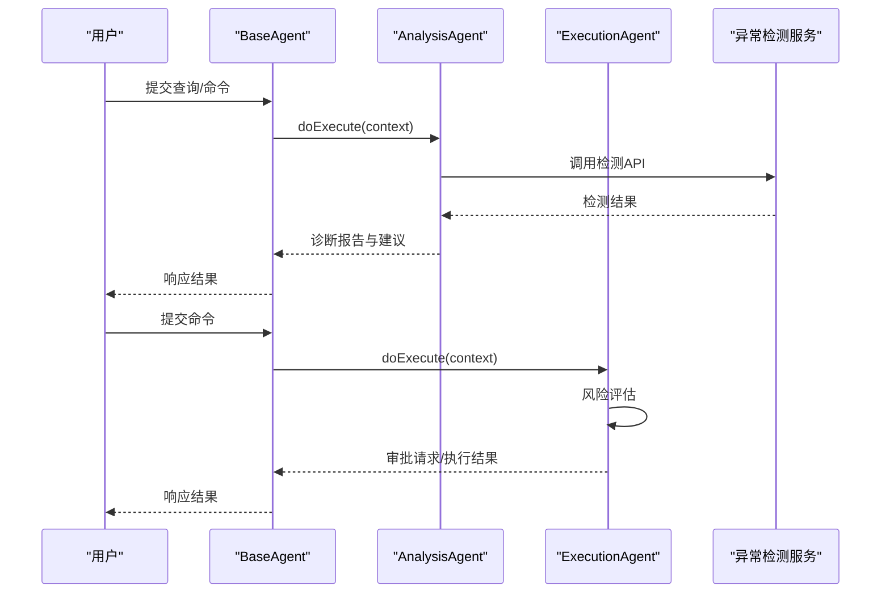
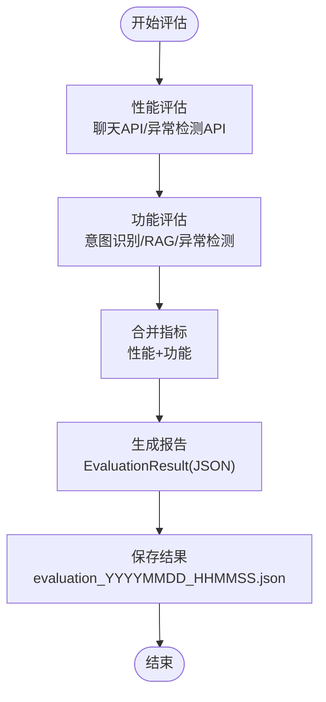
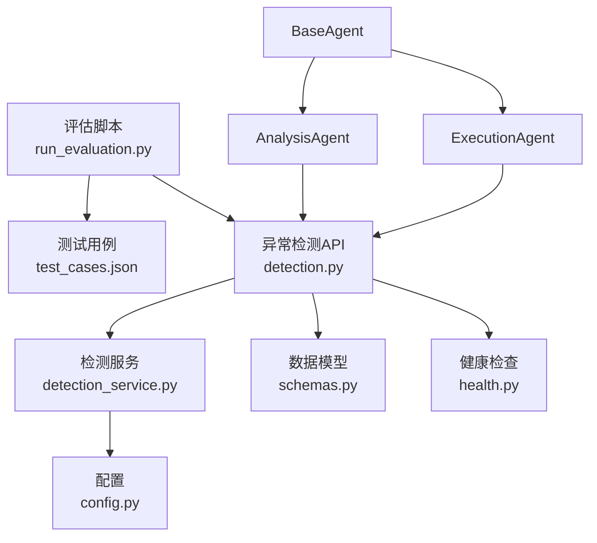

# 结果分析与报告

<cite>
**本文引用的文件**
- [run_evaluation.py](file://evaluation/run_evaluation.py)
- [test_cases.json](file://evaluation/test_cases.json)
- [schemas.py](file://anomaly-detection-service/app/models/schemas.py)
- [detection_service.py](file://anomaly-detection-service/app/services/detection_service.py)
- [detection.py](file://anomaly-detection-service/app/api/routes/detection.py)
- [config.py](file://anomaly-detection-service/app/config.py)
- [health.py](file://anomaly-detection-service/app/api/routes/health.py)
- [AnalysisAgent.java](file://netdata-ai-backend/src/main/java/com/netdata/ops/core/agent/AnalysisAgent.java)
- [ExecutionAgent.java](file://netdata-ai-backend/src/main/java/com/netdata/ops/core/agent/ExecutionAgent.java)
- [BaseAgent.java](file://netdata-ai-backend/src/main/java/com/netdata/ops/core/agent/BaseAgent.java)
- [evaluation_report.md](file://docs/evaluation_report.md)
- [system_architecture.md](file://docs/system_architecture.md)
- [README.md](file://anomaly-detection-service/README.md)
</cite>

## 目录
1. [简介](#简介)
2. [项目结构](#项目结构)
3. [核心组件](#核心组件)
4. [架构概览](#架构概览)
5. [详细组件分析](#详细组件分析)
6. [依赖分析](#依赖分析)
7. [性能考虑](#性能考虑)
8. [故障排除指南](#故障排除指南)
9. [结论](#结论)
10. [附录](#附录)

## 简介
本指南面向评估结果分析与报告，围绕智能运维系统在功能、性能、用户体验三个维度的评估指标，提供标准化的数据结构与格式规范、统计分析方法、趋势与对比分析流程，以及报告生成与展示方案。通过对评估脚本、异常检测服务、多智能体系统及现有评估报告的综合分析，帮助管理者与技术人员从数据中提取价值，制定改进与优化策略。

## 项目结构
系统采用前后端分离与微服务架构，评估工作主要涉及：
- 评估脚本：负责收集功能与性能指标，生成JSON结果文件
- 异常检测服务：提供批量/流式异常检测API，支撑性能与功能评估
- 多智能体系统：负责意图识别、RAG检索、故障诊断与命令执行
- 评估报告：以Markdown形式呈现，包含指标汇总、对比分析与改进建议

**图表来源**
- [run_evaluation.py:440-528](file://evaluation/run_evaluation.py#L440-L528)
- [detection.py:55-153](file://anomaly-detection-service/app/api/routes/detection.py#L55-L153)
- [detection_service.py:37-118](file://anomaly-detection-service/app/services/detection_service.py#L37-L118)
- [schemas.py:63-122](file://anomaly-detection-service/app/models/schemas.py#L63-L122)
- [config.py:28-183](file://anomaly-detection-service/app/config.py#L28-L183)
- [health.py:25-52](file://anomaly-detection-service/app/api/routes/health.py#L25-L52)
- [BaseAgent.java:107-226](file://netdata-ai-backend/src/main/java/com/netdata/ops/core/agent/BaseAgent.java#L107-L226)
- [AnalysisAgent.java:47-59](file://netdata-ai-backend/src/main/java/com/netdata/ops/core/agent/AnalysisAgent.java#L47-L59)
- [ExecutionAgent.java:149-198](file://netdata-ai-backend/src/main/java/com/netdata/ops/core/agent/ExecutionAgent.java#L149-L198)

**章节来源**
- [run_evaluation.py:1-528](file://evaluation/run_evaluation.py#L1-L528)
- [test_cases.json:1-241](file://evaluation/test_cases.json#L1-L241)
- [README.md:1-42](file://anomaly-detection-service/README.md#L1-L42)

## 核心组件
本节聚焦评估结果的数据结构与格式规范，涵盖性能指标、功能指标与详细日志的组织方式与存储格式，并给出统计分析、趋势分析与对比分析的实施步骤。

- 评估配置与结果数据结构
  - 评估配置包含服务地址、测试轮次、超时与输出目录等字段，用于统一控制评估过程
  - 性能指标包含延迟（P50/P90/P99/平均/最小/最大）、吞吐量与资源占用
  - 功能指标包含意图识别（准确率/精确率/召回率/F1）、RAG检索（召回率/精确率/MRR）、异常检测（精确率/召回率/F1）与诊断准确率
  - 评估结果以JSON格式保存，包含时间戳、配置、性能指标、功能指标与细节字典

- 测试用例组织
  - 测试用例分为意图识别、RAG评估、异常检测与命令风险评估等类别，每类包含查询语句、期望标签或相关文档等字段
  - 评估脚本按类别加载测试用例，驱动API调用与指标计算

- 统计分析方法
  - 描述性统计：均值、中位数、标准差、极值等
  - 分类指标：准确率、精确率、召回率、F1分数
  - 时序指标：延迟百分位数、吞吐量、资源占用
  - 检索指标：Recall@K、Precision@K、MRR

- 趋势分析
  - 按时间序列绘制延迟、吞吐量与资源占用的变化曲线
  - 对比不同算法或配置下的指标变化，识别性能瓶颈与优化方向

- 对比分析
  - 不同检测器（Isolation Forest、LOF、KNN）的性能与准确性对比
  - 不同检索策略（纯向量、纯BM25、混合+RRF、混合+Reranker）的召回与延迟对比
  - 不同意图识别规则与LLM增强方案的准确率对比

**章节来源**
- [run_evaluation.py:42-128](file://evaluation/run_evaluation.py#L42-L128)
- [test_cases.json:1-241](file://evaluation/test_cases.json#L1-L241)

## 架构概览
评估流程贯穿前端交互、API网关、多智能体编排、核心服务与外部服务层，异常检测服务提供离线/在线检测能力，支撑端到端性能与功能评估。

**图表来源**
- [system_architecture.md:23-134](file://docs/system_architecture.md#L23-L134)
- [system_architecture.md:171-206](file://docs/system_architecture.md#L171-L206)
- [system_architecture.md:322-407](file://docs/system_architecture.md#L322-L407)
- [system_architecture.md:409-442](file://docs/system_architecture.md#L409-L442)
- [system_architecture.md:454-509](file://docs/system_architecture.md#L454-L509)

**章节来源**
- [system_architecture.md:1-921](file://docs/system_architecture.md#L1-L921)

## 详细组件分析

### 评估脚本与结果数据结构
评估脚本定义了评估配置、性能指标、功能指标与评估结果的数据类，负责：
- 性能评估：测量聊天API与异常检测API的延迟，计算吞吐量与资源占用
- 功能评估：意图识别准确率与F1、RAG检索召回率与MRR、异常检测F1
- 结果聚合：合并性能与功能指标，生成JSON报告并保存

**图表来源**
- [run_evaluation.py:42-128](file://evaluation/run_evaluation.py#L42-L128)

**章节来源**
- [run_evaluation.py:133-252](file://evaluation/run_evaluation.py#L133-L252)
- [run_evaluation.py:257-435](file://evaluation/run_evaluation.py#L257-L435)
- [run_evaluation.py:440-528](file://evaluation/run_evaluation.py#L440-L528)

### 异常检测服务与API
异常检测服务提供批量与流式检测接口，支持多种检测器类型与阈值配置，返回标准化的检测结果与状态信息。

**图表来源**
- [detection.py:55-153](file://anomaly-detection-service/app/api/routes/detection.py#L55-L153)
- [detection_service.py:76-118](file://anomaly-detection-service/app/services/detection_service.py#L76-L118)
- [schemas.py:238-254](file://anomaly-detection-service/app/models/schemas.py#L238-L254)

**章节来源**
- [detection.py:52-153](file://anomaly-detection-service/app/api/routes/detection.py#L52-L153)
- [detection_service.py:37-118](file://anomaly-detection-service/app/services/detection_service.py#L37-L118)
- [schemas.py:63-122](file://anomaly-detection-service/app/models/schemas.py#L63-L122)

### 多智能体系统与Agent执行流程
多智能体系统通过Agent基类提供超时控制、重试、拦截器与指标采集能力，AnalysisAgent与ExecutionAgent分别负责故障诊断与命令执行审批。

**图表来源**
- [BaseAgent.java:107-226](file://netdata-ai-backend/src/main/java/com/netdata/ops/core/agent/BaseAgent.java#L107-L226)
- [AnalysisAgent.java:47-59](file://netdata-ai-backend/src/main/java/com/netdata/ops/core/agent/AnalysisAgent.java#L47-L59)
- [ExecutionAgent.java:149-198](file://netdata-ai-backend/src/main/java/com/netdata/ops/core/agent/ExecutionAgent.java#L149-L198)

**章节来源**
- [BaseAgent.java:1-488](file://netdata-ai-backend/src/main/java/com/netdata/ops/core/agent/BaseAgent.java#L1-L488)
- [AnalysisAgent.java:1-261](file://netdata-ai-backend/src/main/java/com/netdata/ops/core/agent/AnalysisAgent.java#L1-L261)
- [ExecutionAgent.java:1-425](file://netdata-ai-backend/src/main/java/com/netdata/ops/core/agent/ExecutionAgent.java#L1-L425)

### 评估流程与统计分析
评估脚本的主流程包括性能评估与功能评估两部分，分别调用异步API测量延迟与计算指标，并生成JSON报告。

**图表来源**
- [run_evaluation.py:440-528](file://evaluation/run_evaluation.py#L440-L528)

**章节来源**
- [run_evaluation.py:440-528](file://evaluation/run_evaluation.py#L440-L528)

## 依赖分析
评估系统的关键依赖关系如下：
- 评估脚本依赖异常检测服务API与测试用例文件
- 异常检测服务依赖检测器工厂与配置模块
- 多智能体系统依赖Agent基类与具体Agent实现

**图表来源**
- [run_evaluation.py:440-528](file://evaluation/run_evaluation.py#L440-L528)
- [detection.py:55-153](file://anomaly-detection-service/app/api/routes/detection.py#L55-L153)
- [detection_service.py:37-118](file://anomaly-detection-service/app/services/detection_service.py#L37-L118)
- [config.py:28-183](file://anomaly-detection-service/app/config.py#L28-L183)
- [schemas.py:63-122](file://anomaly-detection-service/app/models/schemas.py#L63-L122)
- [health.py:25-52](file://anomaly-detection-service/app/api/routes/health.py#L25-L52)
- [BaseAgent.java:107-226](file://netdata-ai-backend/src/main/java/com/netdata/ops/core/agent/BaseAgent.java#L107-L226)
- [AnalysisAgent.java:47-59](file://netdata-ai-backend/src/main/java/com/netdata/ops/core/agent/AnalysisAgent.java#L47-L59)
- [ExecutionAgent.java:149-198](file://netdata-ai-backend/src/main/java/com/netdata/ops/core/agent/ExecutionAgent.java#L149-L198)

**章节来源**
- [run_evaluation.py:1-528](file://evaluation/run_evaluation.py#L1-L528)
- [detection.py:1-378](file://anomaly-detection-service/app/api/routes/detection.py#L1-L378)
- [detection_service.py:1-334](file://anomaly-detection-service/app/services/detection_service.py#L1-L334)
- [config.py:1-183](file://anomaly-detection-service/app/config.py#L1-L183)
- [schemas.py:1-329](file://anomaly-detection-service/app/models/schemas.py#L1-L329)
- [health.py:1-88](file://anomaly-detection-service/app/api/routes/health.py#L1-L88)
- [BaseAgent.java:1-488](file://netdata-ai-backend/src/main/java/com/netdata/ops/core/agent/BaseAgent.java#L1-L488)
- [AnalysisAgent.java:1-261](file://netdata-ai-backend/src/main/java/com/netdata/ops/core/agent/AnalysisAgent.java#L1-L261)
- [ExecutionAgent.java:1-425](file://netdata-ai-backend/src/main/java/com/netdata/ops/core/agent/ExecutionAgent.java#L1-L425)

## 性能考虑
- 延迟与吞吐量：通过多次测试轮次与百分位数统计，确保评估结果稳定可靠
- 资源占用：结合容器化部署与缓存策略，降低服务间通信开销
- 检测器选择：Isolation Forest在性能与准确性之间取得平衡，适合作为默认检测算法
- 检索策略：混合检索与RRF融合显著提升召回率，Reranker带来额外延迟需权衡

[本节为通用指导，无需引用具体文件]

## 故障排除指南
- 异常检测服务不可用
  - 检查健康检查端点与服务状态
  - 验证配置参数（阈值、窗口大小、最大批大小）
  - 确认NetData数据源可达性

- 评估脚本执行失败
  - 检查测试用例文件是否存在且格式正确
  - 确认API端点可达与响应格式符合预期
  - 查看日志输出定位具体错误

- 多智能体执行超时
  - 调整Agent超时时间与重试策略
  - 检查下游服务响应时间与稳定性

**章节来源**
- [health.py:25-88](file://anomaly-detection-service/app/api/routes/health.py#L25-L88)
- [config.py:108-146](file://anomaly-detection-service/app/config.py#L108-L146)
- [BaseAgent.java:281-303](file://netdata-ai-backend/src/main/java/com/netdata/ops/core/agent/BaseAgent.java#L281-L303)

## 结论
评估结果分析与报告体系明确了数据结构、统计方法与展示方案，结合异常检测服务与多智能体系统的实际能力，能够为系统优化与决策支持提供坚实依据。建议持续跟踪关键指标趋势，定期进行对比分析，推动系统在准确性、性能与用户体验方面的持续改进。

[本节为总结性内容，无需引用具体文件]

## 附录
- 评估报告模板与生成流程参考现有评估报告文档，包含功能评估、性能评估、资源占用与问题改进建议等章节
- 异常检测服务API文档与端点说明可参考服务自述文件

**章节来源**
- [evaluation_report.md:1-224](file://docs/evaluation_report.md#L1-L224)
- [README.md:1-42](file://anomaly-detection-service/README.md#L1-L42)