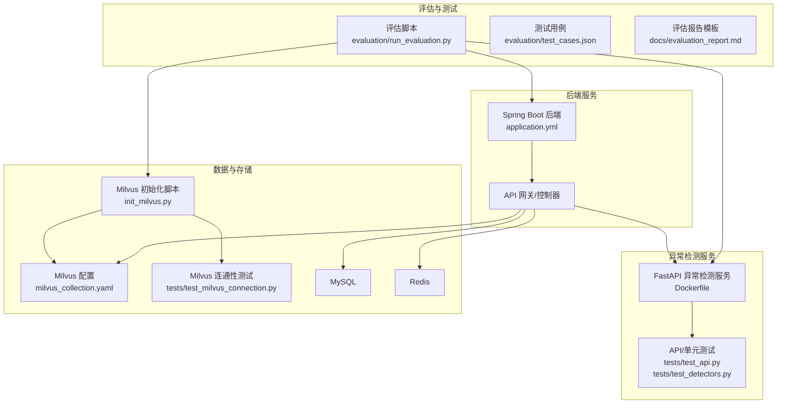
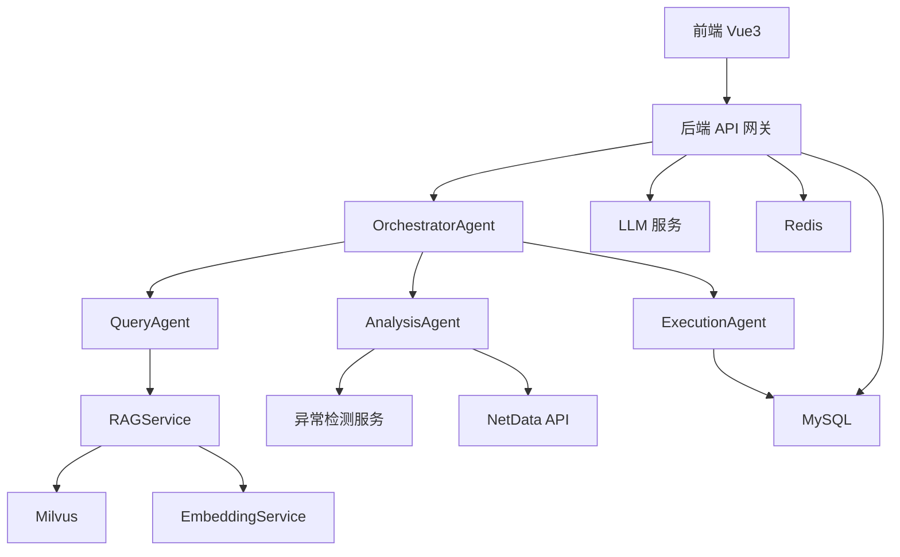
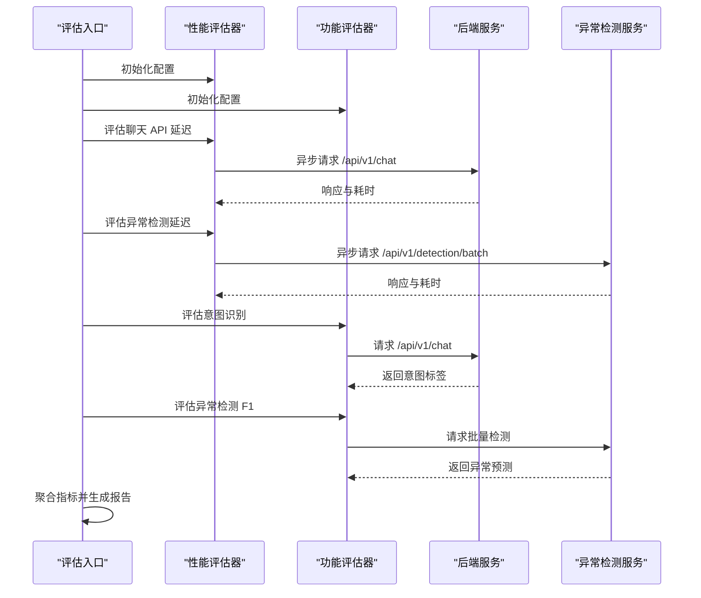
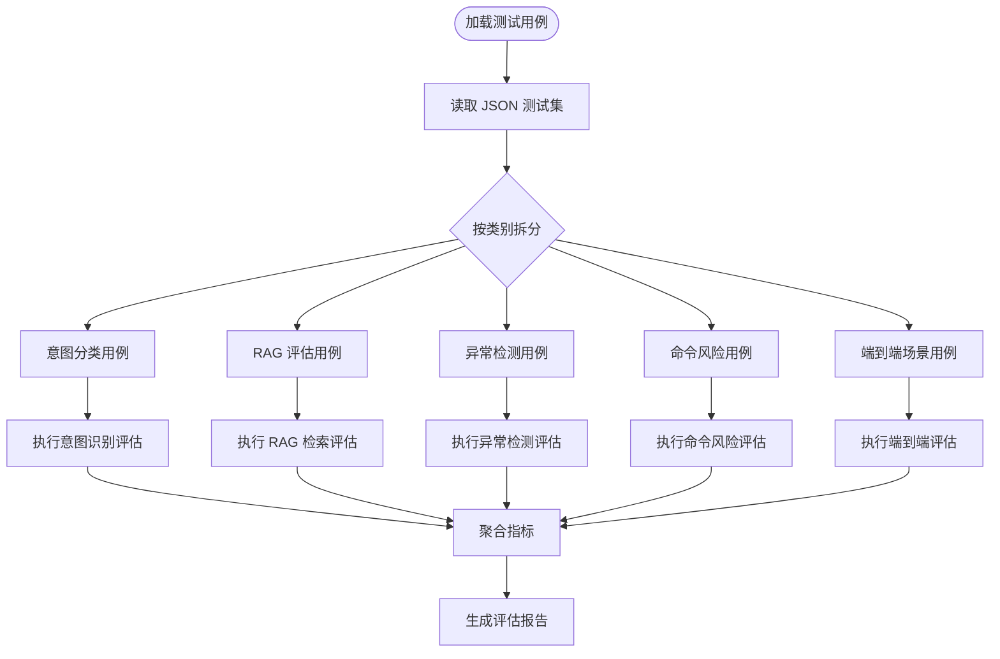
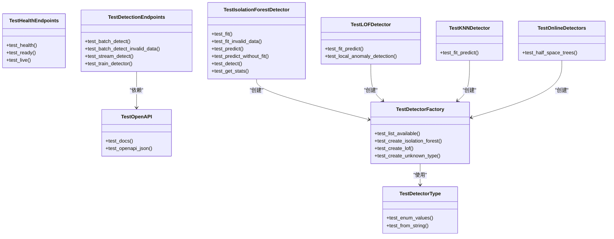
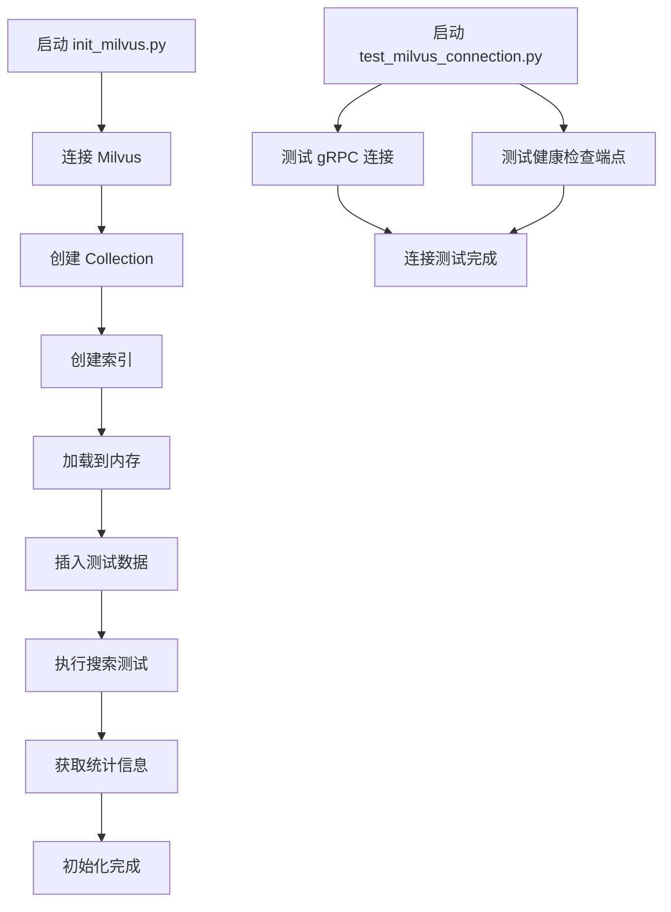
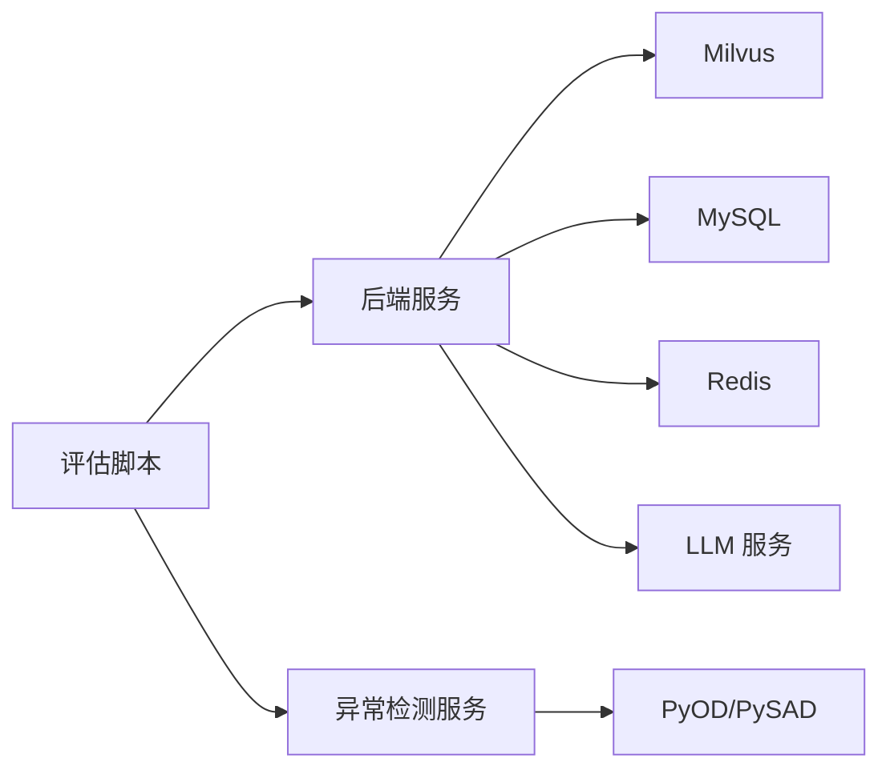

# 评估与测试

<cite>
**本文引用的文件**
- [evaluation/run_evaluation.py](file://evaluation/run_evaluation.py)
- [evaluation/test_cases.json](file://evaluation/test_cases.json)
- [docs/evaluation_report.md](file://docs/evaluation_report.md)
- [docs/system_architecture.md](file://docs/system_architecture.md)
- [anomaly-detection-service/tests/test_api.py](file://anomaly-detection-service/tests/test_api.py)
- [anomaly-detection-service/tests/test_detectors.py](file://anomaly-detection-service/tests/test_detectors.py)
- [anomaly-detection-service/tests/conftest.py](file://anomaly-detection-service/tests/conftest.py)
- [anomaly-detection-service/pyproject.toml](file://anomaly-detection-service/pyproject.toml)
- [anomaly-detection-service/README.md](file://anomaly-detection-service/README.md)
- [anomaly-detection-service/Dockerfile](file://anomaly-detection-service/Dockerfile)
- [netdata-ai-backend/src/main/resources/application.yml](file://netdata-ai-backend/src/main/resources/application.yml)
- [scripts/init_milvus.py](file://scripts/init_milvus.py)
- [config/milvus_collection.yaml](file://config/milvus_collection.yaml)
- [tests/test_milvus_connection.py](file://tests/test_milvus_connection.py)
- [docker-compose.yml](file://docker-compose.yml)
</cite>

## 目录
1. [简介](#简介)
2. [项目结构](#项目结构)
3. [核心组件](#核心组件)
4. [架构总览](#架构总览)
5. [详细组件分析](#详细组件分析)
6. [依赖分析](#依赖分析)
7. [性能考量](#性能考量)
8. [故障排查指南](#故障排查指南)
9. [结论](#结论)
10. [附录](#附录)

## 简介
本方法论文档围绕“系统评估与测试”主题，结合仓库中的评估脚本、测试用例、配置与架构文档，构建一套完整的评估方法论。内容涵盖功能测试、性能测试、安全测试与用户体验评估的实施策略；测试用例设计原则（覆盖范围、边界条件、异常场景）；性能基准测试（响应时间、吞吐量、并发处理能力）；用户体验指标体系（易用性、效率、满意度）；评估结果分析与报告生成（统计分析、趋势分析、对比分析）；以及测试自动化（脚本编写、执行调度、结果收集）与评估工具使用指南。

## 项目结构
本项目采用多模块协作的架构：前端 Vue3 + 后端 Spring Boot + 异常检测 Python 服务 + 向量数据库 Milvus + 关系数据库 MySQL + 缓存 Redis + LLM 服务（DeepSeek/Ollama）。评估与测试涉及以下关键路径：
- 评估脚本与测试用例：evaluation/run_evaluation.py、evaluation/test_cases.json
- 后端服务配置与接口：netdata-ai-backend/application.yml
- 异常检测服务：anomaly-detection-service（FastAPI）
- 向量数据库初始化与配置：scripts/init_milvus.py、config/milvus_collection.yaml
- Milvus 连通性测试：tests/test_milvus_connection.py
- Docker 编排：docker-compose.yml
- 测试框架与覆盖率：anomaly-detection-service/pyproject.toml、anomaly-detection-service/tests/

图表来源
- [evaluation/run_evaluation.py:1-528](file://evaluation/run_evaluation.py#L1-L528)
- [evaluation/test_cases.json:1-241](file://evaluation/test_cases.json#L1-L241)
- [docs/evaluation_report.md:1-224](file://docs/evaluation_report.md#L1-L224)
- [netdata-ai-backend/src/main/resources/application.yml:1-314](file://netdata-ai-backend/src/main/resources/application.yml#L1-L314)
- [anomaly-detection-service/Dockerfile:1-95](file://anomaly-detection-service/Dockerfile#L1-L95)
- [anomaly-detection-service/tests/test_api.py:1-172](file://anomaly-detection-service/tests/test_api.py#L1-L172)
- [anomaly-detection-service/tests/test_detectors.py:1-231](file://anomaly-detection-service/tests/test_detectors.py#L1-L231)
- [scripts/init_milvus.py:1-525](file://scripts/init_milvus.py#L1-L525)
- [config/milvus_collection.yaml:1-186](file://config/milvus_collection.yaml#L1-L186)
- [tests/test_milvus_connection.py:1-148](file://tests/test_milvus_connection.py#L1-L148)

章节来源
- [evaluation/run_evaluation.py:1-528](file://evaluation/run_evaluation.py#L1-L528)
- [docs/system_architecture.md:1-921](file://docs/system_architecture.md#L1-L921)

## 核心组件
- 评估脚本与指标体系
  - 性能指标：P50/P90/P99 延迟、平均延迟、吞吐量、CPU/内存占用
  - 功能指标：意图识别准确率/精确率/召回率/F1、RAG 召回率/MRR、异常检测精确率/召回率/F1
  - 评估流程：异步并发请求、指标聚合、结果序列化与报告输出
- 测试用例设计
  - 覆盖意图分类（知识问答/故障诊断/命令执行/混合）、RAG 检索、异常检测、命令风险评估、端到端场景
  - 边界与异常：空输入、无效数据、阈值边界、异常注入
- 后端与异常检测服务
  - 后端配置（LLM、RAG、Milvus、Redis、限流、安全）
  - 异常检测服务（批量/流式检测、训练、健康检查）
- 数据与存储
  - Milvus 集合结构、索引与搜索参数、连接与健康检查
- 测试框架与自动化
  - pytest 配置、标记、覆盖率、CI/CD 可集成

章节来源
- [evaluation/run_evaluation.py:440-528](file://evaluation/run_evaluation.py#L440-L528)
- [evaluation/test_cases.json:1-241](file://evaluation/test_cases.json#L1-L241)
- [anomaly-detection-service/tests/test_api.py:1-172](file://anomaly-detection-service/tests/test_api.py#L1-L172)
- [anomaly-detection-service/tests/test_detectors.py:1-231](file://anomaly-detection-service/tests/test_detectors.py#L1-L231)
- [netdata-ai-backend/src/main/resources/application.yml:140-237](file://netdata-ai-backend/src/main/resources/application.yml#L140-L237)
- [scripts/init_milvus.py:142-303](file://scripts/init_milvus.py#L142-L303)
- [tests/test_milvus_connection.py:33-116](file://tests/test_milvus_connection.py#L33-L116)

## 架构总览
系统采用“前端-后端-外部服务-数据存储”的分层架构，评估与测试贯穿各层：
- 前端：Vue3 + TypeScript，负责用户交互与消息推送
- 后端：Spring Boot，提供 API 网关、多智能体编排、RAG、异常检测调用、命令执行与审批
- 外部服务：异常检测 Python 服务、NetData API、LLM 服务（DeepSeek/Ollama）
- 数据存储：Milvus（向量）、MySQL（关系）、Redis（缓存）

图表来源
- [docs/system_architecture.md:21-134](file://docs/system_architecture.md#L21-L134)
- [docs/system_architecture.md:169-206](file://docs/system_architecture.md#L169-L206)
- [docs/system_architecture.md:322-407](file://docs/system_architecture.md#L322-L407)
- [docs/system_architecture.md:409-442](file://docs/system_architecture.md#L409-L442)

## 详细组件分析

### 评估脚本与测试自动化
- 评估维度与指标
  - 功能评估：意图识别（准确率/精确率/召回率/F1）、RAG（召回率/MRR）、异常检测（精确率/召回率/F1）
  - 性能评估：延迟（P50/P90/P99/平均）、吞吐量（req/s）、资源占用（CPU/内存）
  - 用户体验：响应质量评分（可扩展）
- 测试流程
  - 加载测试用例（JSON）
  - 异步并发请求（httpx.AsyncClient）
  - 指标计算（numpy/statistics）
  - 结果聚合与报告输出（JSON）
- 自动化与可扩展性
  - 通过配置类统一管理服务地址、轮次、超时、输出目录
  - 指标类与结果类标准化输出，便于后续分析与可视化

图表来源
- [evaluation/run_evaluation.py:133-252](file://evaluation/run_evaluation.py#L133-L252)
- [evaluation/run_evaluation.py:257-435](file://evaluation/run_evaluation.py#L257-L435)
- [evaluation/run_evaluation.py:440-528](file://evaluation/run_evaluation.py#L440-L528)

章节来源
- [evaluation/run_evaluation.py:42-128](file://evaluation/run_evaluation.py#L42-L128)
- [evaluation/run_evaluation.py:133-252](file://evaluation/run_evaluation.py#L133-L252)
- [evaluation/run_evaluation.py:257-435](file://evaluation/run_evaluation.py#L257-L435)
- [evaluation/run_evaluation.py:440-528](file://evaluation/run_evaluation.py#L440-L528)

### 测试用例设计与覆盖范围
- 意图识别测试用例：覆盖知识问答、故障诊断、命令执行、混合意图，标注期望意图类型
- RAG 评估用例：标注相关文档集合，用于计算召回率/MRR
- 异常检测用例：提供指标名称、正常范围、异常阈值、样本规模与异常比例
- 命令风险评估用例：覆盖不同风险等级的命令，标注预期风险与审批需求
- 端到端场景用例：描述完整流程步骤、预期延迟与成功率

图表来源
- [evaluation/test_cases.json:1-241](file://evaluation/test_cases.json#L1-L241)
- [evaluation/run_evaluation.py:242-252](file://evaluation/run_evaluation.py#L242-L252)

章节来源
- [evaluation/test_cases.json:1-241](file://evaluation/test_cases.json#L1-L241)

### 后端服务配置与安全测试要点
- LLM 与 RAG 配置：模型选择（DeepSeek/Ollama）、向量维度、检索 Top-K、融合参数、相似度阈值
- Milvus 配置：主机、端口、集合名、向量维度、索引类型与参数
- 安全配置：JWT 密钥、访问/刷新过期时间、限流策略、命令执行黑名单/白名单与风险阈值
- 异常检测服务配置：URL、超时、重试次数与退避策略

章节来源
- [netdata-ai-backend/src/main/resources/application.yml:140-237](file://netdata-ai-backend/src/main/resources/application.yml#L140-L237)

### 异常检测服务测试
- API 测试：健康检查、批量检测、流式检测、训练接口、OpenAPI 文档
- 单元测试：检测器工厂、隔离森林/LOF/KNN 检测器、在线检测器（半空间树）、检测器类型枚举
- 标记与配置：pytest 标记 slow/integration，覆盖率配置

图表来源
- [anomaly-detection-service/tests/test_api.py:32-172](file://anomaly-detection-service/tests/test_api.py#L32-L172)
- [anomaly-detection-service/tests/test_detectors.py:32-231](file://anomaly-detection-service/tests/test_detectors.py#L32-L231)

章节来源
- [anomaly-detection-service/tests/test_api.py:1-172](file://anomaly-detection-service/tests/test_api.py#L1-L172)
- [anomaly-detection-service/tests/test_detectors.py:1-231](file://anomaly-detection-service/tests/test_detectors.py#L1-L231)
- [anomaly-detection-service/tests/conftest.py:14-22](file://anomaly-detection-service/tests/conftest.py#L14-L22)
- [anomaly-detection-service/pyproject.toml:37-55](file://anomaly-detection-service/pyproject.toml#L37-L55)

### Milvus 初始化与连通性测试
- 初始化脚本：连接、创建集合、创建索引、加载、插入测试数据、搜索测试、统计信息
- 配置文件：集合字段、索引类型与参数、搜索参数、输出字段
- 连通性测试：gRPC 连接、健康检查端点、版本与集合列表

图表来源
- [scripts/init_milvus.py:466-525](file://scripts/init_milvus.py#L466-L525)
- [config/milvus_collection.yaml:22-186](file://config/milvus_collection.yaml#L22-L186)
- [tests/test_milvus_connection.py:118-148](file://tests/test_milvus_connection.py#L118-L148)

章节来源
- [scripts/init_milvus.py:142-303](file://scripts/init_milvus.py#L142-L303)
- [config/milvus_collection.yaml:22-186](file://config/milvus_collection.yaml#L22-L186)
- [tests/test_milvus_connection.py:33-116](file://tests/test_milvus_connection.py#L33-L116)

### Docker 编排与部署
- 服务编排：Milvus（etcd/minio）、MySQL、Redis、Ollama、Neo4j（可选）
- 网络与卷：自定义桥接网络、绑定挂载或命名卷
- 健康检查：etcd、MinIO、Milvus、MySQL、Redis、Ollama
- 资源限制：为各服务分配内存上限与预留

章节来源
- [docker-compose.yml:23-358](file://docker-compose.yml#L23-L358)

## 依赖分析
- 组件耦合
  - 评估脚本依赖后端与异常检测服务的 REST API；后端依赖 Milvus、MySQL、Redis、LLM
  - 异常检测服务独立性强，具备健康检查与训练接口
- 外部依赖
  - Python 评估脚本依赖 httpx、numpy、statistics、pytest（测试）
  - 后端依赖 Spring Boot、Spring AI、MyBatis-Plus、Resilience4j、WebSocket
  - Milvus 依赖 etcd 与 MinIO，需合理配置索引与搜索参数
- 循环依赖
  - 未发现直接循环依赖；测试与实现分离，降低耦合

图表来源
- [evaluation/run_evaluation.py:133-252](file://evaluation/run_evaluation.py#L133-L252)
- [netdata-ai-backend/src/main/resources/application.yml:140-237](file://netdata-ai-backend/src/main/resources/application.yml#L140-L237)
- [anomaly-detection-service/README.md:1-42](file://anomaly-detection-service/README.md#L1-L42)

章节来源
- [evaluation/run_evaluation.py:133-252](file://evaluation/run_evaluation.py#L133-L252)
- [netdata-ai-backend/src/main/resources/application.yml:140-237](file://netdata-ai-backend/src/main/resources/application.yml#L140-L237)
- [anomaly-detection-service/README.md:1-42](file://anomaly-detection-service/README.md#L1-L42)

## 性能考量
- 延迟与吞吐量
  - 评估脚本通过多次并发请求测量 P50/P90/P99 延迟与吞吐量，适用于 API 基准测试
  - 建议在不同负载下重复评估，形成趋势分析
- 资源占用
  - Docker 编排中为 Milvus、MySQL、Redis、Ollama 分配内存资源，需根据实际数据规模调整
- 检索性能
  - Milvus 索引类型（IVF_FLAT/HNSW）与 nlist/nprobe 参数直接影响检索精度与速度
- 并发与限流
  - 后端配置了限流策略与断路器指标，评估时需考虑限流对吞吐的影响

章节来源
- [docs/evaluation_report.md:123-180](file://docs/evaluation_report.md#L123-L180)
- [scripts/init_milvus.py:253-303](file://scripts/init_milvus.py#L253-L303)
- [docker-compose.yml:148-291](file://docker-compose.yml#L148-L291)
- [netdata-ai-backend/src/main/resources/application.yml:198-202](file://netdata-ai-backend/src/main/resources/application.yml#L198-L202)

## 故障排查指南
- Milvus 连接失败
  - 检查 etcd 与 MinIO 健康状态、端口映射、数据卷挂载
  - 使用连接测试脚本验证 gRPC 与健康检查端点
- 异常检测服务不可用
  - 查看健康检查端点、日志、容器状态；确认依赖的 PyOD/PySAD 是否安装
- 后端服务异常
  - 检查 LLM 配置（API Key/Base URL）、RAG 参数、Redis/Milvus 连接
- 测试执行失败
  - 确认 pytest 配置、覆盖率与标记；检查测试用例 JSON 格式

章节来源
- [tests/test_milvus_connection.py:118-148](file://tests/test_milvus_connection.py#L118-L148)
- [docker-compose.yml:47-139](file://docker-compose.yml#L47-L139)
- [anomaly-detection-service/Dockerfile:78-95](file://anomaly-detection-service/Dockerfile#L78-L95)
- [anomaly-detection-service/tests/conftest.py:14-22](file://anomaly-detection-service/tests/conftest.py#L14-L22)

## 结论
本方法论文档基于仓库中的评估脚本、测试用例与系统配置，构建了覆盖功能、性能、安全与用户体验的评估体系。通过标准化的指标采集、自动化执行与报告生成，能够有效支撑系统迭代与发布决策。建议在后续工作中进一步完善用户体验量化指标、引入 A/B 对照实验与回归测试，并将评估流程纳入 CI/CD。

## 附录
- 评估报告模板：包含评估目的、范围、环境、功能与性能评估结果、资源占用、问题与改进建议、结论
- 架构文档：系统整体架构、核心模块设计（Multi-Agent、RAG、异常检测）、数据模型、接口设计、安全设计、性能优化与部署架构

章节来源
- [docs/evaluation_report.md:1-224](file://docs/evaluation_report.md#L1-L224)
- [docs/system_architecture.md:1-921](file://docs/system_architecture.md#L1-L921)