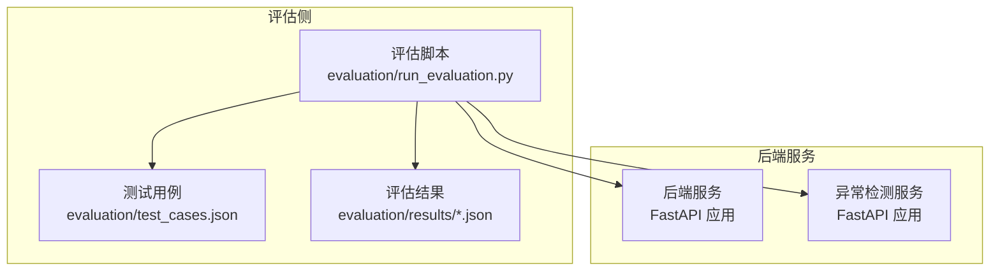
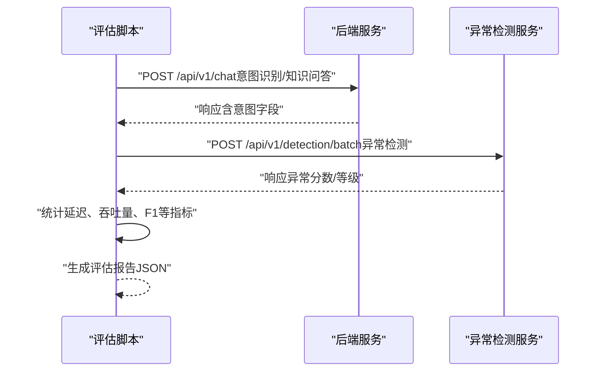
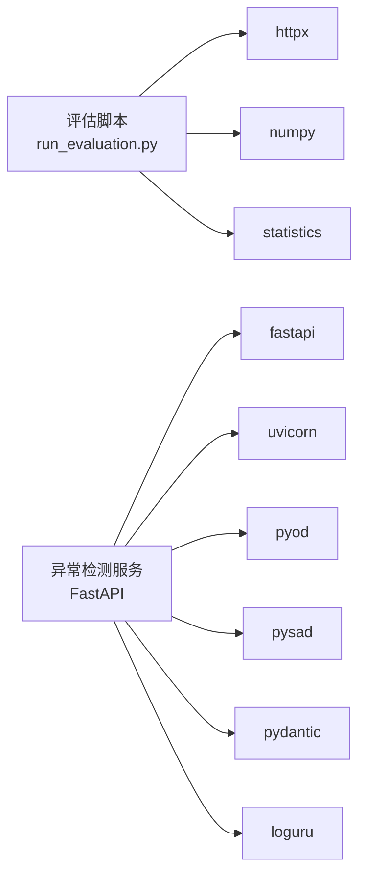

# 评估方法论

<cite>
**本文引用的文件**
- [evaluation/run_evaluation.py](file://evaluation/run_evaluation.py)
- [evaluation/test_cases.json](file://evaluation/test_cases.json)
- [anomaly-detection-service/README.md](file://anomaly-detection-service/README.md)
- [anomaly-detection-service/app/main.py](file://anomaly-detection-service/app/main.py)
- [anomaly-detection-service/app/api/routes/detection.py](file://anomaly-detection-service/app/api/routes/detection.py)
- [anomaly-detection-service/app/services/detection_service.py](file://anomaly-detection-service/app/services/detection_service.py)
- [anomaly-detection-service/app/models/schemas.py](file://anomaly-detection-service/app/models/schemas.py)
- [anomaly-detection-service/app/config.py](file://anomaly-detection-service/app/config.py)
- [anomaly-detection-service/pyproject.toml](file://anomaly-detection-service/pyproject.toml)
- [anomaly-detection-service/requirements.txt](file://anomaly-detection-service/requirements.txt)
</cite>

## 目录
1. [简介](#简介)
2. [项目结构](#项目结构)
3. [核心组件](#核心组件)
4. [架构总览](#架构总览)
5. [详细组件分析](#详细组件分析)
6. [依赖分析](#依赖分析)
7. [性能考量](#性能考量)
8. [故障排查指南](#故障排查指南)
9. [结论](#结论)
10. [附录](#附录)

## 简介
本文件系统性阐述本项目的评估方法论与实现，围绕“整体设计理念与理论基础、评估维度与指标体系、评估流程标准化步骤、评估配置最佳实践、评估结果解读与基准线设定”五个方面展开。评估对象涵盖：
- 后端智能运维系统（包含意图识别、RAG检索、异常检测等能力）
- 异常检测微服务（FastAPI + PyOD/PySAD）

评估维度包括：
- 功能评估：意图识别准确率、RAG召回率、异常检测F1等
- 性能评估：延迟（P50/P90/P99/平均）、吞吐量、资源占用
- 用户体验：响应质量评分（概念性指标，本仓库未实现具体量化）

评估流程采用“预热测试 + 正式测试 + 结果统计”的标准步骤，并提供可复用的配置参数与结果解读方法，帮助开发者快速落地评估并持续改进系统性能与稳定性。

## 项目结构
本项目由两部分组成：
- 评估脚本与测试用例：位于 evaluation 目录，负责构造测试场景、发起请求、收集指标并生成报告
- 异常检测微服务：位于 anomaly-detection-service 目录，提供异常检测API，支撑评估中的性能与功能指标采集

图表来源
- [evaluation/run_evaluation.py:440-527](file://evaluation/run_evaluation.py#L440-L527)
- [evaluation/test_cases.json:1-241](file://evaluation/test_cases.json#L1-L241)
- [anomaly-detection-service/app/main.py:76-217](file://anomaly-detection-service/app/main.py#L76-L217)

章节来源
- [evaluation/run_evaluation.py:1-528](file://evaluation/run_evaluation.py#L1-L528)
- [evaluation/test_cases.json:1-241](file://evaluation/test_cases.json#L1-L241)
- [anomaly-detection-service/app/main.py:1-217](file://anomaly-detection-service/app/main.py#L1-L217)

## 核心组件
- 评估配置类：封装服务地址、测试轮次、超时、输出目录等参数
- 性能评估器：测量延迟、计算吞吐量、汇总性能指标
- 功能评估器：调用后端API进行意图识别、RAG检索、异常检测评估，计算准确率、精确率、召回率、F1等
- 评估结果聚合：合并性能与功能指标，生成JSON报告并打印摘要

章节来源
- [evaluation/run_evaluation.py:42-128](file://evaluation/run_evaluation.py#L42-L128)

## 架构总览
评估脚本通过HTTP异步客户端向后端与异常检测服务发送请求，收集延迟与业务指标，最终生成评估报告。后端服务在FastAPI中提供健康检查、聊天接口、异常检测接口等；异常检测服务提供批量/流式检测与模型训练接口。

图表来源
- [evaluation/run_evaluation.py:197-241](file://evaluation/run_evaluation.py#L197-L241)
- [anomaly-detection-service/app/api/routes/detection.py:55-153](file://anomaly-detection-service/app/api/routes/detection.py#L55-L153)
- [anomaly-detection-service/app/main.py:177-187](file://anomaly-detection-service/app/main.py#L177-L187)

## 详细组件分析

### 评估配置与数据类
- EvaluationConfig：包含后端与异常检测服务URL、预热轮次、测试轮次、超时、输出目录等
- PerformanceMetrics：包含P50/P90/P99/平均延迟、最小/最大延迟、吞吐量、CPU/内存占用
- FunctionalMetrics：包含意图识别准确率/精确率/召回率/F1、RAG召回率/MRR、异常检测精确率/召回率/F1、诊断准确率
- EvaluationResult：封装时间戳、配置、性能与功能指标及细节

章节来源
- [evaluation/run_evaluation.py:42-128](file://evaluation/run_evaluation.py#L42-L128)

### 性能评估器
- measure_latency：对指定URL与负载进行多次请求，记录每次耗时（毫秒），返回延迟列表
- calculate_metrics：基于延迟列表计算P50/P90/P99/平均、最小/最大延迟，并计算吞吐量（req/s）
- evaluate_chat_api：加载意图分类测试用例，逐条调用后端聊天接口，汇总延迟
- evaluate_anomaly_detection：构造批量异常检测数据，调用异常检测服务，汇总延迟

章节来源
- [evaluation/run_evaluation.py:133-241](file://evaluation/run_evaluation.py#L133-L241)

### 功能评估器
- evaluate_intent_classification：调用后端聊天接口，解析响应中的意图字段，与测试用例期望意图对比，计算准确率与简化版精确率/召回率/F1
- evaluate_rag_retrieval：加载RAG评估用例，模拟检索评估（当前返回固定模拟值），计算RAG召回率与MRR
- evaluate_anomaly_detection：构造带标签的异常检测数据集，调用异常检测服务，计算异常检测F1（精确率/召回率/F1）

章节来源
- [evaluation/run_evaluation.py:257-435](file://evaluation/run_evaluation.py#L257-L435)

### 评估主流程
- run_evaluation：创建评估器实例，依次执行性能评估与功能评估，合并指标，生成EvaluationResult并保存为JSON，打印摘要

章节来源
- [evaluation/run_evaluation.py:440-527](file://evaluation/run_evaluation.py#L440-L527)

### 异常检测服务（后端支撑）
- FastAPI应用：注册路由、中间件、异常处理，提供健康检查、异常检测接口
- 异常检测路由：批量检测、流式检测、训练检测器、从NetData获取数据并检测
- 检测服务：管理离线/在线检测器实例池、训练与加载模型、执行检测与评分
- 数据模型：定义检测器类型、异常等级、请求/响应模型
- 配置：默认检测器、阈值、批处理上限、日志与缓存等

章节来源
- [anomaly-detection-service/app/main.py:76-217](file://anomaly-detection-service/app/main.py#L76-L217)
- [anomaly-detection-service/app/api/routes/detection.py:55-378](file://anomaly-detection-service/app/api/routes/detection.py#L55-L378)
- [anomaly-detection-service/app/services/detection_service.py:37-334](file://anomaly-detection-service/app/services/detection_service.py#L37-L334)
- [anomaly-detection-service/app/models/schemas.py:31-329](file://anomaly-detection-service/app/models/schemas.py#L31-L329)
- [anomaly-detection-service/app/config.py:28-183](file://anomaly-detection-service/app/config.py#L28-L183)

## 依赖分析
- 评估脚本依赖：
  - httpx（异步HTTP客户端）
  - numpy（数值计算与百分位）
  - statistics（均值等统计）
  - dataclasses（结构化指标数据类）
- 异常检测服务依赖：
  - FastAPI、Uvicorn（Web框架与ASGI服务器）
  - PyOD/PySAD（离线/在线异常检测算法）
  - NumPy/Pandas/SciPy（数值与科学计算）
  - Pydantic/Settings（类型安全配置与模型）
  - Loguru（日志）
  - pytest/mypy/ruff（测试与代码质量）

图表来源
- [evaluation/run_evaluation.py:26-37](file://evaluation/run_evaluation.py#L26-L37)
- [anomaly-detection-service/requirements.txt:18-94](file://anomaly-detection-service/requirements.txt#L18-L94)
- [anomaly-detection-service/pyproject.toml:1-55](file://anomaly-detection-service/pyproject.toml#L1-L55)

章节来源
- [evaluation/run_evaluation.py:26-37](file://evaluation/run_evaluation.py#L26-L37)
- [anomaly-detection-service/requirements.txt:1-94](file://anomaly-detection-service/requirements.txt#L1-L94)
- [anomaly-detection-service/pyproject.toml:1-55](file://anomaly-detection-service/pyproject.toml#L1-L55)

## 性能考量
- 延迟测量：使用高精度计时器记录请求往返时间，单位转换为毫秒；通过多次测试取统计值，避免瞬时波动影响
- 吞吐量计算：以平均延迟反推吞吐量（req/s），便于横向比较不同配置下的系统承载能力
- 资源占用：当前评估脚本未直接采集CPU/内存，可在扩展中结合系统监控或容器指标采集
- 并发与超时：评估脚本使用异步HTTP客户端并配置超时，避免阻塞；异常检测服务也具备超时控制与阈值配置
- 批处理与阈值：异常检测服务支持批量检测与阈值控制，评估时可调整阈值观察不同误报/漏报表现

章节来源
- [evaluation/run_evaluation.py:140-195](file://evaluation/run_evaluation.py#L140-L195)
- [anomaly-detection-service/app/config.py:132-137](file://anomaly-detection-service/app/config.py#L132-L137)
- [anomaly-detection-service/app/api/routes/detection.py:55-153](file://anomaly-detection-service/app/api/routes/detection.py#L55-L153)

## 故障排查指南
- 服务不可达：确认后端与异常检测服务URL、端口、网络连通性；检查FastAPI路由注册与中间件配置
- 超时与异常：评估脚本与异常检测服务均设置超时；若出现超时，适当增大timeout或优化算法参数
- 指标为空：当测试用例缺失或接口返回异常时，评估器会返回空指标或警告；检查测试用例文件与接口响应
- 模型未训练：异常检测服务对离线检测器首次使用会自动训练；若检测效果不佳，可使用训练接口提供历史数据
- 日志定位：异常检测服务启用请求日志中间件并在响应头添加处理耗时；评估脚本打印关键步骤与摘要

章节来源
- [evaluation/run_evaluation.py:260-298](file://evaluation/run_evaluation.py#L260-L298)
- [anomaly-detection-service/app/main.py:118-139](file://anomaly-detection-service/app/main.py#L118-L139)
- [anomaly-detection-service/app/api/routes/detection.py:147-152](file://anomaly-detection-service/app/api/routes/detection.py#L147-L152)

## 结论
本评估方法论以“功能-性能-体验”三维评估为核心，结合可复用的配置与流程，能够稳定地量化系统在真实场景下的表现。通过延迟、吞吐量、准确率、召回率、F1等指标，开发者可以快速定位瓶颈、验证改进效果，并建立持续的评估闭环。建议在实际落地中：
- 明确基线与目标阈值，定期回归评估
- 扩展资源占用采集，完善性能画像
- 将评估脚本集成到CI/CD，实现自动化回归
- 基于评估结果迭代算法参数与服务配置

## 附录

### 评估维度与指标体系
- 功能评估
  - 意图识别：准确率、精确率、召回率、F1
  - RAG检索：召回率、MRR（Mean Reciprocal Rank）
  - 异常检测：精确率、召回率、F1
  - 诊断准确率：系统诊断建议的正确性
- 性能评估
  - 延迟：P50、P90、P99、平均、最小、最大（毫秒）
  - 吞吐量：请求/秒
  - 资源占用：CPU/内存（建议扩展采集）
- 用户体验
  - 响应质量评分（概念性指标，建议结合用户调研或A/B实验）

章节来源
- [evaluation/run_evaluation.py:13-16](file://evaluation/run_evaluation.py#L13-L16)
- [evaluation/run_evaluation.py:85-108](file://evaluation/run_evaluation.py#L85-L108)

### 评估流程标准化步骤
- 准备阶段
  - 准备测试用例（意图分类、RAG检索、异常检测等）
  - 启动后端与异常检测服务
- 预热测试
  - 执行少量请求以预热模型与缓存
- 正式测试
  - 按配置轮次执行性能与功能测试
  - 记录延迟、业务指标
- 结果统计
  - 汇总性能指标（延迟、吞吐量）
  - 汇总功能指标（准确率、精确率、召回率、F1、RAG指标）
  - 生成JSON报告并打印摘要

章节来源
- [evaluation/run_evaluation.py:440-527](file://evaluation/run_evaluation.py#L440-L527)
- [evaluation/test_cases.json:1-241](file://evaluation/test_cases.json#L1-L241)

### 评估配置最佳实践
- 测试轮次
  - 预热轮次：3~5轮，确保模型与缓存预热
  - 正式轮次：10~50轮，平衡统计可靠性与时间成本
- 超时设置
  - 评估脚本：根据接口复杂度设置60~120秒
  - 异常检测服务：根据数据规模与算法复杂度设置合理超时
- 输出目录
  - 建议使用时间戳命名的子目录，便于归档与对比
- 指标阈值
  - 延迟：P95/P99作为关键阈值；吞吐量：稳定期平均值
  - 功能指标：F1作为综合指标；RAG建议使用Recall@K与MRR

章节来源
- [evaluation/run_evaluation.py:49-57](file://evaluation/run_evaluation.py#L49-L57)
- [anomaly-detection-service/app/config.py:132-137](file://anomaly-detection-service/app/config.py#L132-L137)

### 评估结果解读与基准线设定
- 延迟
  - P50/P90/P99差异反映尾延迟分布；P99异常偏大需重点排查
  - 平均延迟用于总体感知；最小/最大用于异常检测
- 吞吐量
  - 与并发度、硬件资源、算法复杂度相关；逐步提升并发观察拐点
- 功能指标
  - F1综合衡量精确率与召回率；RAG建议关注Recall@K与MRR
  - 异常检测F1受阈值影响显著，建议多阈值对比
- 基准线
  - 建议以历史稳定版本为基线，设定P95/P99延迟与吞吐量目标
  - 功能指标以领域专家共识或A/B实验结果为准

章节来源
- [evaluation/run_evaluation.py:174-195](file://evaluation/run_evaluation.py#L174-L195)
- [evaluation/run_evaluation.py:458-464](file://evaluation/run_evaluation.py#L458-L464)