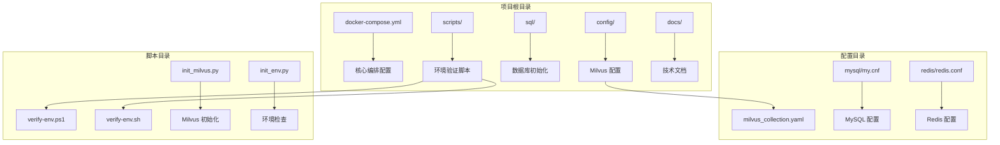
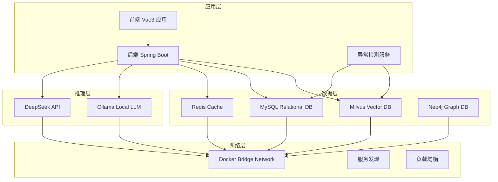
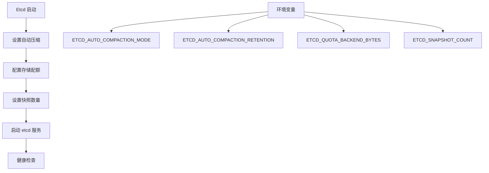
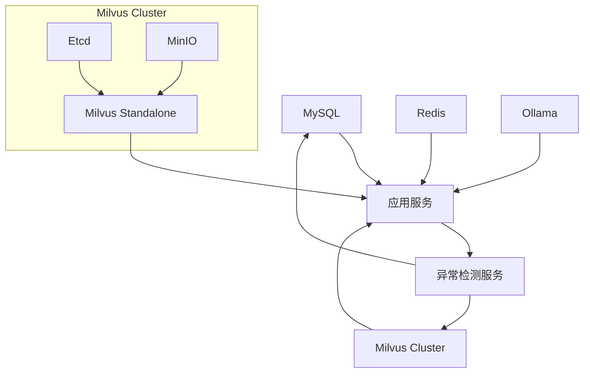
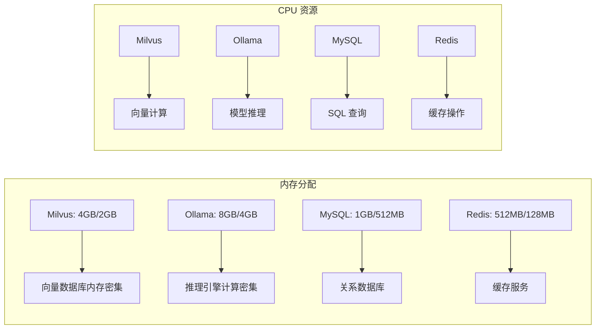

# Docker 部署配置

<cite>
**本文档引用的文件**
- [docker-compose.yml](file://docker-compose.yml)
- [PROJECT_CONTEXT.md](file://PROJECT_CONTEXT.md)
- [milvus_collection.yaml](file://config/milvus_collection.yaml)
- [init.sql](file://sql/init.sql)
- [init_milvus.py](file://scripts/init_milvus.py)
- [verify-env.ps1](file://scripts/verify-env.ps1)
- [verify-env.sh](file://scripts/verify-env.sh)
</cite>

## 目录
1. [简介](#简介)
2. [项目结构](#项目结构)
3. [核心组件](#核心组件)
4. [架构概览](#架构概览)
5. [详细组件分析](#详细组件分析)
6. [依赖关系分析](#依赖关系分析)
7. [性能考虑](#性能考虑)
8. [故障排除指南](#故障排除指南)
9. [结论](#结论)
10. [附录](#附录)

## 简介

本文档详细介绍了面向 NetData 监控数据的智能运维问答与执行系统的 Docker 部署配置。该系统采用微服务架构，通过 Docker Compose 实现多服务协同部署，包括 Milvus 向量数据库、MySQL 关系数据库、Redis 缓存、Ollama 本地 LLM 推理引擎等核心组件。

系统采用 Orchestrator-Subagent 模式，结合 RAG（检索增强生成）技术和 ReAct（思维-行动-反思）模式，构建了一个完整的智能运维平台。该平台能够处理自然语言运维问题、执行智能故障诊断，并支持人工参与的命令执行流程。

## 项目结构

智能运维系统采用模块化的项目结构，主要包含以下核心目录：



**图表来源**
- [docker-compose.yml:1-357](file://docker-compose.yml#L1-L357)
- [PROJECT_CONTEXT.md:120-149](file://PROJECT_CONTEXT.md#L120-L149)

**章节来源**
- [docker-compose.yml:1-357](file://docker-compose.yml#L1-L357)
- [PROJECT_CONTEXT.md:120-149](file://PROJECT_CONTEXT.md#L120-L149)

## 核心组件

系统的核心组件包括五个主要服务，每个服务都经过精心配置以满足智能运维场景的需求：

### Milvus 向量数据库集群

Milvus 采用分布式架构中的 Standalone 模式部署，包含三个核心组件：
- **Etcd**: 分布式键值存储，用于服务发现和协调
- **MinIO**: 对象存储服务，存储向量数据和索引文件
- **Milvus Standalone**: 主数据库服务，处理向量检索和管理

### 关系数据库系统

MySQL 8.0 提供完整的数据持久化能力，支持用户管理、命令执行审计、知识库元数据等业务数据存储。

### 缓存层

Redis 7.x 提供高性能缓存服务，支持会话管理、RAG 检索结果缓存、分布式锁等功能。

### 本地推理引擎

Ollama 提供本地大语言模型推理能力，支持离线场景和隐私保护需求。

**章节来源**
- [docker-compose.yml:23-357](file://docker-compose.yml#L23-L357)

## 架构概览

系统采用微服务架构，通过 Docker Compose 实现统一编排管理：



**图表来源**
- [docker-compose.yml:324-357](file://docker-compose.yml#L324-L357)
- [PROJECT_CONTEXT.md:25-39](file://PROJECT_CONTEXT.md#L25-L39)

## 详细组件分析

### Milvus 向量数据库集群

#### Etcd 配置详解

Etcd 作为 Milvus 的协调服务，采用以下配置策略：



**图表来源**
- [docker-compose.yml:32-56](file://docker-compose.yml#L32-L56)

关键配置说明：
- **存储配额**: 8GB 存储配额支持大量向量数据
- **自动压缩**: revision 模式保留 1000 个版本
- **快照配置**: 50000 个快照点确保数据完整性

#### MinIO 对象存储配置

MinIO 作为 Milvus 的对象存储后端：

| 配置项 | 值 | 说明 |
|--------|----|------|
| 端口映射 | 9000:9000 | S3 API 端口 |
| 端口映射 | 9001:9001 | 控制台管理界面 |
| 数据卷 | /minio_data | 存储向量数据和索引 |
| 凭证 | minioadmin:minioadmin | 默认凭证（生产环境需修改） |

#### Milvus Standalone 主服务

Milvus 主服务采用 v2.4.15 版本，配置要点：

**环境变量配置**：
- **ETCD_ENDPOINTS**: 连接到 etcd 服务
- **MINIO_ADDRESS**: 连接到 MinIO 服务
- **DATA_COORD_ENABLECOMPACTION**: 启用数据压缩
- **COMMON_LOG_LEVEL**: 设置日志级别为 info

**端口映射**：
- **19530:19530**: gRPC 端口（SDK 连接）
- **9091:9091**: Metrics 端口（Prometheus 监控）

**健康检查策略**：
- 检查间隔: 30 秒
- 超时时间: 20 秒
- 重试次数: 5 次
- 启动延迟: 90 秒

**资源限制**：
- 内存上限: 4GB
- 内存预留: 2GB

**章节来源**
- [docker-compose.yml:32-154](file://docker-compose.yml#L32-L154)
- [milvus_collection.yaml:1-186](file://config/milvus_collection.yaml#L1-L186)

### MySQL 关系数据库

#### 核心配置分析

MySQL 8.0 采用以下配置策略：

**环境变量配置**：
- **MYSQL_ROOT_PASSWORD**: root 密码（必须修改）
- **MYSQL_DATABASE**: netdata_ops 数据库
- **MYSQL_USER**: ops_user 业务用户
- **MYSQL_PASSWORD**: ops123456 业务密码
- **TZ**: Asia/Shanghai 中国时区

**数据持久化策略**：
- **/var/lib/mysql**: MySQL 数据目录
- **/etc/mysql/conf.d/my.cnf**: MySQL 配置文件
- **/docker-entrypoint-initdb.d/init.sql**: 初始化脚本

**启动参数**：
- **utf8mb4 字符集**: 支持完整的 Unicode
- **mysql_native_password**: 兼容旧客户端
- **collation-server**: utf8mb4_unicode_ci

**健康检查配置**：
- 检查间隔: 10 秒
- 超时时间: 5 秒
- 重试次数: 5 次
- 启动延迟: 30 秒

**资源限制**：
- 内存上限: 1GB
- 内存预留: 512MB

**章节来源**
- [docker-compose.yml:163-208](file://docker-compose.yml#L163-L208)
- [init.sql:1-274](file://sql/init.sql#L1-L274)

### Redis 缓存服务

#### 配置策略分析

Redis 7.2-alpine 镜像提供轻量级缓存服务：

**端口映射**：
- **6379:6379**: Redis 服务端口

**数据持久化**：
- **/data**: Redis 数据目录
- **/usr/local/etc/redis/redis.conf**: Redis 配置文件

**启动命令**：
使用配置文件启动，启用 AOF 持久化

**健康检查**：
- 检查间隔: 10 秒
- 超时时间: 5 秒
- 重试次数: 5 次
- 启动延迟: 10 秒

**资源限制**：
- 内存上限: 512MB
- 内存预留: 128MB

**章节来源**
- [docker-compose.yml:218-246](file://docker-compose.yml#L218-L246)

### Ollama 本地推理引擎

#### 配置策略分析

Ollama 提供本地大语言模型推理能力：

**端口映射**：
- **11434:11434**: Ollama API 端口

**数据持久化**：
- **/root/.ollama**: 模型存储目录

**GPU 支持**：
```yaml
# deploy:
#   resources:
#     reservations:
#       devices:
#         - driver: nvidia
#           count: 1
#           capabilities: [gpu]
```

**健康检查**：
- 检查间隔: 30 秒
- 超时时间: 10 秒
- 重试次数: 3 次
- 启动延迟: 60 秒

**资源限制**：
- 内存上限: 8GB
- 内存预留: 4GB

**章节来源**
- [docker-compose.yml:258-290](file://docker-compose.yml#L258-L290)

## 依赖关系分析

系统服务之间的依赖关系采用 Docker Compose 的 `depends_on` 机制实现：



**图表来源**
- [docker-compose.yml:139-144](file://docker-compose.yml#L139-L144)

### 启动顺序控制

1. **Etcd 启动** (优先级最高)
2. **MinIO 启动** (优先级高)
3. **Milvus Standalone 启动** (依赖 Etcd 和 MinIO)
4. **MySQL 启动** (独立服务)
5. **Redis 启动** (独立服务)
6. **Ollama 启动** (独立服务)

### 健康检查机制

每个服务都配置了相应的健康检查策略：

| 服务 | 健康检查方式 | 检查间隔 | 超时时间 | 重试次数 |
|------|-------------|---------|---------|---------|
| Etcd | etcdctl endpoint health | 30s | 20s | 3次 |
| MinIO | curl live endpoint | 30s | 20s | 3次 |
| Milvus | curl metrics healthz | 30s | 20s | 5次 |
| MySQL | mysqladmin ping | 10s | 5s | 5次 |
| Redis | redis-cli ping | 10s | 5s | 5次 |
| Ollama | curl API tags | 30s | 10s | 3次 |

**章节来源**
- [docker-compose.yml:47-138](file://docker-compose.yml#L47-L138)

## 性能考虑

### 资源分配策略

系统采用差异化的资源分配策略以满足不同服务的性能需求：



**图表来源**
- [docker-compose.yml:57-289](file://docker-compose.yml#L57-L289)

### 网络配置优化

系统采用自定义 Docker Bridge 网络：

- **网络驱动**: bridge
- **网络名称**: netdata-ops-network
- **IPAM**: 默认自动分配
- **服务发现**: 通过容器名相互访问

### 存储策略

#### 开发环境 vs 生产环境

| 组件 | 开发环境 | 生产环境 |
|------|----------|----------|
| Milvus 数据 | 绑定挂载 | 命名卷 |
| MySQL 数据 | 绑定挂载 | 命名卷 |
| Redis 数据 | 绑定挂载 | 命名卷 |
| Ollama 数据 | 绑定挂载 | 命名卷 |

**章节来源**
- [docker-compose.yml:342-357](file://docker-compose.yml#L342-L357)

## 故障排除指南

### 环境验证脚本

系统提供了完整的环境验证脚本，支持 Windows 和 Linux/macOS 环境：

#### Windows 环境验证

```powershell
# 运行环境检查
.\scripts\verify-env.ps1

# 常见问题排查
# 1. Docker 未安装
# 解决: 安装 Docker Desktop

# 2. 端口被占用
# 解决: 修改 .env 文件中的端口配置

# 3. 内存不足
# 解决: 在 Docker Desktop 中增加内存分配
```

#### Linux/macOS 环境验证

```bash
# 添加执行权限
chmod +x scripts/verify-env.sh

# 运行环境检查
./scripts/verify-env.sh

# 查看服务状态
docker-compose ps

# 查看服务日志
docker-compose logs -f
```

### 常见问题及解决方案

#### Milvus 启动失败

**问题症状**:
- Milvus 状态显示 unhealthy
- 日志中出现连接错误

**解决方案**:
1. 检查 Etcd 和 MinIO 服务状态
2. 验证网络连通性
3. 检查内存分配是否充足
4. 查看 Milvus 日志获取详细错误信息

#### MySQL 连接超时

**问题症状**:
- 应用无法连接到 MySQL
- 连接被拒绝

**解决方案**:
1. 检查 MySQL 端口映射
2. 验证数据库凭证配置
3. 检查防火墙设置
4. 查看 MySQL 错误日志

#### Redis 缓存失效

**问题症状**:
- Redis 连接失败
- 缓存数据丢失

**解决方案**:
1. 检查 Redis 数据卷挂载
2. 验证 Redis 配置文件
3. 检查磁盘空间
4. 重启 Redis 服务

#### Ollama 模型加载失败

**问题症状**:
- Ollama 服务启动但无法加载模型
- 推理接口返回错误

**解决方案**:
1. 检查模型存储目录权限
2. 验证磁盘空间充足
3. 检查 GPU 驱动（如使用 GPU）
4. 查看 Ollama 日志

### 性能优化建议

#### Milvus 性能调优

1. **索引参数调优**:
   - nlist: 根据数据量调整聚类中心数量
   - nprobe: 平衡检索精度和速度

2. **内存配置优化**:
   - 确保 Docker 分配足够内存
   - 调整 Milvus 内存限制

#### MySQL 性能优化

1. **字符集配置**:
   - 使用 utf8mb4 支持完整 Unicode
   - 配置合适的 collation

2. **连接池优化**:
   - 调整连接池大小
   - 优化查询性能

#### Redis 性能优化

1. **持久化策略**:
   - AOF vs RDB 选择
   - 持久化时机配置

2. **内存优化**:
   - 合理的数据过期策略
   - 内存碎片整理

**章节来源**
- [verify-env.ps1:1-251](file://scripts/verify-env.ps1#L1-L251)
- [verify-env.sh:1-318](file://scripts/verify-env.sh#L1-L318)

## 结论

本 Docker 部署配置文档详细介绍了智能运维问答与执行系统的完整部署方案。系统采用现代化的微服务架构，通过 Docker Compose 实现了服务间的协调和管理。

关键特性包括：
- **模块化设计**: 每个服务独立部署，便于维护和扩展
- **资源优化**: 差异化的资源分配策略满足不同服务需求
- **健康监控**: 完善的健康检查机制确保服务稳定性
- **环境适配**: 支持多种部署环境（开发、测试、生产）
- **故障恢复**: 提供完整的故障排除和恢复指导

该配置为后续的功能开发和系统集成奠定了坚实的基础，支持智能运维场景下的各种需求。

## 附录

### 环境变量配置模板

| 服务 | 环境变量 | 默认值 | 说明 |
|------|----------|--------|------|
| MySQL | MYSQL_ROOT_PASSWORD | root123456 | Root 用户密码 |
| MySQL | MYSQL_DATABASE | netdata_ops | 数据库名称 |
| MySQL | MYSQL_USER | ops_user | 业务用户 |
| MySQL | MYSQL_PASSWORD | ops123456 | 业务用户密码 |
| MySQL | MYSQL_PORT | 3306 | MySQL 端口 |
| Redis | REDIS_PASSWORD | redis123456 | Redis 密码 |
| Redis | REDIS_PORT | 6379 | Redis 端口 |
| Milvus | MILVUS_GRPC_PORT | 19530 | gRPC 端口 |
| Milvus | MILVUS_METRICS_PORT | 9091 | Metrics 端口 |
| Ollama | OLLAMA_PORT | 11434 | Ollama 端口 |
| MinIO | MINIO_ACCESS_KEY | minioadmin | 访问密钥 |
| MinIO | MINIO_SECRET_KEY | minioadmin | 密钥 |

### 启动和停止命令

```bash
# 启动所有服务
docker-compose up -d

# 查看服务状态
docker-compose ps

# 查看服务日志
docker-compose logs -f

# 停止所有服务
docker-compose down

# 清理数据并重建
docker-compose down -v

# 仅停止特定服务
docker-compose stop mysql

# 启动特定服务
docker-compose start redis
```

### 监控和维护

```bash
# 查看系统资源使用
docker stats

# 查看磁盘使用情况
docker system df

# 清理未使用的资源
docker system prune

# 查看网络配置
docker network ls

# 查看卷配置
docker volume ls
```