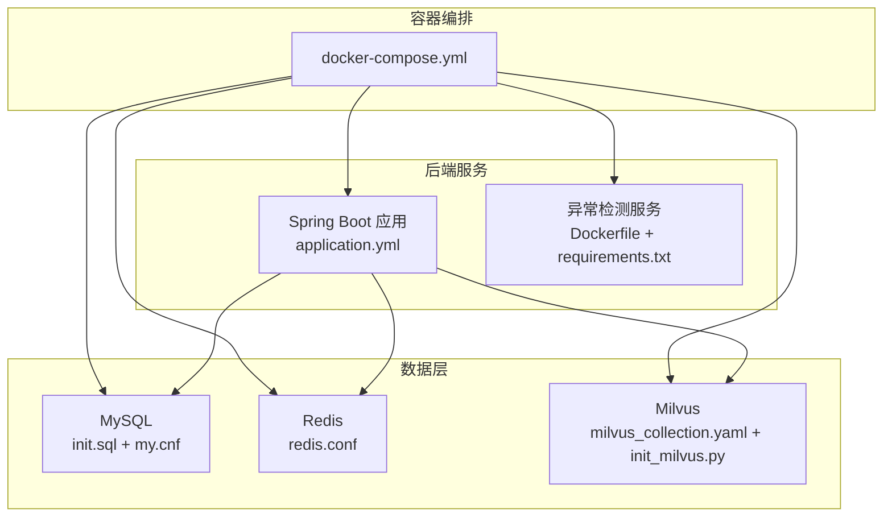
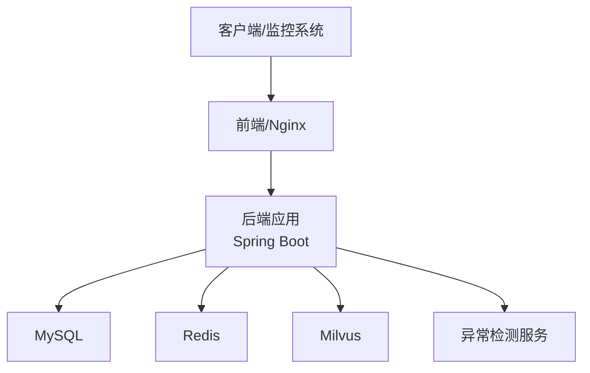
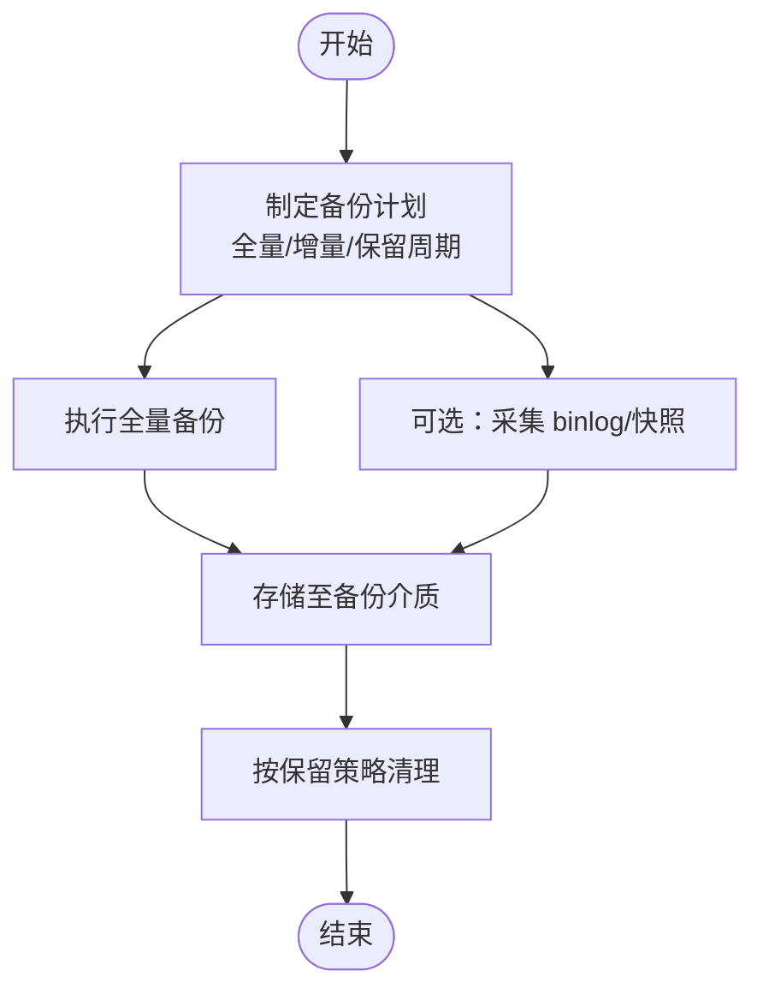
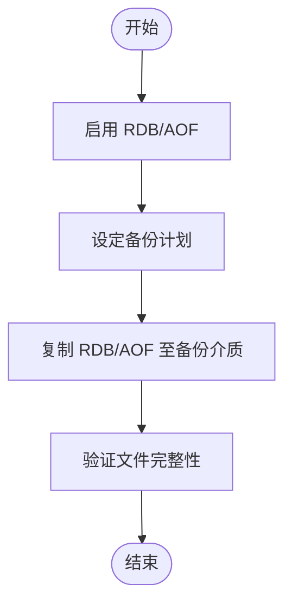
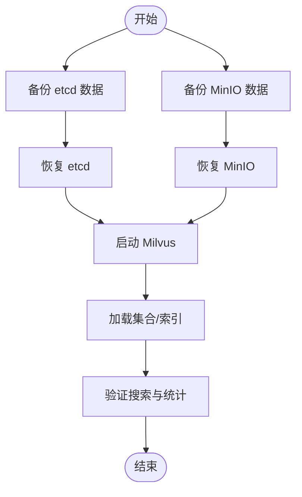
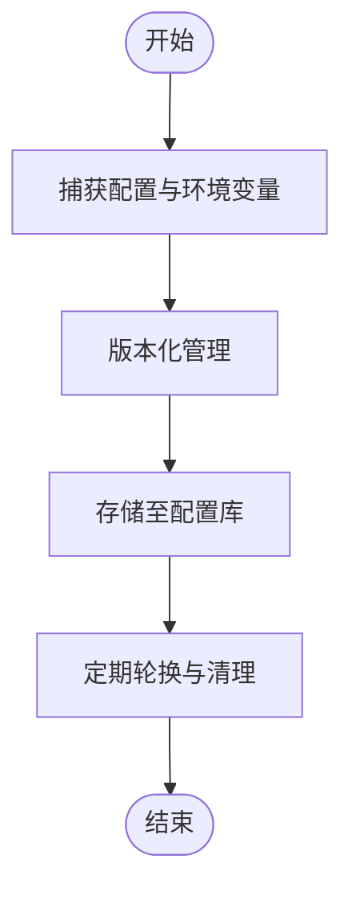
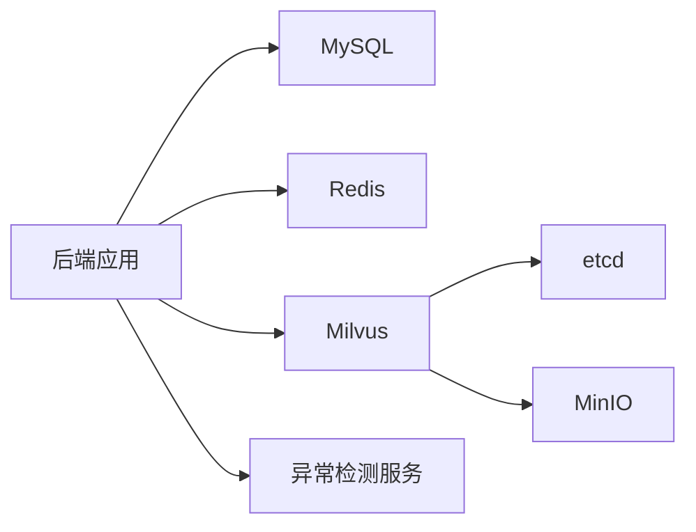

# 备份与恢复

<cite>
**本文引用的文件**
- [docker-compose.yml](file://docker-compose.yml)
- [application.yml](file://netdata-ai-backend/src/main/resources/application.yml)
- [init.sql](file://sql/init.sql)
- [my.cnf](file://config/mysql/my.cnf)
- [redis.conf](file://config/redis/redis.conf)
- [milvus_collection.yaml](file://config/milvus_collection.yaml)
- [init_milvus.py](file://scripts/init_milvus.py)
- [deployment_guide.md](file://docs/deployment_guide.md)
- [NetDataOpsApplication.java](file://netdata-ai-backend/src/main/java/com/netdata/ops/NetDataOpsApplication.java)
- [requirements.txt](file://anomaly-detection-service/requirements.txt)
- [Dockerfile](file://anomaly-detection-service/Dockerfile)
</cite>

## 目录
1. [简介](#简介)
2. [项目结构](#项目结构)
3. [核心组件](#核心组件)
4. [架构总览](#架构总览)
5. [详细组件分析](#详细组件分析)
6. [依赖分析](#依赖分析)
7. [性能考虑](#性能考虑)
8. [故障排查指南](#故障排查指南)
9. [结论](#结论)
10. [附录](#附录)

## 简介
本文件为“智能运维问答与执行系统”的完整数据保护方案，围绕备份与恢复展开，覆盖全量备份与增量备份策略、备份频率与保留周期、配置备份、灾难恢复计划（RTO/RPO）、恢复流程演练、备份验证与测试、以及恢复操作步骤。方案基于仓库现有配置与部署文件，结合系统关键数据源（MySQL、Redis、Milvus、应用配置与环境变量）进行设计，并提供可落地的实践建议。

## 项目结构
系统采用多服务容器化架构，核心数据与配置分布如下：
- 关系数据库：MySQL（初始化脚本与配置）
- 缓存与会话：Redis（持久化与配置）
- 向量数据库：Milvus（集合结构与索引配置）
- 应用配置：Spring Boot 后端（Profile、数据源、缓存、AI、安全等）
- 异常检测服务：Python FastAPI（Dockerfile、依赖）
- 部署编排：docker-compose（服务编排、卷与健康检查）

图表来源
- [docker-compose.yml](file://docker-compose.yml)
- [application.yml](file://netdata-ai-backend/src/main/resources/application.yml)
- [init.sql](file://sql/init.sql)
- [my.cnf](file://config/mysql/my.cnf)
- [redis.conf](file://config/redis/redis.conf)
- [milvus_collection.yaml](file://config/milvus_collection.yaml)
- [init_milvus.py](file://scripts/init_milvus.py)
- [Dockerfile](file://anomaly-detection-service/Dockerfile)
- [requirements.txt](file://anomaly-detection-service/requirements.txt)

章节来源
- [docker-compose.yml](file://docker-compose.yml)
- [application.yml](file://netdata-ai-backend/src/main/resources/application.yml)

## 核心组件
- MySQL：关系型数据与系统配置，初始化脚本定义表结构与基础数据；配置文件提供性能与安全参数。
- Redis：会话、缓存与中间状态，配置包含持久化策略与内存淘汰策略。
- Milvus：向量集合结构、索引与搜索参数，初始化脚本负责创建集合、索引与加载。
- Spring Boot 应用：通过 Profile 切换开发/生产环境，集中管理数据源、缓存、AI、安全与监控。
- 异常检测服务：Python 服务，容器化部署，提供健康检查与端口映射。

章节来源
- [init.sql](file://sql/init.sql)
- [my.cnf](file://config/mysql/my.cnf)
- [redis.conf](file://config/redis/redis.conf)
- [milvus_collection.yaml](file://config/milvus_collection.yaml)
- [init_milvus.py](file://scripts/init_milvus.py)
- [application.yml](file://netdata-ai-backend/src/main/resources/application.yml)
- [Dockerfile](file://anomaly-detection-service/Dockerfile)
- [requirements.txt](file://anomaly-detection-service/requirements.txt)

## 架构总览
系统采用 Docker Compose 编排，服务间通过自定义网络通信，数据通过命名卷或绑定挂载持久化。关键数据保护点包括：
- MySQL：数据与二进制日志（可选）、慢查询日志
- Redis：RDB/AOF 双持久化
- Milvus：etcd/MinIO 数据卷
- 应用配置：Profile、环境变量、外部化配置

图表来源
- [docker-compose.yml](file://docker-compose.yml)
- [application.yml](file://netdata-ai-backend/src/main/resources/application.yml)

## 详细组件分析

### MySQL 备份与恢复策略
- 全量备份
  - 使用 mysqldump 导出逻辑备份，包含 DDL、DML 与系统配置表。
  - 建议在业务低峰期执行，导出至独立备份卷或对象存储。
- 增量备份
  - 可选开启二进制日志（binlog），配合定时快照与 binlog 合并，实现近实时增量。
  - 需结合慢查询日志定位热点与优化。
- 备份频率与保留
  - 全量：每日一次（或每周多次，视数据增长与 RPO 设定）
  - 增量：每 5-15 分钟（结合 binlog）
  - 保留：全量保留 14-30 天，增量保留 7 天；定期清理过期备份。
- 配置备份
  - 备份 my.cnf 与初始化脚本 init.sql，确保可快速重建数据库结构。
- 恢复流程
  - 恢复顺序：结构（init.sql）→ 全量 → 增量（如启用）
  - 验证：检查系统配置表、用户表、审计与告警表完整性。
- 验证与测试
  - 定期抽样恢复演练，验证备份可恢复性与一致性。

图表来源
- [init.sql](file://sql/init.sql)
- [my.cnf](file://config/mysql/my.cnf)
- [deployment_guide.md](file://docs/deployment_guide.md)

章节来源
- [init.sql](file://sql/init.sql)
- [my.cnf](file://config/mysql/my.cnf)
- [deployment_guide.md](file://docs/deployment_guide.md)

### Redis 备份与恢复策略
- 全量备份
  - 基于 RDB 快照与 AOF 持久化，定期复制 dump.rdb 与 appendonly.aof 至备份介质。
- 增量备份
  - AOF 重写与 fsync 策略保证数据安全；可结合 AOF 备份实现近实时增量。
- 备份频率与保留
  - RDB：每 15-60 分钟一次（结合业务窗口）
  - AOF：每日全量备份，保留最近 7 天
- 配置备份
  - 备份 redis.conf，确保可快速重建缓存服务。
- 恢复流程
  - 恢复顺序：AOF/RDB → 服务启动 → 校验键空间与过期策略。
- 验证与测试
  - 恢复后验证键空间、过期键、内存淘汰策略与慢查询日志。

图表来源
- [redis.conf](file://config/redis/redis.conf)

章节来源
- [redis.conf](file://config/redis/redis.conf)

### Milvus 备份与恢复策略
- 全量备份
  - 备份 etcd 与 MinIO 数据卷（/etcd 与 /minio_data），包含集合元数据与向量数据。
- 增量备份
  - Milvus 本身不提供传统增量备份，建议通过 etcd/MinIO 的快照与对象存储归档实现近似增量。
- 备份频率与保留
  - etcd/MinIO：每日全量快照，保留 7-14 天
  - 集合元数据：随初始化脚本版本化管理
- 配置备份
  - 备份 milvus_collection.yaml 与 init_milvus.py，确保可重建集合结构与索引。
- 恢复流程
  - 恢复顺序：etcd → MinIO → 启动 Milvus → 加载集合 → 验证索引与搜索。
- 验证与测试
  - 恢复后执行搜索测试与统计信息核对。

图表来源
- [docker-compose.yml](file://docker-compose.yml)
- [milvus_collection.yaml](file://config/milvus_collection.yaml)
- [init_milvus.py](file://scripts/init_milvus.py)

章节来源
- [docker-compose.yml](file://docker-compose.yml)
- [milvus_collection.yaml](file://config/milvus_collection.yaml)
- [init_milvus.py](file://scripts/init_milvus.py)

### 应用配置与环境变量备份
- 配置备份
  - application.yml（Profile 切换与敏感项外置）、Docker 环境变量、.env（异常检测服务）。
- 环境变量
  - 包括数据库、缓存、向量库、AI 与安全相关的密钥与地址，建议集中管理与轮换。
- 备份频率与保留
  - 配置变更即备份，保留最近 30 天版本。
- 恢复流程
  - 恢复配置文件与环境变量，重启服务并验证健康检查。
- 验证与测试
  - 通过 Actuator 健康检查与日志核对关键连接。

图表来源
- [application.yml](file://netdata-ai-backend/src/main/resources/application.yml)
- [NetDataOpsApplication.java](file://netdata-ai-backend/src/main/java/com/netdata/ops/NetDataOpsApplication.java)
- [Dockerfile](file://anomaly-detection-service/Dockerfile)
- [requirements.txt](file://anomaly-detection-service/requirements.txt)

章节来源
- [application.yml](file://netdata-ai-backend/src/main/resources/application.yml)
- [NetDataOpsApplication.java](file://netdata-ai-backend/src/main/java/com/netdata/ops/NetDataOpsApplication.java)
- [Dockerfile](file://anomaly-detection-service/Dockerfile)
- [requirements.txt](file://anomaly-detection-service/requirements.txt)

### 异常检测服务备份
- 全量备份
  - 备份模型目录与容器镜像，确保可快速重建服务。
- 增量备份
  - 模型文件增量更新，结合镜像层缓存。
- 备份频率与保留
  - 模型：每次训练后备份；镜像：按版本保留最近 5 个。
- 恢复流程
  - 恢复模型与镜像 → 启动容器 → 健康检查。
- 验证与测试
  - 调用健康端点与推理接口验证。

章节来源
- [Dockerfile](file://anomaly-detection-service/Dockerfile)
- [requirements.txt](file://anomaly-detection-service/requirements.txt)

## 依赖分析
系统关键依赖关系如下：
- 后端应用依赖 MySQL、Redis、Milvus 与异常检测服务
- Milvus 依赖 etcd 与 MinIO
- 配置通过 Profile 与环境变量注入

图表来源
- [docker-compose.yml](file://docker-compose.yml)
- [application.yml](file://netdata-ai-backend/src/main/resources/application.yml)

章节来源
- [docker-compose.yml](file://docker-compose.yml)
- [application.yml](file://netdata-ai-backend/src/main/resources/application.yml)

## 性能考虑
- MySQL
  - InnoDB 缓冲池、慢查询日志与二进制日志对性能的影响，建议生产环境开启二进制日志与严格 SQL 模式。
- Redis
  - RDB/AOF 策略与内存淘汰策略对性能与数据安全的平衡。
- Milvus
  - 索引类型与 nprobe/nlist 参数对检索性能与内存占用的影响。
- 应用
  - Actuator 指标暴露与健康检查对可观测性的提升。

章节来源
- [my.cnf](file://config/mysql/my.cnf)
- [redis.conf](file://config/redis/redis.conf)
- [milvus_collection.yaml](file://config/milvus_collection.yaml)
- [application.yml](file://netdata-ai-backend/src/main/resources/application.yml)

## 故障排查指南
- 健康检查失败
  - 检查各服务健康端点与日志，确认依赖服务（etcd、MinIO、MySQL、Redis）可达。
- 数据不一致
  - 核对 MySQL binlog 与慢查询日志，验证备份时间点与恢复顺序。
- 缓存异常
  - 检查 Redis RDB/AOF 文件完整性与内存淘汰策略。
- 向量检索异常
  - 核对 Milvus 集合加载状态与索引参数，执行搜索测试。
- 配置错误
  - 对照 application.yml 与环境变量，确认 Profile 与敏感项注入。

章节来源
- [docker-compose.yml](file://docker-compose.yml)
- [application.yml](file://netdata-ai-backend/src/main/resources/application.yml)
- [deployment_guide.md](file://docs/deployment_guide.md)

## 结论
本方案基于仓库现有配置与部署文件，建立了覆盖 MySQL、Redis、Milvus、应用配置与环境变量的完整备份与恢复框架。通过全量与增量备份、明确的频率与保留策略、严格的验证与演练，确保系统在发生故障时能够满足既定的 RTO/RPO 目标，并保障业务连续性。

## 附录

### 灾难恢复计划（DRP）
- RTO/RPO 目标
  - RTO：应用与数据恢复至可接受业务中断时间（建议：小时级）
  - RPO：数据丢失容忍度（建议：分钟级）
- 恢复流程演练
  - 定期进行抽样恢复演练，验证备份完整性与恢复效率。
- 业务连续性保障
  - 多地备份与异地容灾（可选），结合负载均衡与自动切换。

章节来源
- [deployment_guide.md](file://docs/deployment_guide.md)

### 恢复操作步骤（示例）
- MySQL
  - 恢复结构与数据 → 校验系统配置与用户表 → 启动后端服务 → 健康检查
- Redis
  - 恢复 RDB/AOF → 启动服务 → 校验键空间与过期策略
- Milvus
  - 恢复 etcd/MinIO → 启动 Milvus → 加载集合与索引 → 搜索验证
- 应用配置
  - 恢复配置文件与环境变量 → 重启服务 → Actuator 健康检查

章节来源
- [init.sql](file://sql/init.sql)
- [redis.conf](file://config/redis/redis.conf)
- [milvus_collection.yaml](file://config/milvus_collection.yaml)
- [application.yml](file://netdata-ai-backend/src/main/resources/application.yml)
- [deployment_guide.md](file://docs/deployment_guide.md)