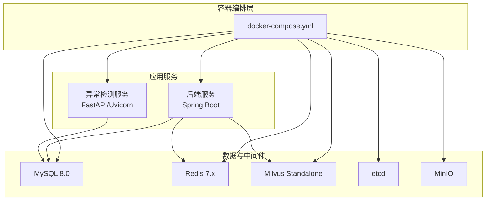
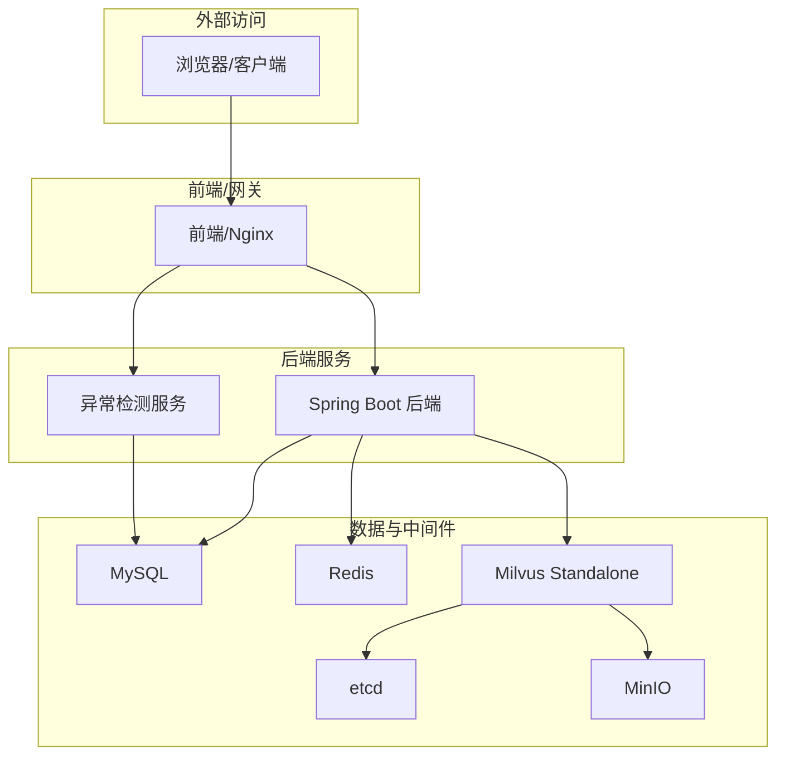
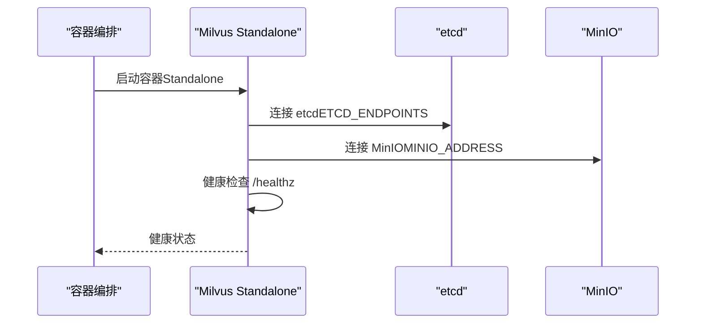
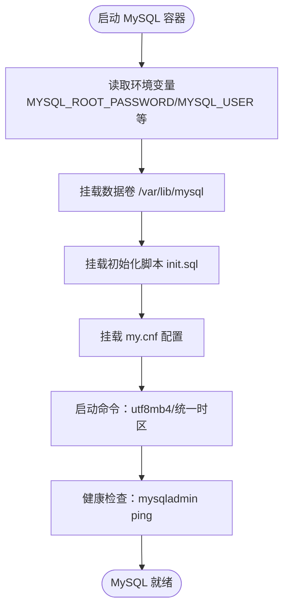
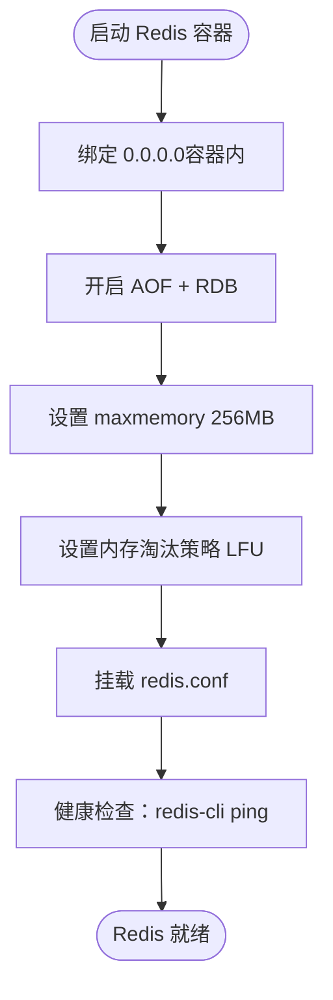
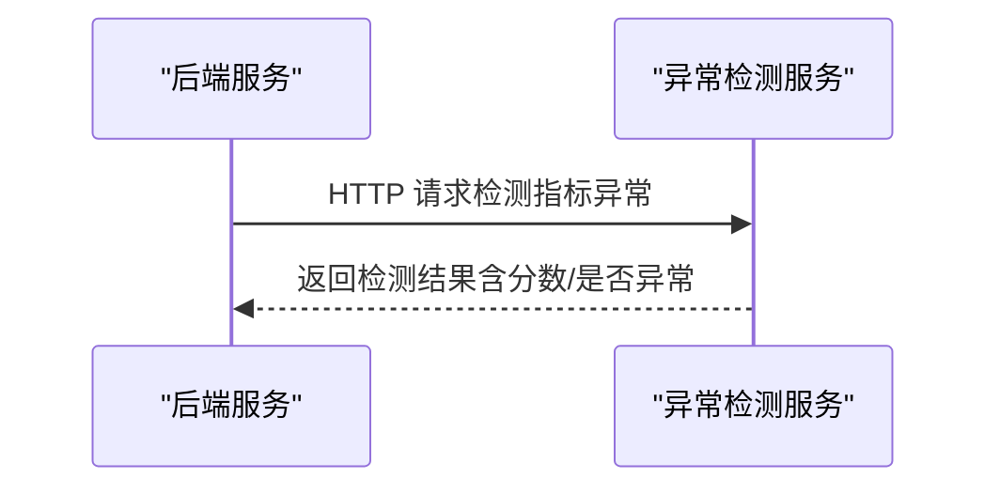
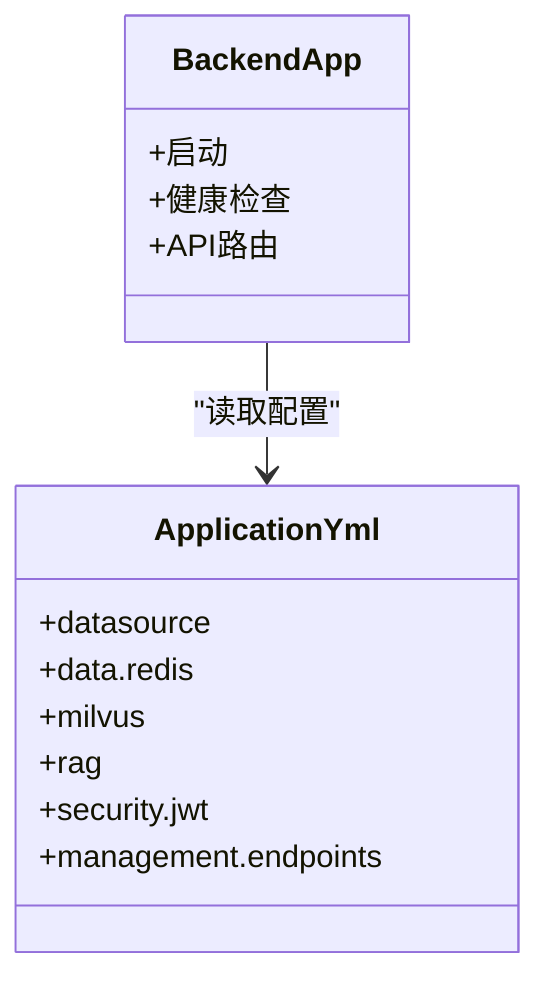
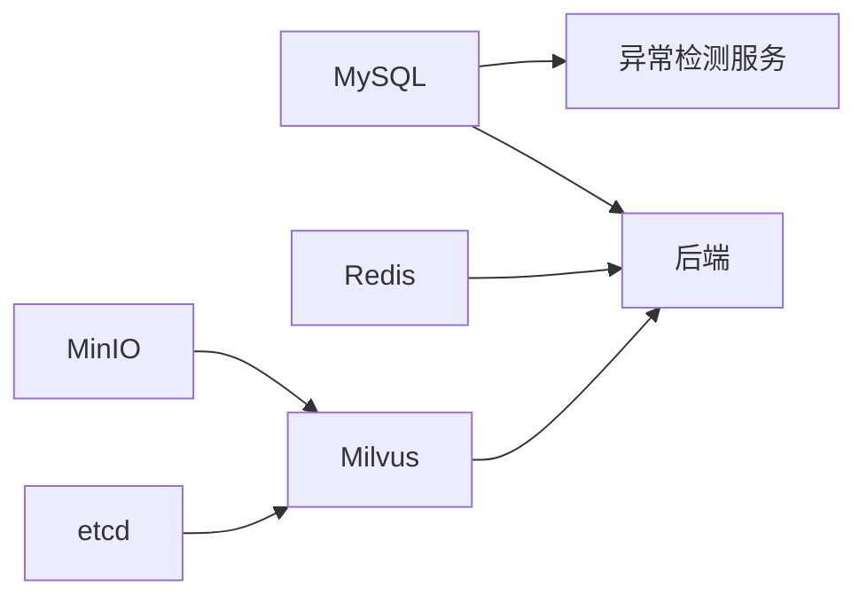

# 容器化部署

<cite>
**本文引用的文件**
- [docker-compose.yml](file://docker-compose.yml)
- [application.yml](file://netdata-ai-backend/src/main/resources/application.yml)
- [Dockerfile（异常检测服务）](file://anomaly-detection-service/Dockerfile)
- [init_milvus.py](file://scripts/init_milvus.py)
- [milvus_collection.yaml](file://config/milvus_collection.yaml)
- [my.cnf（MySQL）](file://config/mysql/my.cnf)
- [redis.conf（Redis）](file://config/redis/redis.conf)
- [init.sql](file://sql/init.sql)
- [verify-env.sh](file://scripts/verify-env.sh)
- [verify-env.ps1](file://scripts/verify-env.ps1)
- [deployment_guide.md](file://docs/deployment_guide.md)
- [pom.xml（后端）](file://netdata-ai-backend/pom.xml)
- [pyproject.toml（异常检测服务）](file://anomaly-detection-service/pyproject.toml)
</cite>

## 目录
1. [简介](#简介)
2. [项目结构](#项目结构)
3. [核心组件](#核心组件)
4. [架构总览](#架构总览)
5. [详细组件分析](#详细组件分析)
6. [依赖关系分析](#依赖关系分析)
7. [性能考虑](#性能考虑)
8. [故障排查指南](#故障排查指南)
9. [结论](#结论)
10. [附录](#附录)

## 简介
本指南面向“面向 NetData 监控数据的智能运维问答与执行系统”的容器化部署，提供从环境准备、服务编排、数据持久化、健康检查到启动验证的全流程说明。重点覆盖：
- Docker Compose 编排配置与资源限制
- Milvus Standalone 模式及其 etcd/MinIO 依赖
- MySQL、Redis 等数据服务的容器化配置与健康检查
- 启动流程与服务验证步骤
- 常见问题排查（端口冲突、内存不足、网络连接等）

## 项目结构
本项目采用多模块与多服务的容器化组织方式：
- 后端服务：Spring Boot 应用，通过 Docker Compose 编排
- 异常检测服务：独立的 Python 服务，容器化运行
- Milvus 向量数据库：Standalone 模式，依赖 etcd 与 MinIO
- MySQL：关系型数据库，初始化脚本与持久化配置
- Redis：缓存与会话存储，持久化与安全配置
- 健康检查与环境验证脚本：Bash/PowerShell 双平台

图表来源
- [docker-compose.yml:23-358](file://docker-compose.yml#L23-L358)

章节来源
- [docker-compose.yml:1-358](file://docker-compose.yml#L1-L358)

## 核心组件
- Milvus Standalone：使用 etcd 作为 KV 存储，MinIO 作为对象存储后端，Standalone 模式适合开发与小规模生产。
- MySQL：8.0，字符集 utf8mb4，挂载初始化脚本与数据卷，健康检查基于 mysqladmin。
- Redis：7.x，开启 AOF/RDB 双持久化，设置内存上限与淘汰策略，健康检查基于 redis-cli。
- 异常检测服务：Python/FastAPI，容器内以 gunicorn+uvicorn worker 方式运行，健康检查基于 HTTP。
- 后端服务：Spring Boot，通过 application.yml 读取环境变量，集成 MySQL、Redis、Milvus、LLM 等。

章节来源
- [docker-compose.yml:23-358](file://docker-compose.yml#L23-L358)
- [application.yml:1-314](file://netdata-ai-backend/src/main/resources/application.yml#L1-L314)

## 架构总览
下图展示容器化部署的整体交互关系与依赖链路。

图表来源
- [docker-compose.yml:23-358](file://docker-compose.yml#L23-L358)
- [application.yml:31-108](file://netdata-ai-backend/src/main/resources/application.yml#L31-L108)

## 详细组件分析

### Milvus Standalone 模式与依赖
- 服务定义：Standalone 模式，使用内置 etcd 与 MinIO，端口映射 19531（gRPC）、9091（Metrics）。
- 依赖关系：通过环境变量连接 etcd 与 MinIO；健康检查使用 curl 访问 /healthz。
- 资源限制：为 Milvus 分配较高内存（4G 上限/2G 预留），符合其内存密集型特性。
- 初始化：提供 init_milvus.py 脚本，创建 Collection、建立索引、加载到内存、插入测试数据并验证搜索。

图表来源
- [docker-compose.yml:99-155](file://docker-compose.yml#L99-L155)
- [init_milvus.py:115-140](file://scripts/init_milvus.py#L115-L140)

章节来源
- [docker-compose.yml:99-155](file://docker-compose.yml#L99-L155)
- [init_milvus.py:142-251](file://scripts/init_milvus.py#L142-L251)
- [milvus_collection.yaml:19-186](file://config/milvus_collection.yaml#L19-L186)

### MySQL 容器化配置
- 镜像与版本：mysql:8.0
- 环境变量：根密码、业务用户、数据库名、时区等
- 端口映射：默认 3306
- 持久化：挂载 /var/lib/mysql；初始化脚本挂载至 /docker-entrypoint-initdb.d
- 健康检查：mysqladmin ping
- 配置文件：my.cnf 挂载，包含字符集、缓冲区、InnoDB、慢查询等优化参数

图表来源
- [docker-compose.yml:164-209](file://docker-compose.yml#L164-L209)
- [my.cnf:15-176](file://config/mysql/my.cnf#L15-L176)
- [init.sql:18-246](file://sql/init.sql#L18-L246)

章节来源
- [docker-compose.yml:164-209](file://docker-compose.yml#L164-L209)
- [my.cnf:15-176](file://config/mysql/my.cnf#L15-L176)
- [init.sql:18-246](file://sql/init.sql#L18-L246)

### Redis 容器化配置
- 镜像与版本：redis:7.2-alpine
- 端口映射：默认 6379
- 持久化：AOF + RDB 双持久化策略，内存上限 256MB（开发环境）
- 配置文件：挂载 redis.conf，包含 bind、保护模式、AOF、内存淘汰策略等
- 健康检查：redis-cli ping

图表来源
- [docker-compose.yml:219-247](file://docker-compose.yml#L219-L247)
- [redis.conf:16-180](file://config/redis/redis.conf#L16-L180)

章节来源
- [docker-compose.yml:219-247](file://docker-compose.yml#L219-L247)
- [redis.conf:16-180](file://config/redis/redis.conf#L16-L180)

### 异常检测服务容器化
- 镜像与运行：基于 Python 3.11-slim，gunicorn + uvicorn worker，端口 8001
- 健康检查：HTTP /api/health
- 非 root 用户运行，日志与模型目录权限管理
- 与后端服务通过 HTTP 交互，后端配置中提供服务地址与超时重试

图表来源
- [Dockerfile（异常检测服务）:78-95](file://anomaly-detection-service/Dockerfile#L78-L95)
- [application.yml:149-155](file://netdata-ai-backend/src/main/resources/application.yml#L149-L155)

章节来源
- [Dockerfile（异常检测服务）:1-95](file://anomaly-detection-service/Dockerfile#L1-L95)
- [application.yml:149-155](file://netdata-ai-backend/src/main/resources/application.yml#L149-L155)

### 后端服务（Spring Boot）
- 配置文件：application.yml 通过环境变量读取 MySQL、Redis、Milvus、LLM、RAG、安全等配置
- Profile：dev/prod 两套配置，开发使用 Ollama，生产使用 DeepSeek API
- 健康检查：Actuator 暴露 /actuator/health，Prometheus 指标
- 依赖：Spring Web、Security、MyBatis-Plus、Redis、Milvus SDK、Resilience4j、OpenAPI/Swagger 等

图表来源
- [application.yml:14-314](file://netdata-ai-backend/src/main/resources/application.yml#L14-L314)
- [pom.xml（后端）:41-200](file://netdata-ai-backend/pom.xml#L41-L200)

章节来源
- [application.yml:14-314](file://netdata-ai-backend/src/main/resources/application.yml#L14-L314)
- [pom.xml（后端）:41-200](file://netdata-ai-backend/pom.xml#L41-L200)

## 依赖关系分析
- 服务间依赖：
  - 后端依赖 MySQL、Redis、Milvus
  - Milvus 依赖 etcd 与 MinIO
  - 异常检测服务依赖 MySQL
- 网络：所有服务位于自定义桥接网络，容器间通过服务名互访
- 健康检查：各服务均配置健康检查，Compose 在启动时等待健康

图表来源
- [docker-compose.yml:140-146](file://docker-compose.yml#L140-L146)
- [application.yml:31-52](file://netdata-ai-backend/src/main/resources/application.yml#L31-L52)

章节来源
- [docker-compose.yml:140-146](file://docker-compose.yml#L140-L146)
- [application.yml:31-52](file://netdata-ai-backend/src/main/resources/application.yml#L31-L52)

## 性能考虑
- Milvus 内存密集：为 Milvus 分配 4G 上限/2G 预留，Standalone 模式下建议至少 8GB 内存
- MySQL 缓冲池：开发环境 256MB，生产环境建议占物理内存 50%-80%
- Redis 内存上限：开发环境 256MB，结合 LFU 淘汰策略
- 端口与网络：避免宿主机端口冲突，合理规划容器网络隔离
- 健康检查间隔与超时：根据服务启动时间适当调整，避免误判

章节来源
- [docker-compose.yml:57-62](file://docker-compose.yml#L57-L62)
- [docker-compose.yml:94-98](file://docker-compose.yml#L94-L98)
- [docker-compose.yml:149-154](file://docker-compose.yml#L149-L154)
- [my.cnf:75-82](file://config/mysql/my.cnf#L75-L82)
- [redis.conf:158-174](file://config/redis/redis.conf#L158-L174)

## 故障排查指南
- 环境验证脚本：
  - Bash：检查 Docker、Compose、端口占用、配置文件、数据目录、服务健康状态
  - PowerShell：同上，适用于 Windows 环境
- 常见问题与解决：
  - 端口冲突：使用 verify-env 脚本检查端口占用，修改 .env 中端口映射
  - 内存不足：提升 Docker 分配内存（建议 8GB+），调整 Milvus/MySQL/Redis 内存上限
  - 网络连接：确认容器网络、服务名解析、防火墙放行
  - 数据持久化：检查挂载目录权限与可写性
  - 健康检查失败：查看对应容器日志，确认依赖服务（etcd、MinIO、MySQL、Redis）已就绪
- 快速连接测试：
  - MySQL：docker exec -it netdata-ops-mysql mysql -u ops_user -p
  - Redis：docker exec -it netdata-ops-redis redis-cli -a redis123456 ping
  - Milvus：curl http://localhost:9091/healthz
  - Ollama：curl http://localhost:11434/api/tags

章节来源
- [verify-env.sh:64-318](file://scripts/verify-env.sh#L64-L318)
- [verify-env.ps1:35-251](file://scripts/verify-env.ps1#L35-L251)

## 结论
本容器化部署方案以 Docker Compose 为核心，围绕 Milvus Standalone、MySQL、Redis、后端与异常检测服务构建了完整的开发与小规模生产环境。通过环境变量、健康检查、资源限制与持久化配置，实现了可维护、可观测、可扩展的部署基线。建议在生产环境中进一步引入 Kubernetes、Ingress、Secret 管理与监控告警体系。

## 附录

### 启动流程（从环境准备到服务验证）
- 环境准备
  - 安装 Docker 与 Docker Compose
  - 检查硬件：CPU≥4核、内存≥8GB、磁盘≥50GB SSD
  - 复制并编辑 .env 示例文件，设置数据库与服务密码
- 启动服务
  - docker-compose up -d
  - docker-compose ps 查看状态
  - docker-compose logs -f 查看日志
- 验证服务
  - 使用 verify-env 脚本进行健康检查
  - 访问后端 API 文档与 Milvus 健康端点
  - 初始化 Milvus：运行 init_milvus.py 创建 Collection、索引与测试数据

章节来源
- [deployment_guide.md:27-56](file://docs/deployment_guide.md#L27-L56)
- [docker-compose.yml:11-21](file://docker-compose.yml#L11-L21)
- [verify-env.sh:64-318](file://scripts/verify-env.sh#L64-L318)
- [init_milvus.py:466-525](file://scripts/init_milvus.py#L466-L525)