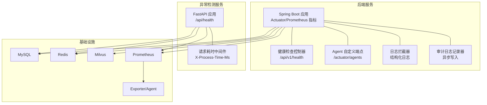
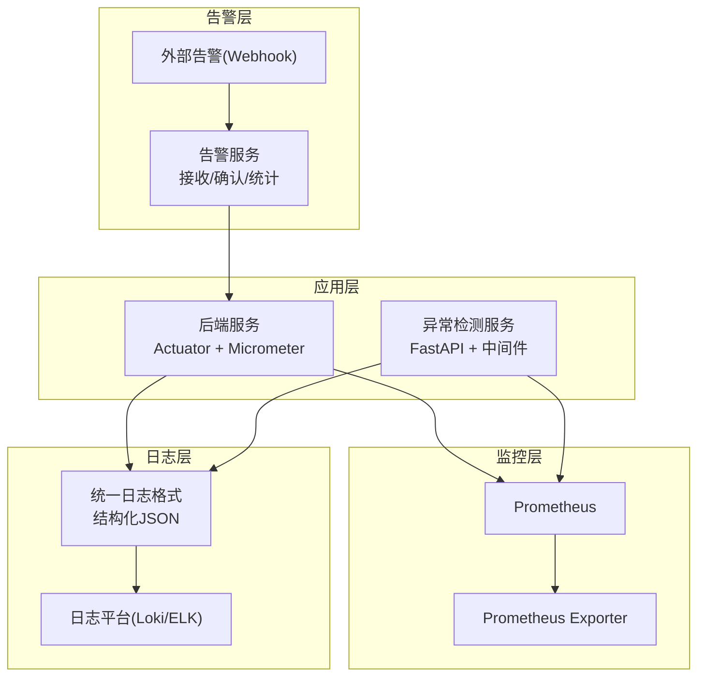
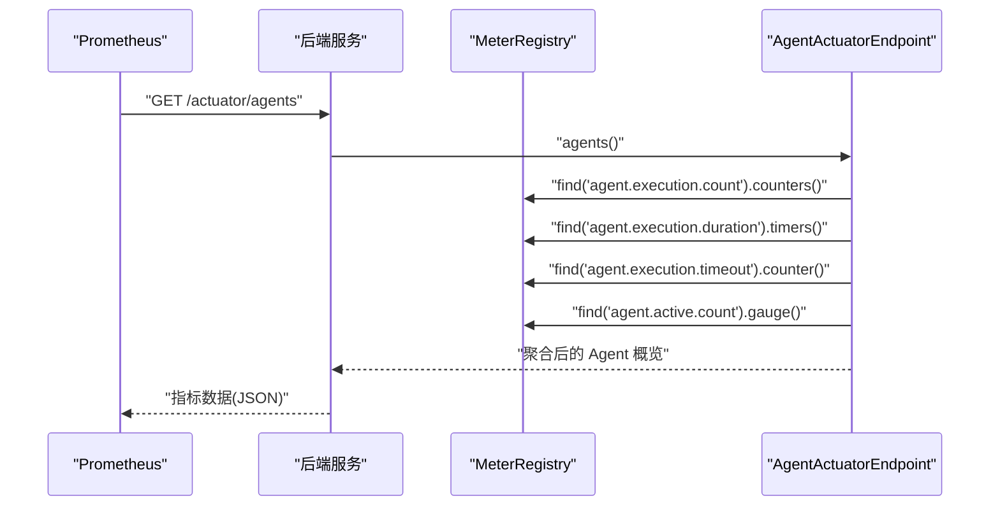
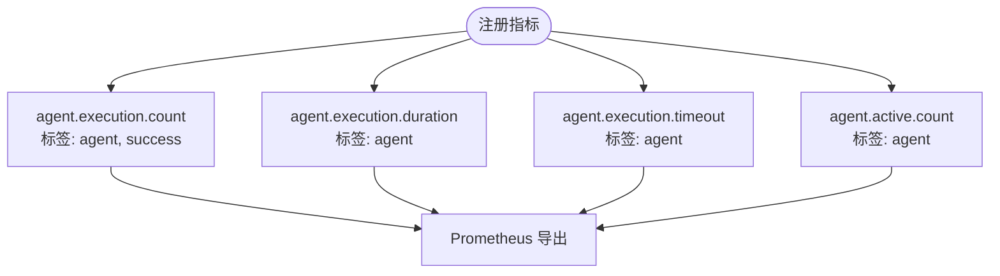
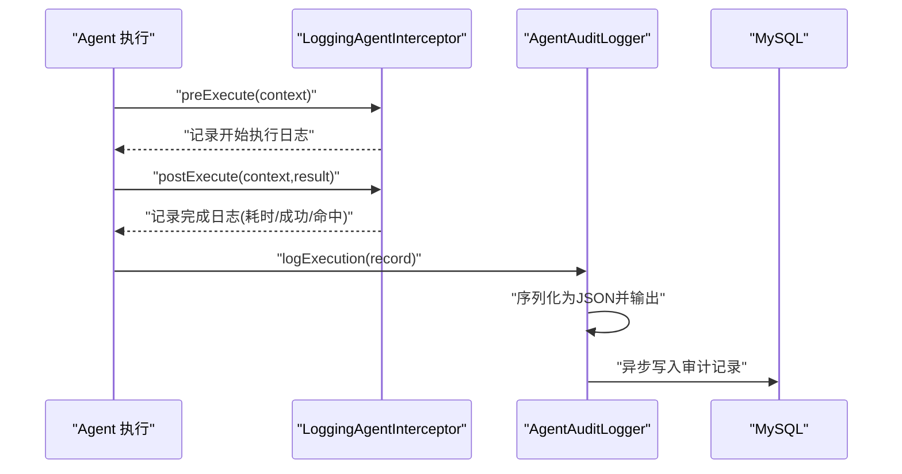
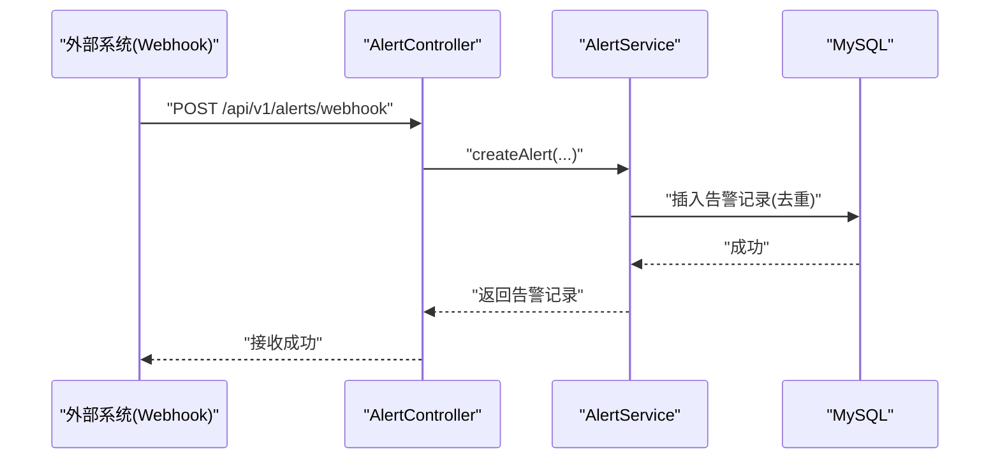
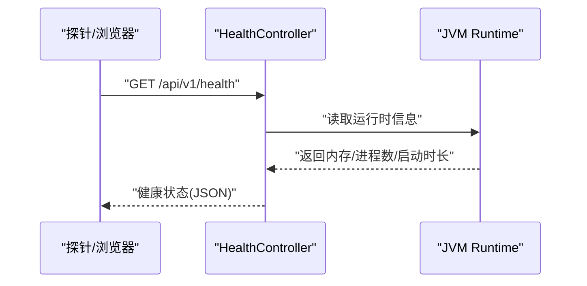
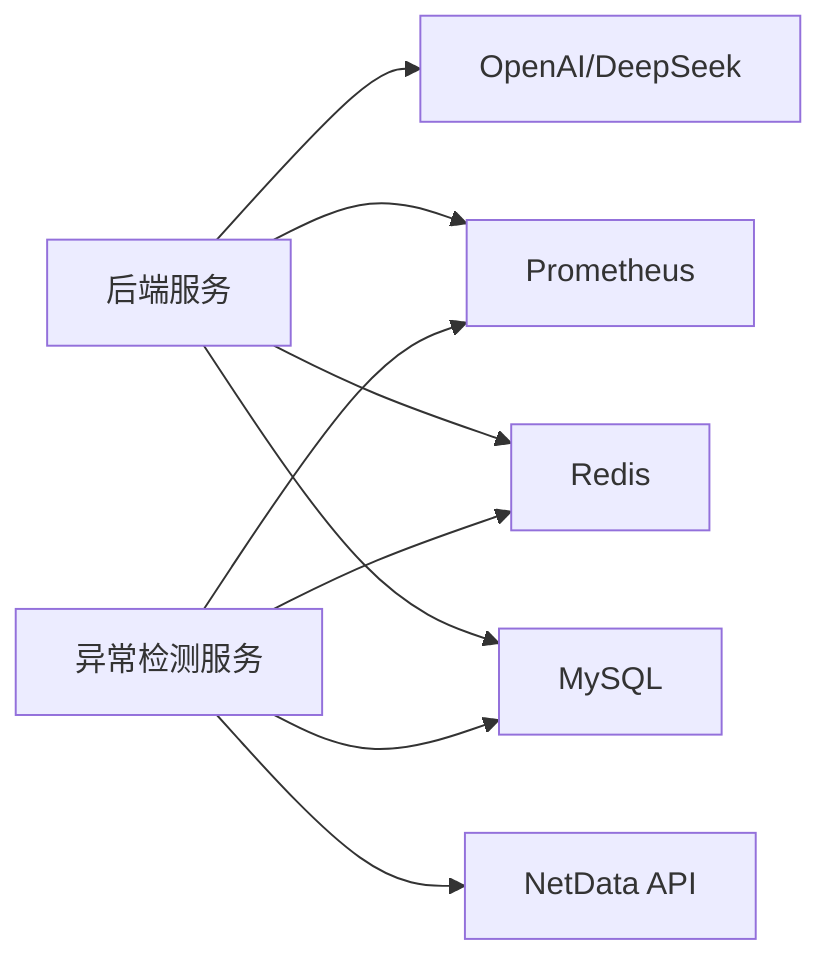

# 性能监控

<cite>
**本文引用的文件**   
- [application.yml](file://netdata-ai-backend/src/main/resources/application.yml)
- [AgentActuatorEndpoint.java](file://netdata-ai-backend/src/main/java/com/netdata/ops/core/agent/AgentActuatorEndpoint.java)
- [LoggingAgentInterceptor.java](file://netdata-ai-backend/src/main/java/com/netdata/ops/core/agent/LoggingAgentInterceptor.java)
- [AgentAuditLogger.java](file://netdata-ai-backend/src/main/java/com/netdata/ops/core/agent/AgentAuditLogger.java)
- [AgentInterceptorConfig.java](file://netdata-ai-backend/src/main/java/com/netdata/ops/config/AgentInterceptorConfig.java)
- [HealthController.java](file://netdata-ai-backend/src/main/java/com/netdata/ops/controller/HealthController.java)
- [AlertController.java](file://netdata-ai-backend/src/main/java/com/netdata/ops/controller/AlertController.java)
- [AlertService.java](file://netdata-ai-backend/src/main/java/com/netdata/ops/service/AlertService.java)
- [docker-compose.yml](file://docker-compose.yml)
- [main.py](file://anomaly-detection-service/app/main.py)
- [config.py](file://anomaly-detection-service/app/config.py)
- [Dockerfile](file://anomaly-detection-service/Dockerfile)
- [requirements.txt](file://anomaly-detection-service/requirements.txt)
</cite>

## 目录
1. [简介](#简介)
2. [项目结构](#项目结构)
3. [核心组件](#核心组件)
4. [架构总览](#架构总览)
5. [详细组件分析](#详细组件分析)
6. [依赖分析](#依赖分析)
7. [性能考虑](#性能考虑)
8. [故障排查指南](#故障排查指南)
9. [结论](#结论)
10. [附录](#附录)

## 简介
本方案围绕“系统性能监控”目标，结合后端 Spring Boot 与异常检测微服务，构建一套完整的监控体系，涵盖：
- 应用指标采集与导出：Spring Boot Actuator、Micrometer、Prometheus 集成
- 自定义指标注册与暴露：Agent 执行指标、成功率、耗时、活跃数、超时数
- 日志聚合与标准化：统一日志格式、结构化审计日志、日志落盘与轮转
- 告警配置：阈值设定、规则设计、Webhook 接收与人工确认
- 性能瓶颈分析：CPU、内存、磁盘 I/O、网络流量的指标解读与定位
- 系统健康检查：服务可用性、响应时间、错误率统计

## 项目结构
系统由以下关键部分组成：
- 后端服务（Spring Boot）：提供业务接口、健康检查、自定义指标端点、日志与审计
- 异常检测微服务（FastAPI）：提供异常检测能力，具备健康检查与请求耗时记录
- 容器编排（Docker Compose）：统一编排数据库、缓存、Milvus、LLM 等依赖服务
- 监控与日志：Actuator 暴露指标，Prometheus 抓取；日志标准化，支持 ELK/Loki

**图表来源**
- [application.yml:206-237](file://netdata-ai-backend/src/main/resources/application.yml#L206-L237)
- [AgentActuatorEndpoint.java:34-67](file://netdata-ai-backend/src/main/java/com/netdata/ops/core/agent/AgentActuatorEndpoint.java#L34-L67)
- [HealthController.java:23-62](file://netdata-ai-backend/src/main/java/com/netdata/ops/controller/HealthController.java#L23-L62)
- [main.py:118-139](file://anomaly-detection-service/app/main.py#L118-L139)
- [docker-compose.yml:23-358](file://docker-compose.yml#L23-L358)

**章节来源**
- [application.yml:206-237](file://netdata-ai-backend/src/main/resources/application.yml#L206-L237)
- [docker-compose.yml:23-358](file://docker-compose.yml#L23-L358)

## 核心组件
- Actuator 指标暴露与 Prometheus 集成：启用 health、info、metrics、prometheus、agents、circuitbreakers、retries 等端点，Resilience4j 指标开关开启
- 自定义 Agent 指标端点：/actuator/agents 汇总 Agent 执行次数、成功率、平均耗时、活跃数、超时数
- 日志拦截与审计：统一结构化日志格式，审计日志异步写入数据库与 JSON 日志
- 健康检查：后端提供 /api/v1/health，异常检测服务提供 /api/health，并在 Dockerfile 中配置 HEALTHCHECK
- 告警：接收外部告警 Webhook，支持批量解决与统计趋势

**章节来源**
- [application.yml:206-237](file://netdata-ai-backend/src/main/resources/application.yml#L206-L237)
- [AgentActuatorEndpoint.java:34-67](file://netdata-ai-backend/src/main/java/com/netdata/ops/core/agent/AgentActuatorEndpoint.java#L34-L67)
- [LoggingAgentInterceptor.java:24-50](file://netdata-ai-backend/src/main/java/com/netdata/ops/core/agent/LoggingAgentInterceptor.java#L24-L50)
- [AgentAuditLogger.java:35-75](file://netdata-ai-backend/src/main/java/com/netdata/ops/core/agent/AgentAuditLogger.java#L35-L75)
- [HealthController.java:23-62](file://netdata-ai-backend/src/main/java/com/netdata/ops/controller/HealthController.java#L23-L62)
- [AlertController.java:69-85](file://netdata-ai-backend/src/main/java/com/netdata/ops/controller/AlertController.java#L69-L85)
- [AlertService.java:96-101](file://netdata-ai-backend/src/main/java/com/netdata/ops/service/AlertService.java#L96-L101)
- [main.py:118-139](file://anomaly-detection-service/app/main.py#L118-L139)
- [Dockerfile:78-81](file://anomaly-detection-service/Dockerfile#L78-L81)

## 架构总览
下图展示了监控与可观测性的整体架构：后端服务与异常检测服务通过 Actuator 暴露 Micrometer 指标，Prometheus 抓取；日志经由统一格式输出至日志平台；告警通过 Webhook 接入并支持人工确认。

**图表来源**
- [application.yml:206-237](file://netdata-ai-backend/src/main/resources/application.yml#L206-L237)
- [main.py:118-139](file://anomaly-detection-service/app/main.py#L118-L139)
- [AlertController.java:69-85](file://netdata-ai-backend/src/main/java/com/netdata/ops/controller/AlertController.java#L69-L85)

## 详细组件分析

### Spring Boot Actuator 与 Micrometer 指标
- 指标暴露：management.endpoints.web.exposure.include 启用 health、info、metrics、prometheus、agents、circuitbreakers、retries
- Resilience4j 指标：开启 circuitbreaker、retry、bulkhead、timelimiter 的指标导出
- 自定义端点：AgentActuatorEndpoint 暴露 /actuator/agents 与 /actuator/agents/{name}，聚合 agent.execution.count、agent.execution.duration、agent.execution.timeout、agent.active.count 等指标

**图表来源**
- [application.yml:206-237](file://netdata-ai-backend/src/main/resources/application.yml#L206-L237)
- [AgentActuatorEndpoint.java:52-104](file://netdata-ai-backend/src/main/java/com/netdata/ops/core/agent/AgentActuatorEndpoint.java#L52-L104)

**章节来源**
- [application.yml:206-237](file://netdata-ai-backend/src/main/resources/application.yml#L206-L237)
- [AgentActuatorEndpoint.java:34-224](file://netdata-ai-backend/src/main/java/com/netdata/ops/core/agent/AgentActuatorEndpoint.java#L34-L224)

### 自定义指标注册与 Prometheus 集成
- 指标类型：Counter（执行次数）、Timer（耗时）、Gauge（活跃数）、Counter（超时）
- 标签规范：agent、success 等标签用于区分不同 Agent 与执行结果
- 指标来源：MeterRegistry 聚合，保证与 Prometheus 导出一致

**图表来源**
- [AgentActuatorEndpoint.java:146-222](file://netdata-ai-backend/src/main/java/com/netdata/ops/core/agent/AgentActuatorEndpoint.java#L146-L222)

**章节来源**
- [AgentActuatorEndpoint.java:146-222](file://netdata-ai-backend/src/main/java/com/netdata/ops/core/agent/AgentActuatorEndpoint.java#L146-L222)

### 日志聚合系统搭建
- 日志格式标准化：application.yml 中 console 模式包含 traceId，便于跨服务追踪
- 结构化审计日志：AgentAuditLogger 将审计记录以 JSON 输出到 SLF4J，并异步写入 MySQL
- 日志落盘与轮转：application.yml 配置日志文件名、最大大小与保留天数
- 异常检测服务：main.py 中请求日志中间件记录请求/响应与耗时，响应头携带 X-Process-Time-Ms

**图表来源**
- [LoggingAgentInterceptor.java:38-96](file://netdata-ai-backend/src/main/java/com/netdata/ops/core/agent/LoggingAgentInterceptor.java#L38-L96)
- [AgentAuditLogger.java:68-118](file://netdata-ai-backend/src/main/java/com/netdata/ops/core/agent/AgentAuditLogger.java#L68-L118)
- [application.yml:259-270](file://netdata-ai-backend/src/main/resources/application.yml#L259-L270)
- [main.py:118-139](file://anomaly-detection-service/app/main.py#L118-L139)

**章节来源**
- [application.yml:259-270](file://netdata-ai-backend/src/main/resources/application.yml#L259-L270)
- [LoggingAgentInterceptor.java:24-116](file://netdata-ai-backend/src/main/java/com/netdata/ops/core/agent/LoggingAgentInterceptor.java#L24-L116)
- [AgentAuditLogger.java:35-164](file://netdata-ai-backend/src/main/java/com/netdata/ops/core/agent/AgentAuditLogger.java#L35-L164)
- [main.py:118-139](file://anomaly-detection-service/app/main.py#L118-L139)

### 告警配置设置
- 外部告警接收：AlertController 提供 /api/v1/alerts/webhook，接收 alertId、source、severity、metricName、threshold 等字段
- 告警确认/解决：支持单条与批量解决，记录诊断结果与处理人
- 告警统计与趋势：提供统计概览与最近7天趋势接口
- 异常检测阈值：异常分数阈值与告警阈值在异常检测服务配置中定义

**图表来源**
- [AlertController.java:69-85](file://netdata-ai-backend/src/main/java/com/netdata/ops/controller/AlertController.java#L69-L85)
- [AlertService.java:96-101](file://netdata-ai-backend/src/main/java/com/netdata/ops/service/AlertService.java#L96-L101)

**章节来源**
- [AlertController.java:69-107](file://netdata-ai-backend/src/main/java/com/netdata/ops/controller/AlertController.java#L69-L107)
- [AlertService.java:96-101](file://netdata-ai-backend/src/main/java/com/netdata/ops/service/AlertService.java#L96-L101)
- [config.py:130-146](file://anomaly-detection-service/app/config.py#L130-L146)

### 性能瓶颈分析方法论
- CPU：结合 JVM 健康检查中的处理器核数与系统信息，观察应用线程池与并发负载
- 内存：利用健康检查返回的内存使用量（max/total/free/used），结合 GC 与堆外内存分析
- 磁盘 I/O：结合容器编排中卷与持久化配置，监控日志文件大小、数据库与 Milvus 数据目录增长
- 网络流量：Prometheus 抓取指标与异常检测服务的请求耗时中间件（X-Process-Time-Ms）辅助定位网络延迟

**章节来源**
- [HealthController.java:40-59](file://netdata-ai-backend/src/main/java/com/netdata/ops/controller/HealthController.java#L40-L59)
- [docker-compose.yml:181-187](file://docker-compose.yml#L181-L187)
- [main.py:118-139](file://anomaly-detection-service/app/main.py#L118-L139)

### 系统健康检查实现
- 后端健康：/api/v1/health 返回应用状态、版本、启动时长、内存与系统信息
- 异常检测健康：/api/health 由异常检测服务提供，Dockerfile 中 HEALTHCHECK 指向该端点
- 容器健康：compose 中对 MySQL、Redis、Milvus、MinIO、Etcd、Ollama 等服务配置健康检查

**图表来源**
- [HealthController.java:31-62](file://netdata-ai-backend/src/main/java/com/netdata/ops/controller/HealthController.java#L31-L62)

**章节来源**
- [HealthController.java:23-71](file://netdata-ai-backend/src/main/java/com/netdata/ops/controller/HealthController.java#L23-L71)
- [main.py:193-201](file://anomaly-detection-service/app/main.py#L193-L201)
- [Dockerfile:78-81](file://anomaly-detection-service/Dockerfile#L78-L81)
- [docker-compose.yml:47-53](file://docker-compose.yml#L47-L53)

## 依赖分析
- 后端服务依赖：MySQL、Redis、Milvus、OpenAI/DeepSeek、Resilience4j
- 异常检测服务依赖：NetData API、MySQL、Redis、PyOD/PySAD、FastAPI、Uvicorn/Gunicorn
- 监控依赖：Prometheus 抓取 Actuator 指标，日志平台消费结构化日志

**图表来源**
- [application.yml:31-58](file://netdata-ai-backend/src/main/resources/application.yml#L31-L58)
- [docker-compose.yml:164-247](file://docker-compose.yml#L164-L247)
- [requirements.txt:20-50](file://anomaly-detection-service/requirements.txt#L20-L50)

**章节来源**
- [application.yml:31-58](file://netdata-ai-backend/src/main/resources/application.yml#L31-L58)
- [docker-compose.yml:164-247](file://docker-compose.yml#L164-L247)
- [requirements.txt:20-50](file://anomaly-detection-service/requirements.txt#L20-L50)

## 性能考虑
- 指标粒度与开销：合理设置 Counter/Timer 标签，避免高基数标签导致指标爆炸
- 日志落盘：控制日志文件大小与轮转策略，避免磁盘压力
- 异步审计：AgentAuditLogger 使用 @Async，避免阻塞主流程
- 容器资源限制：compose 中为 Milvus、Ollama 等服务设置内存上限，防止资源争用
- 健康检查与超时：异常检测服务 HEALTHCHECK 与请求耗时中间件，有助于快速发现问题

**章节来源**
- [AgentAuditLogger.java:68-75](file://netdata-ai-backend/src/main/java/com/netdata/ops/core/agent/AgentAuditLogger.java#L68-L75)
- [docker-compose.yml:148-154](file://docker-compose.yml#L148-L154)
- [main.py:118-139](file://anomaly-detection-service/app/main.py#L118-L139)
- [Dockerfile:78-81](file://anomaly-detection-service/Dockerfile#L78-L81)

## 故障排查指南
- 指标缺失：确认 management.endpoints.web.exposure.include 是否包含 prometheus 与 agents
- 自定义端点不可用：检查 AgentActuatorEndpoint 是否被 Spring 扫描并注册
- 日志格式异常：核对 application.yml 中 logging.pattern.console 与日志级别
- 审计写入失败：AgentAuditLogger 已做容错，若数据库异常，日志通道仍会输出
- 告警重复：AlertService 在接收外部告警时进行去重判断
- 健康检查失败：检查 /api/v1/health 与 /api/health 的可达性，以及容器 HEALTHCHECK 配置

**章节来源**
- [application.yml:206-237](file://netdata-ai-backend/src/main/resources/application.yml#L206-L237)
- [AgentActuatorEndpoint.java:34-67](file://netdata-ai-backend/src/main/java/com/netdata/ops/core/agent/AgentActuatorEndpoint.java#L34-L67)
- [application.yml:259-270](file://netdata-ai-backend/src/main/resources/application.yml#L259-L270)
- [AgentAuditLogger.java:113-118](file://netdata-ai-backend/src/main/java/com/netdata/ops/core/agent/AgentAuditLogger.java#L113-L118)
- [AlertService.java:96-101](file://netdata-ai-backend/src/main/java/com/netdata/ops/service/AlertService.java#L96-L101)
- [HealthController.java:31-62](file://netdata-ai-backend/src/main/java/com/netdata/ops/controller/HealthController.java#L31-L62)
- [main.py:193-201](file://anomaly-detection-service/app/main.py#L193-L201)
- [Dockerfile:78-81](file://anomaly-detection-service/Dockerfile#L78-L81)

## 结论
本方案通过 Spring Boot Actuator 与 Micrometer 提供统一指标出口，结合自定义 Agent 端点与结构化日志，实现了可观测性的闭环。配合 Prometheus 抓取与日志平台，能够有效支撑性能瓶颈定位与告警闭环。建议在生产环境中进一步完善告警阈值与规则、日志查询优化与容量规划。

## 附录
- 配置要点速查
  - 启用 Actuator 指标与 Prometheus：management.endpoints.web.exposure.include
  - Resilience4j 指标开关：resilience4j.*.metrics.enabled
  - 日志格式与落盘：logging.pattern.console、logging.file.*
  - 异常检测阈值：anomaly_threshold、alert_threshold
  - 健康检查端点：后端 /api/v1/health、异常检测 /api/health、Docker HEALTHCHECK

**章节来源**
- [application.yml:206-237](file://netdata-ai-backend/src/main/resources/application.yml#L206-L237)
- [application.yml:259-270](file://netdata-ai-backend/src/main/resources/application.yml#L259-L270)
- [config.py:130-146](file://anomaly-detection-service/app/config.py#L130-L146)
- [main.py:193-201](file://anomaly-detection-service/app/main.py#L193-L201)
- [Dockerfile:78-81](file://anomaly-detection-service/Dockerfile#L78-L81)