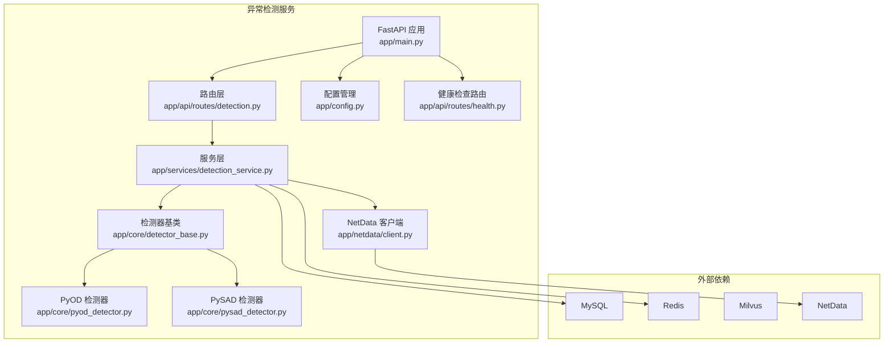
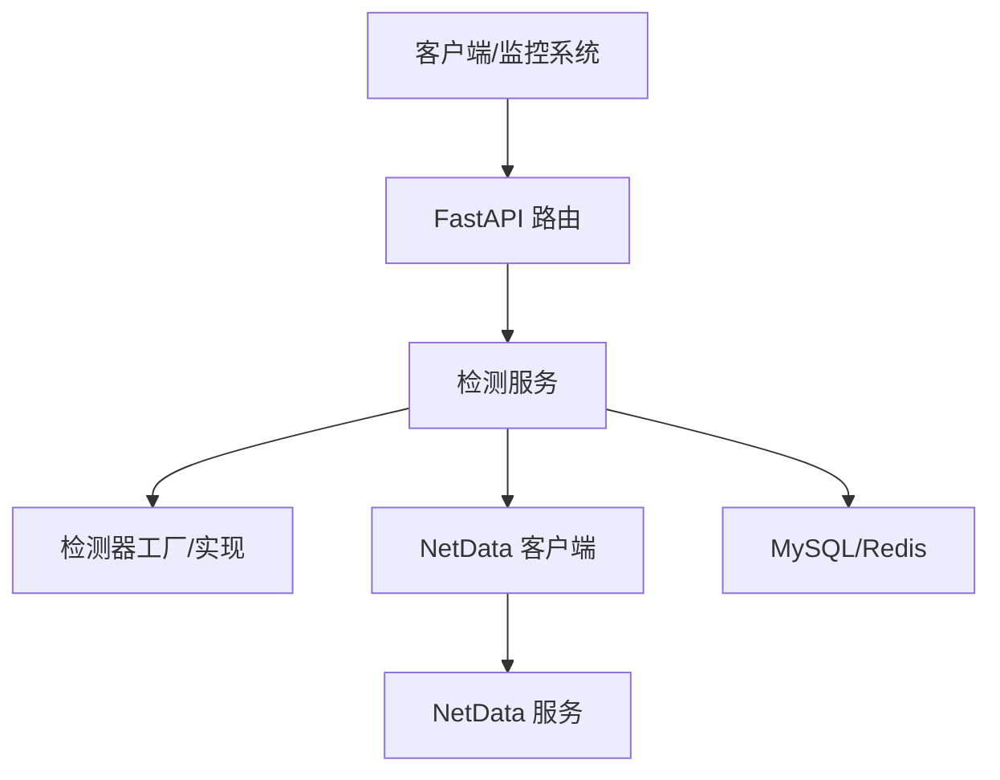
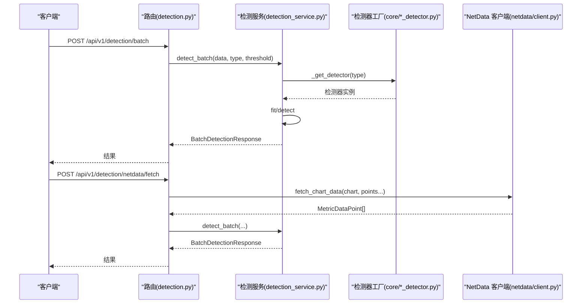
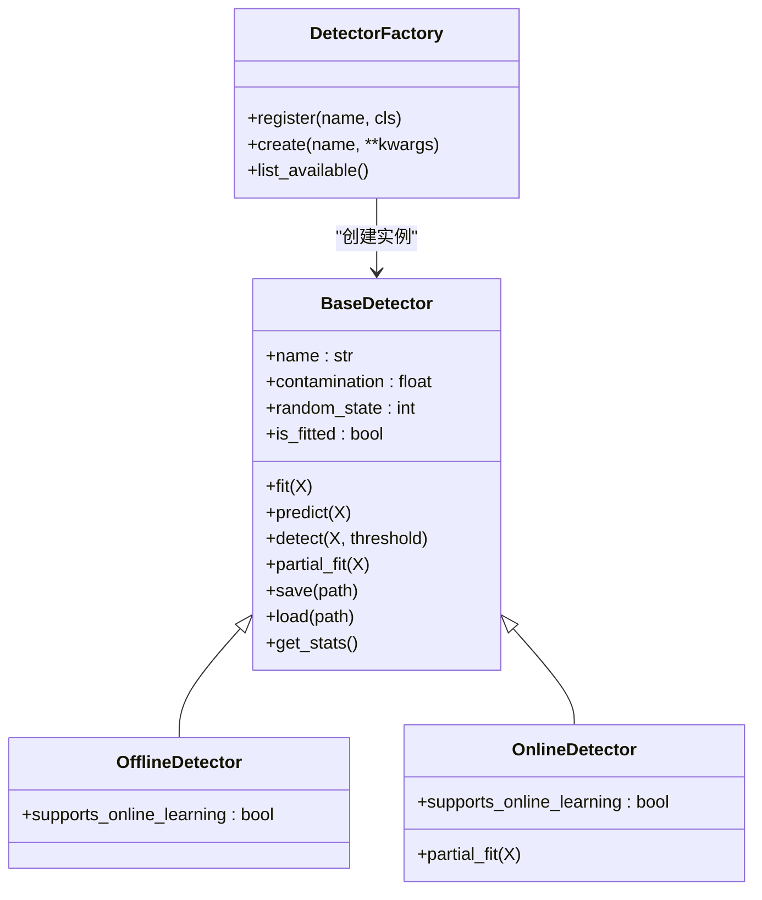
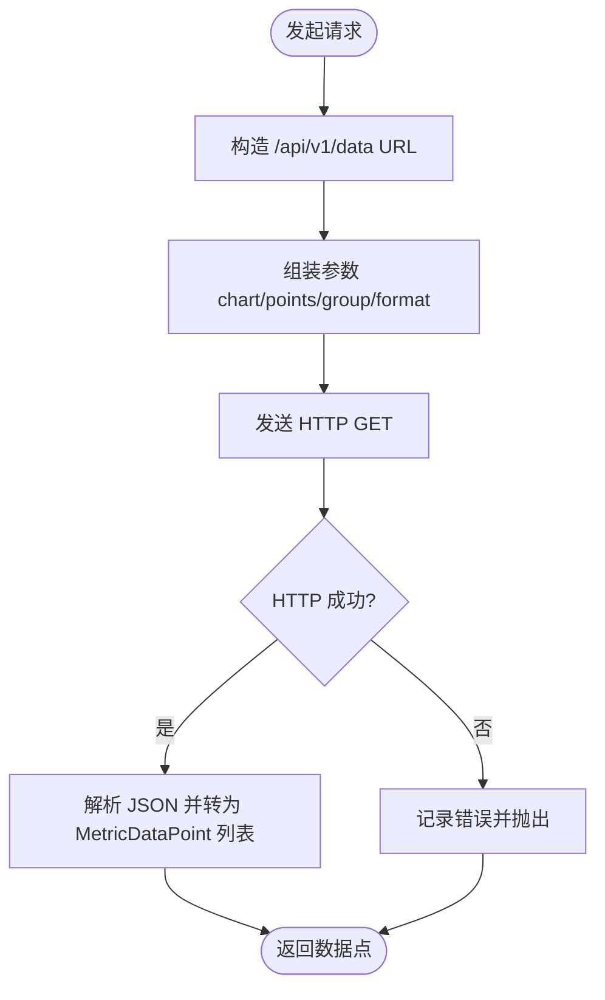
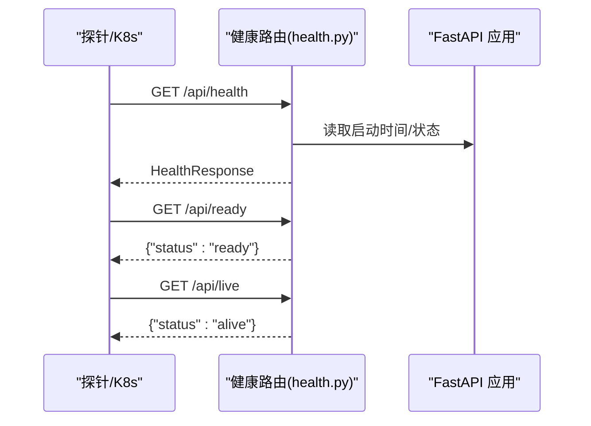
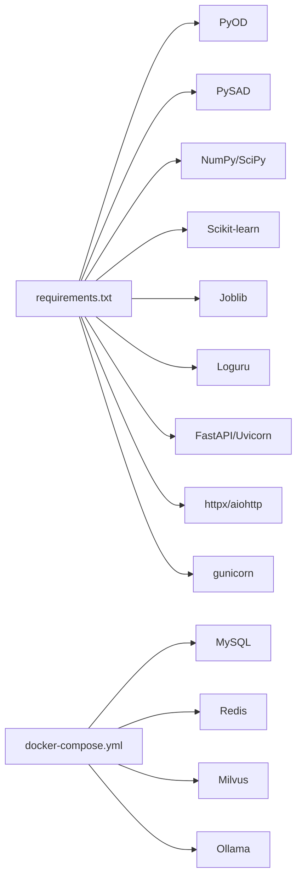

# 故障排除指南

<cite>
**本文引用的文件**
- [anomaly-detection-service/README.md](file://anomaly-detection-service/README.md)
- [anomaly-detection-service/Dockerfile](file://anomaly-detection-service/Dockerfile)
- [anomaly-detection-service/docker-compose.yml](file://anomaly-detection-service/docker-compose.yml)
- [anomaly-detection-service/pyproject.toml](file://anomaly-detection-service/pyproject.toml)
- [anomaly-detection-service/requirements.txt](file://anomaly-detection-service/requirements.txt)
- [anomaly-detection-service/app/main.py](file://anomaly-detection-service/app/main.py)
- [anomaly-detection-service/app/config.py](file://anomaly-detection-service/app/config.py)
- [anomaly-detection-service/app/netdata/client.py](file://anomaly-detection-service/app/netdata/client.py)
- [anomaly-detection-service/app/services/detection_service.py](file://anomaly-detection-service/app/services/detection_service.py)
- [anomaly-detection-service/app/api/routes/detection.py](file://anomaly-detection-service/app/api/routes/detection.py)
- [anomaly-detection-service/app/api/routes/health.py](file://anomaly-detection-service/app/api/routes/health.py)
- [anomaly-detection-service/app/core/detector_base.py](file://anomaly-detection-service/app/core/detector_base.py)
- [anomaly-detection-service/app/core/pyod_detector.py](file://anomaly-detection-service/app/core/pyod_detector.py)
- [anomaly-detection-service/app/core/pysad_detector.py](file://anomaly-detection-service/app/core/pysad_detector.py)
- [anomaly-detection-service/app/models/schemas.py](file://anomaly-detection-service/app/models/schemas.py)
</cite>

## 目录
1. [简介](#简介)
2. [项目结构](#项目结构)
3. [核心组件](#核心组件)
4. [架构总览](#架构总览)
5. [详细组件分析](#详细组件分析)
6. [依赖分析](#依赖分析)
7. [性能考虑](#性能考虑)
8. [故障排除指南](#故障排除指南)
9. [结论](#结论)
10. [附录](#附录)

## 简介
本指南面向“面向 NetData 监控数据的智能运维问答与执行系统”的异常检测子系统，提供系统化的问题诊断与恢复流程，覆盖服务启动失败、数据库连接问题、网络通信异常等典型故障场景；深入解释性能瓶颈的分析方法（CPU 使用率过高、内存泄漏、磁盘 I/O 阻塞等）；阐述系统恢复流程（数据恢复、服务重启、配置回滚）；并给出调试工具使用指南（Docker 容器检查、日志分析、网络诊断命令），以及预防性维护建议（定期检查清单、性能优化与容量规划）。

## 项目结构
该子系统采用 FastAPI + Uvicorn 生产部署，结合 Gunicorn 作为 WSGI 服务器，Docker 容器化运行，并通过 docker-compose 编排多个依赖服务（MySQL、Redis、Milvus、Ollama 等）。异常检测服务负责：
- 接收批量/流式指标数据
- 调用检测器（离线/在线）进行异常判定
- 与 NetData 集成获取监控指标
- 提供健康检查与文档接口

**图示来源**
- [anomaly-detection-service/app/main.py:76-102](file://anomaly-detection-service/app/main.py#L76-L102)
- [anomaly-detection-service/app/api/routes/detection.py:39-49](file://anomaly-detection-service/app/api/routes/detection.py#L39-L49)
- [anomaly-detection-service/app/services/detection_service.py:37-74](file://anomaly-detection-service/app/services/detection_service.py#L37-L74)
- [anomaly-detection-service/app/core/detector_base.py:31-74](file://anomaly-detection-service/app/core/detector_base.py#L31-L74)
- [anomaly-detection-service/app/netdata/client.py:30-64](file://anomaly-detection-service/app/netdata/client.py#L30-L64)
- [anomaly-detection-service/app/config.py:28-47](file://anomaly-detection-service/app/config.py#L28-L47)
- [anomaly-detection-service/app/api/routes/health.py:22-31](file://anomaly-detection-service/app/api/routes/health.py#L22-L31)

**章节来源**
- [anomaly-detection-service/README.md:1-42](file://anomaly-detection-service/README.md#L1-L42)
- [anomaly-detection-service/Dockerfile:1-95](file://anomaly-detection-service/Dockerfile#L1-L95)
- [anomaly-detection-service/docker-compose.yml:1-358](file://anomaly-detection-service/docker-compose.yml#L1-L358)

## 核心组件
- 应用入口与生命周期：负责应用启动、日志配置、中间件与异常处理注册，以及健康检查路由挂载。
- 配置管理：集中管理应用、数据库、Redis、NetData、检测器参数与日志配置，支持环境变量覆盖。
- 检测服务：协调离线/在线检测器，管理实例池与模型持久化，提供批量/流式检测与训练接口。
- 检测器实现：基于 PyOD（离线）与 PySAD（在线）封装统一接口，支持工厂模式扩展。
- NetData 客户端：异步 HTTP 客户端，提供图表数据获取、告警查询与健康检查。
- 路由与模型：定义 API 请求/响应模型与路由，提供批量检测、流式检测、训练与 NetData 集成接口。

**章节来源**
- [anomaly-detection-service/app/main.py:32-102](file://anomaly-detection-service/app/main.py#L32-L102)
- [anomaly-detection-service/app/config.py:28-183](file://anomaly-detection-service/app/config.py#L28-L183)
- [anomaly-detection-service/app/services/detection_service.py:37-334](file://anomaly-detection-service/app/services/detection_service.py#L37-L334)
- [anomaly-detection-service/app/core/detector_base.py:31-202](file://anomaly-detection-service/app/core/detector_base.py#L31-L202)
- [anomaly-detection-service/app/netdata/client.py:30-272](file://anomaly-detection-service/app/netdata/client.py#L30-L272)
- [anomaly-detection-service/app/models/schemas.py:31-329](file://anomaly-detection-service/app/models/schemas.py#L31-L329)

## 架构总览
异常检测服务采用分层架构：
- 表现层：FastAPI 路由与响应模型
- 业务层：检测服务协调器
- 检测层：离线/在线检测器
- 集成层：NetData 客户端与外部依赖（MySQL、Redis、Milvus）

**图示来源**
- [anomaly-detection-service/app/api/routes/detection.py:39-49](file://anomaly-detection-service/app/api/routes/detection.py#L39-L49)
- [anomaly-detection-service/app/services/detection_service.py:214-314](file://anomaly-detection-service/app/services/detection_service.py#L214-L314)
- [anomaly-detection-service/app/netdata/client.py:26-64](file://anomaly-detection-service/app/netdata/client.py#L26-L64)

## 详细组件分析

### 组件 A：异常检测服务（批量/流式）
- 批量检测：接收时序数据，按需训练离线检测器，输出异常分数与等级。
- 流式检测：单值实时检测，支持在线检测器的预热与增量学习。
- 训练接口：使用历史数据训练离线检测器并持久化模型。
- NetData 集成：直接从 NetData 拉取指标进行检测。

**图示来源**
- [anomaly-detection-service/app/api/routes/detection.py:62-146](file://anomaly-detection-service/app/api/routes/detection.py#L62-L146)
- [anomaly-detection-service/app/services/detection_service.py:76-118](file://anomaly-detection-service/app/services/detection_service.py#L76-L118)
- [anomaly-detection-service/app/netdata/client.py:138-198](file://anomaly-detection-service/app/netdata/client.py#L138-L198)

**章节来源**
- [anomaly-detection-service/app/services/detection_service.py:76-334](file://anomaly-detection-service/app/services/detection_service.py#L76-L334)
- [anomaly-detection-service/app/api/routes/detection.py:62-378](file://anomaly-detection-service/app/api/routes/detection.py#L62-L378)
- [anomaly-detection-service/app/netdata/client.py:84-272](file://anomaly-detection-service/app/netdata/client.py#L84-L272)

### 组件 B：检测器基类与工厂
- 抽象基类：定义统一接口（fit/predict）、输入校验、分数归一化、持久化与统计信息。
- 工厂模式：集中注册与创建检测器，便于扩展新算法。
- 离线/在线基类：区分训练型与流式型检测器能力。

**图示来源**
- [anomaly-detection-service/app/core/detector_base.py:31-202](file://anomaly-detection-service/app/core/detector_base.py#L31-L202)
- [anomaly-detection-service/app/core/detector_base.py:288-339](file://anomaly-detection-service/app/core/detector_base.py#L288-L339)

**章节来源**
- [anomaly-detection-service/app/core/detector_base.py:31-339](file://anomaly-detection-service/app/core/detector_base.py#L31-L339)

### 组件 C：NetData 客户端
- 异步 HTTP 客户端，支持获取图表数据、告警与健康检查。
- 提供结构化数据点转换，便于检测服务消费。

**图示来源**
- [anomaly-detection-service/app/netdata/client.py:84-198](file://anomaly-detection-service/app/netdata/client.py#L84-L198)

**章节来源**
- [anomaly-detection-service/app/netdata/client.py:30-272](file://anomaly-detection-service/app/netdata/client.py#L30-L272)

### 组件 D：健康检查与就绪检查
- 健康检查：返回服务状态、版本、检测器加载情况与运行时长。
- 就绪/存活检查：为容器编排提供探针接口。

**图示来源**
- [anomaly-detection-service/app/api/routes/health.py:31-87](file://anomaly-detection-service/app/api/routes/health.py#L31-L87)
- [anomaly-detection-service/app/main.py:40-60](file://anomaly-detection-service/app/main.py#L40-L60)

**章节来源**
- [anomaly-detection-service/app/api/routes/health.py:25-87](file://anomaly-detection-service/app/api/routes/health.py#L25-L87)

## 依赖分析
- Python 依赖：FastAPI、Uvicorn、Pydantic、PyOD、PySAD、NumPy/SciPy、Scikit-learn、Joblib、Loguru、httpx/aiohttp、gunicorn 等。
- 容器编排：通过 docker-compose 启动 MySQL、Redis、Milvus、Ollama 等服务，定义健康检查与资源限制。
- 部署配置：Dockerfile 使用 HEALTHCHECK 与 gunicorn + uvicorn worker，暴露端口 8001。

**图示来源**
- [anomaly-detection-service/requirements.txt:17-94](file://anomaly-detection-service/requirements.txt#L17-L94)
- [anomaly-detection-service/docker-compose.yml:164-324](file://anomaly-detection-service/docker-compose.yml#L164-L324)
- [anomaly-detection-service/Dockerfile:78-94](file://anomaly-detection-service/Dockerfile#L78-L94)

**章节来源**
- [anomaly-detection-service/requirements.txt:17-94](file://anomaly-detection-service/requirements.txt#L17-L94)
- [anomaly-detection-service/docker-compose.yml:1-358](file://anomaly-detection-service/docker-compose.yml#L1-L358)
- [anomaly-detection-service/Dockerfile:1-95](file://anomaly-detection-service/Dockerfile#L1-L95)

## 性能考虑
- 批量检测性能
  - 离线检测器（Isolation Forest、LOF、KNN）依赖 NumPy/SciPy 与并行计算参数，样本量与特征维度过高会导致内存与 CPU 压力上升。
  - 建议：合理设置 max_batch_size、n_estimators/n_neighbors 等参数，避免过大数据批次。
- 流式检测性能
  - 在线检测器（Half-Space Trees、xStream）依赖滑动窗口大小与预热数据，窗口过大导致内存占用上升。
  - 建议：根据指标频率调整 online_window_size，启用增量学习以减少重复训练。
- I/O 与网络
  - NetData 拉取数据的超时与并发请求会影响整体吞吐，建议优化 points/group/format 参数与缓存策略。
- 日志与资源
  - 生产环境建议降低日志级别、配置日志轮转与保留策略，避免磁盘 I/O 压力。

[本节为通用性能讨论，不直接分析具体文件]

## 故障排除指南

### 一、服务启动失败
- 现象
  - 容器启动后立即退出或健康检查失败。
- 诊断步骤
  - 检查容器日志：查看应用启动日志与异常堆栈。
  - 确认端口占用：容器暴露 8001，确认主机端口映射正确。
  - 健康检查：Dockerfile 中 HEALTHCHECK 访问 /api/health，若失败需排查应用启动流程。
  - 依赖服务：docker-compose 中 MySQL/Redis/Milvus/Ollama 的健康检查与资源限制。
- 处理建议
  - 修复配置项（端口、超时、凭据），确保依赖服务可用且资源充足。
  - 使用 --no-daemon 方式在前台运行，观察启动过程。

**章节来源**
- [anomaly-detection-service/Dockerfile:78-94](file://anomaly-detection-service/Dockerfile#L78-L94)
- [anomaly-detection-service/docker-compose.yml:164-324](file://anomaly-detection-service/docker-compose.yml#L164-L324)
- [anomaly-detection-service/app/main.py:40-70](file://anomaly-detection-service/app/main.py#L40-L70)

### 二、数据库连接问题（MySQL/Redis）
- 现象
  - 检测服务报连接失败、认证错误或超时。
- 诊断步骤
  - 检查 .env 或环境变量中的数据库连接串与凭据。
  - 使用 docker-compose ps 查看 MySQL/Redis 容器健康状态。
  - 在宿主机使用 mysql/redis-cli 连接验证网络连通性。
- 处理建议
  - 修正凭据与网络配置，确保容器间网络互通（同一自定义网络）。
  - 调整连接超时与重试策略，必要时增加资源限制。

**章节来源**
- [anomaly-detection-service/app/config.py:81-103](file://anomaly-detection-service/app/config.py#L81-L103)
- [anomaly-detection-service/docker-compose.yml:164-209](file://anomaly-detection-service/docker-compose.yml#L164-L209)
- [anomaly-detection-service/docker-compose.yml:219-239](file://anomaly-detection-service/docker-compose.yml#L219-L239)

### 三、网络通信异常（NetData）
- 现象
  - /api/v1/detection/netdata/fetch 返回空数据或超时。
- 诊断步骤
  - 使用 NetData 客户端的 health_check() 检查 NetData 服务可达性。
  - 在容器内使用 curl 访问 NetData API，确认端口与鉴权。
  - 检查 NetData 端口（默认 19999）与防火墙策略。
- 处理建议
  - 调整 netdata_host/port/timeout 配置，确保与 NetData 一致。
  - 优化 points/group/format 参数，减少单次拉取数据量。

**章节来源**
- [anomaly-detection-service/app/netdata/client.py:250-266](file://anomaly-detection-service/app/netdata/client.py#L250-L266)
- [anomaly-detection-service/app/config.py:67-76](file://anomaly-detection-service/app/config.py#L67-L76)

### 四、性能瓶颈分析
- CPU 使用率过高
  - 批量检测：降低 n_estimators/n_neighbors、减小 max_batch_size、启用并行参数。
  - 流式检测：缩小 online_window_size、减少预热数据量。
- 内存泄漏/占用过高
  - 检查检测器实例池与模型持久化逻辑，避免重复创建。
  - 调整日志级别与轮转策略，减少 I/O 压力。
- 磁盘 I/O 阻塞
  - 检查日志文件轮转与保留策略，避免单文件过大。
  - 模型持久化路径与权限，确保写入正常。

**章节来源**
- [anomaly-detection-service/app/services/detection_service.py:67-74](file://anomaly-detection-service/app/services/detection_service.py#L67-L74)
- [anomaly-detection-service/app/config.py:149-154](file://anomaly-detection-service/app/config.py#L149-L154)

### 五、系统恢复流程
- 数据恢复
  - MySQL：备份/恢复 SQL 文件，确认初始化脚本与字符集配置。
  - Redis：恢复 AOF/RDB 文件，检查持久化配置。
  - Milvus：恢复 etcd/minio 数据目录，确保数据一致性。
- 服务重启
  - docker-compose restart 依赖服务，观察健康检查状态。
  - 容器内使用进程管理工具（如 supervisor）或直接重启异常服务。
- 配置回滚
  - 使用版本化配置文件，回退到上一个稳定 .env 或 docker-compose 版本。
  - 回滚检测器模型文件，确保服务可正常加载。

**章节来源**
- [anomaly-detection-service/docker-compose.yml:181-187](file://anomaly-detection-service/docker-compose.yml#L181-L187)
- [anomaly-detection-service/docker-compose.yml:225-227](file://anomaly-detection-service/docker-compose.yml#L225-L227)
- [anomaly-detection-service/docker-compose.yml:44-46](file://anomaly-detection-service/docker-compose.yml#L44-L46)

### 六、调试工具使用指南
- Docker 容器检查
  - docker-compose ps：查看各服务状态与健康检查。
  - docker logs -f <container>：实时查看日志。
  - docker exec -it <container> sh：进入容器交互式调试。
- 日志分析
  - 应用日志：检查 logs/app.log 与轮转策略。
  - 容器标准输出：gunicorn uvicorn worker 输出。
- 网络诊断命令
  - curl http://host:port/api/health：验证健康检查。
  - telnet/nc：检查端口连通性。
  - ss/netstat：查看监听与连接状态。

**章节来源**
- [anomaly-detection-service/Dockerfile:78-94](file://anomaly-detection-service/Dockerfile#L78-L94)
- [anomaly-detection-service/app/main.py:46-53](file://anomaly-detection-service/app/main.py#L46-L53)

### 七、预防性维护建议
- 定期检查清单
  - 服务健康检查：/api/health、/api/ready、/api/live。
  - 依赖服务：MySQL/Redis/Milvus/Ollama 健康状态与资源使用。
  - 日志：检查日志轮转与磁盘占用。
- 性能优化
  - 调整检测器参数与批处理大小，启用并行与增量学习。
  - 优化 NetData 拉取参数，减少 I/O 压力。
- 容量规划
  - 依据指标频率与窗口大小估算内存与 CPU 需求。
  - 为 Milvus/MySQL/Redis 预留充足的内存与磁盘空间。

**章节来源**
- [anomaly-detection-service/app/api/routes/health.py:31-87](file://anomaly-detection-service/app/api/routes/health.py#L31-L87)
- [anomaly-detection-service/docker-compose.yml:148-154](file://anomaly-detection-service/docker-compose.yml#L148-L154)
- [anomaly-detection-service/app/config.py:141-145](file://anomaly-detection-service/app/config.py#L141-L145)

## 结论
本指南围绕异常检测服务的启动、网络、数据库与性能等关键故障场景提供了系统化的诊断与恢复流程，并结合容器化与编排配置给出实用的调试方法与预防性维护建议。建议在生产环境中持续关注健康检查、日志与资源使用，配合参数调优与容量规划，保障系统的稳定性与可维护性。

## 附录
- 快速开始与 API 文档
  - 服务启动与文档访问见 README。
- 配置与部署要点
  - 环境变量覆盖、端口映射、健康检查与资源限制见 Dockerfile 与 docker-compose。

**章节来源**
- [anomaly-detection-service/README.md:11-22](file://anomaly-detection-service/README.md#L11-L22)
- [anomaly-detection-service/Dockerfile:18-23](file://anomaly-detection-service/Dockerfile#L18-L23)
- [anomaly-detection-service/docker-compose.yml:11-21](file://anomaly-detection-service/docker-compose.yml#L11-L21)