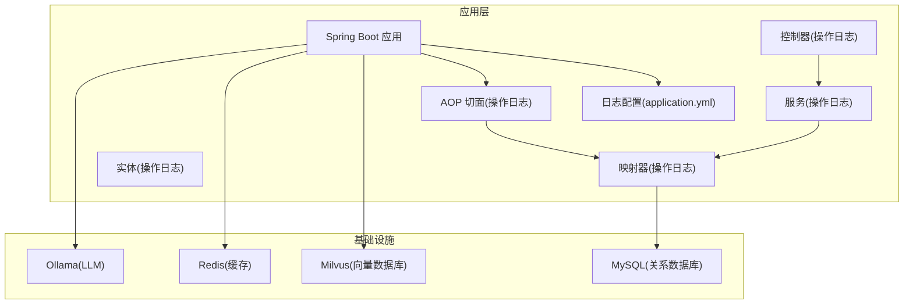
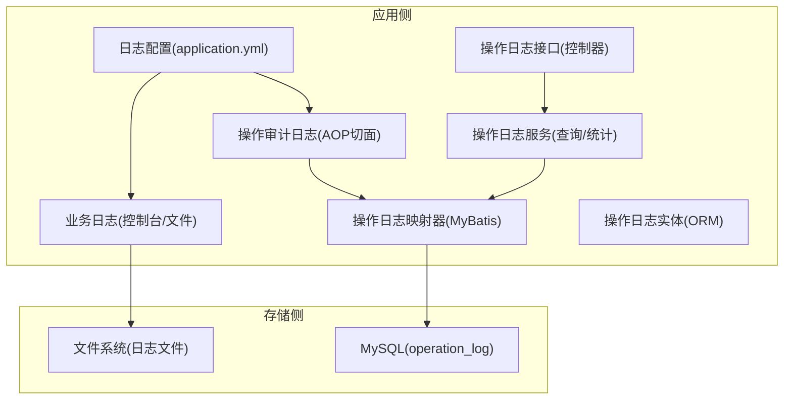
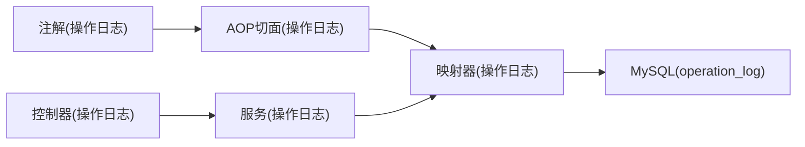
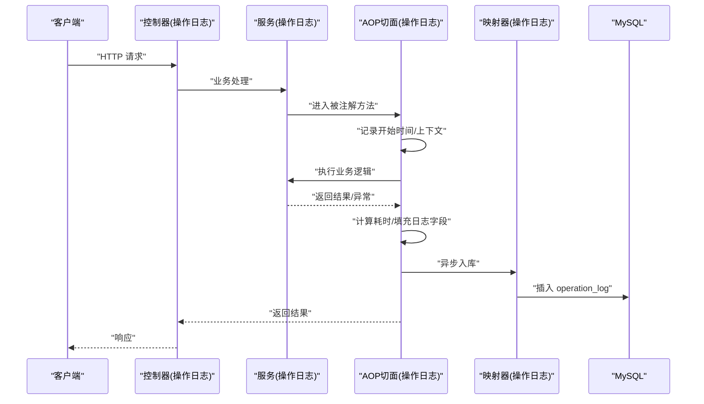

# 日志管理

<cite>
**本文引用的文件**
- [application.yml](file://netdata-ai-backend/src/main/resources/application.yml)
- [OperationLogAnno.java](file://netdata-ai-backend/src/main/java/com/netdata/ops/annotation/OperationLogAnno.java)
- [OperationLogAspect.java](file://netdata-ai-backend/src/main/java/com/netdata/ops/aspect/OperationLogAspect.java)
- [OperationLog.java](file://netdata-ai-backend/src/main/java/com/netdata/ops/entity/OperationLog.java)
- [OperationLogMapper.java](file://netdata-ai-backend/src/main/java/com/netdata/ops/mapper/OperationLogMapper.java)
- [OperationLogService.java](file://netdata-ai-backend/src/main/java/com/netdata/ops/service/OperationLogService.java)
- [OperationLogController.java](file://netdata-ai-backend/src/main/java/com/netdata/ops/controller/OperationLogController.java)
- [docker-compose.yml](file://docker-compose.yml)
</cite>

## 目录
1. [简介](#简介)
2. [项目结构](#项目结构)
3. [核心组件](#核心组件)
4. [架构总览](#架构总览)
5. [详细组件分析](#详细组件分析)
6. [依赖分析](#依赖分析)
7. [性能考量](#性能考量)
8. [故障排查指南](#故障排查指南)
9. [结论](#结论)
10. [附录](#附录)

## 简介
本文件围绕日志管理制定一套完整的策略与实施方案，结合当前代码库中的日志配置与审计日志能力，给出日志级别最佳实践、日志轮转策略、集中化存储与查询优化、日志分析工具使用指南以及安全与合规建议。目标是帮助团队在开发与生产环境中建立统一、可观测、可追溯且安全的日志体系。

## 项目结构
本项目采用 Spring Boot 后端工程，日志相关配置集中在应用配置文件中，并通过 AOP 切面实现操作审计日志的自动采集与落库。Docker Compose 提供了 Milvus、MySQL、Redis、Ollama 等服务的编排，便于本地与生产环境的一致化部署。

图表来源
- [application.yml:256-270](file://netdata-ai-backend/src/main/resources/application.yml#L256-L270)
- [OperationLogAspect.java:37-53](file://netdata-ai-backend/src/main/java/com/netdata/ops/aspect/OperationLogAspect.java#L37-L53)
- [OperationLogController.java:20-48](file://netdata-ai-backend/src/main/java/com/netdata/ops/controller/OperationLogController.java#L20-L48)
- [OperationLogService.java:16-79](file://netdata-ai-backend/src/main/java/com/netdata/ops/service/OperationLogService.java#L16-L79)
- [OperationLogMapper.java:1-10](file://netdata-ai-backend/src/main/java/com/netdata/ops/mapper/OperationLogMapper.java#L1-L10)
- [OperationLog.java:8-56](file://netdata-ai-backend/src/main/java/com/netdata/ops/entity/OperationLog.java#L8-L56)
- [docker-compose.yml:23-358](file://docker-compose.yml#L23-L358)

章节来源
- [application.yml:256-270](file://netdata-ai-backend/src/main/resources/application.yml#L256-L270)
- [docker-compose.yml:23-358](file://docker-compose.yml#L23-L358)

## 核心组件
- 应用日志配置：通过 application.yml 设置根日志级别、包级别、控制台格式、文件输出及轮转参数。
- 操作审计日志：基于注解与 AOP 切面自动采集请求上下文、用户信息、执行耗时与结果状态，并异步入库。
- 数据库存储：操作日志实体映射到 operation_log 表，提供分页查询与统计接口。
- 基础设施编排：Docker Compose 统一管理各依赖服务，便于日志集中化与运维。

章节来源
- [application.yml:256-270](file://netdata-ai-backend/src/main/resources/application.yml#L256-L270)
- [OperationLogAnno.java:1-29](file://netdata-ai-backend/src/main/java/com/netdata/ops/annotation/OperationLogAnno.java#L1-L29)
- [OperationLogAspect.java:1-127](file://netdata-ai-backend/src/main/java/com/netdata/ops/aspect/OperationLogAspect.java#L1-L127)
- [OperationLog.java:1-56](file://netdata-ai-backend/src/main/java/com/netdata/ops/entity/OperationLog.java#L1-L56)
- [OperationLogMapper.java:1-10](file://netdata-ai-backend/src/main/java/com/netdata/ops/mapper/OperationLogMapper.java#L1-L10)
- [OperationLogService.java:1-80](file://netdata-ai-backend/src/main/java/com/netdata/ops/service/OperationLogService.java#L1-L80)
- [OperationLogController.java:1-49](file://netdata-ai-backend/src/main/java/com/netdata/ops/controller/OperationLogController.java#L1-L49)

## 架构总览
下图展示了应用侧日志与审计日志的采集、处理与存储路径，以及与基础设施的关系。

图表来源
- [application.yml:256-270](file://netdata-ai-backend/src/main/resources/application.yml#L256-L270)
- [OperationLogAspect.java:37-53](file://netdata-ai-backend/src/main/java/com/netdata/ops/aspect/OperationLogAspect.java#L37-L53)
- [OperationLogController.java:20-48](file://netdata-ai-backend/src/main/java/com/netdata/ops/controller/OperationLogController.java#L20-L48)
- [OperationLogService.java:16-79](file://netdata-ai-backend/src/main/java/com/netdata/ops/service/OperationLogService.java#L16-L79)
- [OperationLogMapper.java:1-10](file://netdata-ai-backend/src/main/java/com/netdata/ops/mapper/OperationLogMapper.java#L1-L10)
- [OperationLog.java:8-56](file://netdata-ai-backend/src/main/java/com/netdata/ops/entity/OperationLog.java#L8-L56)

## 详细组件分析

### 日志级别设置与最佳实践
- 根级别与包级别
  - 根级别：开发环境建议较低级别以便调试；生产环境建议提升至 WARN 或更高，减少噪声。
  - 包级别：对业务包与第三方库分别设置不同级别，便于聚焦关键信息。
- 级别应用场景
  - DEBUG：开发调试、定位问题时启用，生产环境谨慎使用。
  - INFO：常规运行信息、关键流程节点、定时任务等。
  - WARN：潜在风险、异常分支但未中断流程。
  - ERROR：错误事件、异常抛出、外部依赖失败等。
- 输出策略
  - 控制台输出：用于开发与快速诊断。
  - 文件输出：生产环境建议开启文件输出并配合轮转，便于离线分析与归档。
  - 格式化：统一时间戳、线程名、traceId、级别、Logger 名称与消息，提升可读性与关联性。

章节来源
- [application.yml:256-270](file://netdata-ai-backend/src/main/resources/application.yml#L256-L270)
- [application.yml:290-314](file://netdata-ai-backend/src/main/resources/application.yml#L290-L314)

### 日志轮转策略配置
- 按大小轮转
  - 通过最大文件大小限制单个日志文件尺寸，避免单文件过大影响读写与传输。
- 按时间轮转
  - 可结合外部工具或框架特性进行日期维度轮转，满足合规与归档周期要求。
- 保留策略
  - 设置最大历史文件数或保留天数，平衡磁盘空间与历史可追溯性。
- 在应用中的体现
  - 文件输出路径、最大文件大小、最大历史天数等参数在配置文件中集中管理，便于统一策略与变更。

章节来源
- [application.yml:266-269](file://netdata-ai-backend/src/main/resources/application.yml#L266-L269)

### 集中化日志存储与查询优化
- 存储方案
  - 当前实现：操作审计日志入库到 MySQL 的 operation_log 表，便于结构化查询与统计。
  - 扩展建议：引入集中化日志平台（如 ELK/ECS）以支持海量日志的采集、索引与检索。
- 索引与查询优化
  - 对高频查询字段建立索引（如创建时间、模块、操作类型、用户名）。
  - 使用范围查询与复合条件过滤，避免全表扫描。
  - 分页查询与统计聚合分离，降低热点压力。
- 索引管理
  - 定期评估索引使用率，清理无效或低效索引。
  - 对冷热数据分层存储，热数据走高性能存储，冷数据下沉。

章节来源
- [OperationLog.java:8-56](file://netdata-ai-backend/src/main/java/com/netdata/ops/entity/OperationLog.java#L8-L56)
- [OperationLogMapper.java:1-10](file://netdata-ai-backend/src/main/java/com/netdata/ops/mapper/OperationLogMapper.java#L1-L10)
- [OperationLogService.java:16-79](file://netdata-ai-backend/src/main/java/com/netdata/ops/service/OperationLogService.java#L16-L79)

### 日志分析工具使用指南
- Kibana 仪表板配置
  - 创建索引模式，映射日志字段（时间戳、级别、traceId、模块、消息等）。
  - 构建常用图表：错误趋势、模块调用量、响应时间分布、IP/用户画像等。
- 日志搜索语法
  - 使用布尔表达式组合关键词、范围与通配符，支持高亮与聚合。
  - 结合 traceId 进行端到端链路追踪。
- 性能分析查询
  - 使用聚合查询计算 P50/P95/P99 响应时间与错误率。
  - 按时间窗口滑动分析，识别异常波动与回归。

（本节为概念性指导，不直接分析具体文件）

### 日志安全与合规
- 敏感信息脱敏
  - 在日志中避免输出明文密码、令牌、身份证号等敏感字段；必要时进行掩码或哈希处理。
  - 对请求参数与响应体进行白名单过滤与长度限制。
- 访问控制
  - 限制日志查询权限，遵循最小授权原则；对审计日志单独设置只读访问。
- 审计日志管理
  - 操作日志具备用户、模块、动作、目标、时间、结果等要素，满足合规审计需求。
  - 建立日志留存与备份策略，满足法规要求。

章节来源
- [OperationLogAspect.java:111-125](file://netdata-ai-backend/src/main/java/com/netdata/ops/aspect/OperationLogAspect.java#L111-L125)
- [OperationLog.java:8-56](file://netdata-ai-backend/src/main/java/com/netdata/ops/entity/OperationLog.java#L8-L56)

## 依赖分析
- 组件耦合
  - AOP 切面依赖 Mapper 与工具类，负责异步入库，避免阻塞主流程。
  - 控制器依赖服务层，服务层封装查询与统计逻辑，降低控制器复杂度。
- 外部依赖
  - MySQL 作为操作日志存储后端；Docker Compose 统一编排，便于扩展与替换。
- 潜在风险
  - 异步入库可能带来最终一致性问题，需结合重试与告警机制。
  - 大量日志写入对数据库造成压力，应配合索引与分表策略。

图表来源
- [OperationLogAnno.java:1-29](file://netdata-ai-backend/src/main/java/com/netdata/ops/annotation/OperationLogAnno.java#L1-L29)
- [OperationLogAspect.java:37-53](file://netdata-ai-backend/src/main/java/com/netdata/ops/aspect/OperationLogAspect.java#L37-L53)
- [OperationLogController.java:20-48](file://netdata-ai-backend/src/main/java/com/netdata/ops/controller/OperationLogController.java#L20-L48)
- [OperationLogService.java:16-79](file://netdata-ai-backend/src/main/java/com/netdata/ops/service/OperationLogService.java#L16-L79)
- [OperationLogMapper.java:1-10](file://netdata-ai-backend/src/main/java/com/netdata/ops/mapper/OperationLogMapper.java#L1-L10)

## 性能考量
- 日志级别与采样
  - 生产环境建议提升日志级别，减少低价值日志；对高频接口可采用采样策略。
- 异步写入
  - 将日志入库异步化，避免阻塞请求；结合队列与批处理提升吞吐。
- 查询优化
  - 对高频字段建立索引；使用分页与范围查询；避免 SELECT *。
- 存储容量
  - 合理设置轮转与保留策略；对冷数据进行归档或删除。

（本节提供通用建议，不直接分析具体文件）

## 故障排查指南
- 日志级别不当导致的问题
  - 症状：日志过多或过少。
  - 处理：根据环境调整根级别与包级别，优先定位问题再降低级别。
- 操作日志缺失
  - 症状：缺少用户、URL、参数等关键信息。
  - 处理：确认注解是否正确标注、切面是否生效、MDC 是否注入 traceId。
- 查询性能差
  - 症状：分页与统计响应慢。
  - 处理：为常用查询字段添加索引；优化查询条件与分页大小。
- 数据库压力大
  - 症状：慢查询增多、连接池紧张。
  - 处理：拆分读写、引入缓存、限流与重试；评估分表与归档策略。

章节来源
- [application.yml:256-270](file://netdata-ai-backend/src/main/resources/application.yml#L256-L270)
- [OperationLogAspect.java:37-53](file://netdata-ai-backend/src/main/java/com/netdata/ops/aspect/OperationLogAspect.java#L37-L53)
- [OperationLogService.java:16-79](file://netdata-ai-backend/src/main/java/com/netdata/ops/service/OperationLogService.java#L16-L79)

## 结论
通过统一的日志级别策略、规范的轮转与保留机制、结构化的操作审计日志与数据库存储，以及面向生产的查询优化与安全合规措施，可以构建一个高效、可观测、可追溯的日志体系。建议在现有基础上逐步引入集中化日志平台与更完善的索引策略，持续提升日志的可用性与治理水平。

## 附录

### 日志级别最佳实践速查
- 开发环境：DEBUG/INFO，便于问题定位。
- 测试/预生产：INFO/WARN，平衡信息量与性能。
- 生产环境：WARN/ERROR，聚焦关键问题。

章节来源
- [application.yml:290-314](file://netdata-ai-backend/src/main/resources/application.yml#L290-L314)

### 操作审计日志流程时序

图表来源
- [OperationLogController.java:20-48](file://netdata-ai-backend/src/main/java/com/netdata/ops/controller/OperationLogController.java#L20-L48)
- [OperationLogService.java:16-79](file://netdata-ai-backend/src/main/java/com/netdata/ops/service/OperationLogService.java#L16-L79)
- [OperationLogAspect.java:37-53](file://netdata-ai-backend/src/main/java/com/netdata/ops/aspect/OperationLogAspect.java#L37-L53)
- [OperationLogMapper.java:1-10](file://netdata-ai-backend/src/main/java/com/netdata/ops/mapper/OperationLogMapper.java#L1-L10)
- [OperationLog.java:8-56](file://netdata-ai-backend/src/main/java/com/netdata/ops/entity/OperationLog.java#L8-L56)