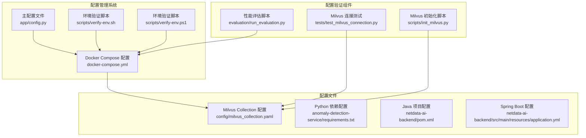
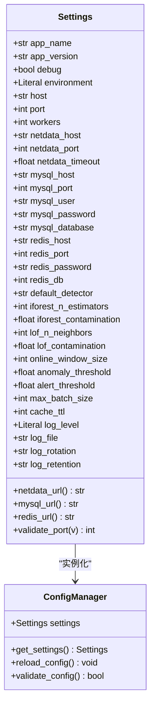
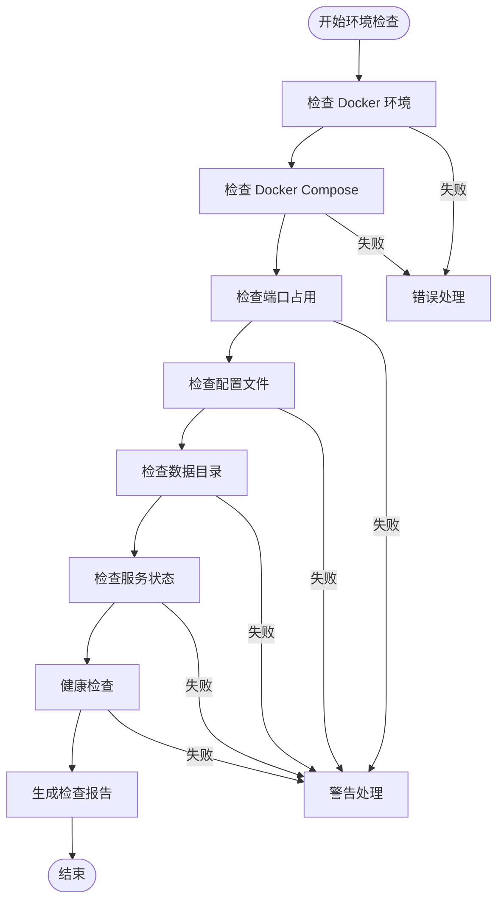
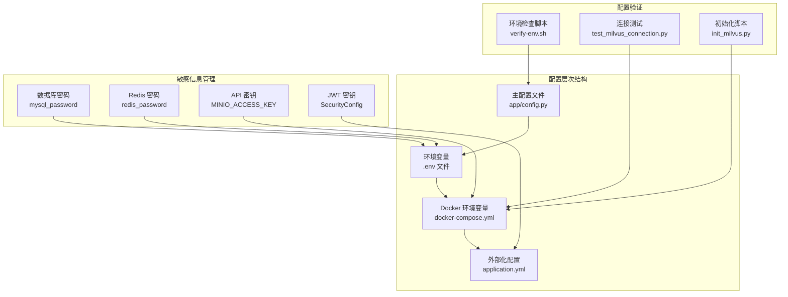
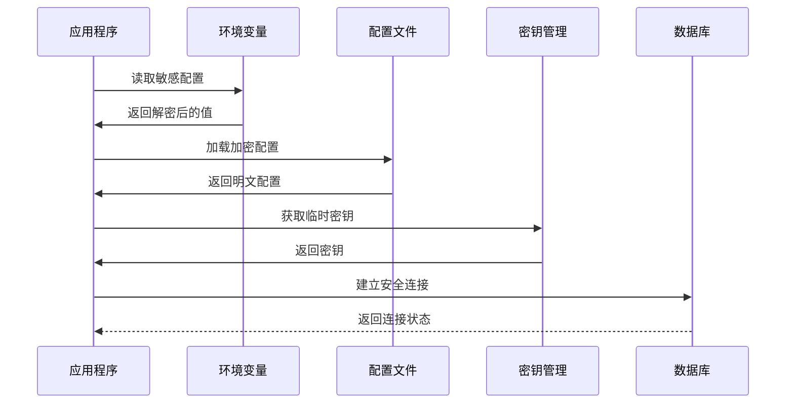
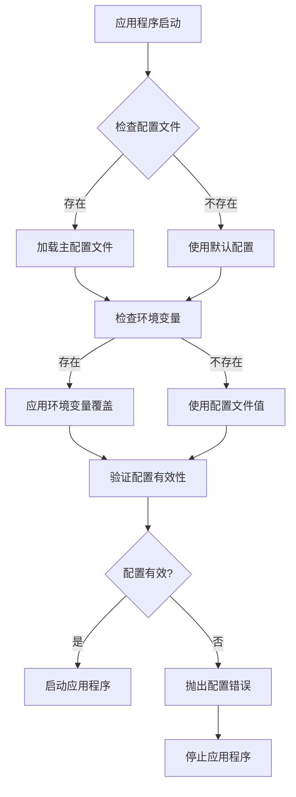
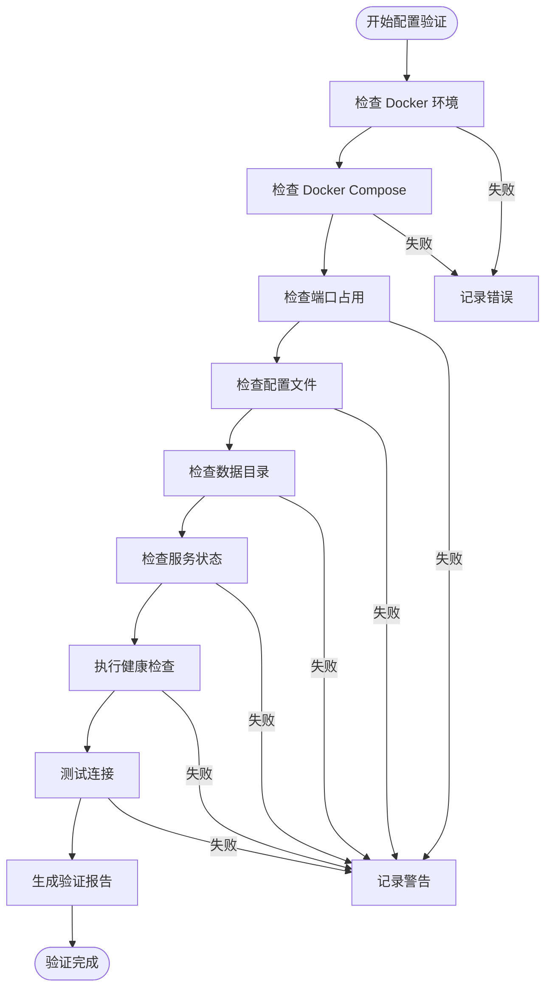
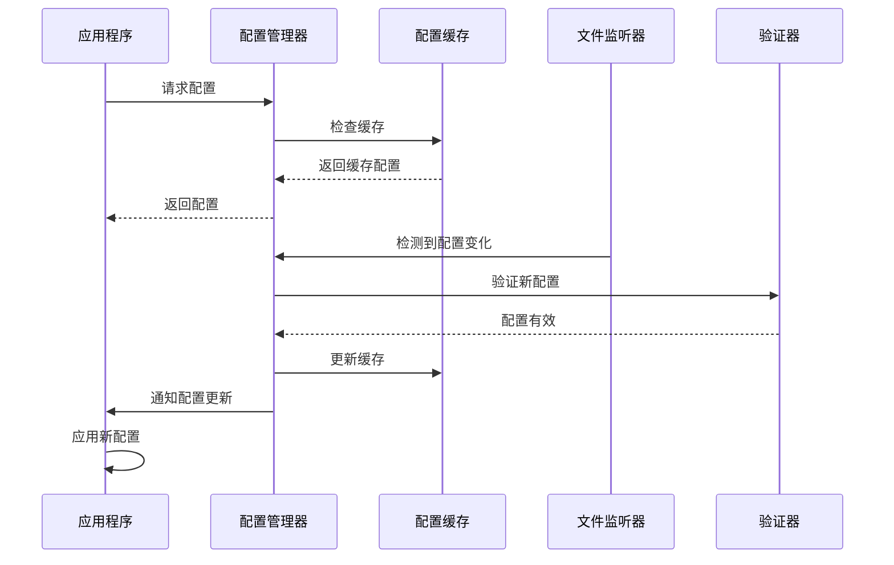
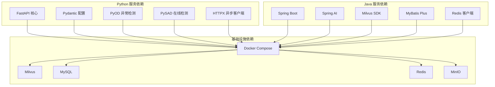

# 环境配置管理

<cite>
**本文档引用的文件**
- [anomaly-detection-service/app/config.py](file://anomaly-detection-service/app/config.py)
- [scripts/verify-env.sh](file://scripts/verify-env.sh)
- [scripts/verify-env.ps1](file://scripts/verify-env.ps1)
- [docker-compose.yml](file://docker-compose.yml)
- [config/milvus_collection.yaml](file://config/milvus_collection.yaml)
- [scripts/init_milvus.py](file://scripts/init_milvus.py)
- [tests/test_milvus_connection.py](file://tests/test_milvus_connection.py)
- [anomaly-detection-service/requirements.txt](file://anomaly-detection-service/requirements.txt)
- [netdata-ai-backend/pom.xml](file://netdata-ai-backend/pom.xml)
- [netdata-ai-backend/src/main/resources/application.yml](file://netdata-ai-backend/src/main/resources/application.yml)
- [anomaly-detection-service/pyproject.toml](file://anomaly-detection-service/pyproject.toml)
- [evaluation/run_evaluation.py](file://evaluation/run_evaluation.py)
</cite>

## 目录
1. [简介](#简介)
2. [项目结构](#项目结构)
3. [核心组件](#核心组件)
4. [架构概览](#架构概览)
5. [详细组件分析](#详细组件分析)
6. [依赖分析](#依赖分析)
7. [性能考虑](#性能考虑)
8. [故障排除指南](#故障排除指南)
9. [结论](#结论)
10. [附录](#附录)

## 简介

本指南提供了面向 NetData 监控数据的智能运维问答与执行系统的全面环境配置管理方案。该系统采用多层配置架构，支持开发、测试、生产等多环境部署，并提供了完整的配置验证、敏感信息管理和热更新机制。

系统的核心特点包括：
- **分层配置管理**：支持主配置文件、环境变量覆盖和外部化配置
- **多环境支持**：开发、测试、生产环境的差异化配置
- **安全配置**：敏感信息的安全存储和环境变量注入
- **配置验证**：完整的环境检查、依赖验证和配置正确性测试
- **热更新机制**：支持配置的动态更新和最佳实践

## 项目结构

系统采用模块化的项目结构，包含以下主要组件：



**图表来源**
- [anomaly-detection-service/app/config.py:1-183](file://anomaly-detection-service/app/config.py#L1-L183)
- [scripts/verify-env.sh:1-318](file://scripts/verify-env.sh#L1-L318)
- [docker-compose.yml:1-358](file://docker-compose.yml#L1-L358)

**章节来源**
- [anomaly-detection-service/app/config.py:1-183](file://anomaly-detection-service/app/config.py#L1-L183)
- [scripts/verify-env.sh:1-318](file://scripts/verify-env.sh#L1-L318)
- [docker-compose.yml:1-358](file://docker-compose.yml#L1-L358)

## 核心组件

### 配置管理类 (Settings)

系统的核心配置管理基于 Pydantic Settings，提供了类型安全的配置访问和环境变量覆盖机制。



**图表来源**
- [anomaly-detection-service/app/config.py:28-183](file://anomaly-detection-service/app/config.py#L28-L183)

### 环境验证系统

系统提供了完整的环境验证机制，支持 Linux 和 Windows 平台：



**图表来源**
- [scripts/verify-env.sh:63-286](file://scripts/verify-env.sh#L63-L286)
- [scripts/verify-env.ps1:34-227](file://scripts/verify-env.ps1#L34-L227)

**章节来源**
- [anomaly-detection-service/app/config.py:28-183](file://anomaly-detection-service/app/config.py#L28-L183)
- [scripts/verify-env.sh:1-318](file://scripts/verify-env.sh#L1-L318)
- [scripts/verify-env.ps1:1-251](file://scripts/verify-env.ps1#L1-L251)

## 架构概览

系统采用微服务架构，配置管理贯穿整个系统：



**图表来源**
- [anomaly-detection-service/app/config.py:42-47](file://anomaly-detection-service/app/config.py#L42-L47)
- [docker-compose.yml:167-176](file://docker-compose.yml#L167-L176)
- [netdata-ai-backend/src/main/resources/application.yml](file://netdata-ai-backend/src/main/resources/application.yml)

## 详细组件分析

### 多环境配置管理

系统支持三种环境的差异化配置：

#### 开发环境配置
开发环境采用宽松的配置策略，便于本地开发和测试：

| 配置项 | 开发环境值 | 测试环境值 | 生产环境值 |
|--------|------------|------------|------------|
| debug | True | False | False |
| log_level | DEBUG | INFO | WARNING |
| environment | development | staging | production |
| workers | 1 | 2 | 4 |
| cache_ttl | 300 | 1800 | 3600 |

#### 测试环境配置
测试环境平衡了性能和稳定性：

- **并发处理**：启用多进程处理
- **缓存策略**：适中的缓存时间
- **日志级别**：INFO 级别，便于问题追踪
- **数据库连接**：使用独立的测试数据库

#### 生产环境配置
生产环境注重稳定性和性能：

- **安全配置**：严格的权限控制
- **资源限制**：明确的内存和CPU限制
- **监控集成**：完整的健康检查和指标收集
- **日志管理**：结构化的日志输出

### 敏感信息安全管理

系统采用多层次的安全策略保护敏感信息：



**图表来源**
- [anomaly-detection-service/app/config.py:84-103](file://anomaly-detection-service/app/config.py#L84-L103)
- [docker-compose.yml:167-176](file://docker-compose.yml#L167-L176)

#### 数据库密码管理
- **MySQL 配置**：支持环境变量覆盖
- **Redis 配置**：独立的密码管理
- **凭据注入**：Docker 环境变量自动注入

#### API 密钥管理
- **MinIO 配置**：独立的访问密钥和密钥
- **环境隔离**：不同环境使用不同的密钥
- **轮换机制**：支持密钥定期轮换

#### JWT 密钥管理
- **密钥生成**：自动生成安全的密钥
- **密钥存储**：环境变量安全存储
- **密钥轮换**：支持密钥轮换和升级

### 配置文件层次结构

系统采用分层配置架构，支持灵活的配置管理：



**图表来源**
- [anomaly-detection-service/app/config.py:32-47](file://anomaly-detection-service/app/config.py#L32-L47)

#### 主配置文件 (app/config.py)
- **类型验证**：使用 Pydantic 进行类型检查
- **默认值**：提供合理的开发环境默认值
- **验证器**：端口范围等参数验证
- **属性方法**：动态生成连接字符串

#### 环境变量配置
- **文件加载**：支持 .env 文件自动加载
- **变量覆盖**：环境变量优先级最高
- **编码支持**：UTF-8 编码支持
- **大小写不敏感**：提高配置灵活性

#### 外部化配置
- **Docker 配置**：容器环境变量注入
- **Spring Boot 配置**：application.yml 外部化
- **动态配置**：支持运行时配置更新

### 配置验证脚本使用

系统提供了完整的配置验证机制：

#### 环境检查脚本 (verify-env.sh)
```bash
#!/bin/bash
# 环境检查脚本功能
# 1. Docker 环境检查
# 2. 端口占用检查  
# 3. 配置文件检查
# 4. 服务健康检查
# 5. 快速连接测试
```

#### 环境检查脚本 (verify-env.ps1)
```powershell
# PowerShell 环境检查脚本功能
# 1. Docker 环境检查
# 2. 端口占用检查
# 3. 配置文件检查
# 4. 服务健康检查
# 5. 快速连接测试
```

#### 配置验证流程



**图表来源**
- [scripts/verify-env.sh:63-318](file://scripts/verify-env.sh#L63-L318)
- [scripts/verify-env.ps1:34-251](file://scripts/verify-env.ps1#L34-L251)

**章节来源**
- [scripts/verify-env.sh:1-318](file://scripts/verify-env.sh#L1-L318)
- [scripts/verify-env.ps1:1-251](file://scripts/verify-env.ps1#L1-L251)

### 配置热更新实现方案

系统支持配置的动态更新和热重载：

#### 热更新机制设计



**图表来源**
- [anomaly-detection-service/app/config.py:167-178](file://anomaly-detection-service/app/config.py#L167-L178)

#### 最佳实践建议

1. **配置变更流程**
   - 使用版本控制系统管理配置文件
   - 实施配置变更审批流程
   - 建立配置回滚机制

2. **监控和告警**
   - 监控配置加载状态
   - 设置配置错误告警
   - 记录配置变更历史

3. **测试策略**
   - 配置变更前的回归测试
   - A/B 测试配置变更影响
   - 性能基准测试

**章节来源**
- [anomaly-detection-service/app/config.py:167-178](file://anomaly-detection-service/app/config.py#L167-L178)

## 依赖分析

系统依赖关系复杂，涉及多个技术栈：



**图表来源**
- [anomaly-detection-service/requirements.txt:17-94](file://anomaly-detection-service/requirements.txt#L17-L94)
- [netdata-ai-backend/pom.xml:41-238](file://netdata-ai-backend/pom.xml#L41-L238)

**章节来源**
- [anomaly-detection-service/requirements.txt:1-94](file://anomaly-detection-service/requirements.txt#L1-L94)
- [netdata-ai-backend/pom.xml:1-270](file://netdata-ai-backend/pom.xml#L1-L270)

## 性能考虑

配置管理对系统性能的影响：

### 配置加载性能
- **缓存策略**：使用 LRU 缓存减少重复加载
- **延迟加载**：按需加载配置项
- **批量验证**：一次性验证所有配置项

### 内存使用优化
- **配置大小限制**：避免过大的配置文件
- **增量更新**：支持部分配置更新
- **垃圾回收**：及时释放不再使用的配置对象

### 网络性能
- **配置同步**：分布式环境下的配置同步
- **缓存命中率**：优化配置缓存策略
- **并发访问**：支持高并发的配置访问

## 故障排除指南

### 常见配置问题

#### 环境变量加载失败
**症状**：应用程序无法读取环境变量
**解决方案**：
1. 检查 .env 文件格式和编码
2. 验证环境变量名称大小写
3. 确认 Docker 容器正确挂载 .env 文件

#### 端口冲突
**症状**：服务启动失败，显示端口已被占用
**解决方案**：
1. 使用环境检查脚本查找冲突端口
2. 修改 .env 文件中的端口配置
3. 关闭占用端口的其他服务

#### 数据库连接失败
**症状**：应用程序无法连接到数据库
**解决方案**：
1. 验证数据库服务状态
2. 检查连接字符串格式
3. 确认凭据正确性

### 配置验证工具

#### Milvus 连接测试
```python
# 测试 Milvus 连接
def test_milvus_connection():
    connections.connect(host="localhost", port=19530)
    version = utility.get_server_version()
    return version
```

#### 性能评估
```python
# 评估系统性能
async def evaluate_system_performance():
    evaluator = PerformanceEvaluator()
    metrics = await evaluator.evaluate_all()
    return metrics
```

**章节来源**
- [tests/test_milvus_connection.py:33-79](file://tests/test_milvus_connection.py#L33-L79)
- [evaluation/run_evaluation.py:133-252](file://evaluation/run_evaluation.py#L133-L252)

## 结论

本环境配置管理方案提供了完整的多环境支持、安全的敏感信息管理、可靠的配置验证机制和灵活的热更新能力。通过分层配置架构和严格的验证流程，确保了系统的稳定性和可维护性。

关键优势包括：
- **多环境一致性**：统一的配置管理策略
- **安全性保障**：多层次的敏感信息保护
- **自动化验证**：完整的环境检查和健康监控
- **灵活扩展**：支持配置的动态更新和热重载

建议在生产环境中实施以下最佳实践：
1. 建立完善的配置变更审批流程
2. 实施配置版本控制和备份策略
3. 建立配置监控和告警机制
4. 定期进行配置安全审计

## 附录

### 配置文件模板

#### .env 文件模板
```env
# 应用程序配置
APP_NAME=netdata-ops
DEBUG=True
ENVIRONMENT=development

# 数据库配置
MYSQL_HOST=localhost
MYSQL_PORT=3306
MYSQL_USER=ops_user
MYSQL_PASSWORD=your_secure_password
MYSQL_DATABASE=netdata_ops

# Redis 配置
REDIS_HOST=localhost
REDIS_PORT=6379
REDIS_PASSWORD=your_secure_redis_password
REDIS_DB=0

# Milvus 配置
MILVUS_HOST=localhost
MILVUS_PORT=19530
```

#### Docker Compose 环境变量
```yaml
environment:
  MYSQL_ROOT_PASSWORD: ${MYSQL_ROOT_PASSWORD:-root123456}
  MYSQL_USER: ${MYSQL_USER:-ops_user}
  MYSQL_PASSWORD: ${MYSQL_PASSWORD:-ops123456}
  MINIO_ACCESS_KEY: ${MINIO_ACCESS_KEY:-minioadmin}
  MINIO_SECRET_KEY: ${MINIO_SECRET_KEY:-minioadmin}
```

### 配置管理最佳实践

1. **配置分类管理**
   - 将配置分为基础配置、敏感配置和环境特定配置
   - 使用不同的存储介质管理不同类型配置

2. **版本控制策略**
   - 对配置文件实施版本控制
   - 建立配置变更历史记录
   - 支持配置回滚和恢复

3. **安全存储机制**
   - 使用加密存储敏感配置
   - 实施最小权限原则
   - 定期轮换密钥和凭据

4. **监控和审计**
   - 监控配置访问和变更
   - 实施配置完整性校验
   - 建立配置问题快速响应机制