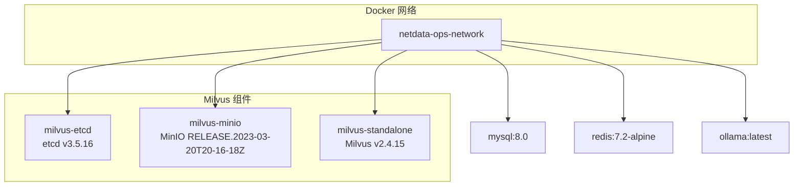
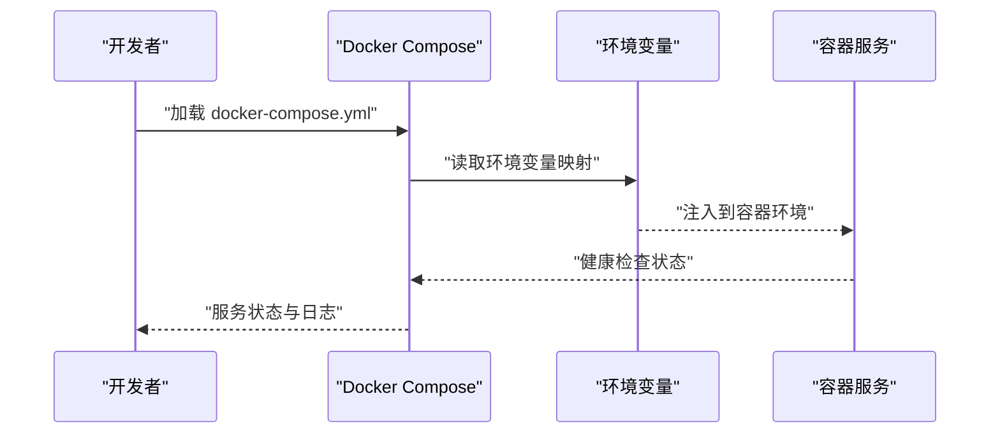
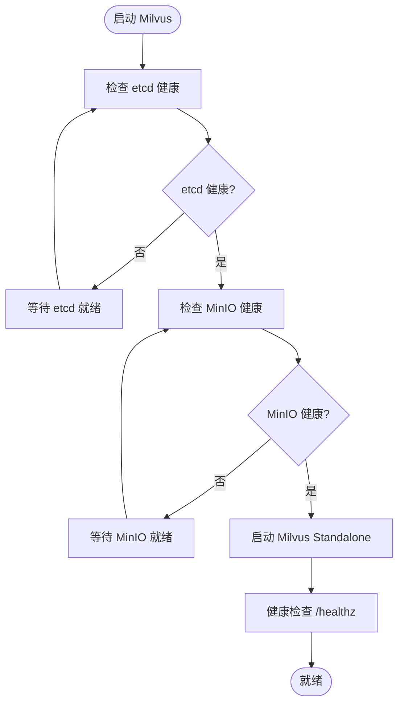
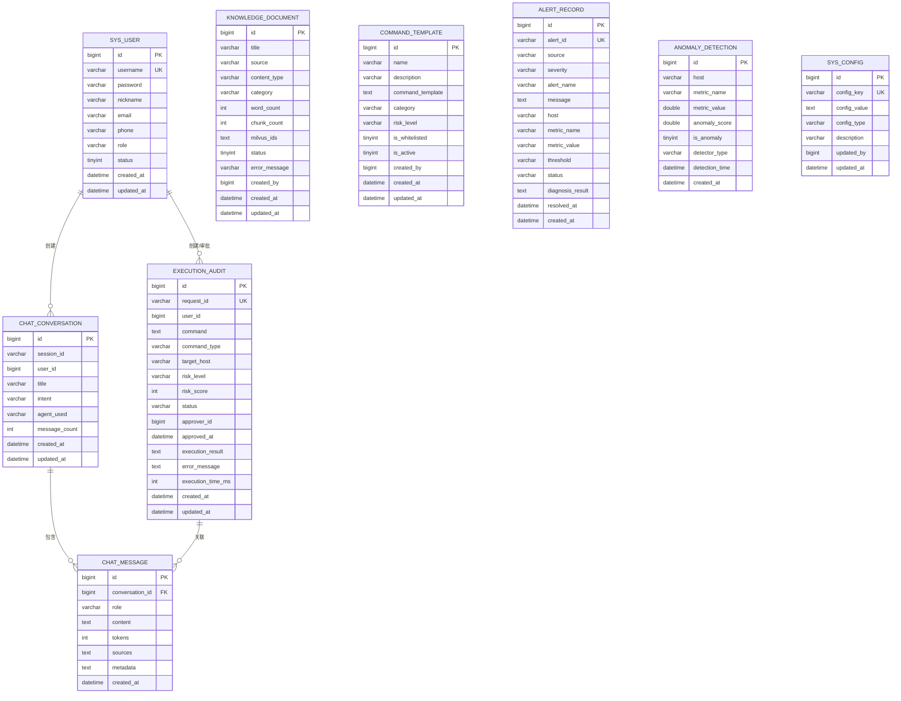
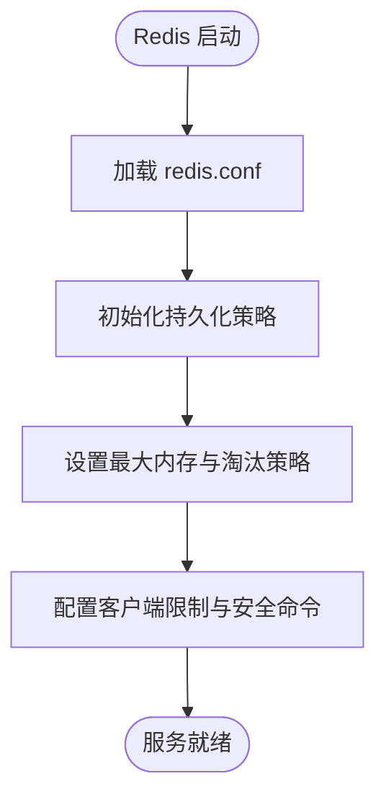
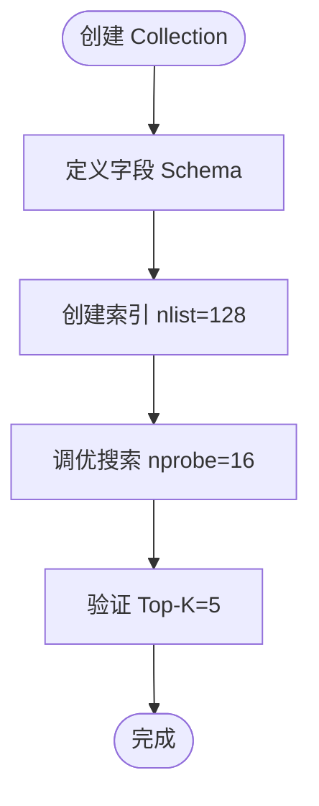
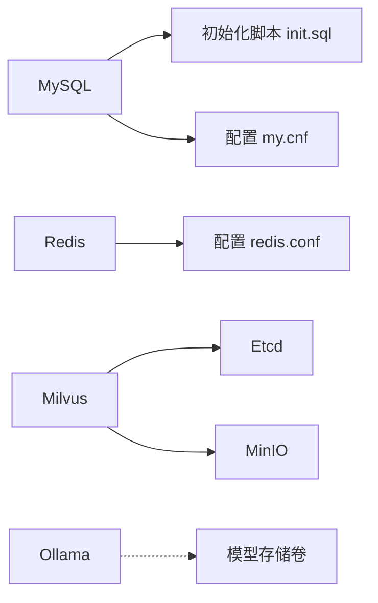
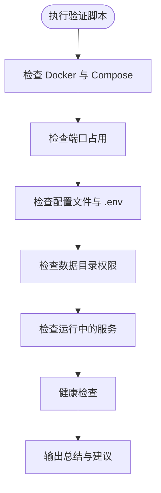

# 环境配置管理

<cite>
**本文档引用的文件**
- [docker-compose.yml](file://docker-compose.yml)
- [milvus_collection.yaml](file://config/milvus_collection.yaml)
- [redis.conf](file://config/redis/redis.conf)
- [my.cnf](file://config/mysql/my.cnf)
- [init.sql](file://sql/init.sql)
- [verify-env.sh](file://scripts/verify-env.sh)
- [verify-env.ps1](file://scripts/verify-env.ps1)
- [.gitignore](file://.gitignore)
- [shared-safety-constraints.md](file://docs/prompts/shared-safety-constraints.md)
</cite>

## 目录
1. [简介](#简介)
2. [项目结构](#项目结构)
3. [核心组件](#核心组件)
4. [架构总览](#架构总览)
5. [详细组件分析](#详细组件分析)
6. [依赖关系分析](#依赖关系分析)
7. [性能考虑](#性能考虑)
8. [故障排查指南](#故障排查指南)
9. [结论](#结论)
10. [附录](#附录)

## 简介
本文件系统性阐述智能运维系统的环境配置管理，覆盖 .env 文件的配置项与环境变量作用机制、各服务配置参数（数据库连接字符串、向量数据库配置、缓存设置等）、不同部署场景下的配置模板与最佳实践、配置加载顺序与优先级规则、配置验证与错误处理机制、配置变更的热更新与重启策略，以及生产环境的安全配置要求（密码管理、SSL 证书等）。文档同时提供可视化图表与实用的排障建议，帮助开发者与运维人员快速搭建与维护系统。

## 项目结构
系统采用 Docker Compose 编排多服务架构，核心服务包括：
- Milvus 向量数据库（Etcd + MinIO + Standalone）
- MySQL 关系数据库
- Redis 缓存
- Ollama 本地推理服务
- 可选 Neo4j 知识图谱服务

**图表来源**
- [docker-compose.yml:23-154](file://docker-compose.yml#L23-L154)
- [docker-compose.yml:163-207](file://docker-compose.yml#L163-L207)
- [docker-compose.yml:218-245](file://docker-compose.yml#L218-L245)
- [docker-compose.yml:258-289](file://docker-compose.yml#L258-L289)

**章节来源**
- [docker-compose.yml:1-357](file://docker-compose.yml#L1-L357)

## 核心组件
本节概述各服务的关键配置参数及其作用。

- Milvus 向量数据库
  - Etcd：集群健康检查、自动压缩、配额设置
  - MinIO：对象存储后端，S3 API 与 Console 管理端口
  - Milvus Standalone：gRPC 端口、Metrics 端口、日志级别、索引配置
- MySQL 关系数据库
  - 根密码、业务用户、数据库名、时区、字符集、认证插件
  - 连接数、缓冲区、InnoDB 参数、慢查询日志、二进制日志
- Redis 缓存
  - AOF + RDB 持久化、LFU 内存淘汰策略、客户端连接限制、慢查询日志
- Ollama 本地推理
  - 模型存储目录、GPU 支持（可选）

**章节来源**
- [docker-compose.yml:32-154](file://docker-compose.yml#L32-L154)
- [docker-compose.yml:163-207](file://docker-compose.yml#L163-L207)
- [docker-compose.yml:218-245](file://docker-compose.yml#L218-L245)
- [docker-compose.yml:258-289](file://docker-compose.yml#L258-L289)

## 架构总览
系统通过 Docker Compose 将各服务编排在同一网络中，服务间通过容器名互访；环境变量通过 Compose 的环境映射传递给容器，实现集中配置与灵活覆盖。

**图表来源**
- [docker-compose.yml:32-154](file://docker-compose.yml#L32-L154)
- [docker-compose.yml:163-207](file://docker-compose.yml#L163-L207)
- [docker-compose.yml:218-245](file://docker-compose.yml#L218-L245)
- [docker-compose.yml:258-289](file://docker-compose.yml#L258-L289)

## 详细组件分析

### Milvus 向量数据库配置
- Etcd
  - 自动压缩模式与保留版本、后端配额、快照数量
  - 健康检查：etcdctl endpoint health
- MinIO
  - 访问密钥与秘密密钥（建议在 .env 中配置）
  - S3 API 端口 9000、Console 端口 9001
  - 健康检查：curl /minio/health/live
- Milvus Standalone
  - gRPC 端口 19530、Metrics 端口 9091
  - 索引压缩开关、日志级别、优雅关闭等待时间
  - 依赖 etcd 与 minio 健康后启动

**图表来源**
- [docker-compose.yml:132-144](file://docker-compose.yml#L132-L144)

**章节来源**
- [docker-compose.yml:32-154](file://docker-compose.yml#L32-L154)

### MySQL 关系数据库配置
- 环境变量映射
  - ROOT 密码、数据库名、业务用户与密码
  - 时区 Asia/Shanghai
- 连接与字符集
  - 默认认证插件 mysql_native_password，utf8mb4 字符集与排序规则
- 性能与安全
  - 最大连接数、缓冲区参数、InnoDB 日志刷新策略
  - 慢查询日志、二进制日志（可选）
  - 禁用 LOCAL INFILE 降低风险

**图表来源**
- [init.sql:26-41](file://sql/init.sql#L26-L41)
- [init.sql:51-70](file://sql/init.sql#L51-L70)
- [init.sql:75-109](file://sql/init.sql#L75-L109)
- [init.sql:114-138](file://sql/init.sql#L114-L138)
- [init.sql:143-159](file://sql/init.sql#L143-L159)
- [init.sql:175-196](file://sql/init.sql#L175-L196)
- [init.sql:201-217](file://sql/init.sql#L201-L217)
- [init.sql:222-233](file://sql/init.sql#L222-L233)

**章节来源**
- [docker-compose.yml:163-207](file://docker-compose.yml#L163-L207)
- [my.cnf:15-176](file://config/mysql/my.cnf#L15-L176)
- [init.sql:1-274](file://sql/init.sql#L1-L274)

### Redis 缓存配置
- 持久化策略
  - RDB 自动保存策略、AOF everysec 同步、混合持久化
- 内存管理
  - 最大内存 256MB（开发环境），LFU 淘汰策略
- 安全与限制
  - 客户端连接上限、慢查询阈值、危险命令重命名
- Docker 运行
  - 守护进程关闭、日志输出至标准输出

**图表来源**
- [redis.conf:84-104](file://config/redis/redis.conf#L84-L104)
- [redis.conf:125-135](file://config/redis/redis.conf#L125-L135)
- [redis.conf:158-174](file://config/redis/redis.conf#L158-L174)
- [redis.conf:189-202](file://config/redis/redis.conf#L189-L202)

**章节来源**
- [docker-compose.yml:218-245](file://docker-compose.yml#L218-L245)
- [redis.conf:1-282](file://config/redis/redis.conf#L1-L282)

### Milvus Collection 配置
- Collection 基础
  - 名称、描述、分片数、动态字段开关
- 向量与索引
  - 维度 1024（BGE-M3）、相似度度量 COSINE
  - 索引类型 IVF_FLAT，nlist 128
- 搜索与字段
  - nprobe 16、Top-K 5、输出字段 content/source/title/chunk_index
  - 主键、内容、向量、来源、标题、片段索引、时间戳
- 性能估算与参数建议
  - 记录大小、索引大小、nlist/nprobe 选择建议

**图表来源**
- [milvus_collection.yaml:22-140](file://config/milvus_collection.yaml#L22-L140)
- [milvus_collection.yaml:70-93](file://config/milvus_collection.yaml#L70-L93)

**章节来源**
- [milvus_collection.yaml:1-186](file://config/milvus_collection.yaml#L1-L186)

### 环境变量与 .env 文件
- .env 文件作用
  - 作为环境变量的集中来源，通过 Compose 的环境映射注入容器
  - 在脚本中被验证脚本检查存在性与必要性
- 关键变量（示例）
  - MySQL：MYSQL_ROOT_PASSWORD、MYSQL_DATABASE、MYSQL_USER、MYSQL_PASSWORD、MYSQL_PORT
  - Redis：REDIS_PORT、REDIS_PASSWORD、REDIS_DATA_PATH
  - Milvus：MILVUS_GRPC_PORT、MILVUS_METRICS_PORT、MILVUS_DATA_PATH
  - MinIO：MINIO_ACCESS_KEY、MINIO_SECRET_KEY
  - Ollama：OLLAMA_PORT、OLLAMA_DATA_PATH
- 加载顺序与优先级
  - Docker 环境变量优先级：Compose 的 environment > .env 文件 > 默认值
  - 建议：在 .env 中设置敏感信息，在 Compose 中覆盖端口与路径

**章节来源**
- [docker-compose.yml:32-154](file://docker-compose.yml#L32-L154)
- [docker-compose.yml:163-207](file://docker-compose.yml#L163-L207)
- [docker-compose.yml:218-245](file://docker-compose.yml#L218-L245)
- [docker-compose.yml:258-289](file://docker-compose.yml#L258-L289)
- [verify-env.sh:179-185](file://scripts/verify-env.sh#L179-L185)
- [verify-env.ps1:135-139](file://scripts/verify-env.ps1#L135-L139)

## 依赖关系分析
- 服务依赖
  - Milvus Standalone 依赖 etcd 与 minio 健康
  - MySQL 依赖初始化脚本与配置文件
  - Redis 依赖持久化配置与安全策略
- 网络与卷
  - 自定义桥接网络隔离服务
  - 命名卷或绑定挂载的数据目录

**图表来源**
- [docker-compose.yml:139-144](file://docker-compose.yml#L139-L144)
- [docker-compose.yml:184-186](file://docker-compose.yml#L184-L186)
- [docker-compose.yml:228-228](file://docker-compose.yml#L228-L228)
- [docker-compose.yml:273-273](file://docker-compose.yml#L273-L273)

**章节来源**
- [docker-compose.yml:139-144](file://docker-compose.yml#L139-L144)
- [docker-compose.yml:184-186](file://docker-compose.yml#L184-L186)
- [docker-compose.yml:228-228](file://docker-compose.yml#L228-L228)
- [docker-compose.yml:273-273](file://docker-compose.yml#L273-L273)

## 性能考虑
- MySQL
  - InnoDB 缓冲池大小、日志刷新策略、慢查询日志与二进制日志
  - 连接数与缓冲区参数需根据并发与数据规模调整
- Redis
  - AOF everysec + RDB 自动保存平衡数据安全与性能
  - LFU 淘汰策略适合缓存场景，样本数量与衰减因子可调
- Milvus
  - nlist 与 nprobe 的权衡：数据量越大，nlist 应越大；nprobe 控制精度与速度
  - 索引类型选择：IVF_FLAT 平衡精度与内存占用
- Ollama
  - GPU 支持可选，模型存储目录需充足磁盘空间

**章节来源**
- [my.cnf:75-111](file://config/mysql/my.cnf#L75-L111)
- [redis.conf:125-152](file://config/redis/redis.conf#L125-L152)
- [milvus_collection.yaml:54-68](file://config/milvus_collection.yaml#L54-L68)
- [milvus_collection.yaml:175-183](file://config/milvus_collection.yaml#L175-L183)

## 故障排查指南
- 环境验证脚本
  - Bash：检查 Docker、Docker Compose、端口占用、配置文件、数据目录、服务健康状态
  - PowerShell：同上，适用于 Windows 环境
- 常见问题
  - 端口被占用：修改 .env 中对应端口变量
  - .env 不存在：复制 .env.example 并填写敏感信息
  - 服务不健康：查看容器健康检查状态与日志
- 安全与合规
  - 禁止提交 .env 等敏感文件
  - 密码与密钥通过环境变量注入，避免硬编码

**图表来源**
- [verify-env.sh:66-286](file://scripts/verify-env.sh#L66-L286)
- [verify-env.ps1:37-227](file://scripts/verify-env.ps1#L37-L227)

**章节来源**
- [verify-env.sh:1-318](file://scripts/verify-env.sh#L1-L318)
- [verify-env.ps1:1-251](file://scripts/verify-env.ps1#L1-L251)
- [.gitignore:10-14](file://.gitignore#L10-L14)

## 结论
本文件提供了从环境变量到各服务配置的全链路说明，并结合验证脚本与安全约束，形成可落地的配置管理实践。建议在开发与生产环境中遵循统一的配置模板与安全策略，定期验证与优化性能参数，确保系统稳定、安全、可维护。

## 附录

### 配置模板与最佳实践
- 开发环境
  - MySQL：max_connections 100，innodb_buffer_pool_size 256M
  - Redis：maxmemory 256MB，maxmemory-policy allkeys-lfu
  - Milvus：nlist 32-64，nprobe = nlist/8
  - Ollama：启用 GPU 支持（若硬件具备）
- 生产环境
  - MySQL：innodb_flush_log_at_trx_commit=1，开启二进制日志与慢查询日志
  - Redis：AOF everysec，持久化策略与内存淘汰策略需结合业务峰值
  - Milvus：根据数据规模调整 nlist 与 nprobe，考虑 HNSW 或 GPU_IVF_FLAT
  - Ollama：模型存储目录容量规划与备份策略

### 配置验证与错误处理
- 验证脚本提供端口、文件、目录、服务健康度检查
- 建议在 CI/CD 中集成验证步骤，失败时阻断发布

### 配置变更的热更新与重启策略
- 热更新
  - Redis：部分配置可 reload（如 AOF 策略、慢查询阈值）
  - MySQL：部分参数需重启生效，建议在维护窗口执行
- 重启策略
  - Milvus：依赖 etcd 与 minio 健康后再启动
  - MySQL/Redis：优先重启缓存，再重启应用服务
  - Ollama：模型加载较慢，建议单独重启并观察日志

### 生产环境安全配置要求
- 密码管理
  - 所有服务密码通过环境变量注入，禁止硬编码
  - .env 文件加入 .gitignore，禁止提交到版本库
- SSL 证书配置
  - 如需 HTTPS，建议在反向代理层统一管理证书与 TLS 终止
- 审计与日志
  - 启用慢查询日志、审计日志与操作日志
  - 日志脱敏，避免敏感信息泄露

**章节来源**
- [.gitignore:10-14](file://.gitignore#L10-L14)
- [shared-safety-constraints.md:130-168](file://docs/prompts/shared-safety-constraints.md#L130-L168)
- [shared-safety-constraints.md:262-292](file://docs/prompts/shared-safety-constraints.md#L262-L292)