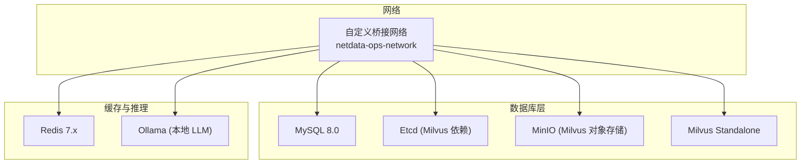
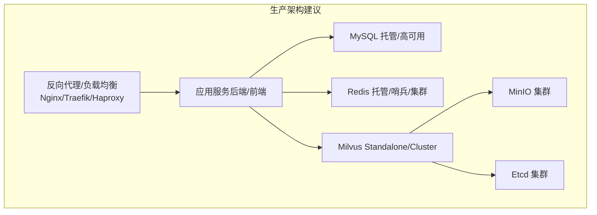
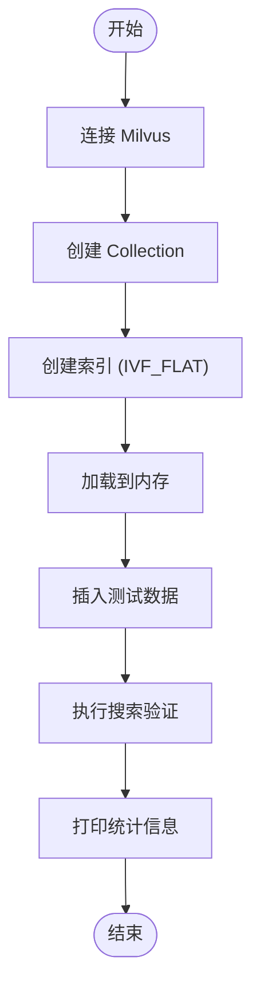
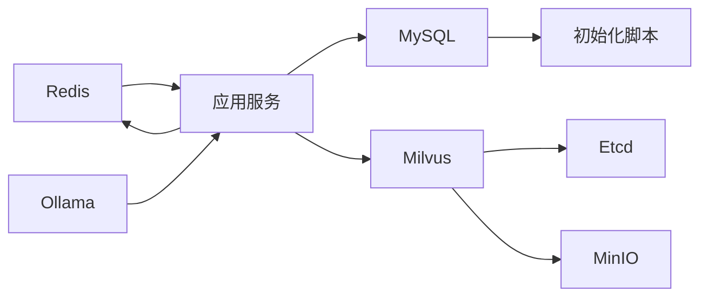

# 生产环境部署

<cite>
**本文引用的文件**
- [docker-compose.yml](file://docker-compose.yml)
- [milvus_collection.yaml](file://config/milvus_collection.yaml)
- [init_milvus.py](file://scripts/init_milvus.py)
- [init.sql](file://sql/init.sql)
- [verify-env.sh](file://scripts/verify-env.sh)
- [verify-env.ps1](file://scripts/verify-env.ps1)
- [test_milvus_connection.py](file://tests/test_milvus_connection.py)
- [PROJECT_CONTEXT.md](file://PROJECT_CONTEXT.md)
- [config.py](file://anomaly-detection-service/app/config.py)
- [Dockerfile](file://anomaly-detection-service/Dockerfile)
</cite>

## 目录
1. [简介](#简介)
2. [项目结构](#项目结构)
3. [核心组件](#核心组件)
4. [架构总览](#架构总览)
5. [详细组件分析](#详细组件分析)
6. [依赖分析](#依赖分析)
7. [性能考虑](#性能考虑)
8. [故障排查指南](#故障排查指南)
9. [结论](#结论)
10. [附录](#附录)

## 简介
本指南面向“面向 NetData 监控数据的智能运维问答与执行系统”的生产环境部署，涵盖硬件与系统依赖、部署架构设计（含高可用、负载均衡与故障转移）、安全加固、性能调优、容量规划与扩缩容、版本发布与滚动更新、维护窗口与应急响应等内容。文档基于仓库中的 Docker Compose 编排、Milvus 配置、MySQL 初始化脚本、环境验证脚本与异常检测服务配置等材料整理而成。

## 项目结构
系统采用多服务容器编排，核心依赖包括：
- Milvus 向量数据库（Standalone 模式，支持无缝迁移到 Cluster）
- MySQL 关系数据库
- Redis 缓存
- Ollama 本地推理（开发调试备用）
- 可选：Neo4j 知识图谱（进阶功能）

图表来源
- [docker-compose.yml:23-357](file://docker-compose.yml#L23-L357)

章节来源
- [docker-compose.yml:1-357](file://docker-compose.yml#L1-L357)
- [PROJECT_CONTEXT.md:120-149](file://PROJECT_CONTEXT.md#L120-L149)

## 核心组件
- Milvus 向量数据库：Standalone 模式，使用 etcd 与 MinIO 作为协调与对象存储后端；支持健康检查与资源限制。
- MySQL：8.0，挂载初始化 SQL，设置字符集与认证插件，提供关系型数据持久化。
- Redis：7.x，启用 AOF 持久化，提供会话、RAG 结果缓存、分布式锁与告警去重。
- Ollama：本地 LLM 推理服务，作为 DeepSeek API 的备用方案。
- 可选 Neo4j：知识图谱（进阶功能，初期可注释掉）。

章节来源
- [docker-compose.yml:23-323](file://docker-compose.yml#L23-L323)
- [PROJECT_CONTEXT.md:25-40](file://PROJECT_CONTEXT.md#L25-L40)

## 架构总览
生产环境推荐采用“单机 Standalone + 外部对象存储与协调服务”的过渡架构，后续平滑迁移到 Milvus Cluster（分片与副本）。MySQL 与 Redis 建议独立部署或托管服务，以提升可靠性与扩展性。

图表来源
- [docker-compose.yml:23-154](file://docker-compose.yml#L23-L154)
- [docker-compose.yml:163-208](file://docker-compose.yml#L163-L208)
- [docker-compose.yml:218-246](file://docker-compose.yml#L218-L246)

## 详细组件分析

### Milvus 集成与索引配置
- Collection 名称与字段结构、向量维度、相似度度量、索引类型与参数、搜索参数与输出字段均在 YAML 中集中定义。
- 初始化脚本负责连接、创建 Collection、创建索引、加载到内存、插入测试数据与搜索验证。
- 建议在生产环境根据数据规模调整 nlist 与 nprobe，并启用数据压缩与合适的分片数。

图表来源
- [init_milvus.py:457-516](file://scripts/init_milvus.py#L457-L516)
- [milvus_collection.yaml:22-101](file://config/milvus_collection.yaml#L22-L101)

章节来源
- [milvus_collection.yaml:1-186](file://config/milvus_collection.yaml#L1-L186)
- [init_milvus.py:1-516](file://scripts/init_milvus.py#L1-L516)

### MySQL 初始化与表结构
- 初始化脚本创建用户、知识库文档、对话历史、命令执行审计、命令模板、告警记录、异常检测结果、系统配置等表，并建立必要索引与视图。
- 建议在生产环境使用只读业务账号、开启二进制日志与备份策略、设置连接池参数与慢查询日志。

章节来源
- [init.sql:1-274](file://sql/init.sql#L1-L274)

### Redis 缓存配置
- 使用 Alpine 镜像，启用 AOF 持久化，挂载数据目录，暴露端口，健康检查。
- 建议在生产环境启用 RDB 快照与 AOF 混合持久化、设置淘汰策略、开启密码认证、使用 Redis 集群或哨兵。

章节来源
- [docker-compose.yml:218-246](file://docker-compose.yml#L218-L246)

### Ollama 本地推理
- 本地 LLM 服务，作为 DeepSeek API 的备用方案；可选 GPU 支持。
- 生产环境建议使用 API 服务（如 DeepSeek-V3），Ollama 用于离线或隐私场景。

章节来源
- [docker-compose.yml:258-290](file://docker-compose.yml#L258-L290)

### 环境验证与健康检查
- Bash 与 PowerShell 双版本环境验证脚本，检查 Docker、端口占用、配置文件、数据目录、服务健康状态与快速连接测试。
- Milvus 健康检查端点与 gRPC 连接测试脚本，便于快速定位问题。

章节来源
- [verify-env.sh:1-318](file://scripts/verify-env.sh#L1-L318)
- [verify-env.ps1:1-251](file://scripts/verify-env.ps1#L1-L251)
- [test_milvus_connection.py:1-148](file://tests/test_milvus_connection.py#L1-L148)

### 异常检测服务（Python 微服务）
- 使用 Pydantic Settings 管理配置，支持环境变量覆盖；Gunicorn + Uvicorn Worker 生产部署；健康检查端点。
- 建议与 MySQL/Redis 配置分离，独立扩缩容与监控。

章节来源
- [config.py:1-182](file://anomaly-detection-service/app/config.py#L1-L182)
- [Dockerfile:47-94](file://anomaly-detection-service/Dockerfile#L47-L94)

## 依赖分析
- 容器编排依赖：Milvus Standalone 依赖 etcd 与 MinIO；MySQL 与 Redis 独立运行；Ollama 可选。
- 网络依赖：自定义桥接网络，服务间通过容器名互访。
- 存储依赖：各服务挂载数据目录，建议生产环境使用命名卷或持久化存储。

图表来源
- [docker-compose.yml:23-323](file://docker-compose.yml#L23-L323)

章节来源
- [docker-compose.yml:332-357](file://docker-compose.yml#L332-L357)

## 性能考虑

### 硬件与系统依赖
- Docker 环境：建议分配至少 8GB 内存，Milvus 为内存密集型服务。
- 操作系统：Linux/Windows/macOS 上均可，Windows 需注意路径分隔符与权限。
- 端口预留：MySQL、Redis、Milvus gRPC/Metrics、Ollama、MinIO API/Console。

章节来源
- [verify-env.sh:109-121](file://scripts/verify-env.sh#L109-L121)
- [docker-compose.yml:178-179](file://docker-compose.yml#L178-L179)
- [docker-compose.yml:222-223](file://docker-compose.yml#L222-L223)
- [docker-compose.yml:124-128](file://docker-compose.yml#L124-L128)
- [docker-compose.yml:269-270](file://docker-compose.yml#L269-L270)
- [docker-compose.yml:74-78](file://docker-compose.yml#L74-L78)

### 数据库连接池与缓存策略
- MySQL：建议使用连接池（如 HikariCP），设置合理的连接数、空闲超时与超时时间；开启只读账号与 SSL。
- Redis：启用 AOF/RDB 混合持久化，设置淘汰策略（如 allkeys-lru），开启密码认证；使用集群或哨兵提高可用性。

章节来源
- [init.sql:220-244](file://sql/init.sql#L220-L244)
- [docker-compose.yml:218-246](file://docker-compose.yml#L218-L246)

### 向量检索性能优化
- 索引类型：根据数据规模选择 IVF_FLAT、IVF_PQ 或 HNSW；nlist 与 nprobe 需权衡精度与性能。
- 内存与分片：Standalone 模式下通过分片与内存估算指导容量规划；Cluster 模式下可横向扩展。
- 搜索参数：Top-K、输出字段与相似度阈值需结合业务调优。

章节来源
- [milvus_collection.yaml:54-101](file://config/milvus_collection.yaml#L54-L101)
- [milvus_collection.yaml:164-185](file://config/milvus_collection.yaml#L164-L185)

### 容量规划与扩缩容
- Milvus：按每条记录约 4.5KB 估算，结合 nlist 与索引类型计算内存占用；数据量大时考虑 Cluster 与 GPU 加速。
- MySQL/Redis：按 QPS 与数据量评估，预留 20%-30% 缓冲；使用只读副本与分片。
- 扩缩容：优先水平扩展应用层，再扩展数据库与缓存；注意缓存一致性与数据迁移。

章节来源
- [milvus_collection.yaml:167-184](file://config/milvus_collection.yaml#L167-L184)
- [docker-compose.yml:147-154](file://docker-compose.yml#L147-L154)

## 故障排查指南
- 环境检查：使用 Bash/PowerShell 脚本检查 Docker、端口占用、配置文件与数据目录，查看服务健康状态。
- Milvus 连接：使用 gRPC 连接测试与健康检查端点；若失败，查看容器日志与端口映射。
- 健康检查：Milvus、MySQL、Redis、Ollama 均配置健康检查，异常时查看状态与日志。

章节来源
- [verify-env.sh:235-261](file://scripts/verify-env.sh#L235-L261)
- [verify-env.ps1:178-197](file://scripts/verify-env.ps1#L178-L197)
- [test_milvus_connection.py:81-116](file://tests/test_milvus_connection.py#L81-L116)
- [docker-compose.yml:47-54](file://docker-compose.yml#L47-L54)
- [docker-compose.yml:193-199](file://docker-compose.yml#L193-L199)
- [docker-compose.yml:231-237](file://docker-compose.yml#L231-L237)
- [docker-compose.yml:274-280](file://docker-compose.yml#L274-L280)

## 结论
本指南基于现有编排与配置，给出了生产环境部署的实施路径与优化建议。建议在生产中采用独立的 MySQL/Redis、Milvus Cluster、MinIO 集群与 Etcd 集群，并配套完善的监控、备份与安全策略，以满足高可用、高性能与可扩展性的需求。

## 附录

### 部署步骤摘要
- 准备环境：安装 Docker 与 Compose，分配足够内存，检查端口占用。
- 配置文件：复制并修改 .env，准备 MySQL/Redis 配置文件。
- 启动服务：docker-compose up -d，等待健康检查通过。
- 初始化 Milvus：运行初始化脚本创建 Collection、索引与测试数据。
- 验证连接：使用连接测试脚本验证各组件连通性。

章节来源
- [verify-env.sh:68-98](file://scripts/verify-env.sh#L68-L98)
- [verify-env.ps1:39-72](file://scripts/verify-env.ps1#L39-L72)
- [docker-compose.yml:17-21](file://docker-compose.yml#L17-L21)
- [init_milvus.py:457-516](file://scripts/init_milvus.py#L457-L516)
- [test_milvus_connection.py:118-144](file://tests/test_milvus_connection.py#L118-L144)