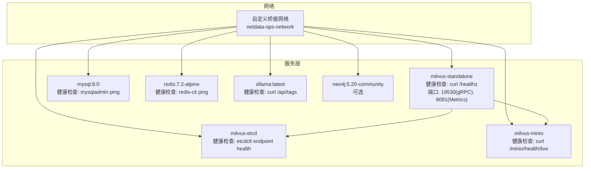
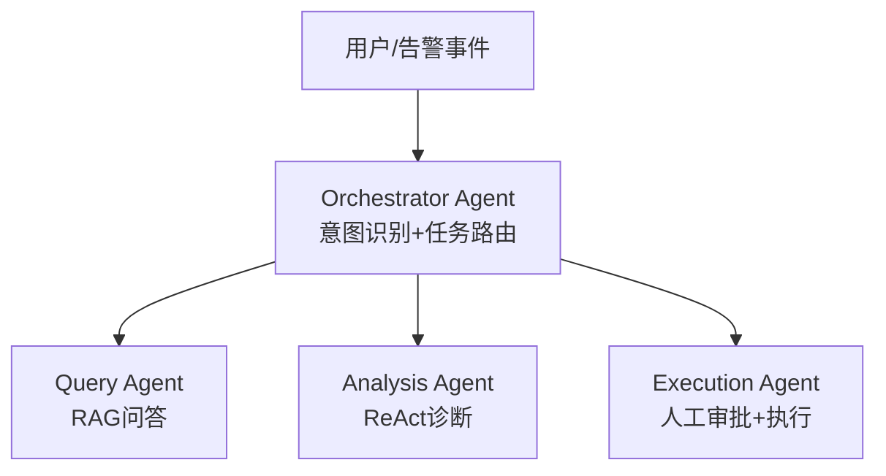
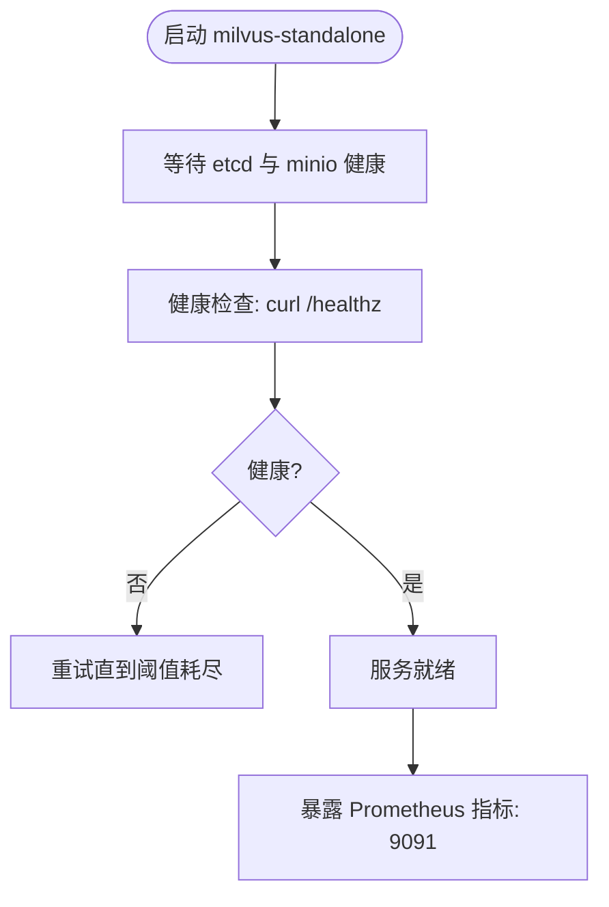
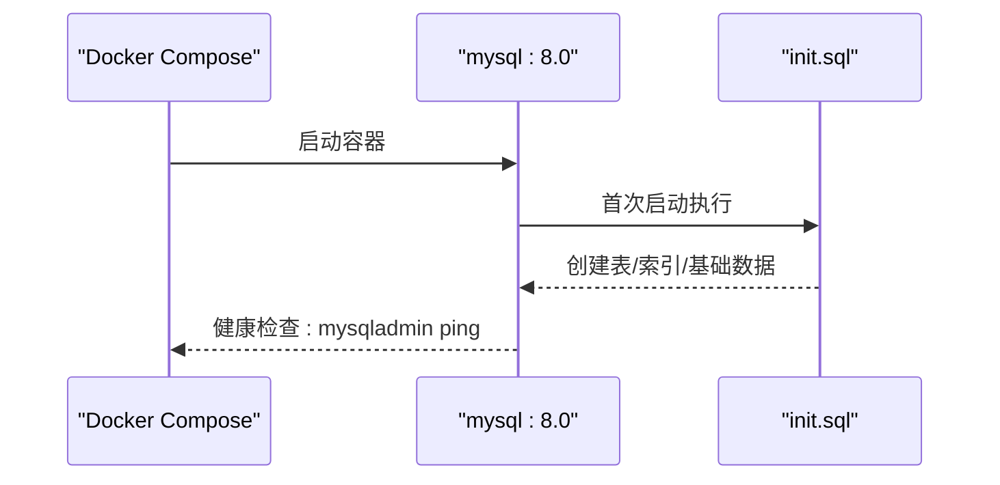
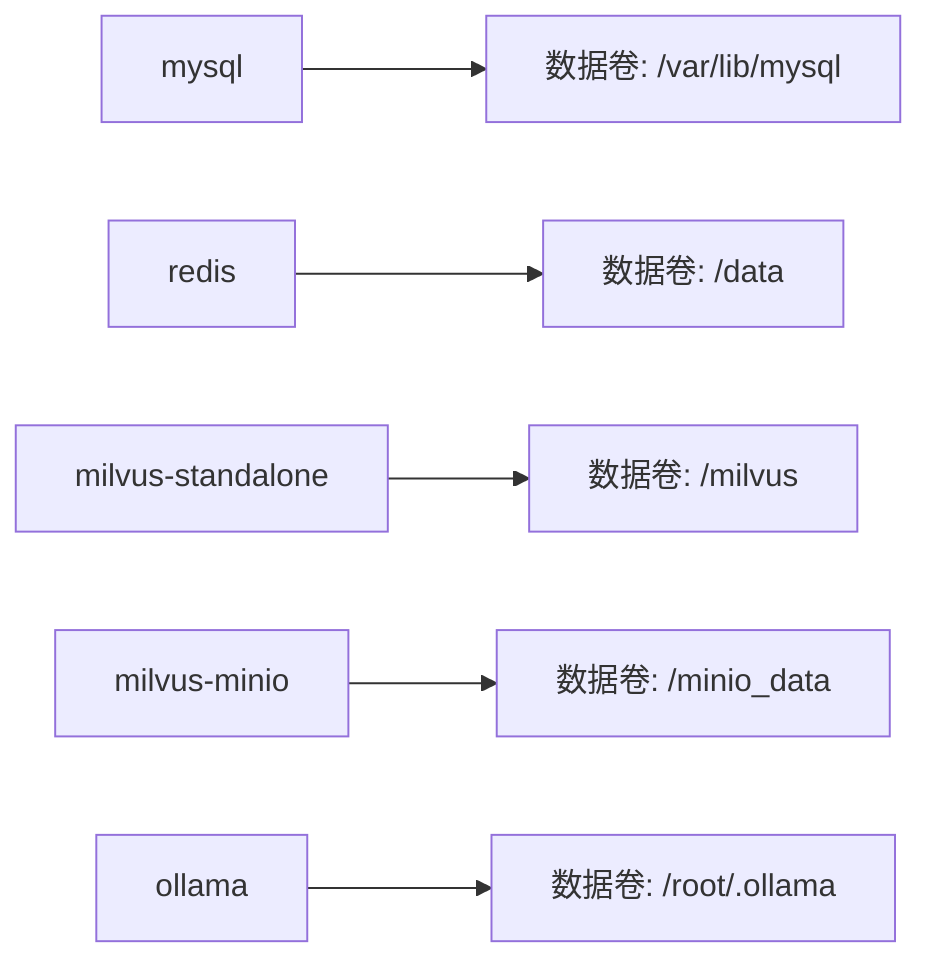
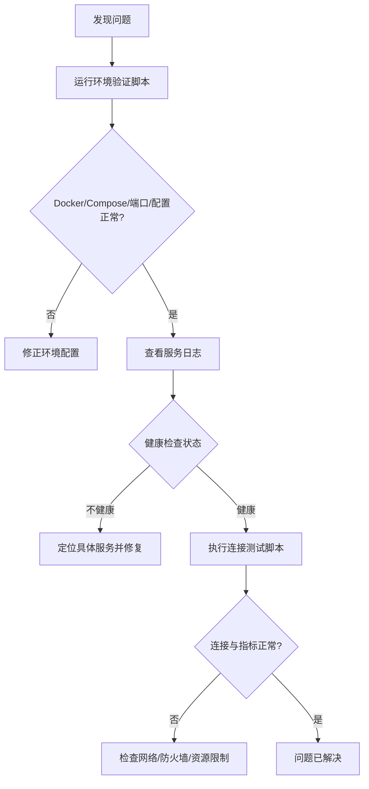

# 监控与运维

<cite>
**本文引用的文件**
- [docker-compose.yml](file://docker-compose.yml)
- [PROJECT_CONTEXT.md](file://PROJECT_CONTEXT.md)
- [milvus_collection.yaml](file://config/milvus_collection.yaml)
- [init_milvus.py](file://scripts/init_milvus.py)
- [init.sql](file://sql/init.sql)
- [verify-env.sh](file://scripts/verify-env.sh)
- [verify-env.ps1](file://scripts/verify-env.ps1)
- [test_milvus_connection.py](file://tests/test_milvus_connection.py)
</cite>

## 目录
1. [简介](#简介)
2. [项目结构](#项目结构)
3. [核心组件](#核心组件)
4. [架构总览](#架构总览)
5. [详细组件分析](#详细组件分析)
6. [依赖分析](#依赖分析)
7. [性能考虑](#性能考虑)
8. [故障排查指南](#故障排查指南)
9. [结论](#结论)
10. [附录](#附录)

## 简介
本文件面向“面向 NetData 监控数据的智能运维问答与执行系统”，提供一套完整的监控与运维文档，覆盖以下主题：
- 各服务的健康检查机制与监控指标采集
- 容器资源使用监控策略（CPU、内存、磁盘空间）与告警设置
- 系统性能监控最佳实践（数据库、向量检索、推理服务）
- 日志管理策略（容器日志收集、应用日志聚合、日志轮转）
- 故障排查标准流程与常用命令
- 备份恢复策略与灾难恢复预案
- 运维自动化工具集成与使用方法

## 项目结构
系统采用 Docker Compose 编排，核心服务包括 Milvus 向量数据库、MySQL 关系数据库、Redis 缓存、Ollama 推理服务，以及可选的 Neo4j 知识图谱。Compose 文件定义了服务间的依赖关系、健康检查、资源限制与网络配置。

图表来源
- [docker-compose.yml:23-357](file://docker-compose.yml#L23-L357)

章节来源
- [docker-compose.yml:1-357](file://docker-compose.yml#L1-L357)

## 核心组件
- Milvus 向量数据库（Standalone 模式）：提供向量检索能力，支持 Prometheus 指标端口与健康检查端点。
- MySQL 关系数据库：存储用户、对话、命令执行审计、告警记录等结构化数据。
- Redis 缓存：会话、RAG 结果缓存、分布式锁与实时告警去重。
- Ollama 推理服务：本地 LLM 推理，作为 DeepSeek API 的备用方案。
- Neo4j（可选）：知识图谱，支持 Graph RAG 与实体关系建模。

章节来源
- [docker-compose.yml:23-357](file://docker-compose.yml#L23-L357)
- [PROJECT_CONTEXT.md:25-40](file://PROJECT_CONTEXT.md#L25-L40)

## 架构总览
系统采用 Orchestrator-Subagent 模式，结合 NetData 监控数据，实现自然语言问答、智能故障诊断与人工参与的命令执行闭环。

图表来源
- [PROJECT_CONTEXT.md:43-61](file://PROJECT_CONTEXT.md#L43-L61)

## 详细组件分析

### Milvus 向量数据库
- 健康检查：通过健康检查端点 /healthz 进行探测，间隔与超时在 Compose 中配置。
- 指标采集：启用 9091 端口暴露 Prometheus 指标，便于外部监控系统抓取。
- 资源限制：为 etcd、minio、milvus 分配内存上限与预留，避免资源争抢。
- 依赖关系：依赖 etcd 与 minio，需等待其健康后再启动 Milvus。
- 配置文件：milvus_collection.yaml 定义集合结构、索引与搜索参数，指导初始化脚本与检索性能。

图表来源
- [docker-compose.yml:99-154](file://docker-compose.yml#L99-L154)
- [milvus_collection.yaml:1-186](file://config/milvus_collection.yaml#L1-L186)

章节来源
- [docker-compose.yml:99-154](file://docker-compose.yml#L99-L154)
- [milvus_collection.yaml:1-186](file://config/milvus_collection.yaml#L1-L186)
- [init_milvus.py:106-319](file://scripts/init_milvus.py#L106-L319)

### MySQL 关系数据库
- 健康检查：使用 mysqladmin ping 进行探测，适用于容器内本地连接。
- 初始化：首次启动自动执行 init.sql，创建表结构、索引与基础数据。
- 配置挂载：支持挂载 my.cnf 进行参数定制。
- 数据持久化：挂载 /var/lib/mysql 目录，确保数据安全。

图表来源
- [docker-compose.yml:163-208](file://docker-compose.yml#L163-L208)
- [init.sql:1-274](file://sql/init.sql#L1-L274)

章节来源
- [docker-compose.yml:163-208](file://docker-compose.yml#L163-L208)
- [init.sql:22-170](file://sql/init.sql#L22-L170)

### Redis 缓存
- 健康检查：通过 redis-cli ping 进行探测。
- 配置挂载：支持挂载 redis.conf，启用 AOF 持久化。
- 数据持久化：挂载 /data 目录，确保 RDB/AOF 文件持久化。

章节来源
- [docker-compose.yml:218-246](file://docker-compose.yml#L218-L246)

### Ollama 推理服务
- 健康检查：通过 /api/tags 接口探测服务可用性。
- GPU 支持：注释中提供 NVIDIA 设备直通示例，可根据硬件环境启用。
- 资源限制：为 CPU/GPU 密集型服务分配较高内存上限与预留。

章节来源
- [docker-compose.yml:258-290](file://docker-compose.yml#L258-L290)

### Neo4j（可选）
- 功能：知识图谱可视化与 Graph RAG。
- 配置：可启用 APOC 插件，设置堆内存与页面缓存大小。
- 部署：初期可注释掉，开发完成后启用。

章节来源
- [docker-compose.yml:291-323](file://docker-compose.yml#L291-L323)

## 依赖分析
- 服务依赖：milvus-standalone 依赖 milvus-etcd 与 milvus-minio，需等待其健康后再启动。
- 网络隔离：所有服务位于自定义桥接网络，便于服务间通过容器名互访。
- 卷与持久化：MySQL、Redis、Milvus、Ollama 的数据目录均挂载至宿主机或使用命名卷，便于备份与迁移。
- 资源约束：各服务设置内存上限与预留，避免资源争用导致性能抖动。

图表来源
- [docker-compose.yml:44-82](file://docker-compose.yml#L44-L82)
- [docker-compose.yml:129-131](file://docker-compose.yml#L129-L131)
- [docker-compose.yml:182-186](file://docker-compose.yml#L182-L186)
- [docker-compose.yml:226-228](file://docker-compose.yml#L226-L228)
- [docker-compose.yml:273-273](file://docker-compose.yml#L273-L273)

章节来源
- [docker-compose.yml:23-357](file://docker-compose.yml#L23-L357)

## 性能考虑
- Milvus 索引与检索
  - 索引类型：根据数据规模选择 IVF_FLAT、HNSW 或 GPU 加速方案。
  - 参数调优：nlist 与 nprobe 的权衡，依据数据量与延迟要求调整。
  - 集合结构：向量维度固定为 1024（BGE-M3），创建后不可更改。
- 数据库性能
  - 索引设计：init.sql 中为高频查询列建立索引，如 idx_status、idx_risk_level、idx_created_at。
  - 查询优化：避免 SELECT *，仅返回必要字段；使用分页与 LIMIT。
  - 连接池：建议在应用侧配置连接池，减少连接开销。
- 推理服务性能
  - Ollama：GPU 直通可显著提升推理速度；若无 GPU，需适当降低并发与批大小。
  - LLM 切换：通过配置文件切换 DeepSeek API 与 Ollama，避免在代码中硬编码。
- 资源监控与告警
  - CPU/内存：利用 Docker 资源限制与容器指标，结合告警规则触发通知。
  - 磁盘空间：监控 /var/lib/mysql、/data、/milvus、/minio_data、/root/.ollama 等挂载点。

章节来源
- [milvus_collection.yaml:52-101](file://config/milvus_collection.yaml#L52-L101)
- [init.sql:38-138](file://sql/init.sql#L38-L138)
- [docker-compose.yml:57-62](file://docker-compose.yml#L57-L62)
- [docker-compose.yml:93-98](file://docker-compose.yml#L93-L98)
- [docker-compose.yml:148-153](file://docker-compose.yml#L148-L153)
- [docker-compose.yml:284-289](file://docker-compose.yml#L284-L289)

## 故障排查指南
- 环境验证
  - 使用 verify-env.sh/verify-env.ps1 检查 Docker、Compose、端口占用、配置文件与数据目录。
  - 若健康检查失败，查看对应服务日志：docker-compose logs <service>。
- 连接测试
  - Milvus：使用 test_milvus_connection.py 验证 gRPC 连接与健康检查端点。
  - MySQL/Redis/Ollama：使用 compose 中提供的快速连接命令进行验证。
- 常用命令
  - 启动/停止：docker-compose up -d / down
  - 查看状态：docker-compose ps
  - 查看日志：docker-compose logs -f <service>
  - 进入容器：docker exec -it <container> bash

图表来源
- [verify-env.sh:64-286](file://scripts/verify-env.sh#L64-L286)
- [verify-env.ps1:35-227](file://scripts/verify-env.ps1#L35-L227)
- [test_milvus_connection.py:33-116](file://tests/test_milvus_connection.py#L33-L116)

章节来源
- [verify-env.sh:64-318](file://scripts/verify-env.sh#L64-L318)
- [verify-env.ps1:35-251](file://scripts/verify-env.ps1#L35-L251)
- [test_milvus_connection.py:33-148](file://tests/test_milvus_connection.py#L33-L148)

## 结论
本监控与运维文档基于现有 Compose 配置与脚本，提供了健康检查、指标采集、资源监控、性能调优、日志管理、故障排查与自动化工具的实践指南。建议在生产环境中进一步引入 Prometheus/Grafana、日志聚合平台与自动化巡检脚本，持续完善告警策略与备份恢复流程。

## 附录

### 健康检查与指标端点一览
- etcd：etcdctl endpoint health
- MinIO：/minio/health/live
- Milvus：/healthz（9091 端口暴露 Prometheus 指标）
- MySQL：mysqladmin ping
- Redis：redis-cli ping
- Ollama：/api/tags

章节来源
- [docker-compose.yml:47-53](file://docker-compose.yml#L47-L53)
- [docker-compose.yml:83-89](file://docker-compose.yml#L83-L89)
- [docker-compose.yml:132-138](file://docker-compose.yml#L132-L138)
- [docker-compose.yml:193-199](file://docker-compose.yml#L193-L199)
- [docker-compose.yml:231-237](file://docker-compose.yml#L231-L237)
- [docker-compose.yml:274-280](file://docker-compose.yml#L274-L280)

### 日志管理策略
- 容器日志收集：Docker 默认将容器 stdout/stderr 写入 JSON 文件，建议配合日志驱动与集中化收集。
- 应用日志聚合：建议引入日志聚合平台，统一收集 MySQL、Redis、Milvus、Ollama 的日志。
- 日志轮转：为 MySQL、Redis、Milvus、Ollama 配置日志轮转策略，避免磁盘占满。

章节来源
- [docker-compose.yml:182-186](file://docker-compose.yml#L182-L186)
- [docker-compose.yml:226-228](file://docker-compose.yml#L226-L228)
- [docker-compose.yml:129-131](file://docker-compose.yml#L129-L131)
- [docker-compose.yml:79-81](file://docker-compose.yml#L79-L81)

### 备份恢复与灾难恢复
- 备份范围：MySQL 数据库、Redis 数据、Milvus 元数据与向量数据、MinIO 对象存储、Ollama 模型。
- 备份方式：定期打包挂载卷目录或使用数据库导出工具；对象存储建议启用版本控制。
- 恢复流程：停止服务 → 恢复数据 → 启动服务 → 健康检查与指标验证。
- 灾难恢复：准备热备/冷备方案，明确 RTO/RPO 指标与演练周期。

章节来源
- [docker-compose.yml:44-46](file://docker-compose.yml#L44-L46)
- [docker-compose.yml:79-81](file://docker-compose.yml#L79-L81)
- [docker-compose.yml:129-131](file://docker-compose.yml#L129-L131)
- [docker-compose.yml:226-228](file://docker-compose.yml#L226-L228)
- [docker-compose.yml:273-273](file://docker-compose.yml#L273-L273)

### 运维自动化工具集成
- 环境验证：verify-env.sh/verify-env.ps1 提供一键检查与健康状态展示。
- Milvus 初始化：init_milvus.py 提供集合创建、索引构建、加载与测试搜索的自动化流程。
- 健康检查：Compose 内置健康检查与启动顺序依赖，保障服务稳定启动。
- 监控集成：Milvus 指标端口与健康检查端点便于 Prometheus 抓取与告警。

章节来源
- [verify-env.sh:64-286](file://scripts/verify-env.sh#L64-L286)
- [verify-env.ps1:35-227](file://scripts/verify-env.ps1#L35-L227)
- [init_milvus.py:457-512](file://scripts/init_milvus.py#L457-L512)
- [docker-compose.yml:139-144](file://docker-compose.yml#L139-L144)
- [docker-compose.yml:127-128](file://docker-compose.yml#L127-L128)