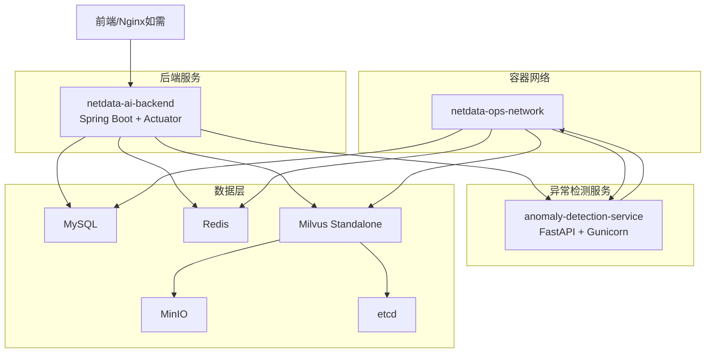
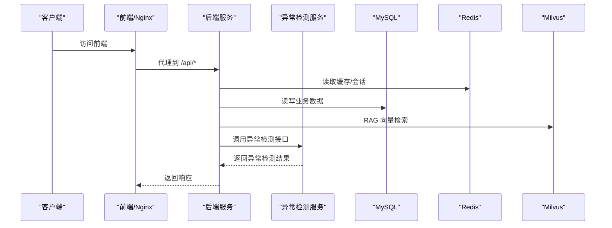
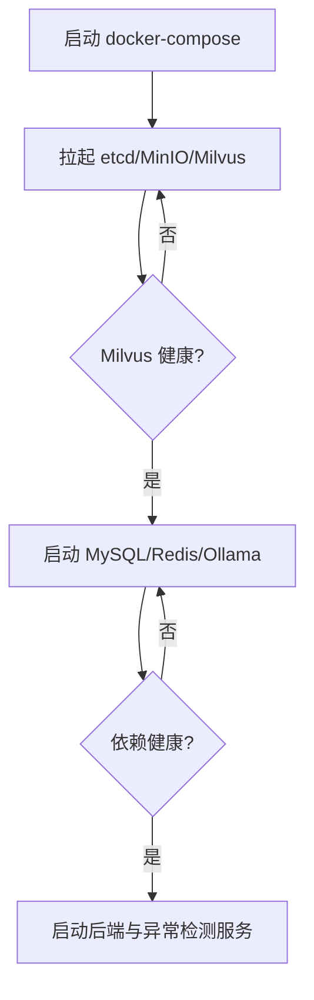
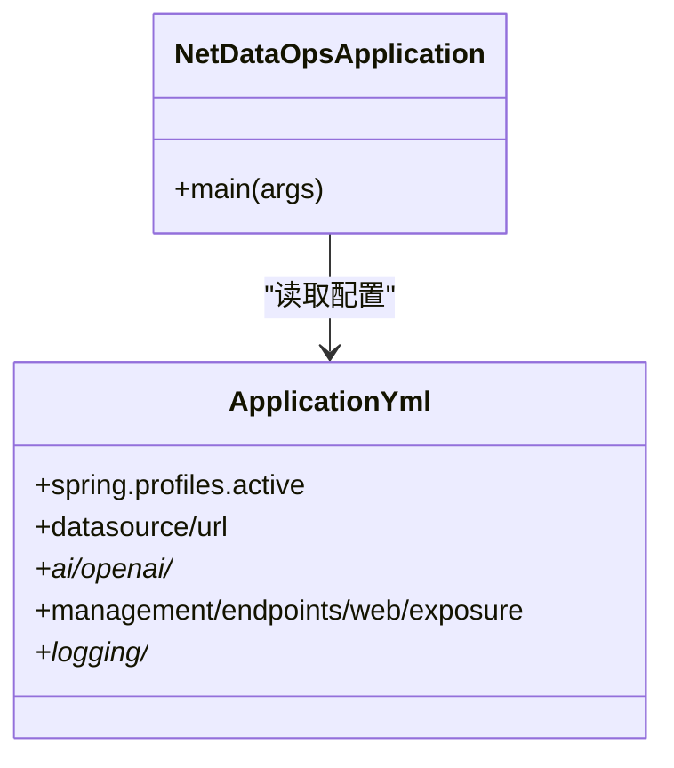
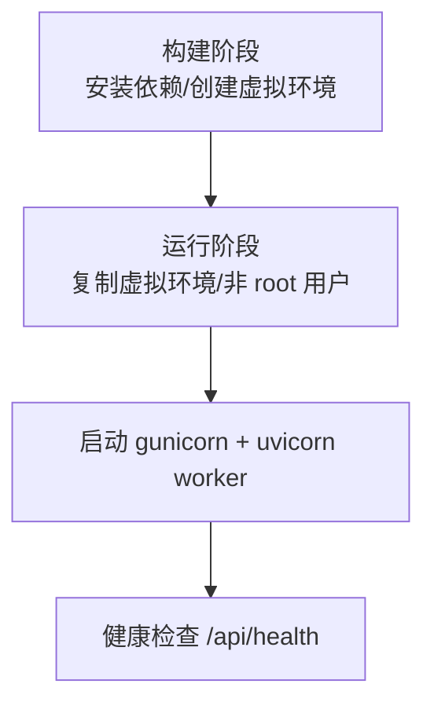
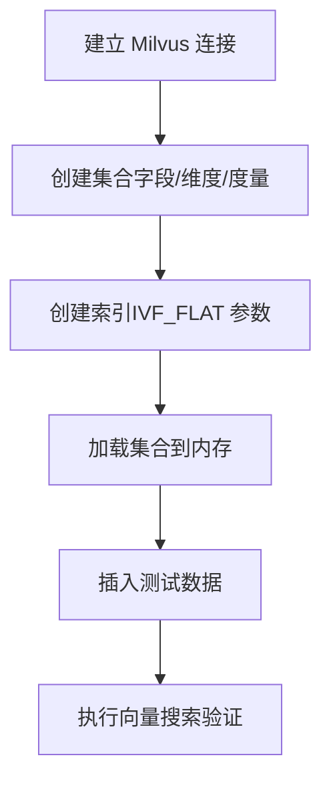
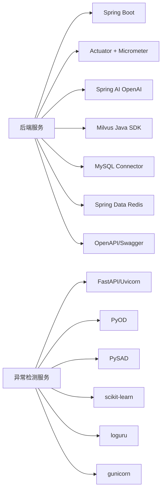

# 部署与运维

<cite>
**本文引用的文件**
- [docker-compose.yml](file://docker-compose.yml)
- [Dockerfile（异常检测服务）](file://anomaly-detection-service/Dockerfile)
- [requirements.txt（异常检测服务）](file://anomaly-detection-service/requirements.txt)
- [application.yml（后端配置）](file://netdata-ai-backend/src/main/resources/application.yml)
- [pom.xml（后端工程）](file://netdata-ai-backend/pom.xml)
- [deployment_guide.md（部署指南）](file://docs/deployment_guide.md)
- [verify-env.sh（环境验证脚本）](file://scripts/verify-env.sh)
- [milvus_collection.yaml（Milvus集合配置）](file://config/milvus_collection.yaml)
- [init_milvus.py（Milvus初始化脚本）](file://scripts/init_milvus.py)
- [init.sql（MySQL初始化脚本）](file://sql/init.sql)
- [NetDataOpsApplication.java（后端入口）](file://netdata-ai-backend/src/main/java/com/netdata/ops/NetDataOpsApplication.java)
</cite>

## 目录
1. [简介](#简介)
2. [项目结构](#项目结构)
3. [核心组件](#核心组件)
4. [架构总览](#架构总览)
5. [详细组件分析](#详细组件分析)
6. [依赖分析](#依赖分析)
7. [性能考虑](#性能考虑)
8. [故障排除指南](#故障排除指南)
9. [结论](#结论)
10. [附录](#附录)

## 简介
本指南面向系统部署与运维团队，提供从容器化部署、环境配置管理、性能监控、日志管理、故障排除、备份恢复到运维自动化与监控仪表板的全流程操作说明。文档基于仓库中的 Docker Compose 编排、后端与异常检测服务的配置、MySQL 初始化脚本、Milvus 集合配置与初始化脚本等关键文件整理而成。

## 项目结构
系统采用多服务容器化架构，核心服务包括：
- 后端服务（Spring Boot + Spring AI + Micrometer + Actuator）
- 异常检测服务（FastAPI + PyOD/PySAD + Gunicorn）
- 数据库（MySQL）
- 缓存（Redis）
- 向量数据库（Milvus Standalone + MinIO + etcd）
- 本地推理（Ollama，开发环境）

图表来源
- [docker-compose.yml:23-358](file://docker-compose.yml#L23-L358)
- [application.yml:14-314](file://netdata-ai-backend/src/main/resources/application.yml#L14-L314)

章节来源
- [docker-compose.yml:1-358](file://docker-compose.yml#L1-L358)
- [deployment_guide.md:398-563](file://docs/deployment_guide.md#L398-L563)

## 核心组件
- 后端服务（Spring Boot）
  - 使用 Actuator 暴露健康检查与指标，集成 Micrometer + Prometheus。
  - 通过 OpenAPI/Swagger 提供接口文档。
  - 配置 Profile 区分 dev/prod，敏感信息来自环境变量。
- 异常检测服务（FastAPI）
  - 使用 gunicorn + uvicorn worker，健康检查通过 /api/health。
  - 依赖 PyOD/PySAD 等算法库，日志使用 loguru。
- 数据库与缓存
  - MySQL：初始化脚本创建表结构与基础数据；Redis：AOF 持久化。
- 向量数据库（Milvus）
  - Standalone 模式，MinIO 作为对象存储后端，etcd 作为 KV 存储。
  - 提供 Metrics 端口用于 Prometheus 抓取。
- 本地推理（Ollama）
  - 开发环境使用本地模型，生产环境使用 DeepSeek API。

章节来源
- [application.yml:14-314](file://netdata-ai-backend/src/main/resources/application.yml#L14-L314)
- [Dockerfile（异常检测服务）:1-95](file://anomaly-detection-service/Dockerfile#L1-L95)
- [requirements.txt（异常检测服务）:1-94](file://anomaly-detection-service/requirements.txt#L1-L94)
- [docker-compose.yml:23-358](file://docker-compose.yml#L23-L358)
- [init.sql:1-274](file://sql/init.sql#L1-L274)
- [milvus_collection.yaml:1-186](file://config/milvus_collection.yaml#L1-L186)

## 架构总览
系统采用“容器编排 + 微服务”的架构，服务间通过自定义桥接网络通信，数据持久化通过命名卷或绑定挂载实现。后端服务负责对外 API、RAG、命令执行与审计、告警管理等；异常检测服务负责对 NetData 指标进行异常检测并与后端联动。

图表来源
- [docker-compose.yml:23-358](file://docker-compose.yml#L23-L358)
- [application.yml:14-314](file://netdata-ai-backend/src/main/resources/application.yml#L14-L314)

## 详细组件分析

### Docker 容器化与编排
- 编排文件定义了服务间的依赖关系与健康检查，确保 etcd、MinIO、Milvus 在后端启动前就绪。
- 端口映射与资源限制明确，便于在开发与生产环境间切换。
- 网络使用自定义桥接网络，便于服务间通过容器名互访。

图表来源
- [docker-compose.yml:140-146](file://docker-compose.yml#L140-L146)
- [docker-compose.yml:47-53](file://docker-compose.yml#L47-L53)
- [docker-compose.yml:83-89](file://docker-compose.yml#L83-L89)
- [docker-compose.yml:134-139](file://docker-compose.yml#L134-L139)

章节来源
- [docker-compose.yml:1-358](file://docker-compose.yml#L1-L358)

### 后端服务（Spring Boot）配置与运行
- 配置文件通过 Profile 切换开发/生产环境，敏感信息从环境变量注入。
- Actuator 暴露健康、指标、Prometheus 端点，Resilience4j 指标集成。
- LLM 配置支持 DeepSeek API 与 Ollama 本地模型双通道降级。

图表来源
- [NetDataOpsApplication.java:1-36](file://netdata-ai-backend/src/main/java/com/netdata/ops/NetDataOpsApplication.java#L1-L36)
- [application.yml:14-314](file://netdata-ai-backend/src/main/resources/application.yml#L14-L314)

章节来源
- [application.yml:14-314](file://netdata-ai-backend/src/main/resources/application.yml#L14-L314)
- [pom.xml:1-270](file://netdata-ai-backend/pom.xml#L1-L270)
- [NetDataOpsApplication.java:1-36](file://netdata-ai-backend/src/main/java/com/netdata/ops/NetDataOpsApplication.java#L1-L36)

### 异常检测服务（FastAPI）容器化
- 使用多阶段构建，分离构建与运行时环境，最终以非 root 用户运行。
- 健康检查通过 /api/health，生产使用 gunicorn + uvicorn worker。
- 依赖 PyOD/PySAD，日志使用 loguru。

图表来源
- [Dockerfile（异常检测服务）:40-95](file://anomaly-detection-service/Dockerfile#L40-L95)
- [requirements.txt（异常检测服务）:1-94](file://anomaly-detection-service/requirements.txt#L1-L94)

章节来源
- [Dockerfile（异常检测服务）:1-95](file://anomaly-detection-service/Dockerfile#L1-L95)
- [requirements.txt（异常检测服务）:1-94](file://anomaly-detection-service/requirements.txt#L1-L94)

### 数据库与缓存
- MySQL 初始化脚本创建用户、知识库、对话、审计、告警、异常检测、系统配置等表，并提供视图与默认数据。
- Redis 使用 AOF 持久化，配置文件挂载，支持会话、缓存与分布式锁等场景。

章节来源
- [init.sql:1-274](file://sql/init.sql#L1-L274)
- [docker-compose.yml:164-247](file://docker-compose.yml#L164-L247)

### 向量数据库（Milvus）集合与索引
- 集合配置定义字段、向量维度、相似度度量、索引类型与搜索参数。
- 初始化脚本演示如何创建连接、集合、索引、加载、插入测试数据与搜索验证。

图表来源
- [milvus_collection.yaml:1-186](file://config/milvus_collection.yaml#L1-L186)
- [init_milvus.py:115-525](file://scripts/init_milvus.py#L115-L525)

章节来源
- [milvus_collection.yaml:1-186](file://config/milvus_collection.yaml#L1-L186)
- [init_milvus.py:1-525](file://scripts/init_milvus.py#L1-L525)

### 环境验证与自动化
- 环境验证脚本检查 Docker/Compose、端口占用、配置文件、数据目录、服务健康状态，并提供快速连接测试。
- 部署指南提供一键启动、日志查看、停止与重建等常用命令。

章节来源
- [verify-env.sh:1-318](file://scripts/verify-env.sh#L1-L318)
- [deployment_guide.md:27-563](file://docs/deployment_guide.md#L27-L563)

## 依赖分析
- 后端依赖
  - Spring Boot Web/WebSocket/Security/AOP/Actuator/Micrometer/Prometheus
  - Spring AI OpenAI Starter、MyBatis-Plus、MySQL Connector、Redis、Milvus Java SDK
  - Resilience4j 容错框架、OpenAPI/Swagger、WebSocket、Jackson
- 异常检测服务依赖
  - FastAPI/Uvicorn、Pydantic、httpx/aiohttp、pandas/numpy/scipy、PyOD/PySAD、scikit-learn、loguru、gunicorn

图表来源
- [pom.xml:41-238](file://netdata-ai-backend/pom.xml#L41-L238)
- [requirements.txt（异常检测服务）:17-94](file://anomaly-detection-service/requirements.txt#L17-L94)

章节来源
- [pom.xml:1-270](file://netdata-ai-backend/pom.xml#L1-L270)
- [requirements.txt（异常检测服务）:1-94](file://anomaly-detection-service/requirements.txt#L1-L94)

## 性能考虑
- 容器资源限制
  - Milvus、Ollama 等内存密集型服务设置了合理的内存上限与预留，避免过度占用宿主机资源。
- 数据库与缓存
  - MySQL 使用 utf8mb4_unicode_ci，Redis 启用 AOF 持久化，合理设置池大小与连接超时。
- 向量检索
  - Milvus 使用 IVF_FLAT 索引，nlist/nprobe 参数根据数据规模调整，兼顾精度与性能。
- 后端指标
  - Actuator + Prometheus 暴露 JVM 与应用指标，结合 Grafana 可视化。

章节来源
- [docker-compose.yml:57-154](file://docker-compose.yml#L57-L154)
- [application.yml:206-237](file://netdata-ai-backend/src/main/resources/application.yml#L206-L237)
- [milvus_collection.yaml:70-101](file://config/milvus_collection.yaml#L70-L101)

## 故障排除指南
- 环境检查
  - 使用环境验证脚本检查 Docker/Compose、端口占用、配置文件与数据目录，查看运行中的服务与健康状态。
- 健康检查
  - Milvus/MinIO/etcd/MySQL/Redis/Ollama 均配置了健康检查，可通过 Compose 状态判断。
- 日志定位
  - 通过 Compose 日志查看后端与异常检测服务的启动与运行状态；MySQL/Redis/Milvus 的健康检查端口可用于快速连通性验证。
- 常见问题
  - 端口冲突：修改 .env 中的端口映射或释放占用端口。
  - Milvus 内存不足：在 Docker Desktop 中提升分配内存，或降低 Milvus 资源限制。
  - LLM 连接失败：检查 DEEPSEEK_API_KEY/URL 与网络连通性；开发环境可切换至 Ollama。

章节来源
- [verify-env.sh:64-261](file://scripts/verify-env.sh#L64-L261)
- [docker-compose.yml:47-139](file://docker-compose.yml#L47-L139)
- [deployment_guide.md:736-787](file://docs/deployment_guide.md#L736-L787)

## 结论
本指南提供了从容器编排、配置管理、监控日志、故障排除到备份恢复与运维自动化的完整实践路径。建议在生产环境中进一步完善密钥管理、网络隔离、备份策略与灾备演练，并持续优化 Milvus 索引参数与后端资源配额以获得最佳性能。

## 附录

### Docker Compose 使用要点
- 启动/停止/重建
  - 启动：docker-compose up -d
  - 查看状态：docker-compose ps
  - 查看日志：docker-compose logs -f
  - 停止：docker-compose down
  - 停止并清理数据：docker-compose down -v
  - 重新构建并启动：docker-compose up -d --build
- 端口与网络
  - MySQL/Redis/Milvus/Ollama/MinIO/etcd 端口映射与健康检查端口需避免冲突。
  - 自定义网络便于服务间通过容器名互访。

章节来源
- [docker-compose.yml:11-21](file://docker-compose.yml#L11-L21)
- [docker-compose.yml:140-146](file://docker-compose.yml#L140-L146)
- [docker-compose.yml:333-358](file://docker-compose.yml#L333-L358)

### 环境配置管理
- 多环境配置
  - Spring Profile：dev/prod，通过环境变量切换。
  - 环境变量优先级：DEEPSEEK_API_KEY/JWT_SECRET/MYSQL_HOST/REDIS_HOST/MILVUS_HOST 等。
- 敏感信息管理
  - 使用 .env 或 Docker/Compose Secrets 注入，避免硬编码。
- 配置热更新
  - Spring Boot 支持部分配置热更新，建议通过外部化配置与环境变量管理关键参数。

章节来源
- [application.yml:25-314](file://netdata-ai-backend/src/main/resources/application.yml#L25-L314)
- [deployment_guide.md:166-212](file://docs/deployment_guide.md#L166-L212)

### 性能监控与日志
- 指标采集
  - 后端：/actuator/prometheus
  - Milvus：/healthz（Metrics 端口）
- 日志聚合
  - 后端：控制台与文件日志，可接入 ELK/EFK。
  - MySQL/Redis/Milvus：容器日志与健康检查端口。
- 告警配置
  - 建议结合 Prometheus 抓取与 Alertmanager，或使用 Grafana Loki/Alertmanager。

章节来源
- [application.yml:206-237](file://netdata-ai-backend/src/main/resources/application.yml#L206-L237)
- [docker-compose.yml:124-128](file://docker-compose.yml#L124-L128)
- [deployment_guide.md:736-787](file://docs/deployment_guide.md#L736-L787)

### 日志管理策略
- 日志级别
  - 开发：DEBUG，生产：WARN/INFO。
- 日志轮转
  - 后端：文件大小与保留天数配置。
- 集中化存储
  - 建议使用 ELK/EFK 或 Loki/Opensearch，统一采集与检索。

章节来源
- [application.yml:259-270](file://netdata-ai-backend/src/main/resources/application.yml#L259-L270)

### 备份与恢复
- MySQL 备份与恢复
  - 备份：docker exec mysql mysqldump ...
  - 恢复：cat ... | docker exec -i mysql mysql ...
- Milvus 数据
  - Standalone 模式下数据位于 /var/lib/milvus；建议使用命名卷并在 Compose 中持久化。
- 配置备份
  - .env、application.yml、Milvus 配置文件与 init.sql 均需纳入版本控制与定期备份。

章节来源
- [init.sql:1-274](file://sql/init.sql#L1-L274)
- [docker-compose.yml:182-187](file://docker-compose.yml#L182-L187)
- [deployment_guide.md:791-800](file://docs/deployment_guide.md#L791-L800)

### 运维自动化与监控仪表板
- 自动化脚本
  - verify-env.sh：环境检查与健康状态汇总。
- 监控仪表板
  - Spring Boot + JVM + 自定义运维仪表板（参考部署指南中的 Grafana 导入 ID）。

章节来源
- [verify-env.sh:1-318](file://scripts/verify-env.sh#L1-L318)
- [deployment_guide.md:757-763](file://docs/deployment_guide.md#L757-L763)