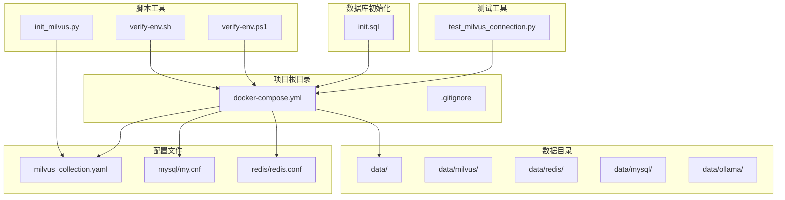
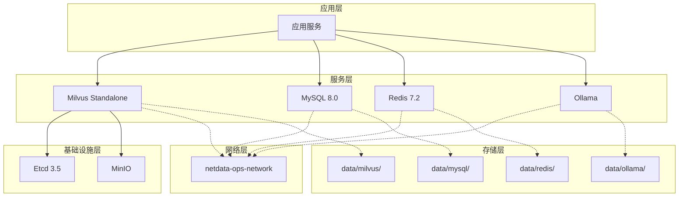
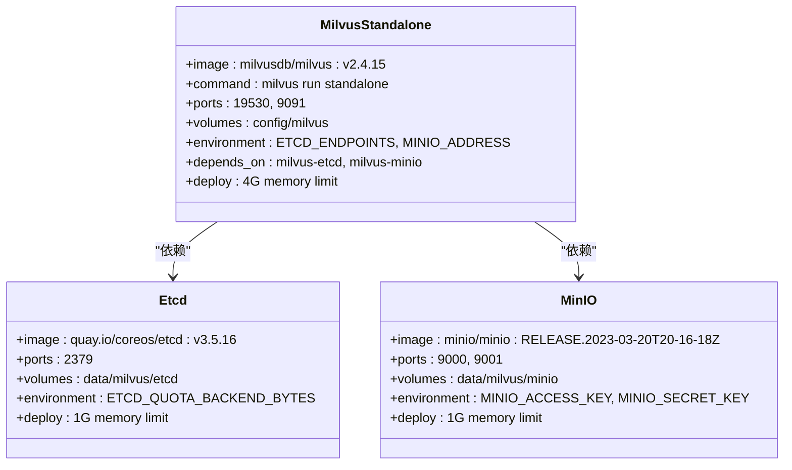
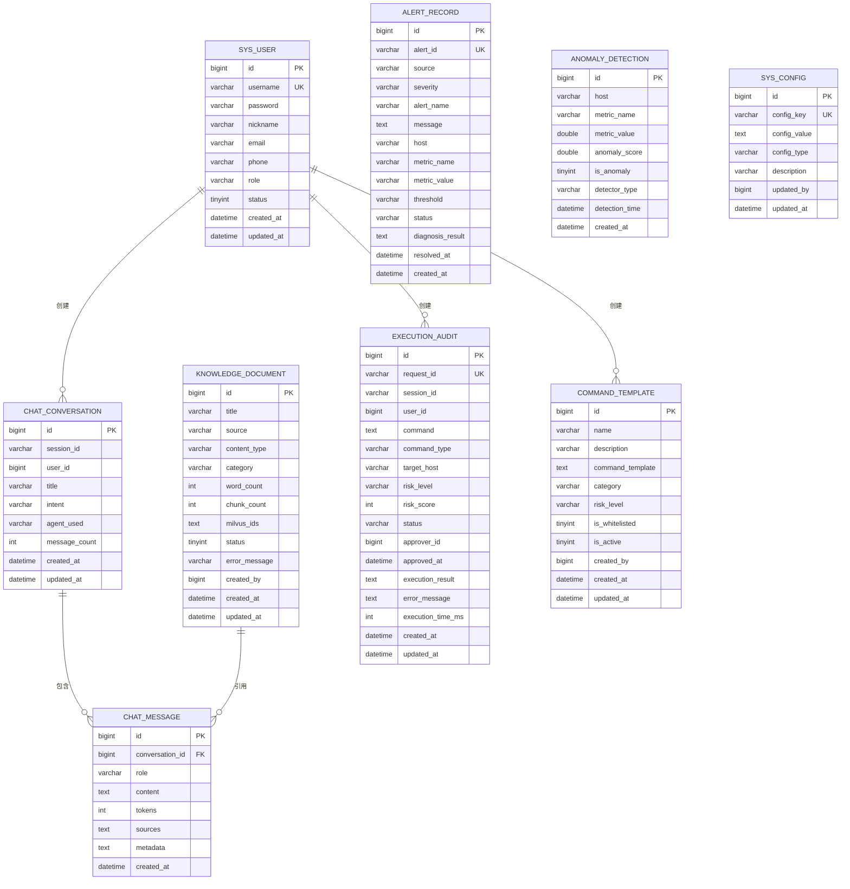
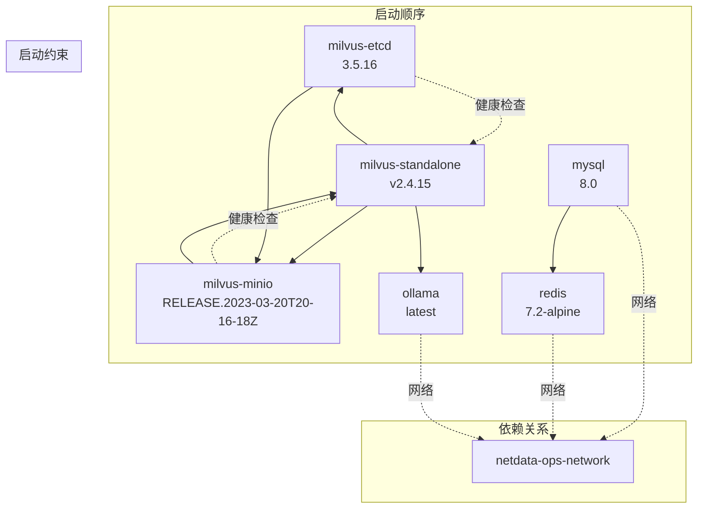
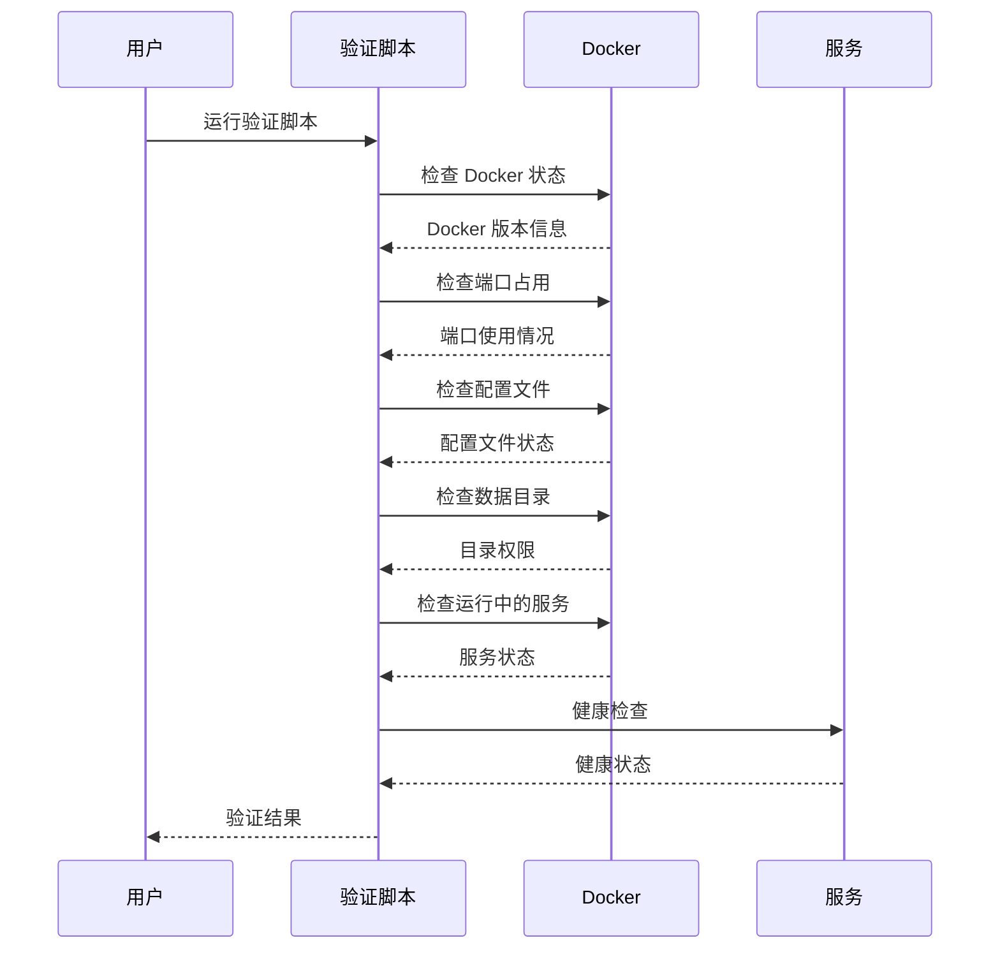
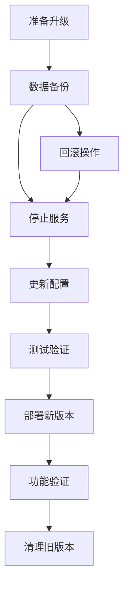
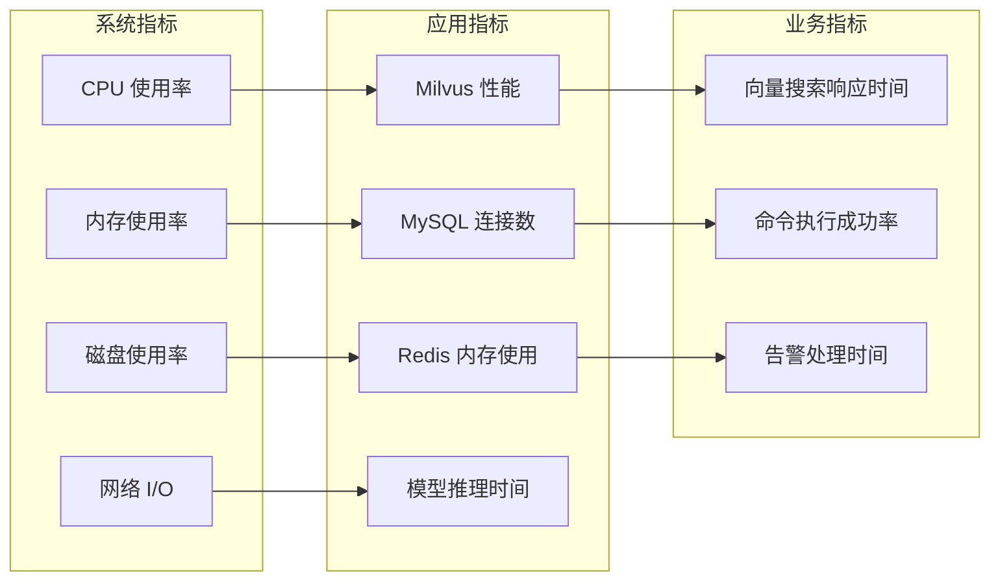
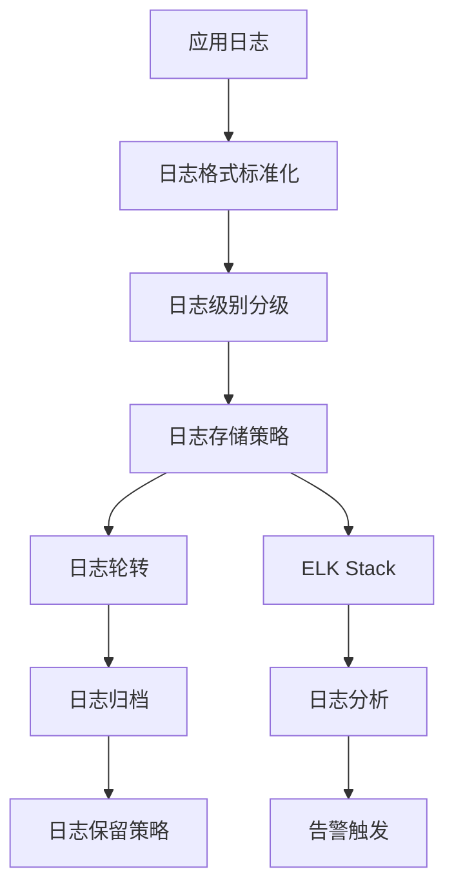

# 部署与运维

<cite>
**本文档引用的文件**
- [docker-compose.yml](file://docker-compose.yml)
- [milvus_collection.yaml](file://config/milvus_collection.yaml)
- [init_milvus.py](file://scripts/init_milvus.py)
- [init.sql](file://sql/init.sql)
- [verify-env.sh](file://scripts/verify-env.sh)
- [verify-env.ps1](file://scripts/verify-env.ps1)
- [test_milvus_connection.py](file://tests/test_milvus_connection.py)
- [.gitignore](file://.gitignore)
</cite>

## 目录
1. [简介](#简介)
2. [项目结构](#项目结构)
3. [核心组件](#核心组件)
4. [架构概览](#架构概览)
5. [详细组件分析](#详细组件分析)
6. [依赖关系分析](#依赖关系分析)
7. [性能考虑](#性能考虑)
8. [故障排查指南](#故障排查指南)
9. [版本升级与回滚](#版本升级与回滚)
10. [生产环境最佳实践](#生产环境最佳实践)
11. [监控与告警](#监控与告警)
12. [日志管理](#日志管理)
13. [结论](#结论)

## 简介

智能运维问答与执行系统是一个基于 Docker Compose 的容器化部署解决方案，专为面向 NetData 监控数据的智能运维场景设计。该系统集成了多种现代化技术栈，包括 Milvus 向量数据库、MySQL 关系数据库、Redis 缓存、Ollama 本地大语言模型推理引擎等，为企业提供完整的智能运维能力。

系统采用微服务架构，通过 Docker Compose 实现服务编排，支持开发、测试和生产环境的灵活部署。每个服务都经过精心配置，确保在不同环境中都能稳定运行。

## 项目结构

项目的整体结构清晰合理，采用了功能模块化的组织方式：



**图表来源**
- [docker-compose.yml:1-357](file://docker-compose.yml#L1-L357)
- [milvus_collection.yaml:1-186](file://config/milvus_collection.yaml#L1-L186)

**章节来源**
- [docker-compose.yml:1-357](file://docker-compose.yml#L1-L357)
- [.gitignore:1-176](file://.gitignore#L1-L176)

## 核心组件

系统包含以下核心服务组件：

### Milvus 向量数据库
- **服务角色**：系统的核心知识库存储，负责存储和检索运维文档的向量表示
- **部署模式**：Standalone 模式，便于开发和测试环境使用
- **资源配置**：4GB 内存限制，2GB 内存预留，满足向量搜索需求
- **数据持久化**：通过 etcd 和 MinIO 实现高可用存储

### MySQL 关系数据库
- **服务角色**：存储用户管理、权限控制、命令执行审计等结构化数据
- **版本**：MySQL 8.0，支持最新的认证机制和性能特性
- **初始化**：通过 SQL 脚本自动创建表结构和基础数据
- **字符集**：UTF8MB4，支持完整的 Unicode 字符

### Redis 缓存系统
- **服务角色**：提供高性能的键值存储，支持会话缓存、RAG 检索缓存等功能
- **持久化**：启用 AOF 持久化，确保数据安全
- **资源配置**：512MB 内存限制，适合缓存场景

### Ollama 本地推理引擎
- **服务角色**：提供本地大语言模型推理能力，支持离线和隐私保护场景
- **资源配置**：8GB 内存限制，支持 GPU 加速（可选）
- **模型存储**：独立的数据卷，便于模型管理和更新

**章节来源**
- [docker-compose.yml:23-323](file://docker-compose.yml#L23-L323)

## 架构概览

系统采用分层架构设计，各组件通过 Docker 网络实现通信：



**图表来源**
- [docker-compose.yml:32-357](file://docker-compose.yml#L32-L357)

## 详细组件分析

### Milvus 向量数据库配置

Milvus 采用 Standalone 模式部署，通过 etcd 和 MinIO 实现高可用架构：



**图表来源**
- [docker-compose.yml:99-154](file://docker-compose.yml#L99-L154)

#### Milvus Collection 配置

系统使用专门的 Collection 配置文件来定义向量存储结构：

| 配置项 | 值 | 说明 |
|--------|----|-----|
| Collection 名称 | ops_knowledge_base | 系统默认知识库名称 |
| 向量维度 | 1024 | BGE-M3 模型固定输出 |
| 相似度度量 | COSINE | 适合文本语义检索 |
| 索引类型 | IVF_FLAT | 平衡性能和准确率 |
| nlist 参数 | 128 | 聚类中心数量 |
| nprobe 参数 | 16 | 搜索聚类数量 |
| 分片数量 | 1 | 单机模式 |

**章节来源**
- [milvus_collection.yaml:22-186](file://config/milvus_collection.yaml#L22-L186)
- [docker-compose.yml:99-154](file://docker-compose.yml#L99-L154)

### MySQL 数据库配置

MySQL 8.0 提供完整的结构化数据存储能力：



**图表来源**
- [init.sql:25-274](file://sql/init.sql#L25-L274)

#### 表结构特点

1. **用户管理系统**：支持多角色权限控制
2. **对话历史管理**：完整的聊天记录追踪
3. **命令执行审计**：详细的运维操作记录
4. **告警管理系统**：实时监控和告警处理
5. **异常检测**：基于机器学习的异常识别

**章节来源**
- [init.sql:25-274](file://sql/init.sql#L25-L274)

### Redis 缓存配置

Redis 7.2 提供高性能的缓存和会话管理：

| 配置项 | 值 | 说明 |
|--------|----|-----|
| 端口 | 6379 | 标准 Redis 端口 |
| 持久化 | AOF | 增强数据安全性 |
| 内存限制 | 512MB | 适合缓存场景 |
| 数据卷 | data/redis | 持久化存储 |

**章节来源**
- [docker-compose.yml:218-246](file://docker-compose.yml#L218-L246)

### Ollama 推理引擎

Ollama 提供本地大语言模型推理能力：

| 配置项 | 值 | 说明 |
|--------|----|-----|
| 端口 | 11434 | Ollama API 端口 |
| 内存限制 | 8GB | 支持大型模型 |
| 模型存储 | data/ollama | 模型文件持久化 |
| 镜像 | latest | 最新版本 |

**章节来源**
- [docker-compose.yml:258-290](file://docker-compose.yml#L258-L290)

## 依赖关系分析

系统的服务依赖关系通过 Docker Compose 的 `depends_on` 机制实现：



**图表来源**
- [docker-compose.yml:139-144](file://docker-compose.yml#L139-L144)

### 依赖关系说明

1. **Milvus 启动依赖**：必须等待 etcd 和 MinIO 完全启动
2. **网络隔离**：所有服务都在同一个自定义网络中
3. **资源分配**：根据服务特性分配不同的内存限制
4. **健康检查**：每个服务都有相应的健康检查机制

**章节来源**
- [docker-compose.yml:139-144](file://docker-compose.yml#L139-L144)

## 性能考虑

### 资源配置优化

| 服务 | 内存限制 | 内存预留 | 说明 |
|------|----------|----------|------|
| Milvus | 4GB | 2GB | 向量搜索内存密集型 |
| MySQL | 1GB | 512MB | 关系数据库 |
| Redis | 512MB | 128MB | 缓存服务 |
| Ollama | 8GB | 4GB | 大语言模型推理 |
| etcd | 1GB | 512MB | 分布式协调服务 |
| MinIO | 1GB | 256MB | 对象存储服务 |

### 索引性能调优

基于 Milvus Collection 配置，系统采用 IVF_FLAT 索引类型：

```mermaid
flowchart TD
START[开始性能调优] --> DATA[数据量评估]
DATA --> SIZE{数据规模}
SIZE --> |< 10万| FLAT[使用 FLAT 索引]
SIZE --> |10-100万| IVF[使用 IVF_FLAT 索引]
SIZE --> |> 100万| PQ[HNSW 或 IVF_PQ]
IVF --> PARAM[nlist 参数调优]
PARAM --> RANGE[nlist = sqrt(N) 到 N/100]
RANGE --> NPROBE[nprobe 参数调优]
NPROBE --> ACCURACY[精度 vs 速度权衡]
ACCURACY --> MONITOR[监控性能指标]
MONITOR --> OPTIMIZE[持续优化]
```

**图表来源**
- [milvus_collection.yaml:54-84](file://config/milvus_collection.yaml#L54-L84)

### 网络性能优化

- **自定义网络**：使用 bridge 驱动，提供更好的网络隔离
- **端口映射**：仅暴露必要端口，减少攻击面
- **健康检查**：定期检查服务状态，及时发现问题

**章节来源**
- [docker-compose.yml:332-357](file://docker-compose.yml#L332-L357)

## 故障排查指南

### 环境验证脚本

系统提供了完整的环境验证工具，支持 Linux 和 Windows：



**图表来源**
- [verify-env.sh:66-260](file://scripts/verify-env.sh#L66-L260)

### 常见问题及解决方案

#### Milvus 连接问题

1. **检查 etcd 和 MinIO 状态**
   - 确保 etcd 和 MinIO 服务完全启动
   - 验证 etcd 端口 2379 和 MinIO 端口 9000 可访问

2. **验证 Milvus 配置**
   - 检查 ETCD_ENDPOINTS 环境变量
   - 确认 MINIO_ADDRESS 配置正确

3. **查看健康检查端点**
   ```bash
   curl http://localhost:9091/healthz
   ```

#### MySQL 连接问题

1. **检查数据库初始化**
   - 确认 init.sql 脚本已执行
   - 验证数据库表结构正确

2. **验证用户权限**
   - 确认 ops_user 用户存在
   - 检查密码配置

#### Redis 连接问题

1. **检查 AOF 持久化**
   - 确认 AOF 文件存在
   - 验证数据卷挂载

2. **验证连接参数**
   - 检查 Redis 密码配置
   - 确认端口映射正确

**章节来源**
- [verify-env.sh:128-260](file://scripts/verify-env.sh#L128-L260)
- [test_milvus_connection.py:33-143](file://tests/test_milvus_connection.py#L33-L143)

## 版本升级与回滚

### 升级策略



### 升级步骤

1. **数据备份**
   - 备份 MySQL 数据库
   - 备份 Milvus 向量数据
   - 备份 Redis 缓存数据
   - 备份 Ollama 模型文件

2. **停止现有服务**
   ```bash
   docker-compose down
   ```

3. **更新配置文件**
   - 修改 docker-compose.yml 中的镜像版本
   - 更新 Milvus Collection 配置
   - 检查环境变量变化

4. **部署新版本**
   ```bash
   docker-compose up -d
   ```

5. **验证功能**
   - 运行环境验证脚本
   - 测试核心功能
   - 监控系统性能

### 回滚策略

如果新版本出现问题，可以快速回滚到之前的版本：

1. **停止当前版本**
   ```bash
   docker-compose down
   ```

2. **恢复备份数据**
   - 恢复 MySQL 数据库
   - 恢复 Milvus 向量数据
   - 恢复 Redis 缓存数据
   - 恢复 Ollama 模型文件

3. **回滚配置**
   - 恢复之前的 docker-compose.yml
   - 恢复 Milvus Collection 配置
   - 恢复环境变量

4. **重新部署**
   ```bash
   docker-compose up -d
   ```

**章节来源**
- [docker-compose.yml:17-21](file://docker-compose.yml#L17-L21)

## 生产环境最佳实践

### 安全配置

1. **环境变量管理**
   - 使用 .env 文件存储敏感信息
   - 在 .gitignore 中排除 .env 文件
   - 定期轮换密码和密钥

2. **网络隔离**
   - 使用自定义网络隔离服务
   - 仅暴露必要端口
   - 配置防火墙规则

3. **数据安全**
   - 启用数据持久化
   - 定期备份重要数据
   - 使用加密存储

### 性能优化

1. **资源分配**
   - 根据实际负载调整内存限制
   - 监控 CPU 和内存使用情况
   - 调整容器资源配额

2. **存储优化**
   - 使用 SSD 存储提高 I/O 性能
   - 定期清理临时文件
   - 监控磁盘使用情况

3. **网络优化**
   - 配置合适的网络带宽
   - 使用负载均衡
   - 监控网络延迟

### 监控配置

1. **系统监控**
   - 监控容器资源使用
   - 监控服务健康状态
   - 设置告警阈值

2. **应用监控**
   - 监控 Milvus 查询性能
   - 监控 MySQL 连接池
   - 监控 Redis 缓存命中率

**章节来源**
- [.gitignore:10-25](file://.gitignore#L10-L25)
- [docker-compose.yml:325-357](file://docker-compose.yml#L325-L357)

## 监控与告警

### 监控指标设置

系统支持多种监控指标：



### 告警配置

1. **健康检查告警**
   - 服务启动超时告警
   - 健康检查失败告警
   - 资源使用率过高告警

2. **业务告警**
   - Milvus 查询超时告警
   - MySQL 连接池耗尽告警
   - Redis 缓存命中率下降告警

3. **运维告警**
   - 命令执行失败告警
   - 告警处理超时告警
   - 数据备份失败告警

**章节来源**
- [docker-compose.yml:47-53](file://docker-compose.yml#L47-L53)
- [docker-compose.yml:193-199](file://docker-compose.yml#L193-L199)

## 日志管理

### 日志配置

系统采用统一的日志管理策略：



### 日志收集

1. **Docker 日志**
   - 使用 JSON 格式存储
   - 配置日志驱动
   - 设置日志大小限制

2. **应用日志**
   - 标准化日志格式
   - 包含时间戳和上下文信息
   - 支持结构化日志

3. **系统日志**
   - 操作系统日志
   - 应用程序日志
   - 安全日志

### 日志分析

1. **实时监控**
   - 实时日志流处理
   - 异常检测
   - 告警触发

2. **历史分析**
   - 日志聚合分析
   - 趋势分析
   - 性能分析

**章节来源**
- [docker-compose.yml:47-53](file://docker-compose.yml#L47-L53)
- [docker-compose.yml:193-199](file://docker-compose.yml#L193-L199)

## 结论

智能运维问答与执行系统通过 Docker Compose 实现了高度集成和可扩展的容器化部署。系统的设计充分考虑了开发、测试和生产环境的不同需求，提供了完善的监控、告警和故障排查机制。

### 主要优势

1. **模块化设计**：每个服务都是独立的容器，便于维护和扩展
2. **资源优化**：合理的内存和 CPU 分配，确保系统稳定运行
3. **数据安全**：完整的数据持久化和备份策略
4. **监控完善**：多层次的监控和告警机制
5. **易于部署**：简化的部署流程和环境验证工具

### 发展方向

1. **集群化部署**：从 Standalone 模式迁移到集群模式
2. **性能优化**：持续优化索引和查询性能
3. **功能扩展**：添加更多运维场景支持
4. **自动化运维**：提升系统的自动化程度

该系统为智能运维场景提供了坚实的技术基础，通过合理的架构设计和完善的运维策略，能够满足企业级应用的需求。