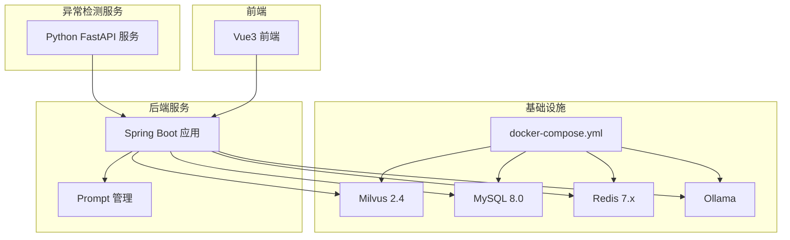
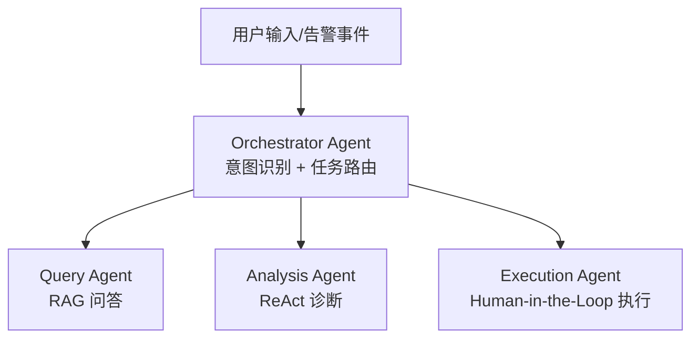
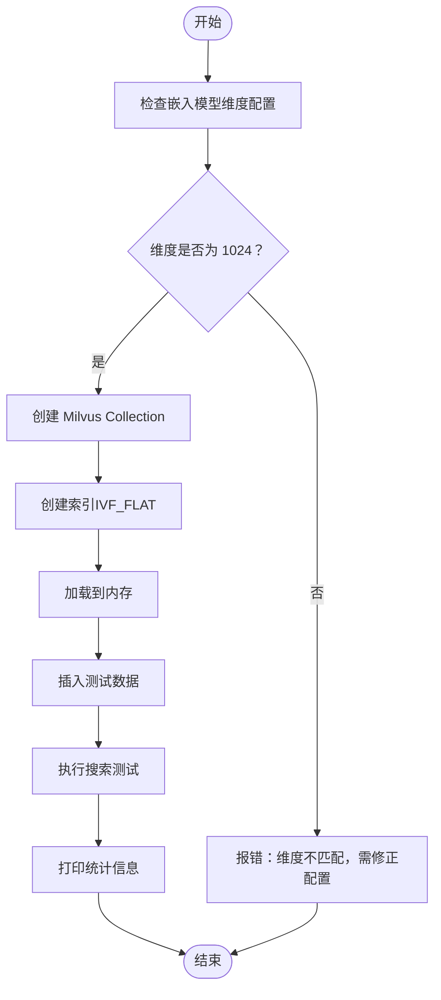
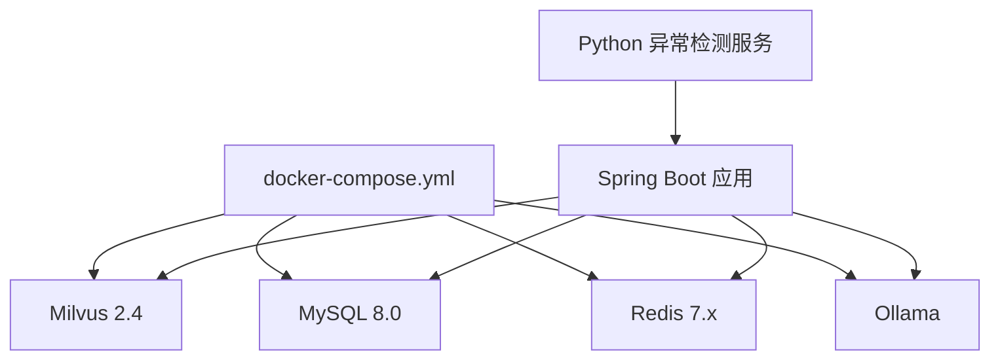
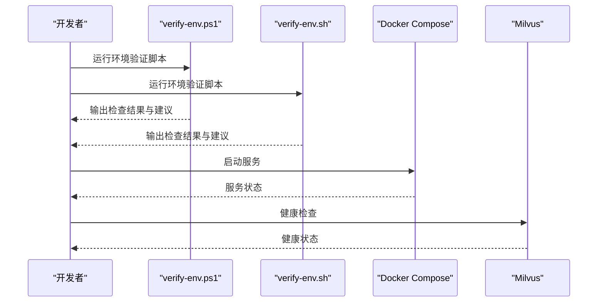

# 关键注意事项

<cite>
**本文引用的文件**
- [PROJECT_CONTEXT.md](file://PROJECT_CONTEXT.md)
- [开题报告_精简版.md](file://开题报告_精简版.md)
- [docker-compose.yml](file://docker-compose.yml)
- [config/milvus_collection.yaml](file://config/milvus_collection.yaml)
- [scripts/init_milvus.py](file://scripts/init_milvus.py)
- [tests/test_milvus_connection.py](file://tests/test_milvus_connection.py)
- [docs/prompts/orchestrator-system-prompt.md](file://docs/prompts/orchestrator-system-prompt.md)
- [docs/prompts/shared-safety-constraints.md](file://docs/prompts/shared-safety-constraints.md)
- [scripts/verify-env.ps1](file://scripts/verify-env.ps1)
- [scripts/verify-env.sh](file://scripts/verify-env.sh)
- [sql/init.sql](file://sql/init.sql)
</cite>

## 目录
1. [引言](#引言)
2. [项目结构](#项目结构)
3. [核心组件](#核心组件)
4. [架构概览](#架构概览)
5. [详细组件分析](#详细组件分析)
6. [依赖分析](#依赖分析)
7. [性能考虑](#性能考虑)
8. [故障排查指南](#故障排查指南)
9. [结论](#结论)
10. [附录](#附录)

## 引言
本文件聚焦于智能运维问答与执行系统开发过程中的关键注意事项与经验教训，围绕 Spring AI 版本选择、Milvus 向量维度锁定、Python-Java 通信超时处理、Prompt 管理最佳实践、LLM 切换配置等核心主题，提供技术背景、潜在风险与解决方案，帮助开发者规避常见陷阱，确保系统稳定、安全、高性能地运行。

## 项目结构
系统采用多模块架构，包含 Java 后端、Python 异常检测服务、Vue3 前端以及基础设施编排。开发阶段以 Docker Compose 一键启动 Milvus、MySQL、Redis、Ollama 等基础服务，便于环境一致性与快速迭代。

**图表来源**
- [docker-compose.yml:1-357](file://docker-compose.yml#L1-L357)

**章节来源**
- [PROJECT_CONTEXT.md:120-166](file://PROJECT_CONTEXT.md#L120-L166)
- [开题报告_精简版.md:118-152](file://开题报告_精简版.md#L118-L152)

## 核心组件
- Spring AI 1.0.x：统一 LLM 客户端抽象，使用 ChatClient 替代已废弃的 AiClient，确保与最新 API 兼容。
- Milvus 2.4：向量数据库，采用 BGE-M3 1024 维嵌入，Collection 创建后维度不可更改，需在设计阶段严格锁定。
- Python 异常检测服务：基于 FastAPI 与 PyOD/PySAD，提供实时异常检测能力，与 Java 后端通过 REST 通信。
- Prompt 管理：集中化管理系统 Prompt，避免硬编码，便于维护与版本控制。
- LLM 切换：通过配置文件与 Profile 切换不同提供商（DeepSeek API 与 Ollama），无需修改代码。

**章节来源**
- [PROJECT_CONTEXT.md:25-40](file://PROJECT_CONTEXT.md#L25-L40)
- [PROJECT_CONTEXT.md:110-117](file://PROJECT_CONTEXT.md#L110-L117)

## 架构概览
系统采用 Orchestrator-Subagent 模式，用户输入经编排代理识别意图后路由至 Query/Analysis/Execution 子代理，实现自然语言问答、故障诊断与人工审批下的命令执行。

**图表来源**
- [PROJECT_CONTEXT.md:43-61](file://PROJECT_CONTEXT.md#L43-L61)

**章节来源**
- [PROJECT_CONTEXT.md:43-61](file://PROJECT_CONTEXT.md#L43-L61)

## 详细组件分析

### Spring AI 版本与 ChatClient 使用
- 技术背景：Spring AI 1.0.x 引入 ChatClient 作为统一入口，简化与 LLM 的交互；AiClient 已废弃，使用过时 API 会导致兼容性问题。
- 潜在风险：教程过时、API 变更频繁，若使用错误客户端或版本，可能导致编译失败或运行时异常。
- 解决方案与建议：
  - 固定 Spring AI 1.0.x 版本，避免升级带来的破坏性变更。
  - 仅使用 ChatClient 进行提示词构造与调用，避免直接依赖已废弃组件。
  - 在配置文件中明确 LLM 提供商与模型，通过 Profile 切换不同环境。

**章节来源**
- [PROJECT_CONTEXT.md:29-30](file://PROJECT_CONTEXT.md#L29-L30)
- [PROJECT_CONTEXT.md:112](file://PROJECT_CONTEXT.md#L112)

### Milvus 向量维度锁定与 Collection 设计
- 技术背景：BGE-M3 输出固定 1024 维向量；Milvus Collection 创建后维度不可更改，必须在设计阶段确定。
- 潜在风险：后期更换嵌入模型将导致数据不一致、检索失败，甚至需要重建整个知识库。
- 解决方案与建议：
  - 在配置文件中明确维度与相似度度量（COSINE），确保与嵌入模型一致。
  - 使用初始化脚本创建 Collection、建立索引并加载到内存，确保检索可用性。
  - 通过测试脚本验证连接与健康状态，避免部署后才发现配置错误。

**图表来源**
- [config/milvus_collection.yaml:40-43](file://config/milvus_collection.yaml#L40-L43)
- [scripts/init_milvus.py:133-242](file://scripts/init_milvus.py#L133-L242)

**章节来源**
- [config/milvus_collection.yaml:11-14](file://config/milvus_collection.yaml#L11-L14)
- [config/milvus_collection.yaml:40-49](file://config/milvus_collection.yaml#L40-L49)
- [scripts/init_milvus.py:69-72](file://scripts/init_milvus.py#L69-L72)
- [tests/test_milvus_connection.py:33-78](file://tests/test_milvus_connection.py#L33-L78)

### Python-Java 通信超时处理
- 技术背景：Python 异常检测服务在处理大数据时，REST 调用可能出现超时；Java 端需设置合理的超时与重试策略。
- 潜在风险：超时导致数据丢失、请求堆积、系统不稳定。
- 解决方案与建议：
  - 在 Java 端配置连接超时、读取超时与重试次数，避免单次失败影响整体流程。
  - 在 Python 侧对大数据处理分批进行，减少单次请求体量。
  - 添加健康检查与降级策略，确保异常检测服务不可用时不影响主流程。

**章节来源**
- [PROJECT_CONTEXT.md:114](file://PROJECT_CONTEXT.md#L114)

### Prompt 管理最佳实践
- 技术背景：Prompt 是 Agent 行为的核心，需集中化管理，避免硬编码在业务逻辑中。
- 潜在风险：硬编码导致维护困难、版本不一致、难以灰度发布。
- 解决方案与建议：
  - 使用配置文件或专门的 Prompt 类管理，支持热更新与版本控制。
  - 为不同 Agent（Orchestrator、Query、Analysis、Execution）分别维护 Prompt，确保职责清晰。
  - 在 Prompt 中加入安全约束与输出格式规范，减少歧义与误判。

**章节来源**
- [PROJECT_CONTEXT.md:115](file://PROJECT_CONTEXT.md#L115)
- [docs/prompts/orchestrator-system-prompt.md:1-291](file://docs/prompts/orchestrator-system-prompt.md#L1-L291)
- [docs/prompts/shared-safety-constraints.md:1-396](file://docs/prompts/shared-safety-constraints.md#L1-L396)

### LLM 切换配置
- 技术背景：生产环境使用 DeepSeek-V3 API，开发调试使用 Ollama 本地推理；通过 Profile 切换不同提供商，无需修改代码。
- 潜在风险：切换不当导致模型不一致、性能差异、成本上升。
- 解决方案与建议：
  - 在配置文件中定义两套 LLM 配置，通过 Profile 控制启用。
  - 保持 Prompt 与模型无关，避免因模型差异导致输出格式变化。
  - 在 CI/CD 中为不同环境设置对应 Profile，确保部署一致性。

**章节来源**
- [PROJECT_CONTEXT.md:33-34](file://PROJECT_CONTEXT.md#L33-L34)
- [PROJECT_CONTEXT.md:116](file://PROJECT_CONTEXT.md#L116)
- [sql/init.sql:235-244](file://sql/init.sql#L235-L244)

## 依赖分析
系统依赖关系围绕基础设施与核心服务展开，其中 Milvus、MySQL、Redis、Ollama 通过 Docker Compose 统一编排，Java 后端作为协调者与各组件交互。

**图表来源**
- [docker-compose.yml:23-357](file://docker-compose.yml#L23-L357)

**章节来源**
- [docker-compose.yml:23-357](file://docker-compose.yml#L23-L357)

## 性能考虑
- Milvus 索引与参数：根据数据规模选择合适索引类型（IVF_FLAT），合理设置 nlist 与 nprobe，在精度与性能间取得平衡。
- 内存与资源：Milvus 为内存密集型服务，需确保 Docker 分配足够内存（建议 ≥8GB），避免启动缓慢或检索失败。
- 检索性能：通过 RRF 融合与 reranker 精排，控制 Top-K 数量，减少不必要的计算开销。
- LLM 调用：合理设置温度与最大 Token 数，避免过长上下文导致延迟增加。

**章节来源**
- [config/milvus_collection.yaml:54-69](file://config/milvus_collection.yaml#L54-L69)
- [config/milvus_collection.yaml:164-185](file://config/milvus_collection.yaml#L164-L185)
- [docker-compose.yml:147-154](file://docker-compose.yml#L147-L154)

## 故障排查指南
- 环境验证：使用 PowerShell 或 Bash 脚本检查 Docker、端口占用、配置文件与数据目录，确保服务健康。
- Milvus 连接：通过 gRPC 与健康检查端点验证服务状态，必要时查看容器日志定位问题。
- Python-Java 通信：检查 REST 调用超时与重试配置，确认异常检测服务可用性与数据格式一致性。
- Prompt 与安全：核对 Prompt 配置与安全约束，确保输出符合预期且满足安全要求。

**图表来源**
- [scripts/verify-env.ps1:1-251](file://scripts/verify-env.ps1#L1-L251)
- [scripts/verify-env.sh:1-318](file://scripts/verify-env.sh#L1-L318)
- [tests/test_milvus_connection.py:33-116](file://tests/test_milvus_connection.py#L33-L116)

**章节来源**
- [scripts/verify-env.ps1:170-228](file://scripts/verify-env.ps1#L170-L228)
- [scripts/verify-env.sh:214-287](file://scripts/verify-env.sh#L214-L287)
- [tests/test_milvus_connection.py:33-116](file://tests/test_milvus_connection.py#L33-L116)

## 结论
通过严格的版本控制、明确的组件职责与完善的配置管理，本系统能够在开发与运维过程中有效规避常见陷阱。重点在于：坚持使用 ChatClient、锁定 Milvus 维度、优化 Python-Java 通信、集中化管理 Prompt、灵活切换 LLM 配置，并配合环境验证与健康检查，确保系统稳定、安全、可扩展。

## 附录
- 数据库初始化：系统通过 SQL 脚本初始化用户、对话、执行审计、命令模板、告警记录等核心表，支持后续功能扩展与审计追踪。
- Prompt 模板：为 Orchestrator Agent 提供结构化输出格式与路由规则，确保意图识别与任务调度的一致性。
- 安全约束：定义命令黑名单、审批流程、日志脱敏与权限矩阵，保障系统操作安全。

**章节来源**
- [sql/init.sql:18-246](file://sql/init.sql#L18-L246)
- [docs/prompts/orchestrator-system-prompt.md:70-137](file://docs/prompts/orchestrator-system-prompt.md#L70-L137)
- [docs/prompts/shared-safety-constraints.md:29-293](file://docs/prompts/shared-safety-constraints.md#L29-L293)