# 开发阶段规划

<cite>
**本文档引用的文件**
- [PROJECT_CONTEXT.md](file://PROJECT_CONTEXT.md)
- [docker-compose.yml](file://docker-compose.yml)
- [开题报告_精简版.md](file://开题报告_精简版.md)
- [scripts/init_milvus.py](file://scripts/init_milvus.py)
- [scripts/verify-env.sh](file://scripts/verify-env.sh)
- [scripts/verify-env.ps1](file://scripts/verify-env.ps1)
- [sql/init.sql](file://sql/init.sql)
- [config/milvus_collection.yaml](file://config/milvus_collection.yaml)
- [tests/test_milvus_connection.py](file://tests/test_milvus_connection.py)
- [.workbuddy/memory/2026-03-31.md](file://.workbuddy/memory/2026-03-31.md)
- [docs/prompts/orchestrator-system-prompt.md](file://docs/prompts/orchestrator-system-prompt.md)
- [docs/prompts/shared-safety-constraints.md](file://docs/prompts/shared-safety-constraints.md)
- [文献/文献知识库_完整版.md](file://文献/文献知识库_完整版.md)
</cite>

## 目录
1. [简介](#简介)
2. [项目结构](#项目结构)
3. [核心组件](#核心组件)
4. [架构概览](#架构概览)
5. [详细组件分析](#详细组件分析)
6. [依赖分析](#依赖分析)
7. [性能考虑](#性能考虑)
8. [故障排除指南](#故障排除指南)
9. [结论](#结论)
10. [附录](#附录)

## 简介
本项目旨在构建一个面向 NetData 监控数据的智能运维问答与执行系统，采用 Python+Java 混合架构，结合异常检测、RAG 知识库、多 Agent 协同与 Human-in-the-Loop 执行流程，实现从故障检测到自动化处置的完整闭环。项目当前处于 Phase 0 环境搭建阶段，已完成项目上下文交接文档、目录结构设计以及基础环境编排文件。

## 项目结构
项目采用分层架构，包含后端服务、异常检测服务、前端界面以及基础设施编排：

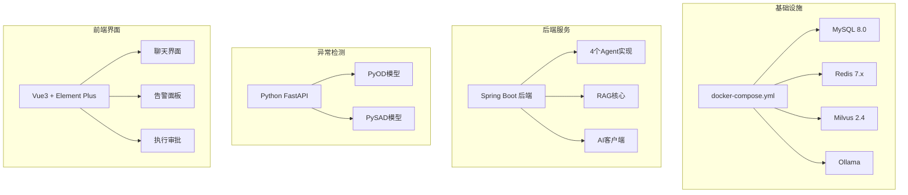

**图表来源**
- [docker-compose.yml:23-357](file://docker-compose.yml#L23-L357)
- [PROJECT_CONTEXT.md:120-149](file://PROJECT_CONTEXT.md#L120-L149)

**章节来源**
- [PROJECT_CONTEXT.md:120-149](file://PROJECT_CONTEXT.md#L120-L149)
- [docker-compose.yml:1-357](file://docker-compose.yml#L1-L357)

## 核心组件
系统采用 Orchestrator-Subagent 模式，包含四个核心 Agent：

### Agent 架构
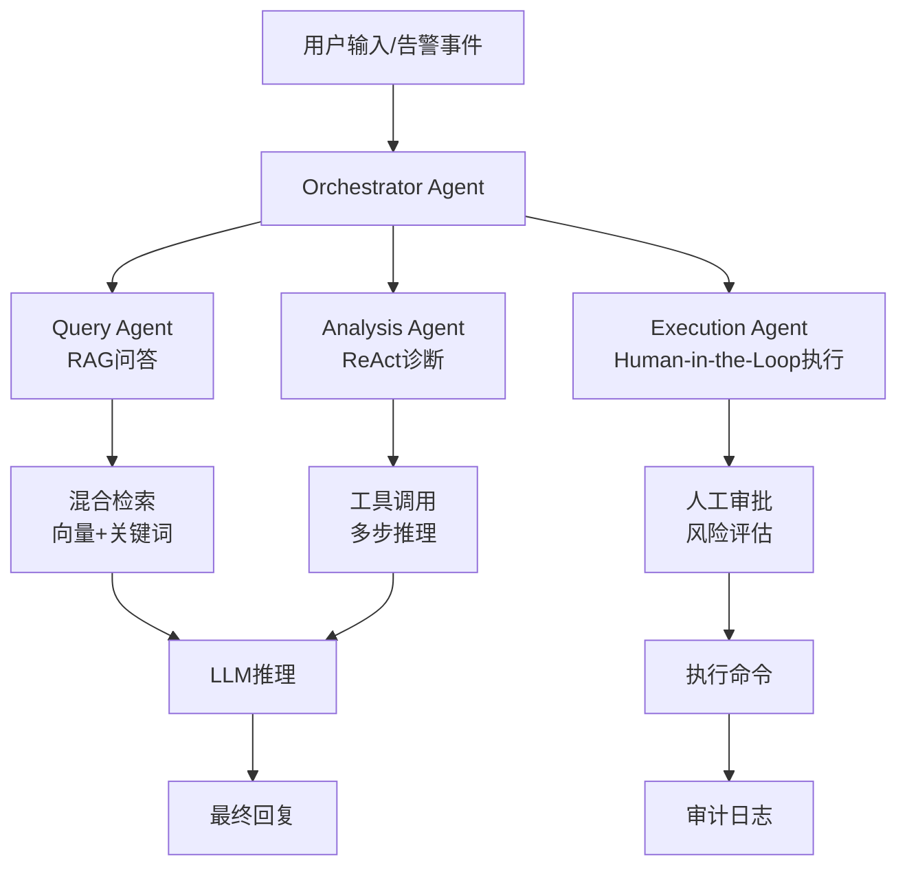

**图表来源**
- [PROJECT_CONTEXT.md:43-61](file://PROJECT_CONTEXT.md#L43-L61)

### 技术栈与版本
- **后端框架**: Spring Boot 3.3.x (Java 主语言)
- **AI 框架**: Spring AI 1.0.x (ChatClient)
- **异常检测**: Python FastAPI + PyOD + PySAD
- **向量数据库**: Milvus 2.4 (BGE-M3 1024维)
- **LLM**: DeepSeek-V3 API (主) + Ollama 本地调试
- **前端**: Vue 3 + Element Plus
- **数据库**: MySQL 8.0 + Redis 7.x
- **容器编排**: Docker Compose

**章节来源**
- [PROJECT_CONTEXT.md:25-40](file://PROJECT_CONTEXT.md#L25-L40)

## 架构概览
系统采用分层架构，各组件职责清晰：

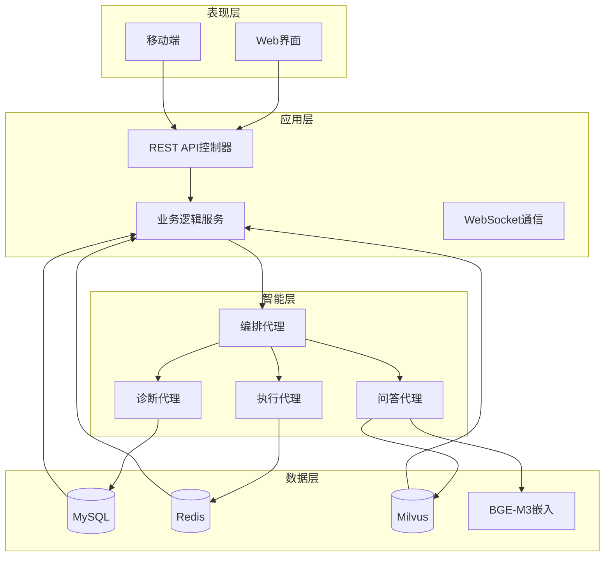

**图表来源**
- [PROJECT_CONTEXT.md:120-149](file://PROJECT_CONTEXT.md#L120-L149)

## 详细组件分析

### Phase 0: 环境搭建 (当前阶段)
**状态**: ⏳ 待完成
**目标**: 完成 Docker Compose 编排，启动所有基础服务

#### 核心服务配置
- **Milvus 2.4**: Standalone 模式，19530 gRPC 端口，9091 Metrics 端口
- **MySQL 8.0**: 3306 端口，UTF8MB4 字符集，初始化数据库结构
- **Redis 7.x**: 6379 端口，AOF 持久化配置
- **Ollama**: 11434 端口，本地 LLM 推理服务

#### 环境验证脚本
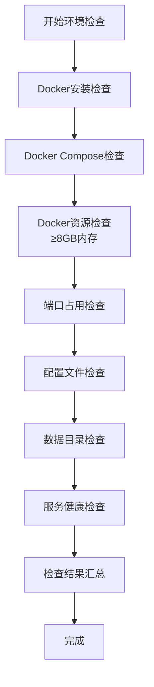

**图表来源**
- [scripts/verify-env.sh:64-286](file://scripts/verify-env.sh#L64-L286)

**章节来源**
- [docker-compose.yml:23-357](file://docker-compose.yml#L23-L357)
- [scripts/verify-env.sh:1-318](file://scripts/verify-env.sh#L1-L318)
- [scripts/verify-env.ps1:1-251](file://scripts/verify-env.ps1#L1-L251)

### Phase 1: 异常检测服务开发
**状态**: ⏳ 待开始
**目标**: 开发 Python FastAPI 异常检测服务，集成 PyOD/PySAD

#### 服务架构
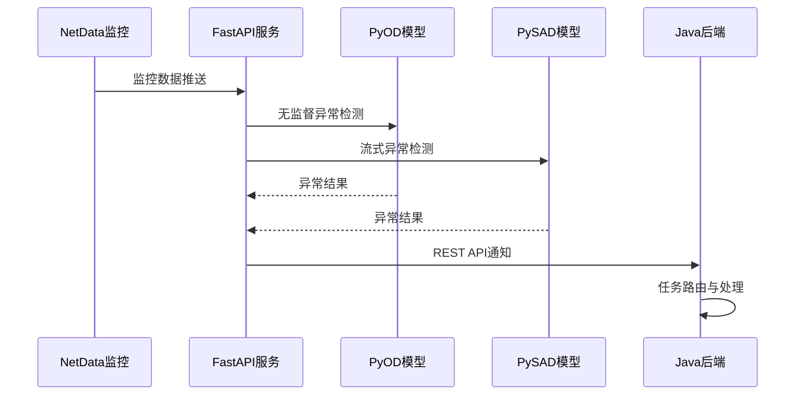

**图表来源**
- [开题报告_精简版.md:163-189](file://开题报告_精简版.md#L163-L189)

#### 核心功能
- 实时监控数据采集 (1秒间隔)
- 多模型异常检测 (Isolation Forest, LSTM-VAE)
- 异常结果标准化输出
- 与 Java 后端的 REST 通信

**章节来源**
- [开题报告_精简版.md:163-189](file://开题报告_精简版.md#L163-L189)

### Phase 2: RAG 知识库构建
**状态**: ⏳ 待开始
**目标**: 构建混合检索 RAG 系统，实现智能问答

#### RAG 架构流程
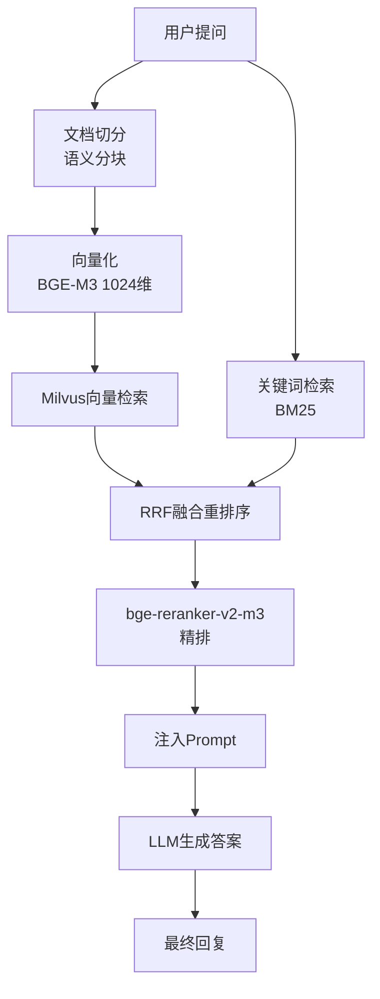

**图表来源**
- [PROJECT_CONTEXT.md:64-82](file://PROJECT_CONTEXT.md#L64-L82)

#### Milvus 初始化配置
- **Collection**: ops_knowledge_base
- **向量维度**: 1024 (BGE-M3 固定)
- **索引类型**: IVF_FLAT (nlist=128)
- **相似度**: COSINE
- **搜索参数**: nprobe=16, top_k=5

**章节来源**
- [PROJECT_CONTEXT.md:64-82](file://PROJECT_CONTEXT.md#L64-L82)
- [config/milvus_collection.yaml:1-186](file://config/milvus_collection.yaml#L1-L186)
- [scripts/init_milvus.py:1-516](file://scripts/init_milvus.py#L1-L516)

### Phase 3: Multi-Agent 架构实现
**状态**: ⏳ 待开始
**目标**: 实现 Orchestrator-Subagent 模式的完整 Agent 系统

#### Orchestrator Agent 设计
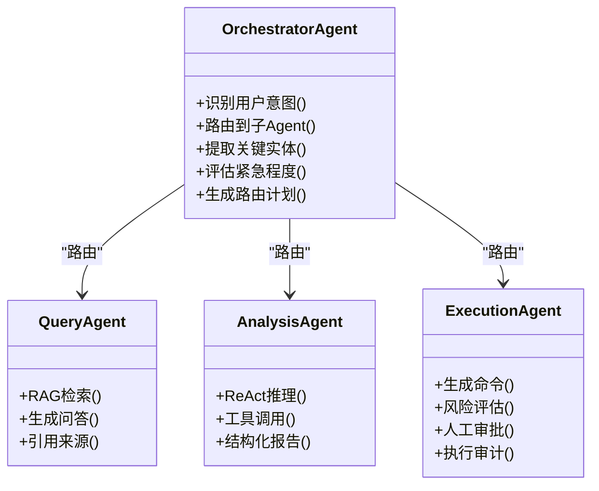

**图表来源**
- [docs/prompts/orchestrator-system-prompt.md:1-291](file://docs/prompts/orchestrator-system-prompt.md#L1-L291)

#### Agent 交互流程
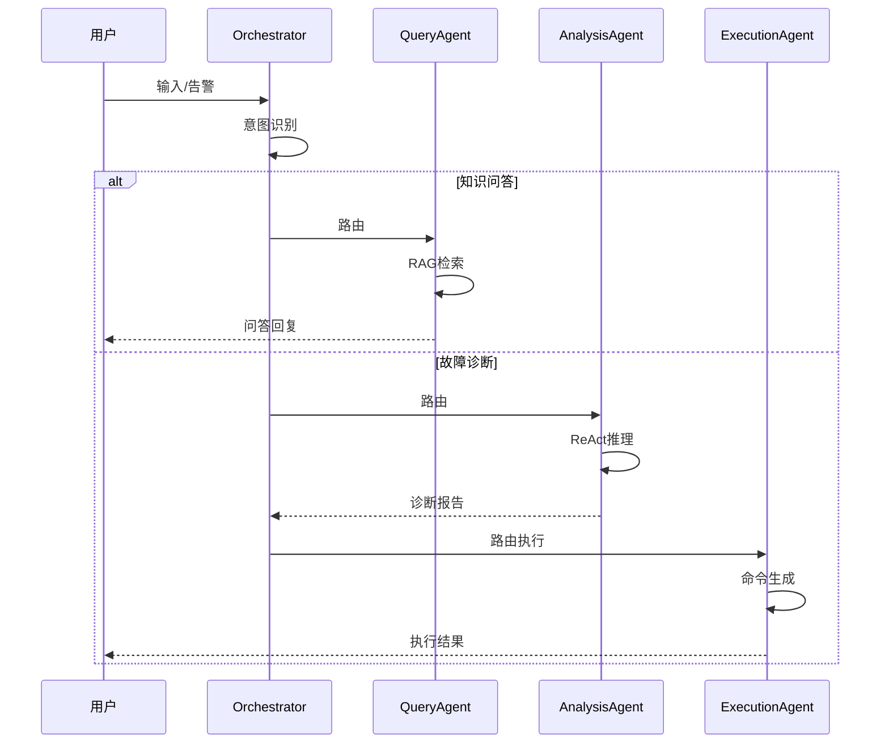

**图表来源**
- [PROJECT_CONTEXT.md:43-61](file://PROJECT_CONTEXT.md#L43-L61)

**章节来源**
- [docs/prompts/orchestrator-system-prompt.md:1-291](file://docs/prompts/orchestrator-system-prompt.md#L1-L291)

### Phase 4: Human-in-the-Loop 执行流程
**状态**: ⏳ 待开始
**目标**: 实现安全的命令执行审批流程

#### 执行安全约束
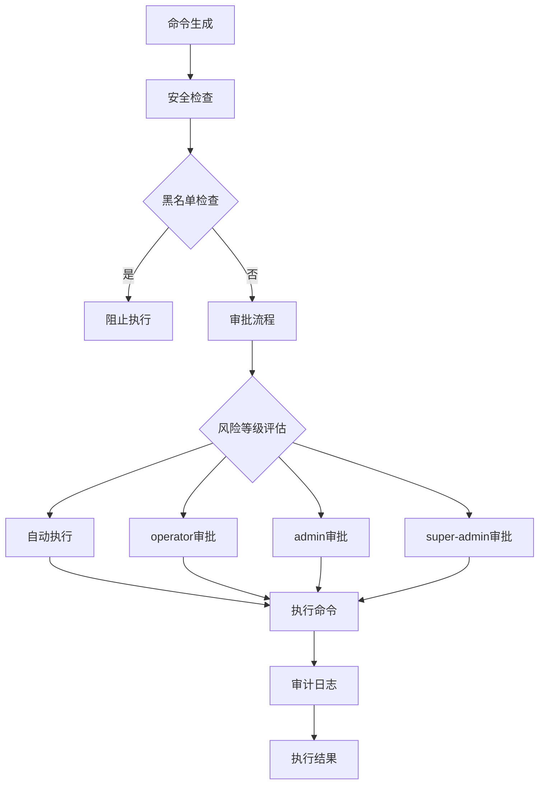

**图表来源**
- [docs/prompts/shared-safety-constraints.md:29-258](file://docs/prompts/shared-safety-constraints.md#L29-L258)

#### 审批权限矩阵
| 角色 | 知识问答 | 故障诊断 | 自动执行命令 | 审批执行命令 |
|------|---------|---------|-------------|-------------|
| viewer | ✅ | ✅ | ❌ | ❌ |
| operator | ✅ | ✅ | ✅ | ✅ |
| admin | ✅ | ✅ | ✅ | ✅ |
| super-admin | ✅ | ✅ | ✅ | ✅ + 越权审批 |

**章节来源**
- [docs/prompts/shared-safety-constraints.md:233-258](file://docs/prompts/shared-safety-constraints.md#L233-L258)

### Phase 5: 前端开发和系统联调
**状态**: ⏳ 待开始
**目标**: 开发 Vue3 前端界面，实现系统集成测试

#### 前端组件架构
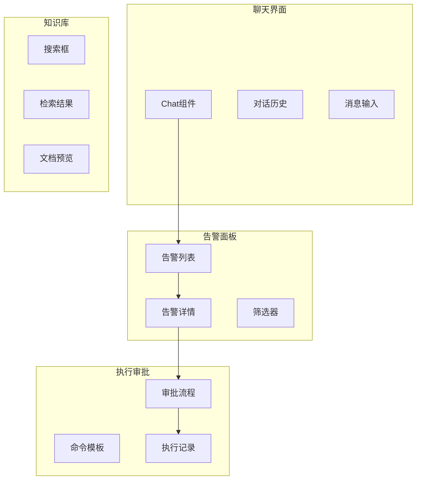

**图表来源**
- [PROJECT_CONTEXT.md:141-145](file://PROJECT_CONTEXT.md#L141-L145)

#### 系统联调重点
- WebSocket 实时通信
- Agent 间数据流转
- 前后端接口对接
- 用户体验优化

**章节来源**
- [PROJECT_CONTEXT.md:141-145](file://PROJECT_CONTEXT.md#L141-L145)

### Phase 6: 论文撰写和性能评估
**状态**: ⏳ 待开始
**目标**: 完成毕业论文撰写，进行系统性能评估

#### 性能评估指标
- **端到端延迟**: < 3分钟
- **异常检测准确率**: > 90%
- **故障诊断准确率**: > 85%
- **系统可用性**: > 99.9%
- **并发处理能力**: 支持 100+ 并发用户

#### 评估方法
- 压力测试 (JMeter/LoadRunner)
- A/B 测试 (不同模型对比)
- 用户体验调查
- 成本效益分析

**章节来源**
- [开题报告_精简版.md:337-348](file://开题报告_精简版.md#L337-L348)

## 依赖分析
系统各组件间的依赖关系如下：

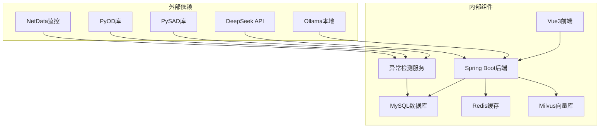

**图表来源**
- [PROJECT_CONTEXT.md:25-40](file://PROJECT_CONTEXT.md#L25-L40)
- [docker-compose.yml:23-357](file://docker-compose.yml#L23-L357)

**章节来源**
- [PROJECT_CONTEXT.md:25-40](file://PROJECT_CONTEXT.md#L25-L40)
- [docker-compose.yml:23-357](file://docker-compose.yml#L23-L357)

## 性能考虑
基于项目的技术栈和架构设计，以下是关键性能考虑因素：

### 系统性能指标
- **启动时间**: < 5分钟 (Docker Compose)
- **内存占用**: 
  - Milvus: 4GB (开发环境)
  - MySQL: 1GB
  - Redis: 512MB
  - Ollama: 8GB (可选)
- **存储需求**: 
  - 数据持久化目录
  - 向量索引 (约 10%-20% 原始数据大小)
  - 日志文件 (按需配置)

### 性能优化建议
1. **向量检索优化**
   - 使用 IVF_FLAT 索引类型
   - 合理设置 nlist 和 nprobe 参数
   - 实施查询结果缓存

2. **数据库性能**
   - MySQL 8.0 性能调优
   - Redis 缓存热点数据
   - 连接池配置优化

3. **Agent 并发处理**
   - 异步任务队列
   - 资源池管理
   - 超时和重试机制

## 故障排除指南

### 环境检查
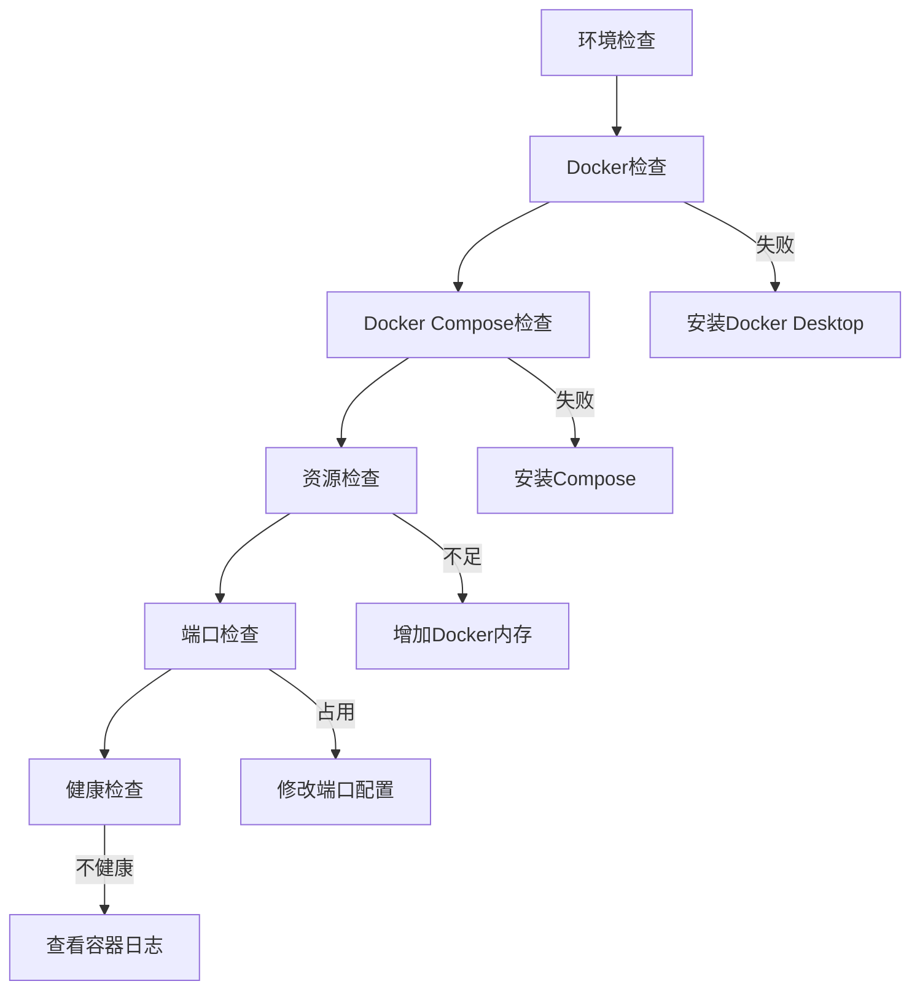

**图表来源**
- [scripts/verify-env.sh:64-286](file://scripts/verify-env.sh#L64-L286)

### 常见问题解决
1. **Milvus 连接失败**
   - 检查 gRPC 端口 (19530)
   - 验证 etcd 和 MinIO 服务状态
   - 查看 Milvus 日志文件

2. **MySQL 连接问题**
   - 确认 root 密码配置
   - 检查初始化脚本执行
   - 验证网络连接

3. **Ollama 模型加载**
   - 确保足够的磁盘空间
   - 检查 GPU 支持 (可选)
   - 验证模型下载完整性

**章节来源**
- [scripts/verify-env.sh:1-318](file://scripts/verify-env.sh#L1-L318)
- [scripts/verify-env.ps1:1-251](file://scripts/verify-env.ps1#L1-L251)
- [tests/test_milvus_connection.py:1-148](file://tests/test_milvus_connection.py#L1-L148)

## 结论
本项目采用渐进式开发策略，从环境搭建开始，逐步实现异常检测、RAG 知识库、多 Agent 架构、执行审批流程，最终完成前端集成和系统联调。当前处于 Phase 0 环境搭建阶段，已完成项目上下文设计和基础设施编排。建议团队按照既定的开发计划推进，重点关注各阶段间的依赖关系和集成测试，确保系统稳定性和性能满足预期要求。

## 附录

### 开发进度跟踪
| 阶段 | 内容 | 状态 | 计划完成时间 |
|------|------|------|-------------|
| Phase 0 | Docker 环境搭建 | ⏳ 待完成 | 2026-04-05 |
| Phase 1 | 异常检测服务 | ⏳ 待开始 | 2026-04-19 |
| Phase 2 | RAG 知识库 | ⏳ 待开始 | 2026-04-30 |
| Phase 3 | Multi-Agent 架构 | ⏳ 待开始 | 2026-05-15 |
| Phase 4 | Human-in-the-Loop | ⏳ 待开始 | 2026-05-25 |
| Phase 5 | 前端开发 | ⏳ 待开始 | 2026-06-05 |
| Phase 6 | 论文撰写 | ⏳ 待开始 | 2026-06-15 |

### 技术文档索引
- **系统架构文档**: [PROJECT_CONTEXT.md](file://PROJECT_CONTEXT.md)
- **环境配置文档**: [docker-compose.yml](file://docker-compose.yml)
- **开题报告**: [开题报告_精简版.md](file://开题报告_精简版.md)
- **Agent Prompt**: [orchestrator-system-prompt.md](file://docs/prompts/orchestrator-system-prompt.md)
- **安全约束**: [shared-safety-constraints.md](file://docs/prompts/shared-safety-constraints.md)
- **文献知识库**: [文献知识库_完整版.md](file://文献/文献知识库_完整版.md)