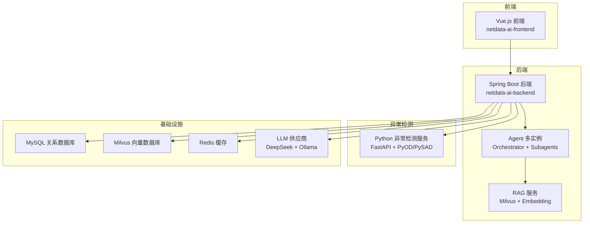
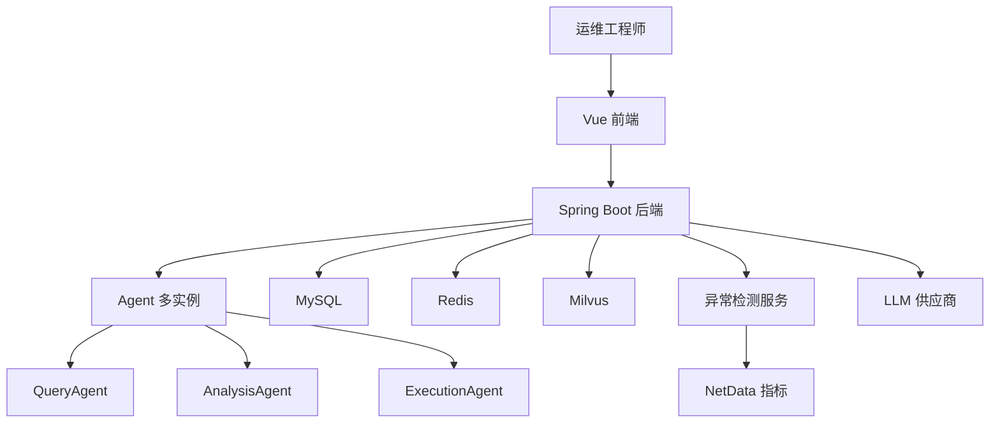
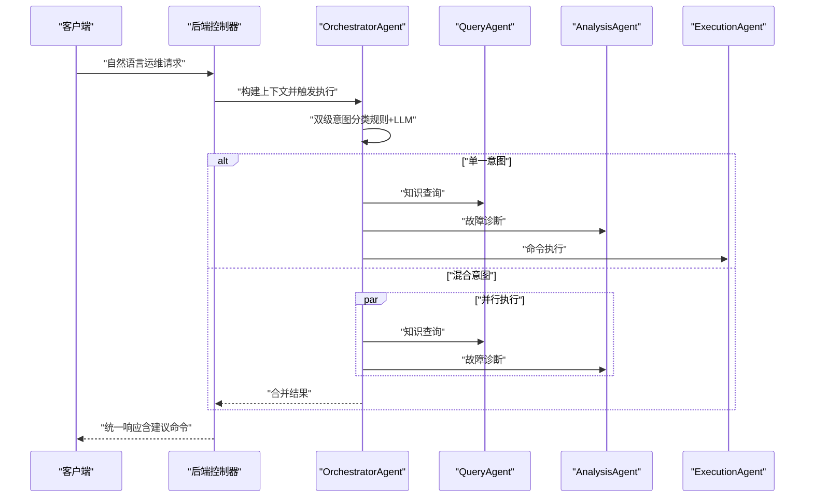
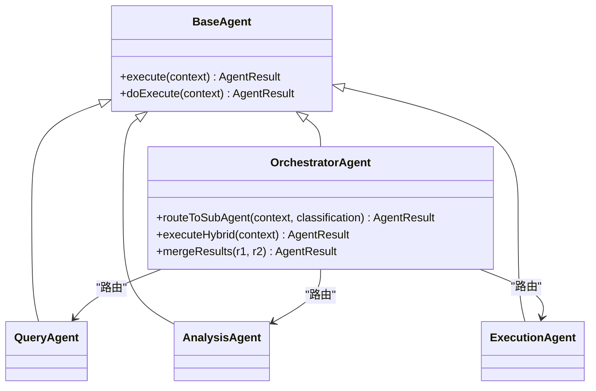
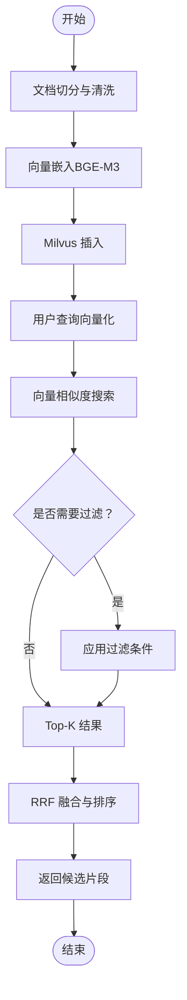
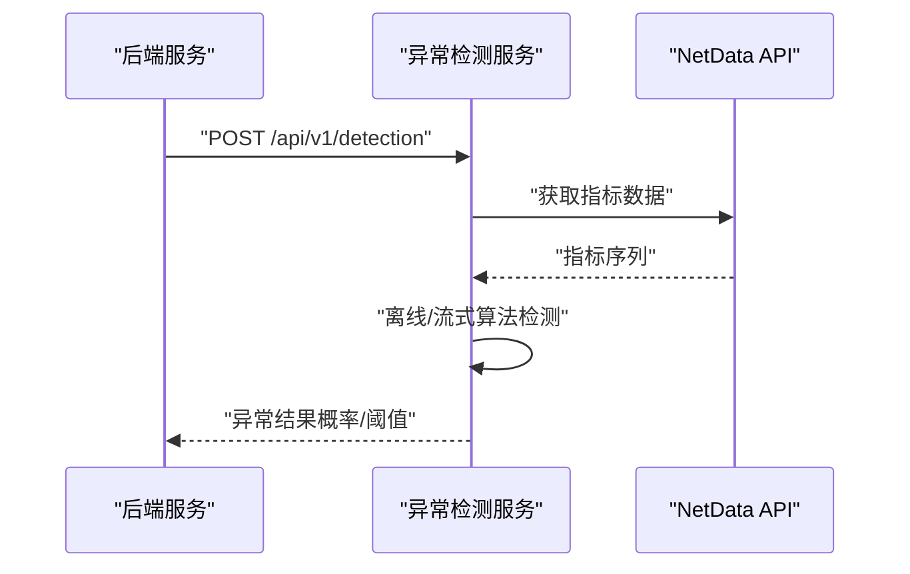
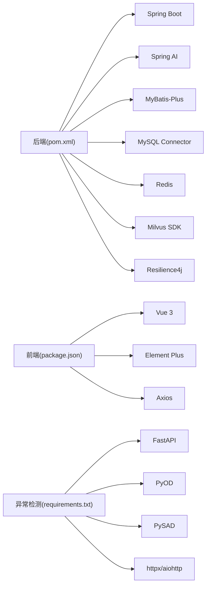

# 技术架构总览

<cite>
**本文引用的文件**
- [docker-compose.yml](file://docker-compose.yml)
- [application.yml](file://netdata-ai-backend/src/main/resources/application.yml)
- [NetDataOpsApplication.java](file://netdata-ai-backend/src/main/java/com/netdata/ops/NetDataOpsApplication.java)
- [OrchestratorAgent.java](file://netdata-ai-backend/src/main/java/com/netdata/ops/core/agent/OrchestratorAgent.java)
- [MilvusVectorStore.java](file://netdata-ai-backend/src/main/java/com/netdata/ops/core/rag/MilvusVectorStore.java)
- [pom.xml](file://netdata-ai-backend/pom.xml)
- [main.py](file://anomaly-detection-service/app/main.py)
- [Dockerfile](file://anomaly-detection-service/Dockerfile)
- [requirements.txt](file://anomaly-detection-service/requirements.txt)
- [package.json](file://netdata-ai-frontend/package.json)
- [main.ts](file://netdata-ai-frontend/src/main.ts)
- [deployment_guide.md](file://docs/deployment_guide.md)
</cite>

## 目录
1. [简介](#简介)
2. [项目结构](#项目结构)
3. [核心组件](#核心组件)
4. [架构总览](#架构总览)
5. [详细组件分析](#详细组件分析)
6. [依赖关系分析](#依赖关系分析)
7. [性能考量](#性能考量)
8. [故障排查指南](#故障排查指南)
9. [结论](#结论)
10. [附录](#附录)

## 简介
本系统是一个面向 NetData 监控数据的智能运维问答与执行平台，采用前后端分离与微服务架构，结合容器化部署实现高可用与可扩展性。系统围绕 Orchestrator-Subagent 多 Agent 架构设计，通过意图识别与任务路由，实现知识问答、故障诊断与命令执行的统一入口；同时集成异常检测服务、RAG 知识库与多 LLM 供应商，提供智能化运维能力。

## 项目结构
系统采用模块化组织，包含后端 Spring Boot 微服务、前端 Vue.js SPA、独立的 Python 异常检测服务以及 Milvus 向量数据库、MySQL 关系数据库、Redis 缓存等基础设施。Docker Compose 提供统一编排与部署。

图表来源
- [docker-compose.yml](file://docker-compose.yml)
- [application.yml](file://netdata-ai-backend/src/main/resources/application.yml)
- [main.py](file://anomaly-detection-service/app/main.py)

章节来源
- [docker-compose.yml](file://docker-compose.yml)
- [application.yml](file://netdata-ai-backend/src/main/resources/application.yml)

## 核心组件
- 后端微服务（Spring Boot）
  - 采用 Spring Web MVC + Spring Security + Spring AI 集成 LLM，Actuator + Micrometer 指标监控，Resilience4j 容错框架，MyBatis-Plus 数据访问。
  - 配置多环境 Profile（dev/prod），支持 Ollama 本地与 DeepSeek API 双 LLM 降级策略。
- 前端 SPA（Vue.js）
  - 基于 Vue 3 + TypeScript + Element Plus，使用 Pinia 状态管理、Vue Router 路由与 Axios HTTP 客户端。
- 异常检测服务（Python FastAPI）
  - 提供批量与流式异常检测接口，集成 PyOD/PySAD 算法，支持 NetData 指标数据接入。
- 向量数据库（Milvus）
  - 2.4.x 版本，固定 BGE-M3 1024 维向量，IVF_FLAT 索引 + COSINE 相似度，提供检索、插入、删除与统计。
- 关系数据库（MySQL）
  - 用户、权限、审计日志等结构化数据存储，字符集 utf8mb4，时区 Asia/Shanghai。
- 缓存（Redis）
  - 会话缓存、RAG 检索缓存、分布式锁与实时告警去重。
- LLM 供应商
  - 开发环境：Ollama 本地模型；生产环境：DeepSeek API，支持降级回退。

章节来源
- [pom.xml](file://netdata-ai-backend/pom.xml)
- [application.yml](file://netdata-ai-backend/src/main/resources/application.yml)
- [NetDataOpsApplication.java](file://netdata-ai-backend/src/main/java/com/netdata/ops/NetDataOpsApplication.java)
- [main.py](file://anomaly-detection-service/app/main.py)
- [Dockerfile](file://anomaly-detection-service/Dockerfile)
- [requirements.txt](file://anomaly-detection-service/requirements.txt)
- [package.json](file://netdata-ai-frontend/package.json)
- [main.ts](file://netdata-ai-frontend/src/main.ts)

## 架构总览
系统采用“前端 + 后端微服务 + 独立异常检测 + 基础设施”的分层架构。前端通过 REST/WebSocket 与后端交互；后端通过 Resilience4j 与 HTTP 客户端调用异常检测服务；RAG 通过 Milvus 存储与检索向量；MySQL/Redis 提供结构化与缓存能力；LLM 供应商支持双栈与降级。

图表来源
- [application.yml](file://netdata-ai-backend/src/main/resources/application.yml)
- [OrchestratorAgent.java](file://netdata-ai-backend/src/main/java/com/netdata/ops/core/agent/OrchestratorAgent.java)
- [MilvusVectorStore.java](file://netdata-ai-backend/src/main/java/com/netdata/ops/core/rag/MilvusVectorStore.java)
- [main.py](file://anomaly-detection-service/app/main.py)

## 详细组件分析

### 后端微服务（Spring Boot）
- 技术栈与版本
  - Spring Boot 3.3.x、Spring AI 1.0.x、MySQL Connector/J、Redis、Milvus Java SDK、Resilience4j、Micrometer、OpenAPI/Swagger。
- 关键特性
  - 多环境配置（dev/prod），开发使用 Ollama，生产使用 DeepSeek API。
  - Actuator 暴露健康检查、指标与熔断/重试状态。
  - WebSocket 实时通知（告警、审批）。
  - JWT 安全与限流策略。
- 数据流
  - 控制器接收请求 → 意图识别与路由 → 子 Agent 执行 → RAG 检索/异常检测 → 结果聚合 → 响应与审计。

图表来源
- [OrchestratorAgent.java](file://netdata-ai-backend/src/main/java/com/netdata/ops/core/agent/OrchestratorAgent.java)

章节来源
- [pom.xml](file://netdata-ai-backend/pom.xml)
- [application.yml](file://netdata-ai-backend/src/main/resources/application.yml)
- [NetDataOpsApplication.java](file://netdata-ai-backend/src/main/java/com/netdata/ops/NetDataOpsApplication.java)

### Orchestrator-Subagent 多 Agent 架构
- 设计思路
  - 双级意图分类：规则快速路径 + LLM 语义分类，结合 Redis 缓存降低重复计算。
  - 混合意图并行执行：使用 CompletableFuture 并行调用多个子 Agent，超时降级为串行。
  - 结果合并：将诊断、知识与建议命令统一输出。
- 优势
  - 提升复杂场景响应速度与准确性。
  - 降低耦合，便于扩展新 Agent。
  - 异常可降级，保证系统稳定性。

图表来源
- [OrchestratorAgent.java](file://netdata-ai-backend/src/main/java/com/netdata/ops/core/agent/OrchestratorAgent.java)

章节来源
- [OrchestratorAgent.java](file://netdata-ai-backend/src/main/java/com/netdata/ops/core/agent/OrchestratorAgent.java)

### 向量数据库（Milvus）与 RAG
- 设计要点
  - 固定向量维度 1024（BGE-M3），COSINE 相似度，IVF_FLAT 索引。
  - Collection 字段：主键、内容、向量、来源、标题、切片索引。
  - 运行时可用性检查，不可用时 RAG 降级为无知识库模式。
- 数据流
  - 文档切分与嵌入 → Milvus 插入 → 查询向量相似度搜索 → 结果过滤与融合 → 返回候选片段。

图表来源
- [MilvusVectorStore.java](file://netdata-ai-backend/src/main/java/com/netdata/ops/core/rag/MilvusVectorStore.java)
- [application.yml](file://netdata-ai-backend/src/main/resources/application.yml)

章节来源
- [MilvusVectorStore.java](file://netdata-ai-backend/src/main/java/com/netdata/ops/core/rag/MilvusVectorStore.java)
- [application.yml](file://netdata-ai-backend/src/main/resources/application.yml)

### 异常检测服务（Python FastAPI）
- 技术栈
  - FastAPI + Uvicorn（生产）、PyOD（离线检测）、PySAD（流式检测）、NetData 客户端。
- 关键流程
  - 启动时预加载默认检测器，注册健康检查与全局异常处理。
  - 提供 /api/v1/detection 接口，支持批量与流式检测。
  - 通过 HTTP 客户端被后端调用，返回异常概率与指标趋势。

图表来源
- [main.py](file://anomaly-detection-service/app/main.py)
- [application.yml](file://netdata-ai-backend/src/main/resources/application.yml)

章节来源
- [main.py](file://anomaly-detection-service/app/main.py)
- [Dockerfile](file://anomaly-detection-service/Dockerfile)
- [requirements.txt](file://anomaly-detection-service/requirements.txt)
- [application.yml](file://netdata-ai-backend/src/main/resources/application.yml)

### 前端（Vue.js）
- 技术栈
  - Vue 3 + TypeScript、Element Plus、Vue Router、Pinia、Axios。
- 关键点
  - 应用初始化注册 Pinia/Router/Element Plus，加载权限指令与认证状态。
  - 通过 API 与后端交互，WebSocket 接收实时通知。

章节来源
- [package.json](file://netdata-ai-frontend/package.json)
- [main.ts](file://netdata-ai-frontend/src/main.ts)

## 依赖关系分析
- 后端依赖
  - Spring Boot Web、Security、WebFlux、Actuator、Micrometer、OpenAPI、MyBatis-Plus、MySQL Connector、Redis、Milvus SDK、Resilience4j、Lombok、Jackson。
- 前端依赖
  - Vue 3、Vue Router、Pinia、Element Plus、Axios、markdown-it、highlight.js、dayjs。
- 异常检测服务依赖
  - FastAPI、Uvicorn、PyOD、PySAD、httpx/aiohttp、loguru、pydantic、numpy/scipy 等。

图表来源
- [pom.xml](file://netdata-ai-backend/pom.xml)
- [package.json](file://netdata-ai-frontend/package.json)
- [requirements.txt](file://anomaly-detection-service/requirements.txt)

章节来源
- [pom.xml](file://netdata-ai-backend/pom.xml)
- [package.json](file://netdata-ai-frontend/package.json)
- [requirements.txt](file://anomaly-detection-service/requirements.txt)

## 性能考量
- 容器资源规划
  - Milvus：4G 内存上限，Standalone 模式适配开发与迁移；Etcd/MinIO 限定内存，避免资源争用。
  - Ollama：8G 内存上限，支持 GPU 加速（可选）。
  - MySQL/Redis：合理分配内存，启用持久化与健康检查。
- 后端性能
  - Resilience4j 重试/熔断/限流，Actuator 指标暴露，Prometheus 监控。
  - WebSocket 与异步处理，减少阻塞。
- 向量检索
  - IVF_FLAT + COSINE，nlist 参数权衡准确率与性能；Top-K 与 RRF 融合控制召回。
- 异常检测
  - 批量与流式算法结合，Gunicorn + Uvicorn worker 提升并发；超时与重试策略保障稳定性。

章节来源
- [docker-compose.yml](file://docker-compose.yml)
- [application.yml](file://netdata-ai-backend/src/main/resources/application.yml)
- [MilvusVectorStore.java](file://netdata-ai-backend/src/main/java/com/netdata/ops/core/rag/MilvusVectorStore.java)
- [main.py](file://anomaly-detection-service/app/main.py)

## 故障排查指南
- 健康检查
  - 后端：/actuator/health，暴露 CircuitBreakers/RateLimiters 状态。
  - Milvus：/healthz，Etcd/MinIO 健康检查。
  - 异常检测：/api/health。
- 常见问题定位
  - LLM 降级：确认 dev/prod Profile 与 API Key/URL 配置。
  - Milvus 不可用：检查连接 URI、索引参数与可用性标志位。
  - 异常检测超时：调整超时与重试次数，确认 NetData 可达性。
  - 前后端跨域：确认 CORS 配置与代理转发。
- 日志与监控
  - 后端：日志文件与控制台格式，TraceId 串联链路。
  - Prometheus：后端 Actuator 指标，异常检测服务 /metrics。
  - Grafana：导入 Spring Boot、JVM 与自定义仪表板。

章节来源
- [application.yml](file://netdata-ai-backend/src/main/resources/application.yml)
- [deployment_guide.md](file://docs/deployment_guide.md)

## 结论
本系统通过清晰的微服务与多 Agent 架构，结合 RAG 与异常检测能力，实现了从“自然语言理解”到“智能诊断与执行”的闭环。容器化与多 LLM 供应商策略提升了部署灵活性与鲁棒性；通过合理的缓存与容错机制，保障了生产环境的稳定性与可维护性。

## 附录
- 部署与运维
  - Docker Compose 一键启动，支持开发与生产环境切换。
  - Kubernetes 部署参考（副本、探针、Ingress、Secret/ConfigMap）。
  - 监控与日志：Prometheus + Grafana + ELK。

章节来源
- [deployment_guide.md](file://docs/deployment_guide.md)
- [docker-compose.yml](file://docker-compose.yml)