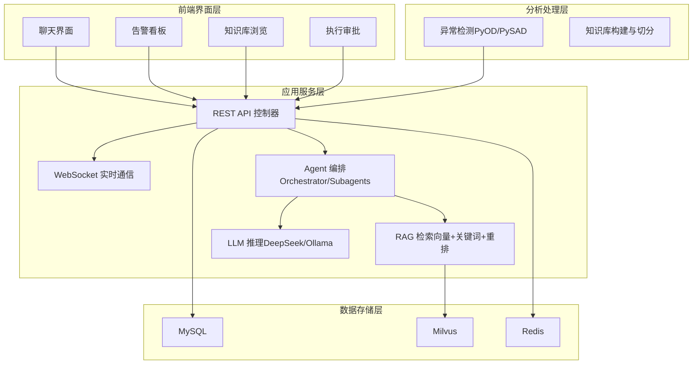
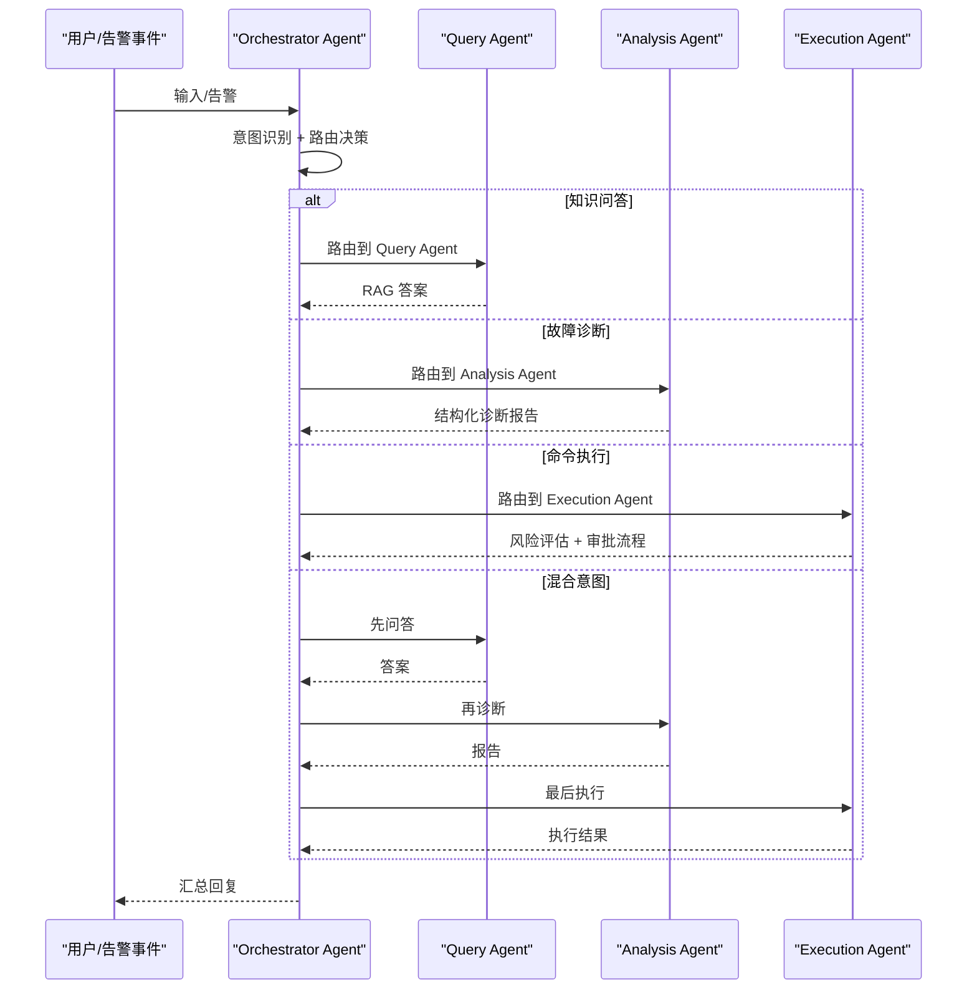
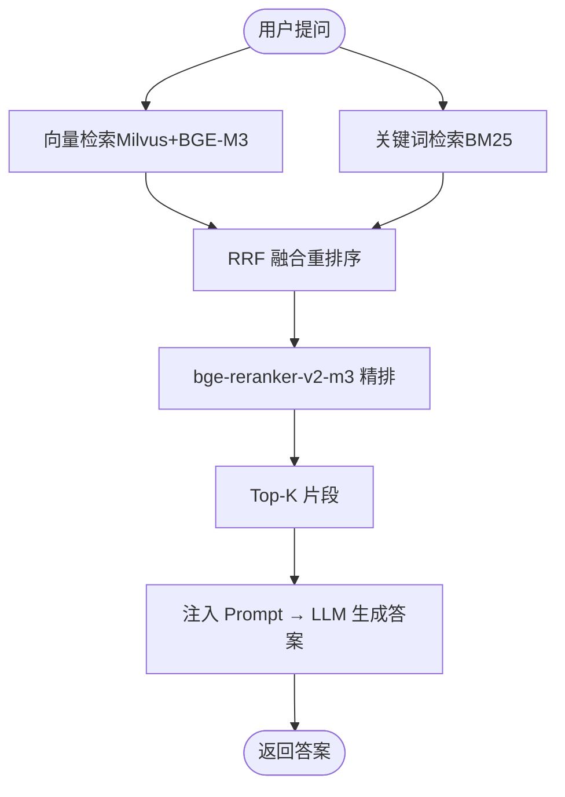
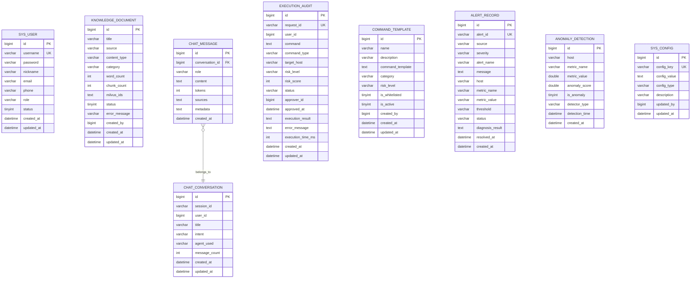
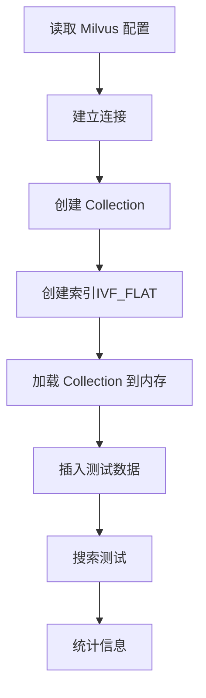
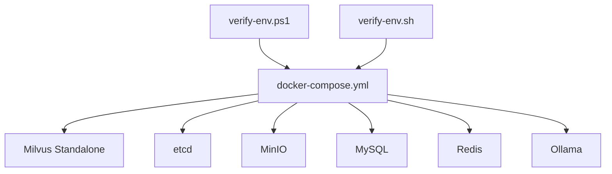
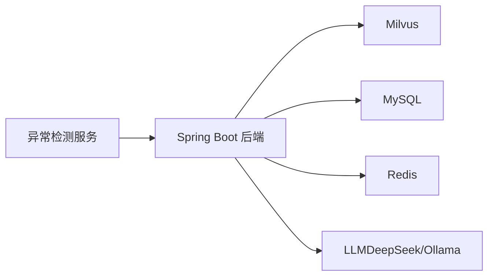

# 技术架构概览

<cite>
**本文档引用的文件**
- [PROJECT_CONTEXT.md](file://PROJECT_CONTEXT.md)
- [开题报告_精简版.md](file://开题报告_精简版.md)
- [docker-compose.yml](file://docker-compose.yml)
- [config/milvus_collection.yaml](file://config/milvus_collection.yaml)
- [sql/init.sql](file://sql/init.sql)
- [scripts/init_milvus.py](file://scripts/init_milvus.py)
- [scripts/verify-env.ps1](file://scripts/verify-env.ps1)
- [scripts/verify-env.sh](file://scripts/verify-env.sh)
- [docs/prompts/orchestrator-system-prompt.md](file://docs/prompts/orchestrator-system-prompt.md)
</cite>

## 目录
1. [简介](#简介)
2. [项目结构](#项目结构)
3. [核心组件](#核心组件)
4. [架构总览](#架构总览)
5. [详细组件分析](#详细组件分析)
6. [依赖关系分析](#依赖关系分析)
7. [性能考虑](#性能考虑)
8. [故障排查指南](#故障排查指南)
9. [结论](#结论)

## 简介
本项目面向 NetData 监控数据，构建一个“智能运维问答与执行系统”。系统采用前后端分离与微服务架构，结合多 Agent 协同模式，实现“自然语言问答、智能故障诊断、命令执行”的一体化运维能力。后端以 Spring Boot 为核心，Python FastAPI 提供异常检测微服务，前端采用 Vue3 + Element Plus，数据层包含 MySQL、Milvus 向量数据库、Redis 缓存等。系统通过 Orchestrator-Subagent 模式进行意图识别与任务路由，结合 RAG 检索与 LLM 推理，形成“感知-分析-决策-执行”的闭环。

## 项目结构
项目采用模块化分层组织，包含后端、异常检测服务、前端、基础设施编排与文档等部分。核心目录如下：
- netdata-ai-backend：Java Spring Boot 后端，包含 Agent、AI、RAG、Controller、Service、WebSocket、Config 等模块
- anomaly-detection-service：Python FastAPI 异常检测微服务，包含 API、核心模型封装、NetData 数据适配
- netdata-ai-frontend：Vue3 前端，包含 Chat、AlertDashboard、KnowledgeBase、ExecutionApproval 等视图
- docker-compose.yml：Docker Compose 编排，统一启动 Milvus、MySQL、Redis、Ollama 等基础服务
- sql/init.sql：MySQL 初始化脚本，定义用户、对话、执行审计、命令模板、告警、异常检测、系统配置等表
- config/milvus_collection.yaml：Milvus Collection 配置，定义向量维度、索引、字段等
- scripts/*：环境验证与 Milvus 初始化脚本

```mermaid
graph TB
subgraph "前端"
FE_Vue["Vue3 前端<br/>Chat/Alert/Knowledge/ExecutionApproval"]
end
subgraph "后端"
BE_SpringBoot["Spring Boot 后端<br/>Agent/RAG/AI/Controller/Service/WebSocket/Config"]
end
subgraph "异常检测服务"
PY_FastAPI["Python FastAPI 异常检测服务<br/>detect/train/health"]
end
subgraph "基础设施"
DB_MySQL["MySQL 8.0"]
DB_Milvus["Milvus 2.4"]
Cache_Redis["Redis 7.x"]
LLM_Ollama["Ollama 本地 LLM"]
end
FE_Vue --> BE_SpringBoot
BE_SpringBoot <- --> PY_FastAPI
BE_SpringBoot --> DB_MySQL
BE_SpringBoot --> DB_Milvus
BE_SpringBoot --> Cache_Redis
BE_SpringBoot --> LLM_Ollama
```

**图表来源**
- [PROJECT_CONTEXT.md:120-152](file://PROJECT_CONTEXT.md#L120-L152)
- [开题报告_精简版.md:118-152](file://开题报告_精简版.md#L118-L152)
- [docker-compose.yml:23-357](file://docker-compose.yml#L23-L357)

**章节来源**
- [PROJECT_CONTEXT.md:120-152](file://PROJECT_CONTEXT.md#L120-L152)
- [开题报告_精简版.md:118-152](file://开题报告_精简版.md#L118-L152)

## 核心组件
- 后端（Spring Boot）：提供 REST API、WebSocket 实时通信、Agent 协同编排、RAG 检索、LLM 集成、业务服务与配置管理
- 异常检测服务（Python FastAPI）：提供异常检测、训练、健康检查等接口，与后端通过 REST 通信
- 前端（Vue3 + Element Plus）：提供聊天界面、告警看板、知识库浏览、执行审批等视图
- 数据与中间件：MySQL（关系数据）、Milvus（向量检索）、Redis（缓存/锁/去重）、Ollama（本地 LLM）
- 编排与环境：Docker Compose 统一启动与管理服务，环境验证脚本辅助检查与连接测试

**章节来源**
- [PROJECT_CONTEXT.md:25-40](file://PROJECT_CONTEXT.md#L25-L40)
- [开题报告_精简版.md:118-152](file://开题报告_精简版.md#L118-L152)

## 架构总览
系统采用“三层架构 + 多 Agent 协同”的设计：
- 前端界面层：Vue3 聊天与运维工单界面
- 应用服务层：Spring Boot 后端，负责 API、WebSocket、Agent 编排、RAG、LLM
- 分析处理层：Python 异常检测服务 + RAG 检索（Milvus + BM25 + Rerank）
- 数据存储层：MySQL（用户、对话、执行审计、命令模板、告警、异常检测、系统配置）、Milvus（知识库向量）、Redis（缓存/锁/去重）



**图表来源**
- [开题报告_精简版.md:118-152](file://开题报告_精简版.md#L118-L152)
- [PROJECT_CONTEXT.md:43-61](file://PROJECT_CONTEXT.md#L43-L61)
- [config/milvus_collection.yaml:19-101](file://config/milvus_collection.yaml#L19-L101)

**章节来源**
- [开题报告_精简版.md:118-152](file://开题报告_精简版.md#L118-L152)
- [PROJECT_CONTEXT.md:43-61](file://PROJECT_CONTEXT.md#L43-L61)

## 详细组件分析

### Agent 架构与编排
系统采用 Orchestrator-Subagent 模式，实现意图识别与任务路由：
- Orchestrator Agent：接收用户输入/告警事件，识别意图（知识问答、故障诊断、命令执行、混合意图），路由至子 Agent，并汇总结果
- Subagents：
  - Query Agent：RAG 流程，回答运维问题
  - Analysis Agent：ReAct 模式，多步工具调用，输出结构化诊断报告
  - Execution Agent：生成命令 → 风险评估 → 人工审批 → 执行 → 记录



**图表来源**
- [PROJECT_CONTEXT.md:43-61](file://PROJECT_CONTEXT.md#L43-L61)
- [docs/prompts/orchestrator-system-prompt.md:16-106](file://docs/prompts/orchestrator-system-prompt.md#L16-L106)

**章节来源**
- [PROJECT_CONTEXT.md:43-61](file://PROJECT_CONTEXT.md#L43-L61)
- [docs/prompts/orchestrator-system-prompt.md:16-106](file://docs/prompts/orchestrator-system-prompt.md#L16-L106)

### RAG 检索与重排
系统采用“混合检索 RAG”方案：
- 向量检索：Milvus + BGE-M3（1024 维）嵌入
- 关键词检索：BM25
- 融合重排序：RRF
- 精排：bge-reranker-v2-m3
- Top-K 注入 Prompt → LLM 生成答案



**图表来源**
- [PROJECT_CONTEXT.md:64-82](file://PROJECT_CONTEXT.md#L64-L82)
- [config/milvus_collection.yaml:39-101](file://config/milvus_collection.yaml#L39-L101)

**章节来源**
- [PROJECT_CONTEXT.md:64-82](file://PROJECT_CONTEXT.md#L64-L82)
- [config/milvus_collection.yaml:39-101](file://config/milvus_collection.yaml#L39-L101)

### 数据库与表结构
系统使用 MySQL 存储关系型数据，包含用户、对话、执行审计、命令模板、告警、异常检测、系统配置等表，并提供统计视图。



**图表来源**
- [sql/init.sql:24-274](file://sql/init.sql#L24-L274)

**章节来源**
- [sql/init.sql:24-274](file://sql/init.sql#L24-L274)

### 向量数据库（Milvus）配置与初始化
- Collection 名称：ops_knowledge_base
- 向量维度：1024（BGE-M3 固定）
- 索引类型：IVF_FLAT（平衡性能与精度）
- 搜索参数：nlist、nprobe、top_k
- 字段：id、content、embedding、source、title、chunk_index、created_at
- 初始化脚本支持连接、创建 Collection、创建索引、加载、插入测试数据、搜索测试与统计



**图表来源**
- [config/milvus_collection.yaml:19-101](file://config/milvus_collection.yaml#L19-L101)
- [scripts/init_milvus.py:106-516](file://scripts/init_milvus.py#L106-L516)

**章节来源**
- [config/milvus_collection.yaml:19-101](file://config/milvus_collection.yaml#L19-L101)
- [scripts/init_milvus.py:106-516](file://scripts/init_milvus.py#L106-L516)

### 基础设施编排与环境验证
- Docker Compose 编排：Milvus（Standalone + etcd + MinIO）、MySQL、Redis、Ollama
- 环境验证脚本（PowerShell/Bash）：检查 Docker、端口占用、配置文件、数据目录、服务健康状态、快速连接测试



**图表来源**
- [docker-compose.yml:23-357](file://docker-compose.yml#L23-L357)
- [scripts/verify-env.ps1:1-251](file://scripts/verify-env.ps1#L1-L251)
- [scripts/verify-env.sh:1-318](file://scripts/verify-env.sh#L1-L318)

**章节来源**
- [docker-compose.yml:23-357](file://docker-compose.yml#L23-L357)
- [scripts/verify-env.ps1:1-251](file://scripts/verify-env.ps1#L1-L251)
- [scripts/verify-env.sh:1-318](file://scripts/verify-env.sh#L1-L318)

## 依赖关系分析
- 后端与异常检测服务：通过 REST API 通信，异常检测服务将异常结果发送至后端
- 后端与 Milvus：RAG 检索依赖 Milvus 向量数据库
- 后端与 MySQL：存储用户、对话、执行审计、命令模板、告警、异常检测、系统配置等
- 后端与 Redis：缓存检索结果、会话、分布式锁、去重
- 后端与 LLM：通过 Spring AI 集成（DeepSeek API 或 Ollama）



**图表来源**
- [开题报告_精简版.md:118-152](file://开题报告_精简版.md#L118-L152)
- [PROJECT_CONTEXT.md:25-40](file://PROJECT_CONTEXT.md#L25-L40)

**章节来源**
- [开题报告_精简版.md:118-152](file://开题报告_精简版.md#L118-L152)
- [PROJECT_CONTEXT.md:25-40](file://PROJECT_CONTEXT.md#L25-L40)

## 性能考虑
- Milvus 索引与搜索参数：根据数据规模选择合适索引类型（如 IVF_FLAT），合理设置 nlist/nprobe 以平衡精度与性能
- 向量维度固定：BGE-M3 1024 维，创建 Collection 后不可更改，需在前期确定
- 检索融合与精排：RRF + reranker 提升召回质量，Top-K 控制 LLM 上下文长度
- 缓存策略：Redis 缓存检索结果与会话，减少重复计算
- 服务资源：Milvus、Ollama 等服务内存占用较高，需合理分配 Docker 资源

[本节为通用性能建议，不直接分析具体文件]

## 故障排查指南
- 环境检查：使用 verify-env.ps1/verify-env.sh 检查 Docker、端口占用、配置文件、数据目录、服务健康状态
- 快速连接测试：MySQL、Redis、Milvus、Ollama 的连接测试命令
- Milvus 初始化：使用 init_milvus.py 创建 Collection、索引、加载、插入测试数据与搜索测试
- 日志查看：通过 docker-compose logs 查看服务日志，定位启动与健康问题

**章节来源**
- [scripts/verify-env.ps1:1-251](file://scripts/verify-env.ps1#L1-L251)
- [scripts/verify-env.sh:1-318](file://scripts/verify-env.sh#L1-L318)
- [scripts/init_milvus.py:106-516](file://scripts/init_milvus.py#L106-L516)

## 结论
本系统通过前后端分离与微服务架构，结合多 Agent 协同与 RAG 检索，构建了面向 NetData 监控数据的智能运维问答与执行平台。Spring Boot 与 Python FastAPI 的混合技术栈分别承担应用层与分析层职责，MySQL/Milvus/Redis/Ollama 等基础设施提供可靠的数据与推理能力。该架构既满足了开发阶段的快速迭代需求，也为后续扩展（如知识图谱、多跳推理、Graph RAG）奠定了基础。