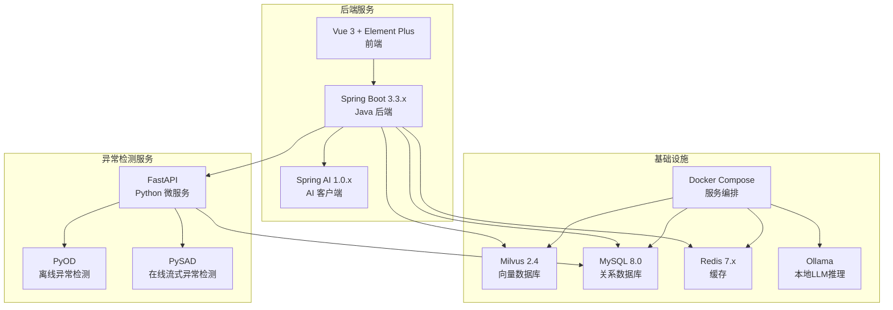
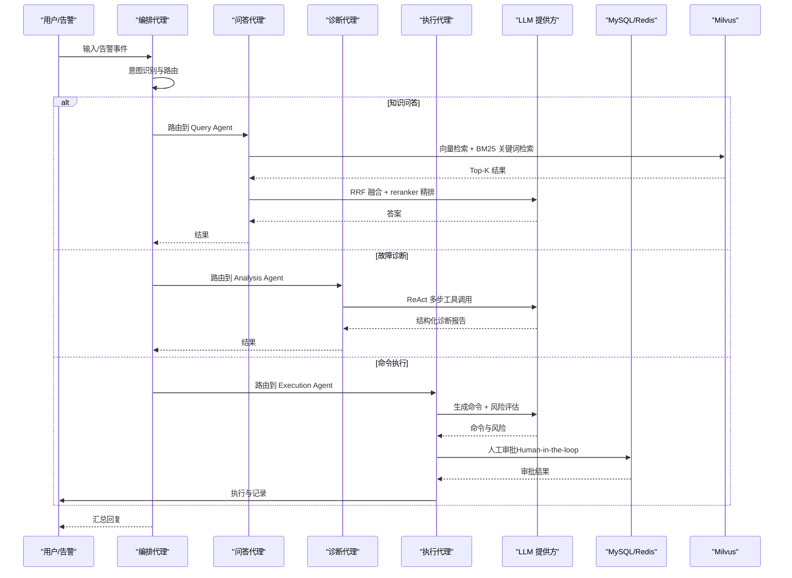
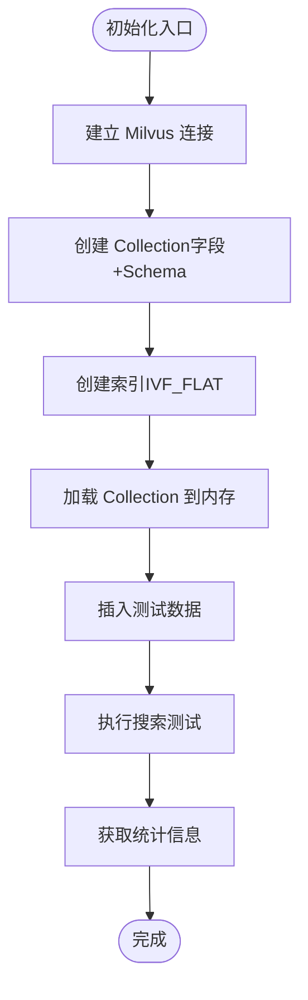
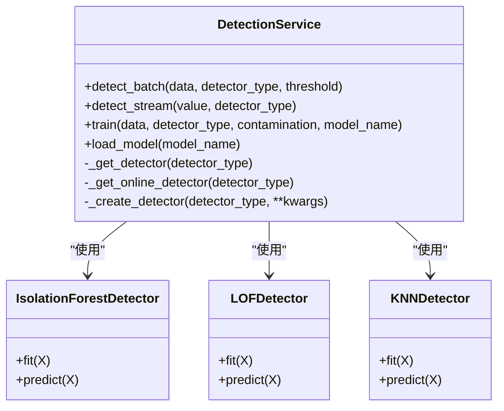
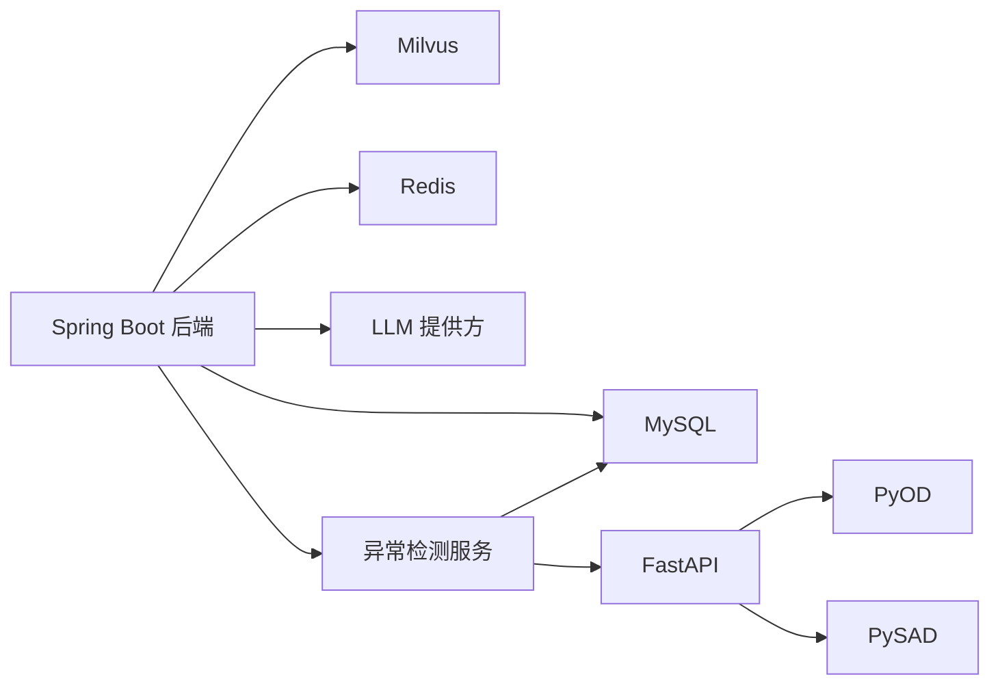

# 技术栈介绍

<cite>
**本文档引用的文件**
- [PROJECT_CONTEXT.md](file://PROJECT_CONTEXT.md)
- [docker-compose.yml](file://docker-compose.yml)
- [config/milvus_collection.yaml](file://config/milvus_collection.yaml)
- [scripts/init_milvus.py](file://scripts/init_milvus.py)
- [sql/init.sql](file://sql/init.sql)
- [tests/test_milvus_connection.py](file://tests/test_milvus_connection.py)
- [docs/prompts/orchestrator-system-prompt.md](file://docs/prompts/orchestrator-system-prompt.md)
- [docs/prompts/shared-safety-constraints.md](file://docs/prompts/shared-safety-constraints.md)
- [anomaly-detection-service/app/api/routes/detection.py](file://anomaly-detection-service/app/api/routes/detection.py)
- [anomaly-detection-service/app/services/detection_service.py](file://anomaly-detection-service/app/services/detection_service.py)
- [anomaly-detection-service/app/core/pyod_detector.py](file://anomaly-detection-service/app/core/pyod_detector.py)
- [anomaly-detection-service/requirements.txt](file://anomaly-detection-service/requirements.txt)
</cite>

## 目录
1. [简介](#简介)
2. [项目结构](#项目结构)
3. [核心组件](#核心组件)
4. [架构总览](#架构总览)
5. [详细组件分析](#详细组件分析)
6. [依赖关系分析](#依赖关系分析)
7. [性能考虑](#性能考虑)
8. [故障排除指南](#故障排除指南)
9. [结论](#结论)
10. [附录](#附录)

## 简介
本项目面向 NetData 监控数据的智能运维问答与执行系统，采用多语言、多组件协同的架构：后端使用 Spring Boot 3.3.x + Spring AI 1.0.x，异常检测采用 Python FastAPI + PyOD + PySAD，向量数据库使用 Milvus 2.4，LLM 提供方支持 DeepSeek-V3 API 与 Ollama，前端使用 Vue 3 + Element Plus，数据库采用 MySQL 8.0 + Redis 7.x。系统通过 Orchestrator-Subagent 模式实现意图识别、任务路由与结果汇总，并结合 RAG 混合检索与 ReAct 诊断流程，最终实现 Human-in-the-Loop 的安全执行闭环。

## 项目结构
项目采用模块化分层组织，包含后端 Java 服务、Python 异常检测微服务、前端 Vue 应用以及基础设施编排与配置文件。

图表来源
- [docker-compose.yml:23-357](file://docker-compose.yml#L23-L357)
- [PROJECT_CONTEXT.md:120-149](file://PROJECT_CONTEXT.md#L120-L149)

章节来源
- [PROJECT_CONTEXT.md:120-149](file://PROJECT_CONTEXT.md#L120-L149)
- [docker-compose.yml:1-357](file://docker-compose.yml#L1-L357)

## 核心组件
- 后端框架：Spring Boot 3.3.x（Java 主语言），提供 REST API、WebSocket 实时通信、业务逻辑与集成。
- AI 框架：Spring AI 1.0.x，使用 ChatClient（注意：AiClient 已废弃），负责 LLM 调用、Prompt 管理与工具调用。
- 异常检测：Python FastAPI + PyOD + PySAD，提供批量与流式异常检测、模型训练与 NetData 数据对接。
- 向量数据库：Milvus 2.4，使用 BGE-M3 1024 维向量，IVF_FLAT 索引，支持 Cosine 相似度。
- LLM：DeepSeek-V3 API（主），Ollama 本地（开发调试备用），通过 Spring Boot 配置切换。
- 前端：Vue 3 + Element Plus，提供聊天界面、告警面板、知识库与执行审批页面。
- 数据库：MySQL 8.0（用户、对话、命令审计、告警、配置等表）+ Redis 7.x（会话、缓存、分布式锁）。
- 知识图谱：Neo4j（可选，5.x），用于 Graph RAG 与多跳推理。
- 容器编排：Docker Compose，一键启动 Milvus、MySQL、Redis、Ollama 等服务。

章节来源
- [PROJECT_CONTEXT.md:25-39](file://PROJECT_CONTEXT.md#L25-L39)
- [docker-compose.yml:99-154](file://docker-compose.yml#L99-L154)
- [sql/init.sql:22-274](file://sql/init.sql#L22-L274)

## 架构总览
系统采用 Orchestrator-Subagent 模式，用户输入或告警事件进入编排代理，进行意图识别与路由，随后由 Query/Analysis/Execution 子代理分别执行问答、诊断与执行流程。异常检测服务独立部署并通过 API 与后端交互，RAG 知识库通过 Milvus 提供混合检索与精排。

图表来源
- [PROJECT_CONTEXT.md:43-61](file://PROJECT_CONTEXT.md#L43-L61)
- [docs/prompts/orchestrator-system-prompt.md:16-57](file://docs/prompts/orchestrator-system-prompt.md#L16-L57)

章节来源
- [PROJECT_CONTEXT.md:43-61](file://PROJECT_CONTEXT.md#L43-L61)
- [docs/prompts/orchestrator-system-prompt.md:1-291](file://docs/prompts/orchestrator-system-prompt.md#L1-L291)

## 详细组件分析

### 向量数据库（Milvus 2.4）
- 设计要点：Collection 名称、字段定义、索引类型（IVF_FLAT）、nlist/nprobe 参数、Top-K 返回字段。
- 维度与模型：BGE-M3 1024 维，创建后不可更改，需在早期严格确定。
- 初始化脚本：提供连接、创建 Collection、创建索引、加载、插入测试数据与搜索测试。
- 健康检查：gRPC 连接与健康端点（/healthz）测试。

图表来源
- [scripts/init_milvus.py:457-512](file://scripts/init_milvus.py#L457-L512)
- [config/milvus_collection.yaml:22-140](file://config/milvus_collection.yaml#L22-L140)

章节来源
- [config/milvus_collection.yaml:1-186](file://config/milvus_collection.yaml#L1-L186)
- [scripts/init_milvus.py:1-516](file://scripts/init_milvus.py#L1-L516)
- [tests/test_milvus_connection.py:1-148](file://tests/test_milvus_connection.py#L1-L148)

### 异常检测服务（Python FastAPI + PyOD + PySAD）
- 服务职责：批量检测、流式检测、模型训练、NetData 数据抓取与检测。
- 算法实现：PyOD 提供 Isolation Forest、LOF、KNN 等离线算法；PySAD 提供半空间树、xStream 等在线算法。
- 接口设计：/batch、/stream、/train、/netdata/fetch，支持阈值分级与异常等级判定。
- 模型管理：检测服务维护离线/在线检测器实例池，支持模型持久化与加载。

图表来源
- [anomaly-detection-service/app/services/detection_service.py:37-334](file://anomaly-detection-service/app/services/detection_service.py#L37-L334)
- [anomaly-detection-service/app/core/pyod_detector.py:31-287](file://anomaly-detection-service/app/core/pyod_detector.py#L31-L287)

章节来源
- [anomaly-detection-service/app/api/routes/detection.py:1-378](file://anomaly-detection-service/app/api/routes/detection.py#L1-L378)
- [anomaly-detection-service/app/services/detection_service.py:1-334](file://anomaly-detection-service/app/services/detection_service.py#L1-L334)
- [anomaly-detection-service/app/core/pyod_detector.py:1-287](file://anomaly-detection-service/app/core/pyod_detector.py#L1-L287)
- [anomaly-detection-service/requirements.txt:1-91](file://anomaly-detection-service/requirements.txt#L1-L91)

### 后端服务（Spring Boot 3.3.x + Spring AI 1.0.x）
- 技术选型：Spring Boot 3.3.x（Java 主语言），Spring AI 1.0.x（ChatClient，避免使用已废弃的 AiClient）。
- 组件职责：控制器（REST API）、WebSocket（实时通信）、业务服务、AI 客户端（LLM/Embedding/Prompt 管理）、RAG 核心（切分、混合检索、重排）。
- 集成方式：通过配置文件切换 LLM 提供方（DeepSeek API/Ollama），统一管理 Prompt 与工具调用。

章节来源
- [PROJECT_CONTEXT.md:25-40](file://PROJECT_CONTEXT.md#L25-L40)

### 前端（Vue 3 + Element Plus）
- 页面构成：Chat、AlertDashboard、KnowledgeBase、ExecutionApproval。
- 交互特性：实时消息、告警面板、知识库浏览、执行审批流程。
- 集成方式：通过 REST API 与 WebSocket 与后端交互。

章节来源
- [PROJECT_CONTEXT.md:141-145](file://PROJECT_CONTEXT.md#L141-L145)

### 数据库与缓存（MySQL 8.0 + Redis 7.x）
- MySQL：用户表、知识库文档、对话历史、命令审计、告警记录、异常检测结果、系统配置、统计视图。
- Redis：会话缓存、RAG 检索结果缓存、分布式锁、实时告警去重。

章节来源
- [sql/init.sql:22-274](file://sql/init.sql#L22-L274)
- [docker-compose.yml:218-246](file://docker-compose.yml#L218-L246)

### 安全约束与执行流程
- 安全原则：最小权限、防御优先、审计追溯。
- 命令执行：禁止危险命令、需要审批的命令、可自动执行的命令、审批流程分级。
- 审计日志：统一格式、必须记录事件、错误信息脱敏、异常恢复与回滚。

章节来源
- [docs/prompts/shared-safety-constraints.md:1-396](file://docs/prompts/shared-safety-constraints.md#L1-L396)

## 依赖关系分析
- 后端与 Milvus：通过 Spring Boot 连接 Milvus，执行向量检索与混合检索。
- 后端与异常检测服务：通过 REST API 调用批量/流式检测与 NetData 数据抓取。
- 后端与数据库：MySQL 存储业务数据，Redis 提供缓存与分布式能力。
- 后端与 LLM：通过 Spring AI ChatClient 调用 DeepSeek API 或 Ollama，支持 Prompt 管理与工具调用。
- 异常检测服务内部：FastAPI 路由 -> DetectionService -> PyOD/PySAD 检测器实现。

图表来源
- [docker-compose.yml:23-357](file://docker-compose.yml#L23-L357)
- [anomaly-detection-service/app/api/routes/detection.py:1-378](file://anomaly-detection-service/app/api/routes/detection.py#L1-L378)

章节来源
- [docker-compose.yml:1-357](file://docker-compose.yml#L1-L357)
- [anomaly-detection-service/app/api/routes/detection.py:1-378](file://anomaly-detection-service/app/api/routes/detection.py#L1-L378)

## 性能考虑
- Milvus 索引与参数：根据数据规模选择 nlist（建议 sqrt(N)~N/100），nprobe 控制精度与速度平衡；Cosine 相似度适合文本语义检索。
- 向量维度固定：BGE-M3 1024 维，创建后不可更改，需在早期确定 Embedding 模型。
- Python-Java 通信：PyOD 处理大数据时 REST 可能超时，Java 端需设置合理超时与重试。
- LLM 切换：通过配置文件（Profile）切换 DeepSeek API 与 Ollama，避免修改代码。
- Prompt 管理：从第一天起使用 @Value 或专门的 Prompt 类管理，避免硬编码在 Service 中。

章节来源
- [PROJECT_CONTEXT.md:110-117](file://PROJECT_CONTEXT.md#L110-L117)
- [config/milvus_collection.yaml:54-184](file://config/milvus_collection.yaml#L54-L184)

## 故障排除指南
- Milvus 连接与健康检查：使用连接测试脚本验证 gRPC 连接与健康端点 /healthz；若失败，查看容器日志并确认端口映射与资源分配。
- Docker 环境：确保 etcd、MinIO、Milvus、MySQL、Redis、Ollama 服务均健康；首次启动前复制 .env.example 为 .env 并修改密码。
- Python 依赖：安装 requirements.txt 中的依赖，注意 PyOD/PySAD 对 numpy/scipy 的依赖安装较慢。
- LLM 配置：application.yml 中配置两套（DeepSeek API + Ollama），使用 Profile 切换，不要改动代码。

章节来源
- [tests/test_milvus_connection.py:1-148](file://tests/test_milvus_connection.py#L1-L148)
- [docker-compose.yml:17-21](file://docker-compose.yml#L17-L21)
- [anomaly-detection-service/requirements.txt:1-91](file://anomaly-detection-service/requirements.txt#L1-L91)
- [PROJECT_CONTEXT.md:115-117](file://PROJECT_CONTEXT.md#L115-L117)

## 结论
本项目通过清晰的模块化架构与严格的版本与兼容性约束，实现了从监控数据到智能问答、诊断与执行的完整闭环。技术栈选择兼顾性能、易用性与可扩展性，为后续 Graph RAG、知识图谱与更复杂的 Agent 协作提供了坚实基础。

## 附录
- 开发阶段规划：Phase 0（环境搭建）→ Phase 1（异常检测服务）→ Phase 2（RAG 知识库）→ Phase 3（Multi-Agent）→ Phase 4（执行审批）→ Phase 5（前端+联调）→ Phase 6（论文与评估）。
- 关键注意事项：Spring AI 版本与 ChatClient、Milvus 维度固定、Python-Java 通信超时、Prompt 管理、LLM 切换与配置文件。

章节来源
- [PROJECT_CONTEXT.md:96-117](file://PROJECT_CONTEXT.md#L96-L117)