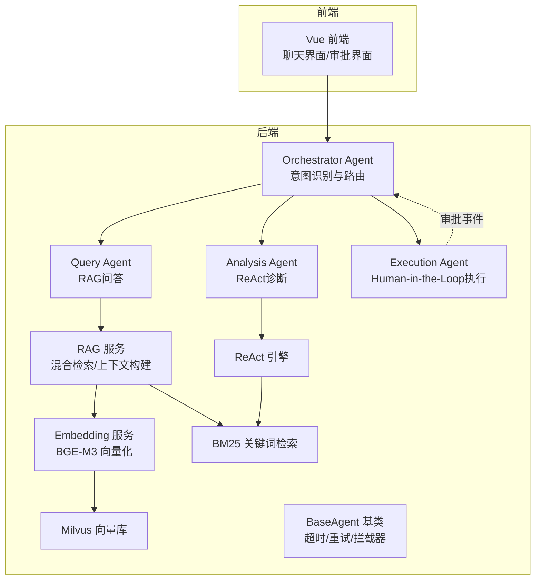
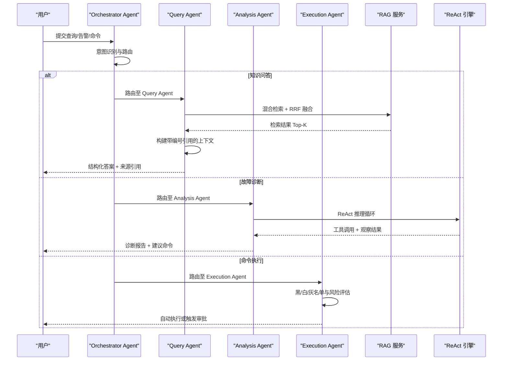
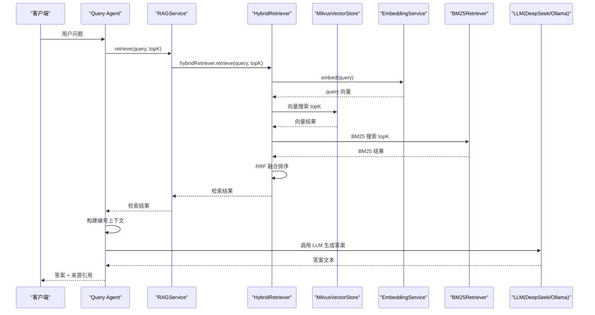
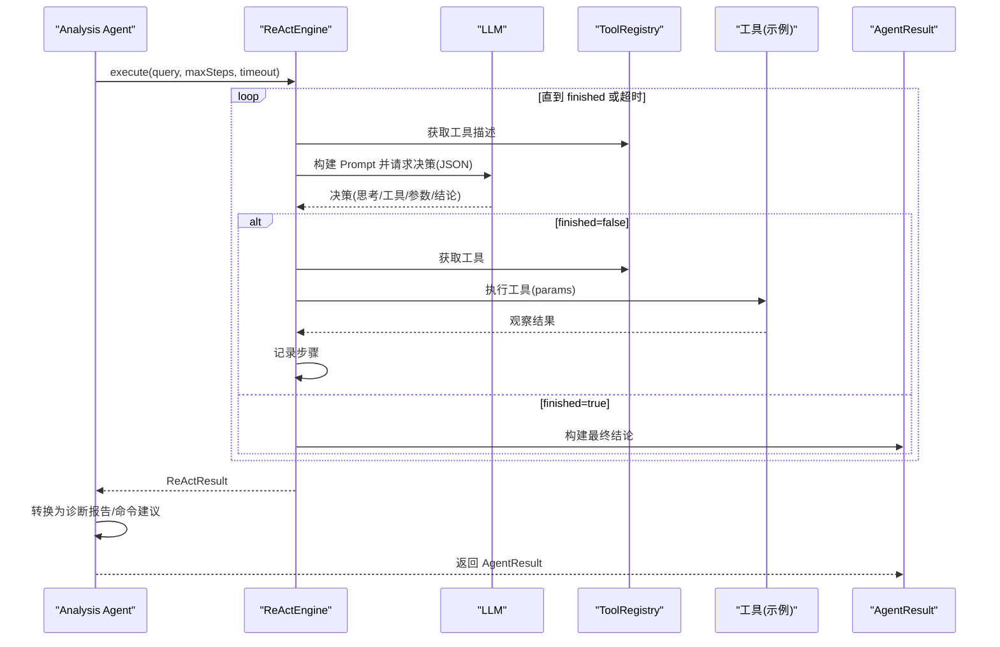
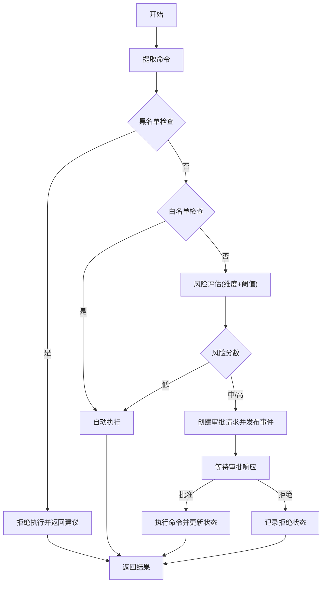
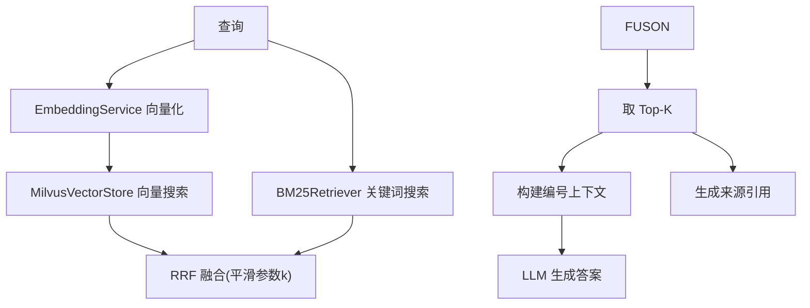
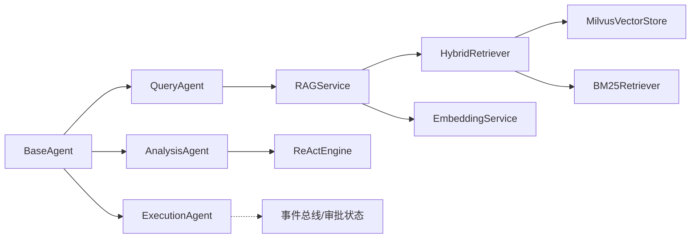

# 核心功能特性

<cite>
**本文引用的文件**
- [QueryAgent.java](file://netdata-ai-backend/src/main/java/com/netdata/ops/core/agent/QueryAgent.java)
- [AnalysisAgent.java](file://netdata-ai-backend/src/main/java/com/netdata/ops/core/agent/AnalysisAgent.java)
- [ExecutionAgent.java](file://netdata-ai-backend/src/main/java/com/netdata/ops/core/agent/ExecutionAgent.java)
- [RAGService.java](file://netdata-ai-backend/src/main/java/com/netdata/ops/core/rag/RAGService.java)
- [HybridRetriever.java](file://netdata-ai-backend/src/main/java/com/netdata/ops/core/rag/HybridRetriever.java)
- [EmbeddingService.java](file://netdata-ai-backend/src/main/java/com/netdata/ops/core/rag/EmbeddingService.java)
- [MilvusVectorStore.java](file://netdata-ai-backend/src/main/java/com/netdata/ops/core/rag/MilvusVectorStore.java)
- [BM25Retriever.java](file://netdata-ai-backend/src/main/java/com/netdata/ops/core/rag/BM25Retriever.java)
- [ReActEngine.java](file://netdata-ai-backend/src/main/java/com/netdata/ops/core/agent/ReActEngine.java)
- [BaseAgent.java](file://netdata-ai-backend/src/main/java/com/netdata/ops/core/agent/BaseAgent.java)
- [AgentContext.java](file://netdata-ai-backend/src/main/java/com/netdata/ops/core/agent/AgentContext.java)
- [AgentResult.java](file://netdata-ai-backend/src/main/java/com/netdata/ops/core/agent/AgentResult.java)
- [application.yml](file://netdata-ai-backend/src/main/resources/application.yml)
- [orchestrator-system-prompt.md](file://docs/prompts/orchestrator-system-prompt.md)
- [shared-safety-constraints.md](file://docs/prompts/shared-safety-constraints.md)
</cite>

## 目录
1. [简介](#简介)
2. [项目结构](#项目结构)
3. [核心组件](#核心组件)
4. [架构总览](#架构总览)
5. [详细组件分析](#详细组件分析)
6. [依赖分析](#依赖分析)
7. [性能考量](#性能考量)
8. [故障排查指南](#故障排查指南)
9. [结论](#结论)
10. [附录](#附录)

## 简介
本文件围绕智能运维系统的核心功能特性，系统性阐述三大Agent模块：自然语言问答系统（Query Agent）、智能故障诊断系统（Analysis Agent）、命令执行系统（Execution Agent）。重点解释RAG检索增强问答的实现机制（混合检索、RRF融合算法、可选rerank精排），ReAct推理模式在故障诊断中的应用，以及Human-in-the-Loop执行流程的安全保障机制。文档同时提供架构图、序列图与流程图，帮助读者从高层到代码级全面理解系统设计与实现。

## 项目结构
系统采用“后端Java + 前端Vue”的前后端分离架构，核心Agent与RAG能力位于后端模块。Agent层负责意图识别、路由与执行；RAG层负责知识入库、检索与上下文构建；安全与合规通过共享安全约束与配置化策略落地。

图表来源
- [application.yml:14-314](file://netdata-ai-backend/src/main/resources/application.yml#L14-L314)
- [BaseAgent.java:39-480](file://netdata-ai-backend/src/main/java/com/netdata/ops/core/agent/BaseAgent.java#L39-L480)
- [RAGService.java:35-212](file://netdata-ai-backend/src/main/java/com/netdata/ops/core/rag/RAGService.java#L35-L212)
- [HybridRetriever.java:40-247](file://netdata-ai-backend/src/main/java/com/netdata/ops/core/rag/HybridRetriever.java#L40-L247)
- [EmbeddingService.java:36-190](file://netdata-ai-backend/src/main/java/com/netdata/ops/core/rag/EmbeddingService.java#L36-L190)
- [MilvusVectorStore.java:42-406](file://netdata-ai-backend/src/main/java/com/netdata/ops/core/rag/MilvusVectorStore.java#L42-L406)
- [BM25Retriever.java:38-257](file://netdata-ai-backend/src/main/java/com/netdata/ops/core/rag/BM25Retriever.java#L38-L257)
- [ReActEngine.java:49-461](file://netdata-ai-backend/src/main/java/com/netdata/ops/core/agent/ReActEngine.java#L49-L461)
- [QueryAgent.java:36-179](file://netdata-ai-backend/src/main/java/com/netdata/ops/core/agent/QueryAgent.java#L36-L179)
- [AnalysisAgent.java:33-260](file://netdata-ai-backend/src/main/java/com/netdata/ops/core/agent/AnalysisAgent.java#L33-L260)
- [ExecutionAgent.java:41-409](file://netdata-ai-backend/src/main/java/com/netdata/ops/core/agent/ExecutionAgent.java#L41-L409)

章节来源
- [application.yml:14-314](file://netdata-ai-backend/src/main/resources/application.yml#L14-L314)

## 核心组件
- Query Agent：基于RAG的检索增强问答，混合向量与关键词检索，采用RRF融合与可选rerank精排，构建带编号引用的上下文，结合LLM生成结构化答案与来源引用。
- Analysis Agent：基于ReAct推理引擎的动态诊断Agent，通过工具调用与LLM决策形成“思考-行动-观察”闭环，输出诊断报告与命令建议，并记录工具调用历史。
- Execution Agent：Human-in-the-Loop命令执行Agent，具备黑名单/白名单/灰名单风险控制、风险评估阈值、审批事件驱动与审计日志记录，确保高风险操作受控。

章节来源
- [QueryAgent.java:36-179](file://netdata-ai-backend/src/main/java/com/netdata/ops/core/agent/QueryAgent.java#L36-L179)
- [AnalysisAgent.java:33-260](file://netdata-ai-backend/src/main/java/com/netdata/ops/core/agent/AnalysisAgent.java#L33-L260)
- [ExecutionAgent.java:41-409](file://netdata-ai-backend/src/main/java/com/netdata/ops/core/agent/ExecutionAgent.java#L41-L409)

## 架构总览
系统以BaseAgent为统一执行框架，提供超时控制、重试、拦截器、指标采集与链路追踪；各Agent通过统一上下文与结果模型交互；RAG服务提供文档入库、混合检索与上下文构建；ReAct引擎实现LLM驱动的动态推理；安全约束通过共享提示词与配置化策略贯穿执行全流程。

图表来源
- [BaseAgent.java:107-222](file://netdata-ai-backend/src/main/java/com/netdata/ops/core/agent/BaseAgent.java#L107-L222)
- [QueryAgent.java:61-98](file://netdata-ai-backend/src/main/java/com/netdata/ops/core/agent/QueryAgent.java#L61-L98)
- [AnalysisAgent.java:46-58](file://netdata-ai-backend/src/main/java/com/netdata/ops/core/agent/AnalysisAgent.java#L46-L58)
- [ExecutionAgent.java:133-182](file://netdata-ai-backend/src/main/java/com/netdata/ops/core/agent/ExecutionAgent.java#L133-L182)
- [RAGService.java:116-130](file://netdata-ai-backend/src/main/java/com/netdata/ops/core/rag/RAGService.java#L116-L130)
- [ReActEngine.java:126-182](file://netdata-ai-backend/src/main/java/com/netdata/ops/core/agent/ReActEngine.java#L126-L182)

## 详细组件分析

### 自然语言问答系统（Query Agent）
- 工作原理
  - 使用RAGService执行混合检索（向量 + BM25），采用RRF融合算法得到最终排序，构建带编号引用的上下文，注入LLM生成答案。
  - 若检索为空，使用兜底提示词让LLM基于通用知识回答，但明确标注无佐证来源，置信度降低。
  - 通过LLM降级处理器（DeepSeek → Ollama）保障服务可用性，极端异常时返回兜底文本。
- 关键实现要点
  - 检索流程：RAGService -> HybridRetriever（向量检索 + BM25检索 + RRF融合）。
  - 上下文构建：编号引用（[1]、[2]）便于LLM直接引用与前端溯源。
  - 引用列表：包含来源、标题、分数与片段预览，支持审计与溯源。
- 场景应用
  - 配置咨询、最佳实践查询、原理解释等知识问答场景。

图表来源
- [QueryAgent.java:61-98](file://netdata-ai-backend/src/main/java/com/netdata/ops/core/agent/QueryAgent.java#L61-L98)
- [RAGService.java:116-130](file://netdata-ai-backend/src/main/java/com/netdata/ops/core/rag/RAGService.java#L116-L130)
- [HybridRetriever.java:75-100](file://netdata-ai-backend/src/main/java/com/netdata/ops/core/rag/HybridRetriever.java#L75-L100)
- [EmbeddingService.java:72-93](file://netdata-ai-backend/src/main/java/com/netdata/ops/core/rag/EmbeddingService.java#L72-L93)
- [MilvusVectorStore.java:274-324](file://netdata-ai-backend/src/main/java/com/netdata/ops/core/rag/MilvusVectorStore.java#L274-L324)
- [BM25Retriever.java:132-178](file://netdata-ai-backend/src/main/java/com/netdata/ops/core/rag/BM25Retriever.java#L132-L178)

章节来源
- [QueryAgent.java:36-179](file://netdata-ai-backend/src/main/java/com/netdata/ops/core/agent/QueryAgent.java#L36-L179)
- [RAGService.java:35-212](file://netdata-ai-backend/src/main/java/com/netdata/ops/core/rag/RAGService.java#L35-L212)
- [HybridRetriever.java:40-247](file://netdata-ai-backend/src/main/java/com/netdata/ops/core/rag/HybridRetriever.java#L40-L247)
- [EmbeddingService.java:36-190](file://netdata-ai-backend/src/main/java/com/netdata/ops/core/rag/EmbeddingService.java#L36-L190)
- [MilvusVectorStore.java:42-406](file://netdata-ai-backend/src/main/java/com/netdata/ops/core/rag/MilvusVectorStore.java#L42-L406)
- [BM25Retriever.java:38-257](file://netdata-ai-backend/src/main/java/com/netdata/ops/core/rag/BM25Retriever.java#L38-L257)

### 智能故障诊断系统（Analysis Agent + ReAct 引擎）
- 工作原理
  - Analysis Agent委托ReActEngine执行推理循环：LLM生成“思考”，选择工具，执行工具并记录“观察”，直至判定信息充分输出结论。
  - ReAct引擎支持工具动态选择、JSON解析容错、超时与最大步数保护，避免无限循环。
  - Analysis Agent将ReAct结果转换为诊断报告（摘要、根因、证据、建议）与命令建议，并记录工具调用历史。
- 关键实现要点
  - ReAct Prompt模板：包含工具描述、已完成步骤、用户问题与指令，强制JSON输出。
  - 工具调用：通过工具注册表动态获取工具，新增工具无需修改引擎。
  - 超时与步数：默认最大步数与超时，保障系统稳定性。
- 场景应用
  - CPU/内存/磁盘等异常排查、根因分析与建议生成。

图表来源
- [AnalysisAgent.java:46-132](file://netdata-ai-backend/src/main/java/com/netdata/ops/core/agent/AnalysisAgent.java#L46-L132)
- [ReActEngine.java:126-182](file://netdata-ai-backend/src/main/java/com/netdata/ops/core/agent/ReActEngine.java#L126-L182)
- [ReActEngine.java:191-216](file://netdata-ai-backend/src/main/java/com/netdata/ops/core/agent/ReActEngine.java#L191-L216)
- [ReActEngine.java:228-278](file://netdata-ai-backend/src/main/java/com/netdata/ops/core/agent/ReActEngine.java#L228-L278)
- [ReActEngine.java:311-335](file://netdata-ai-backend/src/main/java/com/netdata/ops/core/agent/ReActEngine.java#L311-L335)

章节来源
- [AnalysisAgent.java:33-260](file://netdata-ai-backend/src/main/java/com/netdata/ops/core/agent/AnalysisAgent.java#L33-L260)
- [ReActEngine.java:49-461](file://netdata-ai-backend/src/main/java/com/netdata/ops/core/agent/ReActEngine.java#L49-L461)

### 命令执行系统（Execution Agent + Human-in-the-Loop）
- 工作原理
  - 命令提取：从用户输入中抽取命令（简化实现，生产环境应使用NLP解析）。
  - 安全控制：黑名单（禁止执行）、白名单（自动执行）、灰名单（需要审批）。
  - 风险评估：综合命令类型、影响范围、可逆性、执行频率，设定阈值分级。
  - 审批流程：高风险命令通过事件总线发布审批请求，审批通过后执行并记录审计日志。
- 关键实现要点
  - 黑/白/灰名单正则匹配，支持扩展。
  - 风险评估维度与阈值可配置。
  - 审批事件驱动，支持审批响应回调与状态更新。
- 场景应用
  - 服务状态查询、日志查看、低风险清理、服务重启等自动执行；高风险命令必须审批。

图表来源
- [ExecutionAgent.java:133-182](file://netdata-ai-backend/src/main/java/com/netdata/ops/core/agent/ExecutionAgent.java#L133-L182)
- [ExecutionAgent.java:170-181](file://netdata-ai-backend/src/main/java/com/netdata/ops/core/agent/ExecutionAgent.java#L170-L181)
- [ExecutionAgent.java:326-379](file://netdata-ai-backend/src/main/java/com/netdata/ops/core/agent/ExecutionAgent.java#L326-L379)
- [ExecutionAgent.java:104-129](file://netdata-ai-backend/src/main/java/com/netdata/ops/core/agent/ExecutionAgent.java#L104-L129)

章节来源
- [ExecutionAgent.java:41-409](file://netdata-ai-backend/src/main/java/com/netdata/ops/core/agent/ExecutionAgent.java#L41-L409)

### RAG检索增强问答（实现机制）
- 混合检索
  - 向量检索：将查询文本向量化，使用Milvus进行相似度搜索。
  - BM25检索：基于词频的关键词检索，补充语义检索不足。
  - RRF融合：对同一文档在不同检索器中的排名进行融合，消除分数尺度差异，鲁棒性强。
- rerank精排（可选）
  - 可在混合检索后接入rerank模型对候选进行二次排序，提升相关性。
- 上下文构建与引用
  - 将检索结果格式化为带编号引用的上下文，便于LLM引用与溯源。
  - 生成来源引用列表，包含来源、标题、分数与片段预览。

图表来源
- [RAGService.java:116-130](file://netdata-ai-backend/src/main/java/com/netdata/ops/core/rag/RAGService.java#L116-L130)
- [HybridRetriever.java:75-100](file://netdata-ai-backend/src/main/java/com/netdata/ops/core/rag/HybridRetriever.java#L75-L100)
- [EmbeddingService.java:72-93](file://netdata-ai-backend/src/main/java/com/netdata/ops/core/rag/EmbeddingService.java#L72-L93)
- [MilvusVectorStore.java:274-324](file://netdata-ai-backend/src/main/java/com/netdata/ops/core/rag/MilvusVectorStore.java#L274-L324)
- [BM25Retriever.java:132-178](file://netdata-ai-backend/src/main/java/com/netdata/ops/core/rag/BM25Retriever.java#L132-L178)
- [HybridRetriever.java:134-193](file://netdata-ai-backend/src/main/java/com/netdata/ops/core/rag/HybridRetriever.java#L134-L193)

章节来源
- [RAGService.java:35-212](file://netdata-ai-backend/src/main/java/com/netdata/ops/core/rag/RAGService.java#L35-L212)
- [HybridRetriever.java:40-247](file://netdata-ai-backend/src/main/java/com/netdata/ops/core/rag/HybridRetriever.java#L40-L247)
- [EmbeddingService.java:36-190](file://netdata-ai-backend/src/main/java/com/netdata/ops/core/rag/EmbeddingService.java#L36-L190)
- [MilvusVectorStore.java:42-406](file://netdata-ai-backend/src/main/java/com/netdata/ops/core/rag/MilvusVectorStore.java#L42-L406)
- [BM25Retriever.java:38-257](file://netdata-ai-backend/src/main/java/com/netdata/ops/core/rag/BM25Retriever.java#L38-L257)

### ReAct推理模式在故障诊断中的应用
- 动态决策：LLM根据当前上下文与观察结果动态选择下一步行动，而非硬编码流程。
- JSON协议：强制LLM输出JSON，包含思考、工具名称、参数或最终结论，便于解析与容错。
- 安全与稳定：最大步数与超时保护，避免无限循环；工具不存在或执行异常时提供友好提示。
- 结果结构：输出摘要、根因、建议与证据，便于人类审阅与决策。

章节来源
- [ReActEngine.java:49-461](file://netdata-ai-backend/src/main/java/com/netdata/ops/core/agent/ReActEngine.java#L49-L461)
- [AnalysisAgent.java:107-132](file://netdata-ai-backend/src/main/java/com/netdata/ops/core/agent/AnalysisAgent.java#L107-L132)

### Human-in-the-Loop执行流程的安全保障机制
- 安全策略
  - 黑名单：绝对禁止执行的命令（如系统销毁、权限开放、fork炸弹等）。
  - 白名单：可自动执行的命令（信息查询、日志查看、服务状态等）。
  - 灰名单：需要人工审批的命令（服务停止/重启、进程操作、配置修改、数据操作、网络操作等）。
- 风险评估
  - 维度：命令类型（40%）、影响范围（30%）、可逆性（20%）、执行频率（10%）。
  - 阈值：低风险（<30）、中风险（60）、高风险（80）。
- 审批与审计
  - 事件驱动：创建审批请求并发布到事件总线，审批通过后执行并更新状态。
  - 审计日志：记录操作人、时间、内容、结果、IP、会话ID、耗时等。

章节来源
- [shared-safety-constraints.md:1-396](file://docs/prompts/shared-safety-constraints.md#L1-L396)
- [ExecutionAgent.java:41-409](file://netdata-ai-backend/src/main/java/com/netdata/ops/core/agent/ExecutionAgent.java#L41-L409)
- [application.yml:158-189](file://netdata-ai-backend/src/main/resources/application.yml#L158-L189)

## 依赖分析
- 组件耦合
  - BaseAgent为所有Agent提供统一执行框架，降低重复代码与提升横切关注点一致性。
  - Query/Analysis/Execution分别依赖RAG与ReAct引擎，体现职责分离与可复用性。
  - RAGService聚合文档切分、向量化、Milvus存储与BM25索引，形成完整的知识库能力。
- 外部依赖
  - LLM：DeepSeek API（生产）与Ollama本地模型（开发）双栈降级。
  - 向量库：Milvus，IVF_FLAT索引，COSINE相似度。
  - 配置中心：Spring Profile切换、环境变量注入、Actuator监控。

图表来源
- [BaseAgent.java:39-480](file://netdata-ai-backend/src/main/java/com/netdata/ops/core/agent/BaseAgent.java#L39-L480)
- [QueryAgent.java:36-49](file://netdata-ai-backend/src/main/java/com/netdata/ops/core/agent/QueryAgent.java#L36-L49)
- [AnalysisAgent.java:33-44](file://netdata-ai-backend/src/main/java/com/netdata/ops/core/agent/AnalysisAgent.java#L33-L44)
- [ExecutionAgent.java:41-89](file://netdata-ai-backend/src/main/java/com/netdata/ops/core/agent/ExecutionAgent.java#L41-L89)
- [RAGService.java:35-42](file://netdata-ai-backend/src/main/java/com/netdata/ops/core/rag/RAGService.java#L35-L42)
- [HybridRetriever.java:40-47](file://netdata-ai-backend/src/main/java/com/netdata/ops/core/rag/HybridRetriever.java#L40-L47)
- [EmbeddingService.java:36-48](file://netdata-ai-backend/src/main/java/com/netdata/ops/core/rag/EmbeddingService.java#L36-L48)
- [MilvusVectorStore.java:42-59](file://netdata-ai-backend/src/main/java/com/netdata/ops/core/rag/MilvusVectorStore.java#L42-L59)
- [BM25Retriever.java:38-46](file://netdata-ai-backend/src/main/java/com/netdata/ops/core/rag/BM25Retriever.java#L38-L46)
- [ReActEngine.java:49-54](file://netdata-ai-backend/src/main/java/com/netdata/ops/core/agent/ReActEngine.java#L49-L54)

章节来源
- [BaseAgent.java:39-480](file://netdata-ai-backend/src/main/java/com/netdata/ops/core/agent/BaseAgent.java#L39-L480)
- [application.yml:14-314](file://netdata-ai-backend/src/main/resources/application.yml#L14-L314)

## 性能考量
- 检索性能
  - 向量检索Top-K与BM25 Top-K可配置，RRF融合避免分数尺度差异，提升召回质量。
  - Milvus使用IVF_FLAT索引与COSINE度量，兼顾性能与精度。
- LLM调用
  - 双栈降级（DeepSeek → Ollama）与异常兜底，保障服务可用性。
  - BaseAgent超时控制与重试机制，避免长时间阻塞。
- 执行效率
  - 白名单命令自动执行，降低审批开销。
  - 风险评估阈值可调，平衡安全与效率。

## 故障排查指南
- LLM不可用
  - 现象：调用异常或超时。
  - 排查：检查DeepSeek API密钥与地址、Ollama本地服务状态；查看降级兜底逻辑。
- Milvus不可用
  - 现象：RAG检索为空或异常。
  - 排查：检查连接配置、Collection是否存在、索引是否创建成功；确认向量维度与模型一致。
- ReAct推理未完成
  - 现象：部分结果或超时。
  - 排查：增大最大步数与超时时间；检查工具是否存在与参数是否正确。
- 命令执行被拒绝
  - 现象：黑名单命中或审批拒绝。
  - 排查：确认命令是否在黑名单；调整风险评估阈值；检查审批流程与权限。

章节来源
- [QueryAgent.java:111-124](file://netdata-ai-backend/src/main/java/com/netdata/ops/core/agent/QueryAgent.java#L111-L124)
- [RAGService.java:182-190](file://netdata-ai-backend/src/main/java/com/netdata/ops/core/rag/RAGService.java#L182-L190)
- [MilvusVectorStore.java:80-103](file://netdata-ai-backend/src/main/java/com/netdata/ops/core/rag/MilvusVectorStore.java#L80-L103)
- [ReActEngine.java:126-182](file://netdata-ai-backend/src/main/java/com/netdata/ops/core/agent/ReActEngine.java#L126-L182)
- [ExecutionAgent.java:147-162](file://netdata-ai-backend/src/main/java/com/netdata/ops/core/agent/ExecutionAgent.java#L147-L162)

## 结论
本系统通过统一的Agent框架与RAG/ReAct能力，实现了从知识问答到故障诊断再到安全可控的命令执行的完整闭环。RAG混合检索与RRF融合提升了检索质量，ReAct推理使诊断过程可解释且可扩展，Human-in-the-Loop与多维风险评估确保高风险操作受控。配合完善的日志与审计，系统在保证安全性的同时兼顾效率与可维护性。

## 附录
- 配置要点
  - LLM：生产使用DeepSeek API，开发使用Ollama本地模型；支持降级。
  - Milvus：向量维度固定1024，索引类型IVF_FLAT，COSINE相似度。
  - RAG：向量Top-K、BM25 Top-K、最终Top-K与RRF平滑参数可配置。
  - 执行：黑名单/白名单/灰名单与风险阈值可配置，审批事件驱动。
- 提示词与安全
  - Orchestrator系统提示词定义意图识别与路由规则。
  - 共享安全约束定义命令执行安全规则、数据安全与审计日志规范。

章节来源
- [application.yml:14-314](file://netdata-ai-backend/src/main/resources/application.yml#L14-L314)
- [orchestrator-system-prompt.md:1-291](file://docs/prompts/orchestrator-system-prompt.md#L1-L291)
- [shared-safety-constraints.md:1-396](file://docs/prompts/shared-safety-constraints.md#L1-L396)