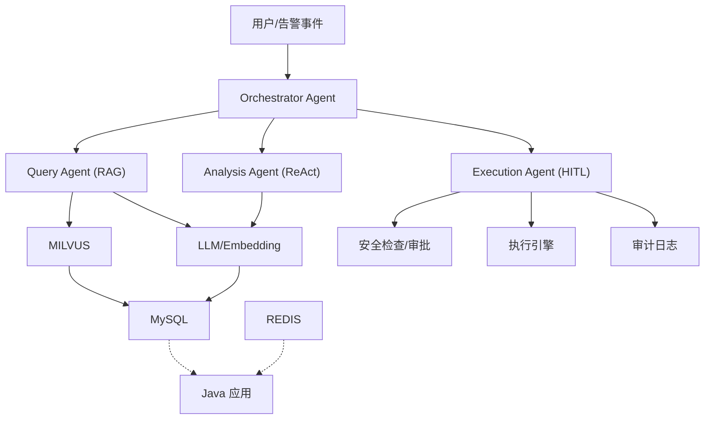
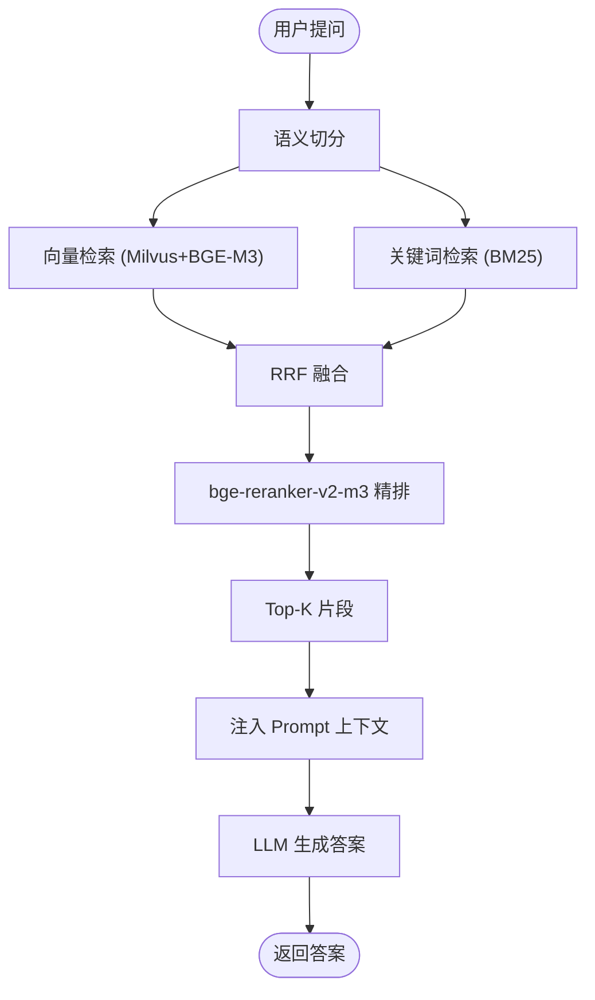
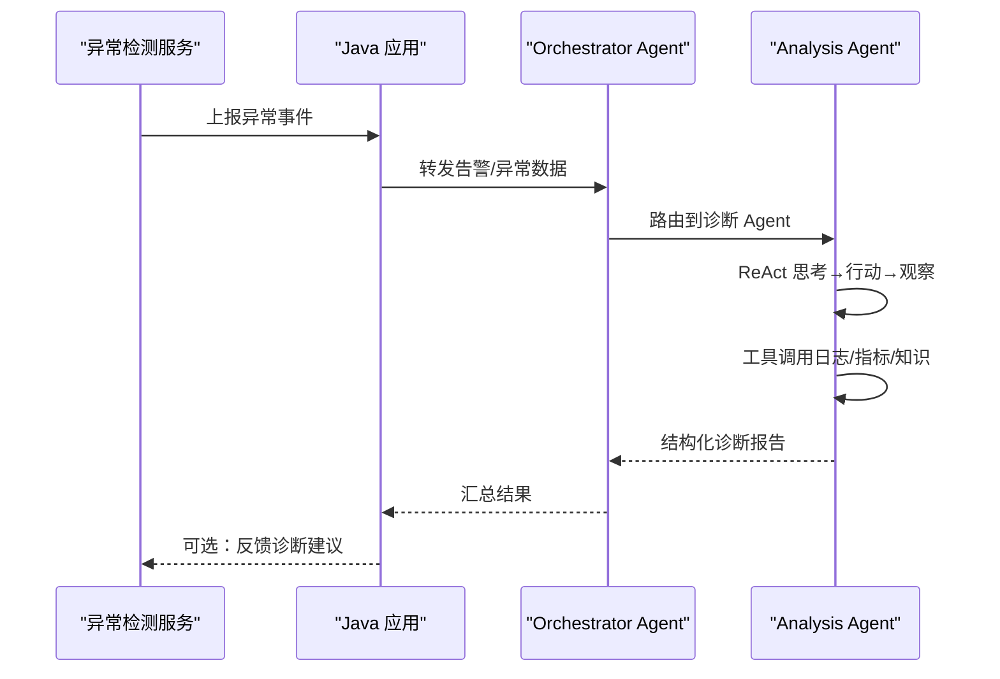
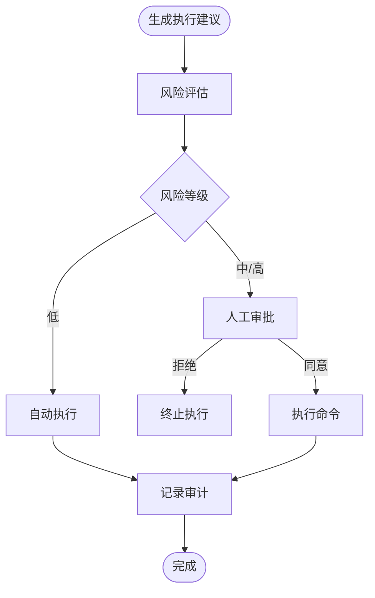
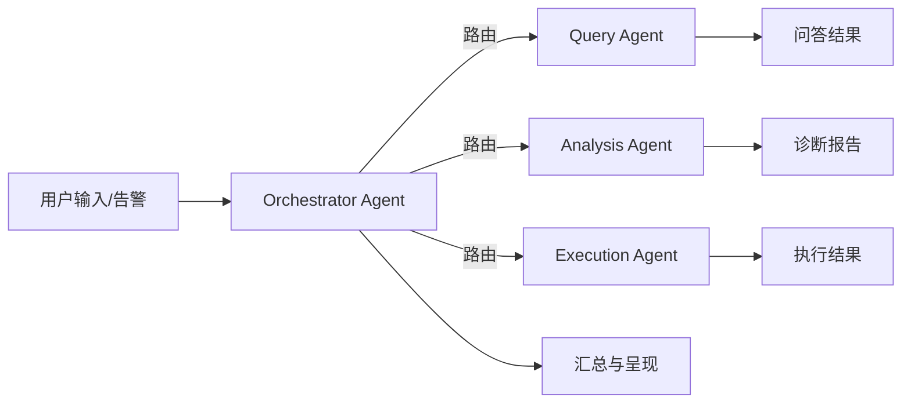
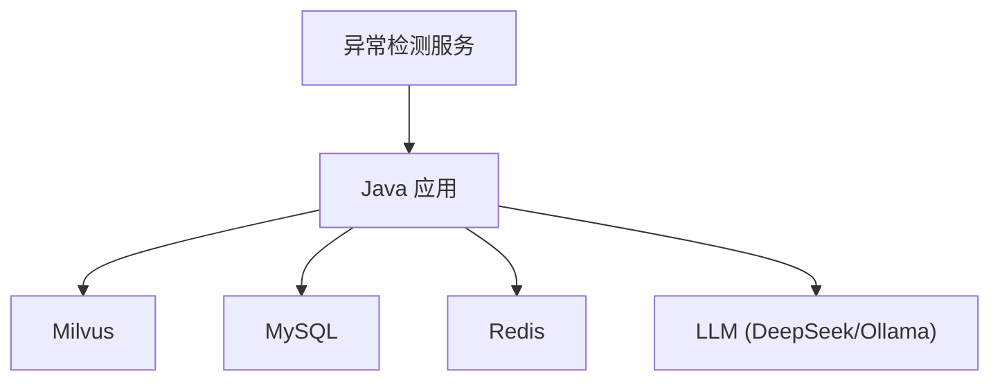

# 核心功能特性

<cite>
**本文引用的文件**
- [PROJECT_CONTEXT.md](file://PROJECT_CONTEXT.md)
- [开题报告_精简版.md](file://开题报告_精简版.md)
- [docker-compose.yml](file://docker-compose.yml)
- [config/milvus_collection.yaml](file://config/milvus_collection.yaml)
- [scripts/init_milvus.py](file://scripts/init_milvus.py)
- [sql/init.sql](file://sql/init.sql)
- [docs/prompts/orchestrator-system-prompt.md](file://docs/prompts/orchestrator-system-prompt.md)
- [文献/文献知识库_完整版.md](file://文献/文献知识库_完整版.md)
</cite>

## 目录
1. [简介](#简介)
2. [项目结构](#项目结构)
3. [核心组件](#核心组件)
4. [架构总览](#架构总览)
5. [详细组件分析](#详细组件分析)
6. [依赖分析](#依赖分析)
7. [性能考虑](#性能考虑)
8. [故障排查指南](#故障排查指南)
9. [结论](#结论)
10. [附录](#附录)

## 简介
本系统围绕 NetData 监控数据，构建多 Agent 协同的智能运维平台，具备三大核心能力：
- 自然语言问答系统（基于 RAG 的智能问答）
- 智能故障诊断系统（异常检测 + ReAct 根因分析）
- 命令执行系统（Human-in-the-Loop 安全执行）

系统采用 Orchestrator-Subagent 模式，通过编排代理进行意图识别与任务路由，分别交由 Query Agent、Analysis Agent、Execution Agent 执行对应流程，并在执行环节引入人工审批与安全控制，确保“能问、能诊、可控”。

## 项目结构
系统采用前后端分离与多服务编排的架构，核心目录与职责如下：
- 后端 Java 应用：提供 REST API、多 Agent 协同、RAG 检索、LLM 集成、WebSocket 实时通信等
- 异常检测 Python 服务：独立 FastAPI 微服务，负责实时异常检测与结果上报
- 前端 Vue3 应用：提供聊天界面、告警看板、知识库浏览、执行审批等
- 基础设施：Docker Compose 编排 Milvus、MySQL、Redis、Ollama 等

```mermaid
graph TB
subgraph "前端"
FE["Vue3 前端<br/>聊天/工单/看板"]
end
subgraph "后端 Java 应用"
ORCH["Orchestrator Agent<br/>意图识别/路由"]
QA["Query Agent<br/>RAG 问答"]
AA["Analysis Agent<br/>ReAct 诊断"]
EA["Execution Agent<br/>Human-in-the-Loop 执行"]
CTRL["控制器/服务层"]
WS["WebSocket 实时通信"]
end
subgraph "Python 异常检测服务"
DET["FastAPI 异常检测服务<br/>PyOD/PySAD"]
end
subgraph "基础设施"
MILVUS["Milvus 向量库"]
MYSQL["MySQL 关系库"]
REDIS["Redis 缓存"]
OLLAMA["Ollama 本地 LLM"]
end
FE --> CTRL
CTRL <- --> ORCH
ORCH --> QA
ORCH --> AA
ORCH --> EA
DET --> CTRL
CTRL --> MILVUS
CTRL --> MYSQL
CTRL --> REDIS
CTRL --> OLLAMA
CTRL --> WS
```

图表来源
- [docker-compose.yml:23-357](file://docker-compose.yml#L23-L357)
- [开题报告_精简版.md:118-152](file://开题报告_精简版.md#L118-L152)

章节来源
- [PROJECT_CONTEXT.md:120-149](file://PROJECT_CONTEXT.md#L120-L149)
- [docker-compose.yml:23-357](file://docker-compose.yml#L23-L357)

## 核心组件
- Orchestrator Agent（编排代理）：负责意图识别、实体抽取、路由计划与紧急程度评估，统一汇总多 Agent 结果
- Query Agent（问答代理）：基于 RAG 的混合检索（向量 + BM25）+ Rerank 精排，注入上下文生成答案
- Analysis Agent（诊断代理）：ReAct 推理循环，多步工具调用，输出结构化诊断报告
- Execution Agent（执行代理）：生成命令 → 风险评估 → 人工审批 → 执行 → 审计记录

章节来源
- [PROJECT_CONTEXT.md:43-61](file://PROJECT_CONTEXT.md#L43-L61)
- [开题报告_精简版.md:154-162](file://开题报告_精简版.md#L154-L162)

## 架构总览
系统通过 Orchestrator Agent 将用户输入或告警事件进行意图识别与路由，Query/Analysis/Execution 三个子 Agent 各司其职，后端 Java 应用提供统一的服务层与 LLM 集成，Milvus 提供向量检索，MySQL/Redis 提供结构化数据与缓存，Python 异常检测服务独立运行并通过 REST 上报。



图表来源
- [PROJECT_CONTEXT.md:43-61](file://PROJECT_CONTEXT.md#L43-L61)
- [开题报告_精简版.md:118-152](file://开题报告_精简版.md#L118-L152)

## 详细组件分析

### 自然语言问答系统（基于 RAG 的智能问答）
- 混合检索方案：向量检索（Milvus + BGE-M3 1024 维）+ 关键词检索（BM25），随后进行 RRF 融合与 reranker 精排，Top-K 注入 Prompt
- 文档切分：采用语义切分（Semantic Chunking），避免固定长度带来的语义割裂
- Prompt 管理：通过集中式 Prompt 管理（@Value 或 Prompt 类）避免硬编码，便于迭代与切换 LLM
- 业务价值：显著降低 LLM 幻觉，提升运维知识问答的准确性与可解释性



图表来源
- [PROJECT_CONTEXT.md:64-82](file://PROJECT_CONTEXT.md#L64-L82)
- [开题报告_精简版.md:191-221](file://开题报告_精简版.md#L191-L221)

章节来源
- [PROJECT_CONTEXT.md:64-82](file://PROJECT_CONTEXT.md#L64-L82)
- [开题报告_精简版.md:191-221](file://开题报告_精简版.md#L191-L221)

### 智能故障诊断系统（异常检测 + ReAct 根因分析）
- 异常检测：Python FastAPI + PyOD/PySAD，独立服务化部署，通过 REST 将异常事件上报 Java 层
- ReAct 推理：思考→行动→观察→再思考的循环，结合工具调用（如日志分析、指标对比、知识检索）形成结构化诊断报告
- 紧急程度：依据告警严重性与影响面进行分级，影响响应优先级与后续动作



图表来源
- [开题报告_精简版.md:163-190](file://开题报告_精简版.md#L163-L190)
- [PROJECT_CONTEXT.md:43-61](file://PROJECT_CONTEXT.md#L43-L61)

章节来源
- [开题报告_精简版.md:163-190](file://开题报告_精简版.md#L163-L190)
- [PROJECT_CONTEXT.md:43-61](file://PROJECT_CONTEXT.md#L43-L61)

### 命令执行系统（Human-in-the-Loop 安全执行）
- 命令生成：基于诊断结果与知识库生成可执行建议
- 风险评估：对命令类型、目标主机、风险等级进行评分与分级
- 人工审批：高风险命令必须经人工审批，支持审批流与状态流转
- 执行与审计：执行引擎记录执行结果、耗时、错误信息，审计日志全生命周期可追溯



图表来源
- [开题报告_精简版.md:275-301](file://开题报告_精简版.md#L275-L301)
- [sql/init.sql:112-159](file://sql/init.sql#L112-L159)

章节来源
- [开题报告_精简版.md:275-301](file://开题报告_精简版.md#L275-L301)
- [sql/init.sql:112-159](file://sql/init.sql#L112-L159)

### 多 Agent 协同架构与编排
- Orchestrator Agent：统一入口，负责意图识别、实体抽取、路由决策与结果汇总
- Query Agent：专注知识问答，RAG 流程稳定可靠
- Analysis Agent：专注根因分析，ReAct 循环可扩展工具链
- Execution Agent：专注安全执行，HITL 与审计闭环



图表来源
- [PROJECT_CONTEXT.md:43-61](file://PROJECT_CONTEXT.md#L43-L61)
- [docs/prompts/orchestrator-system-prompt.md:1-291](file://docs/prompts/orchestrator-system-prompt.md#L1-L291)

章节来源
- [PROJECT_CONTEXT.md:43-61](file://PROJECT_CONTEXT.md#L43-L61)
- [docs/prompts/orchestrator-system-prompt.md:1-291](file://docs/prompts/orchestrator-system-prompt.md#L1-L291)

## 依赖分析
- 向量数据库：Milvus 2.4，Collection 使用 BGE-M3 1024 维向量，索引类型 IVF_FLAT，nlist/nprobe 参数平衡精度与性能
- 关系数据库：MySQL 8.0，提供用户、对话、执行审计、命令模板、告警记录等结构化数据
- 缓存：Redis 7.x，用于会话、RAG 结果缓存、分布式锁与实时告警去重
- LLM：Spring AI 集成，支持 DeepSeek API 与 Ollama 本地模型，通过 Profile 切换
- Python 异常检测：FastAPI + PyOD/PySAD，独立服务通过 REST 与 Java 通信



图表来源
- [docker-compose.yml:23-357](file://docker-compose.yml#L23-L357)
- [config/milvus_collection.yaml:1-186](file://config/milvus_collection.yaml#L1-L186)
- [sql/init.sql:1-274](file://sql/init.sql#L1-L274)

章节来源
- [docker-compose.yml:23-357](file://docker-compose.yml#L23-L357)
- [config/milvus_collection.yaml:1-186](file://config/milvus_collection.yaml#L1-L186)
- [sql/init.sql:1-274](file://sql/init.sql#L1-L274)

## 性能考虑
- 检索性能：Milvus 采用 IVF_FLAT 索引，nlist 与 nprobe 参数需结合数据规模与延迟目标调优；Top-K 控制在 5 左右，兼顾准确与速度
- LLM 延迟：通过 Prompt 管理与缓存（Redis）减少重复计算；必要时使用 Ollama 本地模型降低外部依赖
- Python-Java 通信：异常检测服务与 Java 应用之间设置合理超时与重试，避免阻塞
- 数据库与缓存：MySQL/Redis 合理索引与连接池配置，避免成为瓶颈

## 故障排查指南
- Milvus 初始化与验证：使用初始化脚本创建 Collection、建立索引、加载数据并进行搜索测试
- 数据库初始化：首次启动 Docker 时自动执行 SQL 初始化脚本，创建用户、对话、执行审计、命令模板、告警记录等表
- 环境检查：提供跨平台环境检查脚本，验证各组件可用性
- 常见问题
  - 向量维度不匹配：BGE-M3 输出固定 1024 维，Collection 创建后不可更改
  - LLM 切换：通过 Profile 切换 DeepSeek API 与 Ollama，避免修改代码
  - Prompt 管理：集中管理提示词，避免硬编码导致的维护困难

章节来源
- [scripts/init_milvus.py:1-516](file://scripts/init_milvus.py#L1-L516)
- [sql/init.sql:1-274](file://sql/init.sql#L1-L274)
- [PROJECT_CONTEXT.md:110-117](file://PROJECT_CONTEXT.md#L110-L117)

## 结论
本系统通过“编排 + 三大子 Agent”的多 Agent 架构，结合 RAG 知识检索、ReAct 根因分析与 Human-in-the-Loop 安全执行，形成“能问、能诊、可控”的智能运维闭环。系统在技术选型上强调稳定性与可演进性（Spring AI、Milvus、MySQL、Redis、Ollama），并通过 Docker Compose 实现一键部署与环境隔离，为后续论文撰写与性能评估打下坚实基础。

## 附录
- 文献知识库：包含多篇关于 AIOps、RAG、多智能体与知识图谱的研究，可作为系统设计与实现的理论支撑
- Prompt 管理：编排代理的系统 Prompt 文件，明确了意图分类、路由规则、输出格式与约束条件

章节来源
- [文献/文献知识库_完整版.md:1-200](file://文献/文献知识库_完整版.md#L1-L200)
- [docs/prompts/orchestrator-system-prompt.md:1-291](file://docs/prompts/orchestrator-system-prompt.md#L1-L291)