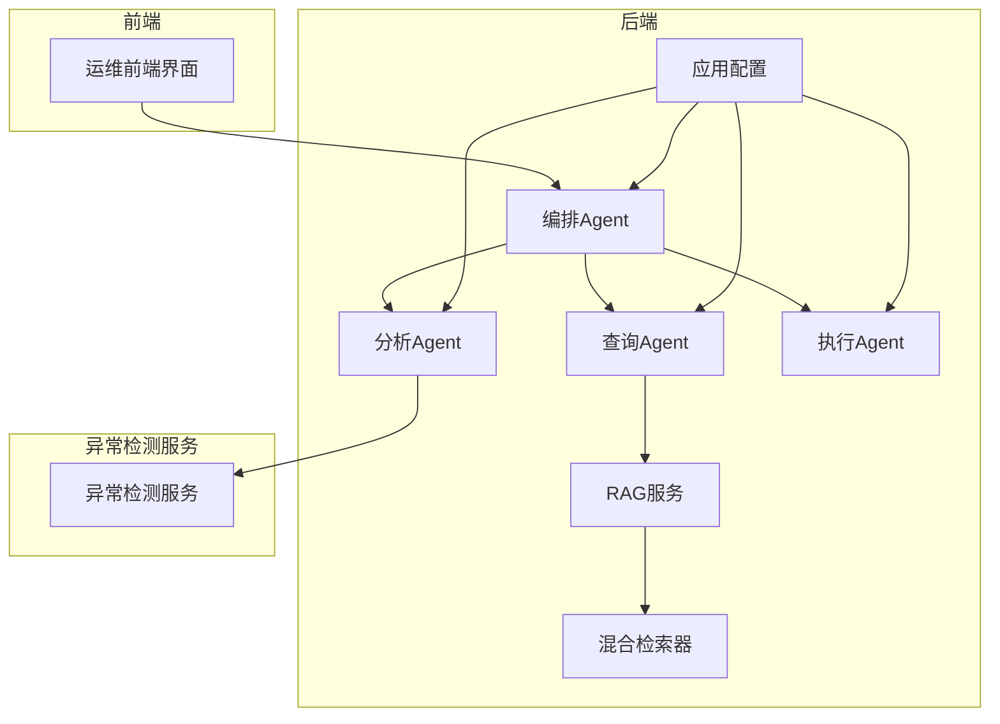
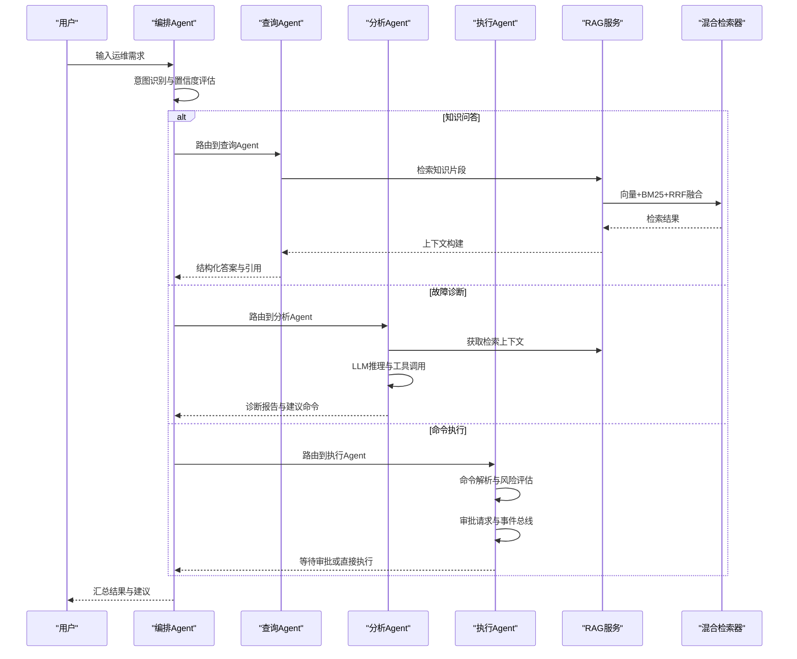
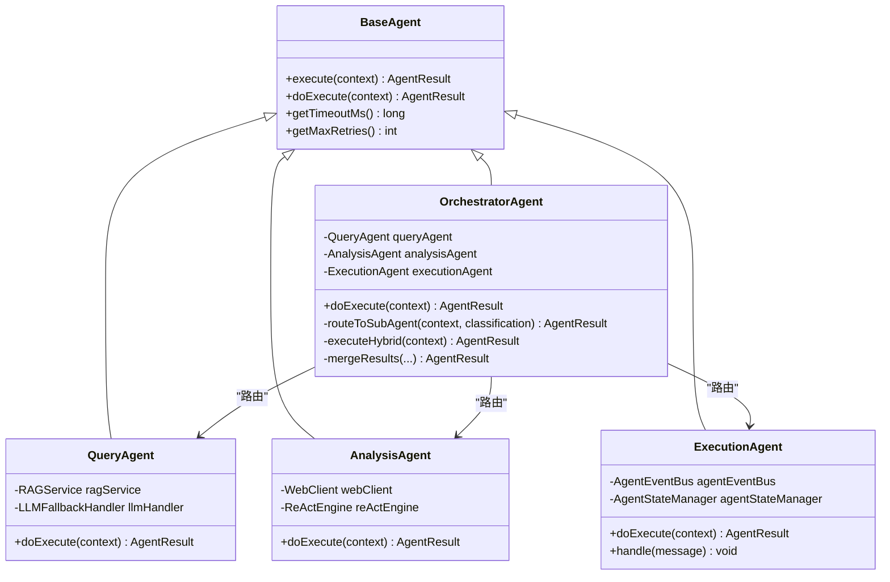
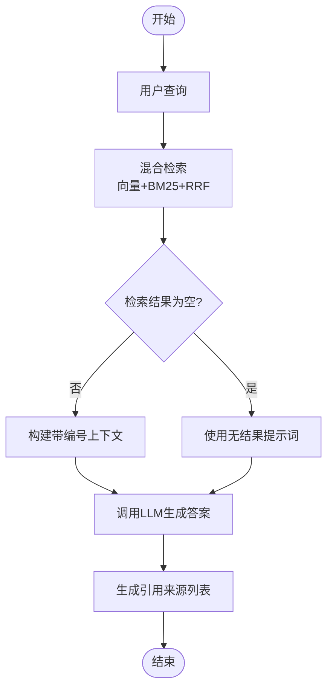
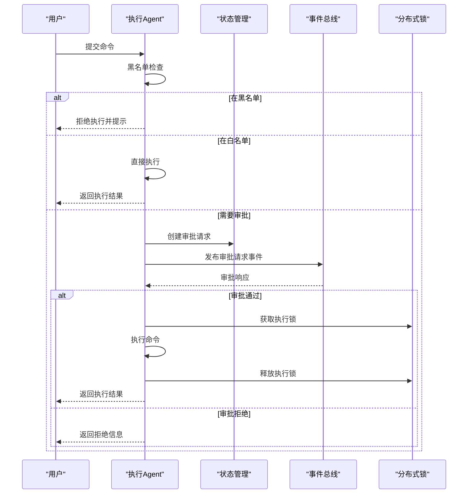
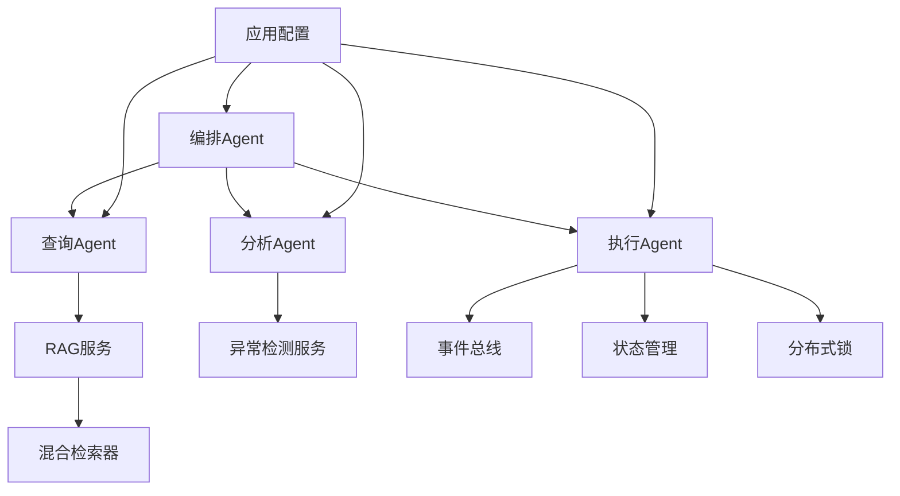

# 系统特色与优势

<cite>
**本文档引用的文件**
- [OrchestratorAgent.java](file://netdata-ai-backend/src/main/java/com/netdata/ops/core/agent/OrchestratorAgent.java)
- [AnalysisAgent.java](file://netdata-ai-backend/src/main/java/com/netdata/ops/core/agent/AnalysisAgent.java)
- [QueryAgent.java](file://netdata-ai-backend/src/main/java/com/netdata/ops/core/agent/QueryAgent.java)
- [ExecutionAgent.java](file://netdata-ai-backend/src/main/java/com/netdata/ops/core/agent/ExecutionAgent.java)
- [BaseAgent.java](file://netdata-ai-backend/src/main/java/com/netdata/ops/core/agent/BaseAgent.java)
- [HybridRetriever.java](file://netdata-ai-backend/src/main/java/com/netdata/ops/core/rag/HybridRetriever.java)
- [RAGService.java](file://netdata-ai-backend/src/main/java/com/netdata/ops/core/rag/RAGService.java)
- [application.yml](file://netdata-ai-backend/src/main/resources/application.yml)
- [orchestrator-system-prompt.md](file://docs/prompts/orchestrator-system-prompt.md)
- [shared-safety-constraints.md](file://docs/prompts/shared-safety-constraints.md)
- [AgentEventBus.java](file://netdata-ai-backend/src/main/java/com/netdata/ops/core/agent/event/AgentEventBus.java)
- [AgentStateManager.java](file://netdata-ai-backend/src/main/java/com/netdata/ops/core/agent/AgentStateManager.java)
- [DistributedLockService.java](file://netdata-ai-backend/src/main/java/com/netdata/ops/core/agent/DistributedLockService.java)
- [main.py](file://anomaly-detection-service/app/main.py)
</cite>

## 目录
1. [引言](#引言)
2. [项目结构](#项目结构)
3. [核心组件](#核心组件)
4. [架构概览](#架构概览)
5. [详细组件分析](#详细组件分析)
6. [依赖分析](#依赖分析)
7. [性能考量](#性能考量)
8. [故障排除指南](#故障排除指南)
9. [结论](#结论)
10. [附录](#附录)

## 引言
本智能运维系统以“多Agent协同 + 混合检索RAG + Human-in-the-Loop”为核心架构，围绕NetData监控数据构建一体化的自动化运维平台。系统在传统运维的“被动响应、人工干预、经验依赖”基础上，实现了“主动预警、智能诊断、安全执行”的升级，显著提升了运维效率、降低了人为错误风险，并增强了复杂故障场景下的响应能力。

## 项目结构
系统采用前后端分离与微服务化架构：
- 后端（Java/Spring Boot）：核心Agent编排与业务逻辑、RAG检索增强、安全执行、异常检测服务集成
- 前端（Vue3/Vite）：运维交互界面、聊天式对话、审批流程可视化
- 异常检测服务（Python/FastAPI）：基于PyOD/PySAD的实时异常检测微服务
- 配置与文档：统一的系统配置、Prompt模板与安全约束文档

**图表来源**
- [application.yml:14-314](file://netdata-ai-backend/src/main/resources/application.yml#L14-L314)
- [OrchestratorAgent.java:38-112](file://netdata-ai-backend/src/main/java/com/netdata/ops/core/agent/OrchestratorAgent.java#L38-L112)
- [RAGService.java:35-130](file://netdata-ai-backend/src/main/java/com/netdata/ops/core/rag/RAGService.java#L35-L130)
- [HybridRetriever.java:40-100](file://netdata-ai-backend/src/main/java/com/netdata/ops/core/rag/HybridRetriever.java#L40-L100)
- [main.py:76-217](file://anomaly-detection-service/app/main.py#L76-L217)

**章节来源**
- [application.yml:14-314](file://netdata-ai-backend/src/main/resources/application.yml#L14-L314)
- [main.py:76-217](file://anomaly-detection-service/app/main.py#L76-L217)

## 核心组件
- 多Agent协同编排：通过意图识别与任务路由，实现知识问答、故障诊断、命令执行的智能分流与组合执行
- 混合检索RAG：结合向量检索与BM25检索，采用RRF融合算法，提升检索准确性与鲁棒性
- Human-in-the-Loop执行：基于风险评估与审批流程，确保高风险操作的人工把关与审计可追溯
- 工业级Agent基座：统一的超时控制、重试、拦截器链、指标采集与链路追踪，保障稳定性与可观测性
- 异常检测服务集成：与NetData指标对接，提供实时异常检测能力，支撑分析Agent的推理闭环

**章节来源**
- [BaseAgent.java:38-488](file://netdata-ai-backend/src/main/java/com/netdata/ops/core/agent/BaseAgent.java#L38-L488)
- [OrchestratorAgent.java:38-261](file://netdata-ai-backend/src/main/java/com/netdata/ops/core/agent/OrchestratorAgent.java#L38-L261)
- [HybridRetriever.java:40-247](file://netdata-ai-backend/src/main/java/com/netdata/ops/core/rag/HybridRetriever.java#L40-L247)
- [RAGService.java:35-212](file://netdata-ai-backend/src/main/java/com/netdata/ops/core/rag/RAGService.java#L35-L212)
- [ExecutionAgent.java:41-425](file://netdata-ai-backend/src/main/java/com/netdata/ops/core/agent/ExecutionAgent.java#L41-L425)

## 架构概览
系统采用“意图识别 + 多Agent编排 + 检索增强 + 审批执行”的闭环架构。编排Agent负责意图识别与任务路由，查询Agent与分析Agent分别承担知识问答与故障诊断，执行Agent负责命令解析、风险评估与审批驱动的执行。RAG服务提供混合检索与上下文构建，异常检测服务为分析Agent提供实时指标数据支持。

**图表来源**
- [OrchestratorAgent.java:74-112](file://netdata-ai-backend/src/main/java/com/netdata/ops/core/agent/OrchestratorAgent.java#L74-L112)
- [QueryAgent.java:64-100](file://netdata-ai-backend/src/main/java/com/netdata/ops/core/agent/QueryAgent.java#L64-L100)
- [AnalysisAgent.java:48-59](file://netdata-ai-backend/src/main/java/com/netdata/ops/core/agent/AnalysisAgent.java#L48-L59)
- [ExecutionAgent.java:149-198](file://netdata-ai-backend/src/main/java/com/netdata/ops/core/agent/ExecutionAgent.java#L149-L198)
- [RAGService.java:116-130](file://netdata-ai-backend/src/main/java/com/netdata/ops/core/rag/RAGService.java#L116-L130)
- [HybridRetriever.java:64-100](file://netdata-ai-backend/src/main/java/com/netdata/ops/core/rag/HybridRetriever.java#L64-L100)

## 详细组件分析

### 多Agent协同架构
- 意图识别与路由：编排Agent采用双级分类（规则快速路径 + LLM语义分类），结合置信度阈值与缓存层，实现低延迟与高准确率的意图识别
- 混合意图并行执行：针对包含多种意图的任务，通过CompletableFuture实现非阻塞并行，提升响应速度，并提供降级串行执行保障
- 结果汇总与一致性：对多Agent输出进行结构化合并，统一呈现诊断结果、知识片段与建议命令

**图表来源**
- [BaseAgent.java:38-488](file://netdata-ai-backend/src/main/java/com/netdata/ops/core/agent/BaseAgent.java#L38-L488)
- [OrchestratorAgent.java:38-261](file://netdata-ai-backend/src/main/java/com/netdata/ops/core/agent/OrchestratorAgent.java#L38-L261)
- [QueryAgent.java:36-181](file://netdata-ai-backend/src/main/java/com/netdata/ops/core/agent/QueryAgent.java#L36-L181)
- [AnalysisAgent.java:33-261](file://netdata-ai-backend/src/main/java/com/netdata/ops/core/agent/AnalysisAgent.java#L33-L261)
- [ExecutionAgent.java:41-425](file://netdata-ai-backend/src/main/java/com/netdata/ops/core/agent/ExecutionAgent.java#L41-L425)

**章节来源**
- [OrchestratorAgent.java:74-194](file://netdata-ai-backend/src/main/java/com/netdata/ops/core/agent/OrchestratorAgent.java#L74-L194)
- [BaseAgent.java:107-226](file://netdata-ai-backend/src/main/java/com/netdata/ops/core/agent/BaseAgent.java#L107-L226)

### 混合检索RAG方案
- 检索融合：向量检索（Milvus）与BM25检索（基于切片索引）通过RRF算法融合，无需调参且鲁棒性强
- 上下文构建：将检索结果格式化为带编号引用的上下文，注入LLM Prompt，提升答案可溯源性
- 批量入库：文档切分、向量化、批量插入与索引更新一体化，支持大规模知识库管理

**图表来源**
- [RAGService.java:116-157](file://netdata-ai-backend/src/main/java/com/netdata/ops/core/rag/RAGService.java#L116-L157)
- [HybridRetriever.java:64-100](file://netdata-ai-backend/src/main/java/com/netdata/ops/core/rag/HybridRetriever.java#L64-L100)
- [QueryAgent.java:64-100](file://netdata-ai-backend/src/main/java/com/netdata/ops/core/agent/QueryAgent.java#L64-L100)

**章节来源**
- [RAGService.java:57-91](file://netdata-ai-backend/src/main/java/com/netdata/ops/core/rag/RAGService.java#L57-L91)
- [HybridRetriever.java:134-193](file://netdata-ai-backend/src/main/java/com/netdata/ops/core/rag/HybridRetriever.java#L134-L193)

### Human-in-the-Loop执行流程
- 命令解析与白名单优先：对用户输入进行命令提取，优先匹配白名单自动执行
- 黑名单拦截与灰名单审批：对高风险命令进行拦截或进入审批流程
- 风险评估与审批驱动：基于命令类型、影响范围、可逆性等维度进行评分，触发事件总线与分布式锁，确保幂等与安全
- 审批响应处理：通过事件总线接收审批结果，执行或拒绝命令，并记录审计日志

**图表来源**
- [ExecutionAgent.java:149-198](file://netdata-ai-backend/src/main/java/com/netdata/ops/core/agent/ExecutionAgent.java#L149-L198)
- [AgentEventBus.java](file://netdata-ai-backend/src/main/java/com/netdata/ops/core/agent/event/AgentEventBus.java)
- [AgentStateManager.java](file://netdata-ai-backend/src/main/java/com/netdata/ops/core/agent/AgentStateManager.java)
- [DistributedLockService.java](file://netdata-ai-backend/src/main/java/com/netdata/ops/core/agent/DistributedLockService.java)

**章节来源**
- [ExecutionAgent.java:163-198](file://netdata-ai-backend/src/main/java/com/netdata/ops/core/agent/ExecutionAgent.java#L163-L198)
- [shared-safety-constraints.md:29-127](file://docs/prompts/shared-safety-constraints.md#L29-L127)

### 工业级Agent基座
- 超时控制与重试：基于CompletableFuture的超时取消与指数退避重试，避免LLM调用卡死
- 拦截器链与指标采集：支持前置/后置/异常拦截器，统一上报执行时长、成功率与超时指标
- 链路追踪：TraceId贯穿执行全程，结合MDC实现日志自动关联
- 生命周期钩子：onStart/onComplete/onError/onTimeout可选覆盖，便于扩展

**章节来源**
- [BaseAgent.java:107-303](file://netdata-ai-backend/src/main/java/com/netdata/ops/core/agent/BaseAgent.java#L107-L303)

### 异常检测服务集成
- 实时异常检测：支持离线与在线算法，直接从NetData API拉取指标数据
- 与分析Agent联动：为故障诊断提供实时指标与异常趋势，增强ReAct推理的可信度
- 可观测性：统一的日志、健康检查与API文档，便于运维与监控

**章节来源**
- [main.py:76-217](file://anomaly-detection-service/app/main.py#L76-L217)

## 依赖分析
系统各模块之间的依赖关系如下：
- 编排Agent依赖查询、分析、执行Agent进行任务路由
- 查询Agent依赖RAG服务与混合检索器获取知识上下文
- 分析Agent依赖异常检测服务与WebClient进行指标查询
- 执行Agent依赖事件总线、状态管理与分布式锁保障安全执行
- 应用配置集中管理LLM、Milvus、RAG、执行安全等参数

**图表来源**
- [application.yml:14-314](file://netdata-ai-backend/src/main/resources/application.yml#L14-L314)
- [OrchestratorAgent.java:38-71](file://netdata-ai-backend/src/main/java/com/netdata/ops/core/agent/OrchestratorAgent.java#L38-L71)
- [QueryAgent.java:38-51](file://netdata-ai-backend/src/main/java/com/netdata/ops/core/agent/QueryAgent.java#L38-L51)
- [AnalysisAgent.java:35-45](file://netdata-ai-backend/src/main/java/com/netdata/ops/core/agent/AnalysisAgent.java#L35-L45)
- [ExecutionAgent.java:43-93](file://netdata-ai-backend/src/main/java/com/netdata/ops/core/agent/ExecutionAgent.java#L43-L93)

**章节来源**
- [application.yml:14-314](file://netdata-ai-backend/src/main/resources/application.yml#L14-L314)

## 性能考量
- 检索性能：RRF融合算法无需调参，向量检索与BM25检索并行，最终Top-K裁剪，兼顾召回与效率
- 执行性能：编排Agent对混合意图采用并行执行，超时控制与降级策略保障稳定性
- 系统吞吐：Agent基座统一的超时与重试机制，配合指标采集与告警，确保在高负载下的可控性
- 配置优化：通过application.yml集中管理RAG检索Top-K、相似度阈值、LLM模型与降级策略，便于按环境调优

**章节来源**
- [HybridRetriever.java:64-100](file://netdata-ai-backend/src/main/java/com/netdata/ops/core/rag/HybridRetriever.java#L64-L100)
- [BaseAgent.java:238-303](file://netdata-ai-backend/src/main/java/com/netdata/ops/core/agent/BaseAgent.java#L238-L303)
- [application.yml:114-145](file://netdata-ai-backend/src/main/resources/application.yml#L114-L145)

## 故障排除指南
- LLM不可用：查询Agent通过LLM降级处理器实现DeepSeek/Ollama自动切换，极端情况下返回兜底提示
- 命令执行失败：执行Agent捕获异常并记录审计日志，同时返回用户友好的错误信息
- 超时与重试：Agent基座统一处理超时与重试，超时路径上报指标并输出可追踪的TraceId
- 审批流程异常：事件总线与状态管理确保审批消息可靠投递与幂等处理，分布式锁避免重复执行

**章节来源**
- [QueryAgent.java:113-126](file://netdata-ai-backend/src/main/java/com/netdata/ops/core/agent/QueryAgent.java#L113-L126)
- [ExecutionAgent.java:302-337](file://netdata-ai-backend/src/main/java/com/netdata/ops/core/agent/ExecutionAgent.java#L302-L337)
- [BaseAgent.java:170-217](file://netdata-ai-backend/src/main/java/com/netdata/ops/core/agent/BaseAgent.java#L170-L217)

## 结论
本系统通过“多Agent协同 + 混合检索RAG + Human-in-the-Loop”的技术组合，在智能化、自动化与安全性方面实现了显著突破。相比传统运维系统，本系统能够：
- 提高运维效率：意图识别与并行执行缩短响应时间，RAG增强问答质量
- 降低人为错误：黑名单拦截、白名单自动执行与审批流程减少误操作
- 增强故障响应能力：异常检测服务与ReAct推理闭环，提升复杂场景诊断与处置能力
- 强化安全与合规：统一的安全约束、审计日志与分布式锁，满足企业级安全要求

## 附录
- Prompt与安全约束：编排Agent系统Prompt与共享安全约束文档，确保意图识别与执行流程的规范化与可追溯
- 配置说明：application.yml涵盖LLM、Milvus、RAG、执行安全等关键配置项，支持开发与生产环境差异化部署

**章节来源**
- [orchestrator-system-prompt.md:1-291](file://docs/prompts/orchestrator-system-prompt.md#L1-L291)
- [shared-safety-constraints.md:1-396](file://docs/prompts/shared-safety-constraints.md#L1-L396)
- [application.yml:14-314](file://netdata-ai-backend/src/main/resources/application.yml#L14-L314)