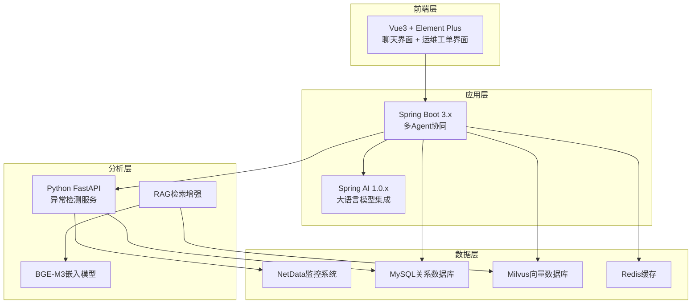
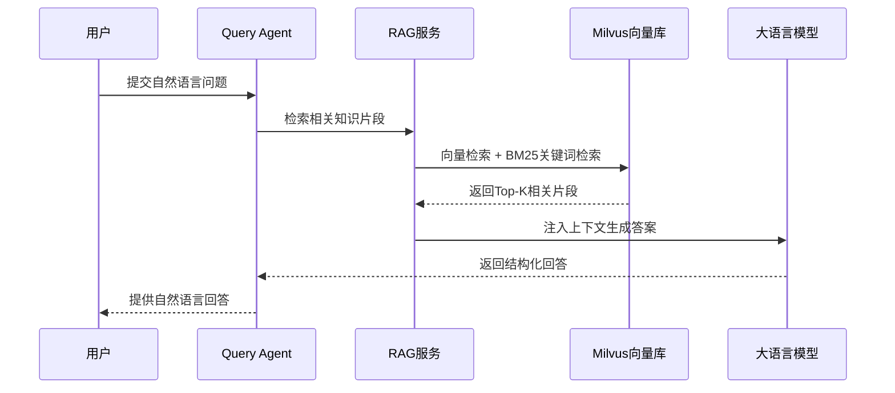
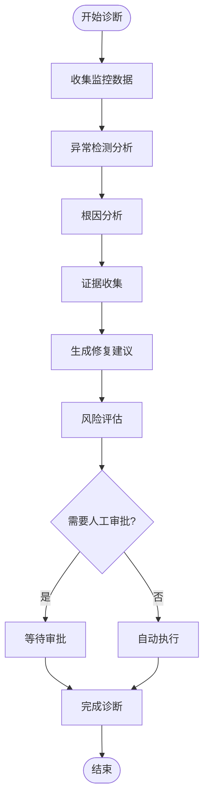
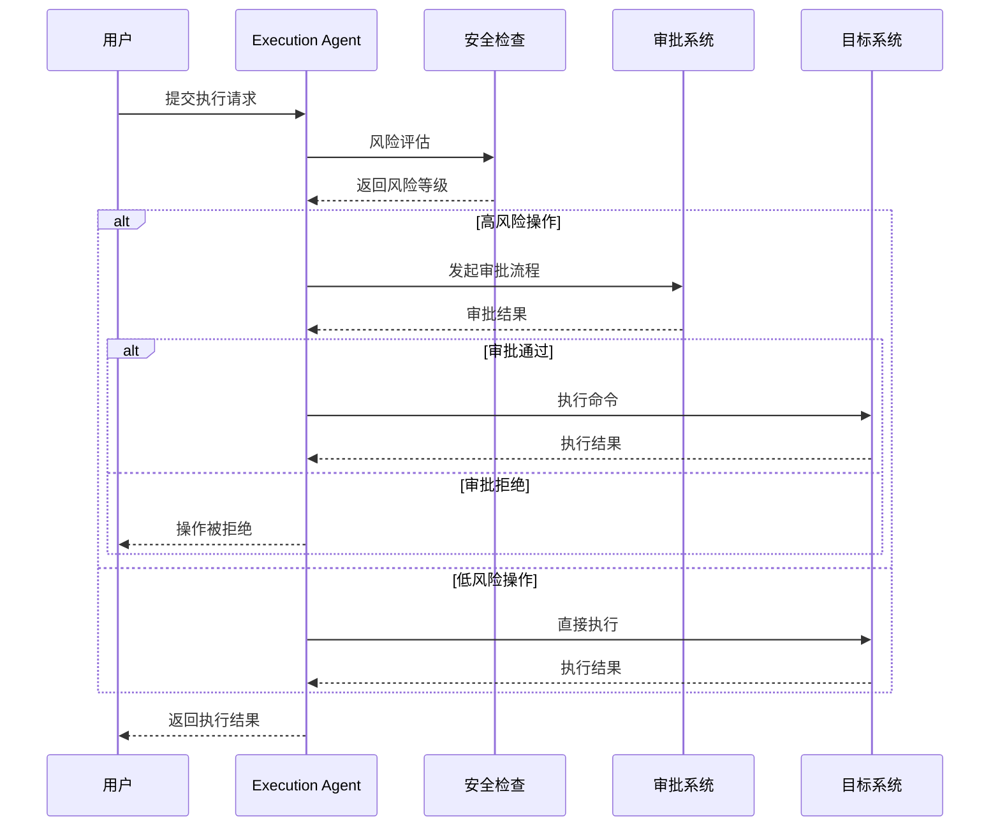
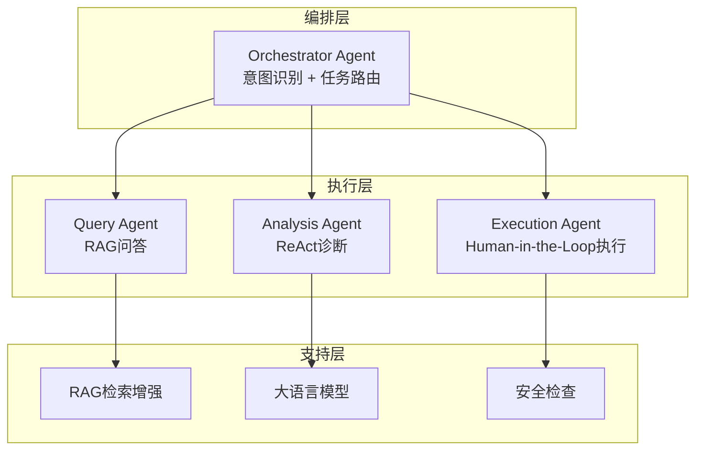
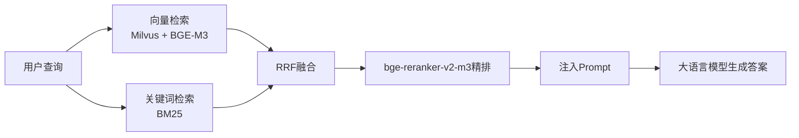
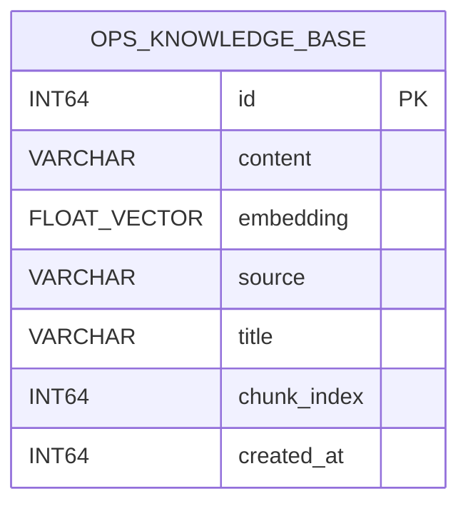

# 项目介绍与目标

<cite>
**本文档引用的文件**
- [PROJECT_CONTEXT.md](file://PROJECT_CONTEXT.md)
- [开题报告_修改版.md](file://开题报告_修改版.md)
- [开题报告_精简版.md](file://开题报告_精简版.md)
- [docker-compose.yml](file://docker-compose.yml)
- [init_milvus.py](file://scripts/init_milvus.py)
- [init.sql](file://sql/init.sql)
- [NetDataOpsApplication.java](file://netdata-ai-backend/src/main/java/com/netdata/ops/NetDataOpsApplication.java)
- [OrchestratorAgent.java](file://netdata-ai-backend/src/main/java/com/netdata/ops/core/agent/OrchestratorAgent.java)
- [RAGService.java](file://netdata-ai-backend/src/main/java/com/netdata/ops/core/rag/RAGService.java)
- [orchestrator-system-prompt.md](file://docs/prompts/orchestrator-system-prompt.md)
- [shared-safety-constraints.md](file://docs/prompts/shared-safety-constraints.md)
- [README.md (异常检测服务)](file://anomaly-detection-service/README.md)
- [README.md (前端)](file://netdata-ai-frontend/README.md)
- [deployment_guide.md](file://docs/deployment_guide.md)
</cite>

## 目录
1. [项目概述](#项目概述)
2. [项目定位与核心目标](#项目定位与核心目标)
3. [技术架构与系统设计](#技术架构与系统设计)
4. [三大核心功能详解](#三大核心功能详解)
5. [智能运维Agent体系](#智能运维agent体系)
6. [RAG检索增强技术方案](#rag检索增强技术方案)
7. [学习目标与技术价值](#学习目标与技术价值)
8. [项目实施计划与里程碑](#项目实施计划与里程碑)
9. [总结](#总结)

## 项目概述

面向NetData监控数据的智能运维问答与执行系统是一个基于开源运维监控系统NetData构建的多Agent协同智能运维平台。该项目旨在通过引入人工智能技术，实现从"被动告警"到"主动分析"、从"人工处置"到"自主决策"的运维模式转变。

### 项目背景与意义

随着企业IT基础设施的复杂化，传统运维模式面临巨大挑战。据研究表明，传统人工运维模式下，跨域故障根因定位平均耗时超过45分钟，即使是简单故障也需要数分钟才能完成处理。NetData作为一款轻量级监控工具，其CPU占用率低于1%，内存消耗仅数十MB，支持1秒级的高频数据采集，为构建实时智能运维系统提供了理想的基础。

通过引入大语言模型(LLM)和多Agent协作技术，系统能够实现：
- **故障检测更实时**：通过NetData的高频采集和实时分析，在秒级检测到异常
- **故障诊断更智能**：通过分析Agent的智能推理，自动分析故障根因，生成结构化诊断报告
- **故障处置更自动化**：对于标准化故障，系统可以自动生成并执行修复脚本
- **运维知识自动沉淀**：系统可以自动记录故障处理过程，提取故障模式和处理方案

## 项目定位与核心目标

### 系统定位

本系统是一个基于NetData监控数据的智能运维问答与执行系统。它不重做NetData的监控功能，而是在NetData采集的数据基础上，通过LLM提供运维建议和自动化执行。

### 核心目标

1. **构建实时监控与分析能力**：基于NetData的1秒级高频数据采集，实现实时异常检测和故障预警
2. **实现智能运维决策**：通过多Agent协作，提供智能化的故障诊断和运维建议
3. **建立自动化执行流程**：在确保安全的前提下，实现运维命令的自动化执行和审批
4. **沉淀运维知识资产**：自动记录和整理运维经验，形成可复用的知识库

### 技术愿景

通过这个项目，不仅实现技术层面的功能目标，更重要的是培养在智能运维领域的核心技术能力，为未来在大厂从事Agent开发岗位打下坚实基础。

## 技术架构与系统设计

### 整体架构设计

系统采用三层架构设计，通过Python+Java混合技术栈实现：

**架构特点**：
- **前后端分离**：Vue3前端负责用户交互，Java后端负责业务逻辑
- **多语言协作**：Python负责异常检测，Java负责应用逻辑，实现各司其职
- **微服务架构**：采用Spring Boot微服务架构，便于扩展和维护
- **容器化部署**：通过Docker Compose实现一键部署

### 技术栈选择

| 层次 | 技术 | 版本 | 用途 |
|------|------|------|------|
| 后端框架 | Spring Boot | 3.3.x | Java主语言，企业级框架 |
| AI框架 | Spring AI | 1.0.x | 与大语言模型集成 |
| 异常检测 | Python FastAPI + PyOD + PySAD | 最新 | 异常检测微服务 |
| 向量数据库 | Milvus | 2.4 | RAG检索增强 |
| LLM | DeepSeek-V3 API | — | 生产环境主用 |
| 嵌入模型 | BGE-M3 | — | 维度1024，固定不可更换 |
| 前端 | Vue 3 + Element Plus | 最新 | 用户界面 |
| 关系数据库 | MySQL | 8.0 | 系统数据存储 |
| 缓存 | Redis | 7.x | 性能优化 |

## 三大核心功能详解

### 1. 自然语言问答功能

自然语言问答功能通过RAG（检索增强生成）技术实现，能够理解用户的自然语言查询并提供准确的运维知识回答。

#### 技术实现

**功能特点**：
- 支持复杂的运维知识查询
- 通过混合检索提高检索准确性
- 结构化回答格式，便于理解和执行

### 2. 智能故障诊断功能

智能故障诊断功能采用ReAct（推理-行动-反思）模式，通过多步工具调用实现深度故障分析。

#### 诊断流程

**核心能力**：
- 实时异常检测和告警
- 多维度根因分析
- 结构化诊断报告生成
- 自动化修复建议

### 3. 命令执行功能

命令执行功能实现了从建议到执行的完整闭环，通过风险评估和人工审批确保操作安全。

#### 执行流程

**安全保障**：
- 命令白名单机制
- 多级风险评估
- 人工审批流程
- 完整审计日志

## 智能运维Agent体系

### Agent架构设计

系统采用Orchestrator-Subagent模式，通过编排Agent统一调度各个子Agent：

### Orchestrator Agent核心能力

Orchestrator Agent负责：
- **意图识别**：判断用户输入属于知识问答、故障诊断还是命令执行
- **任务路由**：将任务分发给对应的子Agent
- **结果汇总**：整合多个Agent的结果生成最终回复

#### 意图识别机制

| 意图类型 | 特征关键词 | 路由目标 | 示例 |
|---------|-----------|----------|------|
| `KNOWLEDGE_QUERY` | 如何、什么是、怎么配置 | Query Agent | "如何配置NetData的内存监控阈值？" |
| `FAULT_DIAGNOSIS` | 告警、异常、故障、排查 | Analysis Agent | "CPU使用率突然飙升到95%，帮我排查" |
| `COMMAND_EXECUTE` | 执行、运行、重启、清理 | Execution Agent | "帮我重启nginx服务" |
| `HYBRID` | 包含多个意图 | 多Agent协作 | "告警显示磁盘满了，帮我清理临时文件" |

### 子Agent职责分工

#### Query Agent（问答Agent）
- 走RAG流程，检索运维知识库回答问题
- 处理纯知识类查询
- 提供结构化的回答格式

#### Analysis Agent（分析Agent）
- 采用ReAct模式，多步工具调用
- 输出结构化诊断报告
- 处理故障分析和根因定位

#### Execution Agent（执行Agent）
- 生成修复命令
- 经风险评估和人工审批后执行
- 记录完整的审计日志

## RAG检索增强技术方案

### 检索增强生成架构

系统采用混合检索RAG方案，通过向量检索和关键词检索的融合实现更准确的知识检索：

### 检索流程详解

#### 1. 文档预处理
- **语义切分**：按语义单元而非固定长度切分文档
- **批量向量化**：使用BGE-M3模型生成1024维向量
- **索引构建**：在Milvus中建立IVF_FLAT索引

#### 2. 混合检索
- **向量检索**：基于余弦相似度的语义匹配
- **关键词检索**：基于BM25的关键词匹配
- **RRF融合**：综合两种检索结果的排名

#### 3. 精排优化
- **bge-reranker-v2-m3**：对融合结果进行二次排序
- **Top-K返回**：将最相关的知识片段注入LLM上下文

### 向量数据库设计

#### Milvus配置要点

| 参数 | 配置 | 说明 |
|------|------|------|
| 向量维度 | 1024 | BGE-M3固定维度，创建后不可更改 |
| 相似度度量 | COSINE | 适合文本语义检索 |
| 索引类型 | IVF_FLAT | 平衡性能和准确率 |
| nlist参数 | 128 | 聚类中心数量 |
| nprobe参数 | 16 | 搜索的聚类数量 |

#### 数据结构设计

**数据字段说明**：
- `id`：主键，自增
- `content`：文档内容片段（最大8000字符）
- `embedding`：1024维向量
- `source`：文档来源
- `title`：文档标题
- `chunk_index`：片段索引
- `created_at`：创建时间戳

## 学习目标与技术价值

### 核心学习目标

通过这个项目，重点掌握以下关键技术：

#### 1. Agent开发技术
- **多Agent协作模式**：理解Orchestrator-Subagent架构的设计思想
- **意图识别算法**：掌握基于规则和关键词的意图分类方法
- **任务路由机制**：学习如何将复杂任务分解和调度
- **结果汇总策略**：实现多Agent输出的统一和整合

#### 2. RAG检索增强技术
- **混合检索原理**：理解向量检索和关键词检索的优势互补
- **RRF融合算法**：掌握排序融合的技术细节和应用场景
- **精排优化策略**：学习bge-reranker的使用和优化
- **语义切分技术**：实现基于语义的文档切分

#### 3. 多智能体协作
- **ReAct推理模式**：理解思考-行动-观察的循环过程
- **工具调用机制**：掌握LLM如何决定调用哪个函数
- **Human-in-the-Loop设计**：实现人机协作的最佳实践
- **安全控制机制**：确保智能体操作的安全性和可控性

### 技术价值体现

#### 1. 实践价值
- **真实场景应用**：解决企业实际的运维痛点
- **技术栈先进性**：采用Spring Boot 3.x、Spring AI 1.0等最新技术
- **性能优化**：通过向量检索和缓存机制提升响应速度

#### 2. 学习价值
- **全栈技能培养**：涵盖前端、后端、数据库、AI等多个领域
- **架构思维训练**：理解大型系统的架构设计和实现
- **工程实践能力**：通过完整的项目开发流程提升实战能力

#### 3. 职业发展价值
- **简历亮点**：为Agent开发岗位提供核心项目经历
- **技术深度**：掌握前沿的AI应用技术
- **解决问题能力**：培养复杂系统问题的分析和解决能力

## 项目实施计划与里程碑

### 开发阶段规划

| 阶段 | 时间 | 内容 | 状态 |
|------|------|------|------|
| Phase 0 | 2026.4.1-2026.4.20 | 环境搭建 + NetData数据采集 + 异常检测 | 当前阶段 |
| Phase 1 | 2026.4.21-2026.5.5 | 知识库构建 + RAG检索 | 待开始 |
| Phase 2 | 2026.5.6-2026.5.20 | Multi-Agent构建 | 待开始 |
| Phase 3 | 2026.5.21-2026.6.1 | 前端开发 + 系统集成 | 待开始 |
| Phase 4 | 2026.6.1-2026.6.15 | 测试 + 论文撰写 | 待开始 |

### 关键里程碑

#### 第1-3周：环境搭建与基础功能
- 完成Docker环境搭建（Milvus + MySQL + Redis + Ollama）
- 实现NetData数据采集模块
- 集成PyOD/PySAD异常检测算法
- 开发REST API接口实现Python与Java通信

#### 第4-5周：知识库与RAG检索
- 收集和整理运维知识文档
- 构建Milvus向量数据库
- 实现混合检索模块（向量+关键词+RRF融合+Reranker）
- 完善知识库管理和更新机制

#### 第6-7周：Multi-Agent系统
- 集成Spring AI与DeepSeek API
- 实现Orchestrator Agent的意图识别和路由
- 实现Query Agent的RAG问答功能
- 实现Analysis Agent的ReAct诊断能力
- 实现Execution Agent的Human-in-the-Loop执行流程

#### 第8-9周：前端界面与系统集成
- 开发Vue3聊天界面
- 实现运维工单和审批界面
- 完成系统集成测试和性能优化
- 实现WebSocket实时通信

#### 第10周：测试与总结
- 功能测试和性能测试
- 编写毕业论文
- 准备项目答辩

### 技术难点与解决方案

#### 1. 实时性问题
**问题**：Python异常检测 + Java LLM推理，如何保证端到端延迟在分钟级？
**解决方案**：
- 优化Python服务的异步处理能力
- 实现Java服务的缓存机制
- 采用流式处理减少等待时间

#### 2. 协同效率问题
**问题**：Python和Java之间如何高效通信，避免延迟？
**解决方案**：
- 使用REST API进行异步通信
- 实现连接池和超时重试机制
- 优化数据序列化和传输格式

#### 3. 准确性问题
**问题**：如何提升故障诊断的准确率？
**解决方案**：
- 采用混合检索提高知识召回率
- 实现多Agent交叉验证机制
- 建立持续学习和模型更新机制

#### 4. 安全性问题
**问题**：如何防止误操作，保障系统安全？
**解决方案**：
- 实现命令白名单和风险评估矩阵
- 建立多级审批机制
- 完整的审计日志记录

## 总结

面向NetData监控数据的智能运维问答与执行系统是一个综合性强、技术含量高的项目。通过这个项目，不仅能够实现智能运维的核心功能，更重要的是能够深入掌握Agent开发、RAG检索增强、多智能体协作等前沿技术。

项目的成功实施将为智能运维领域提供一个完整的解决方案，同时也为个人技术能力的提升和职业发展奠定坚实基础。通过理论与实践相结合的方式，这个项目将成为智能运维领域的一个优秀案例，具有重要的技术价值和应用前景。

在未来的工作中，将继续完善系统的各项功能，优化性能表现，扩展应用场景，为推动智能运维技术的发展贡献自己的力量。