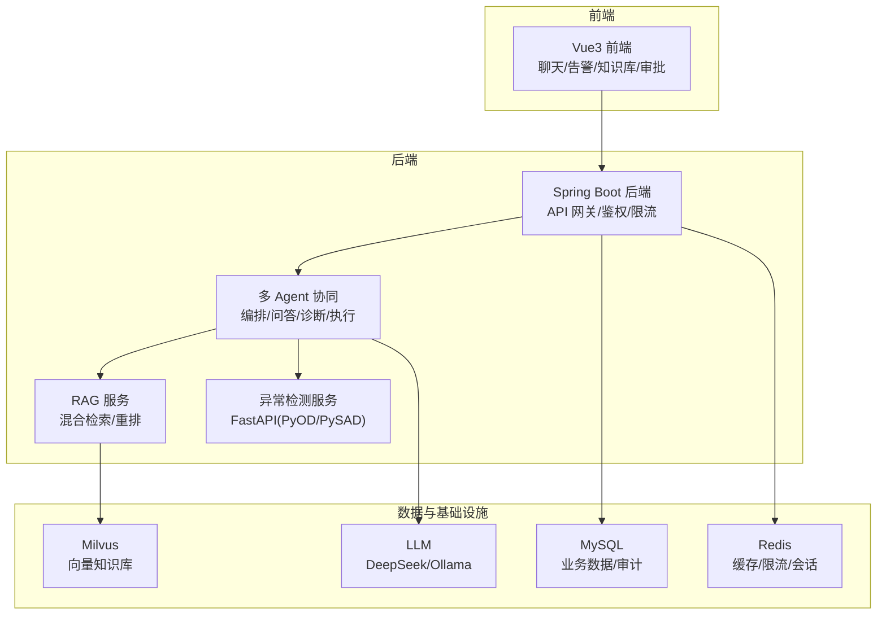
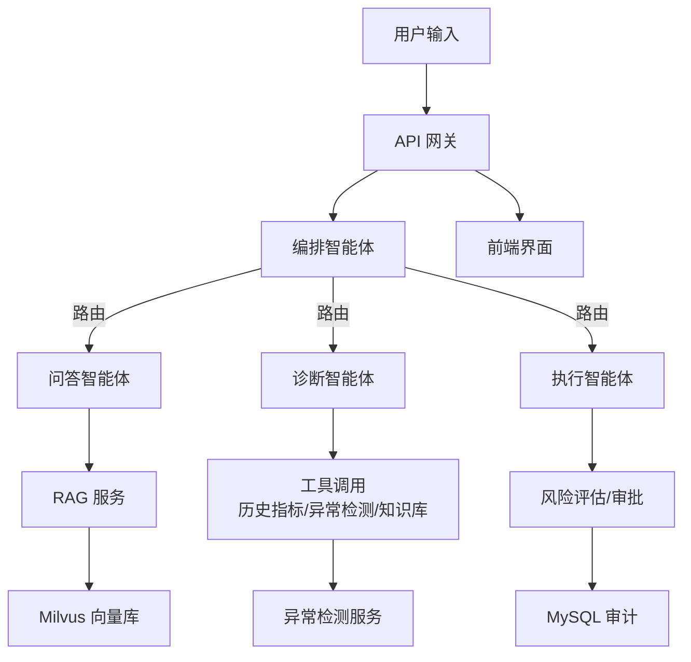
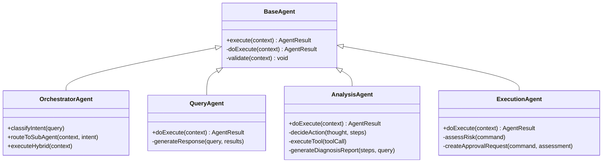
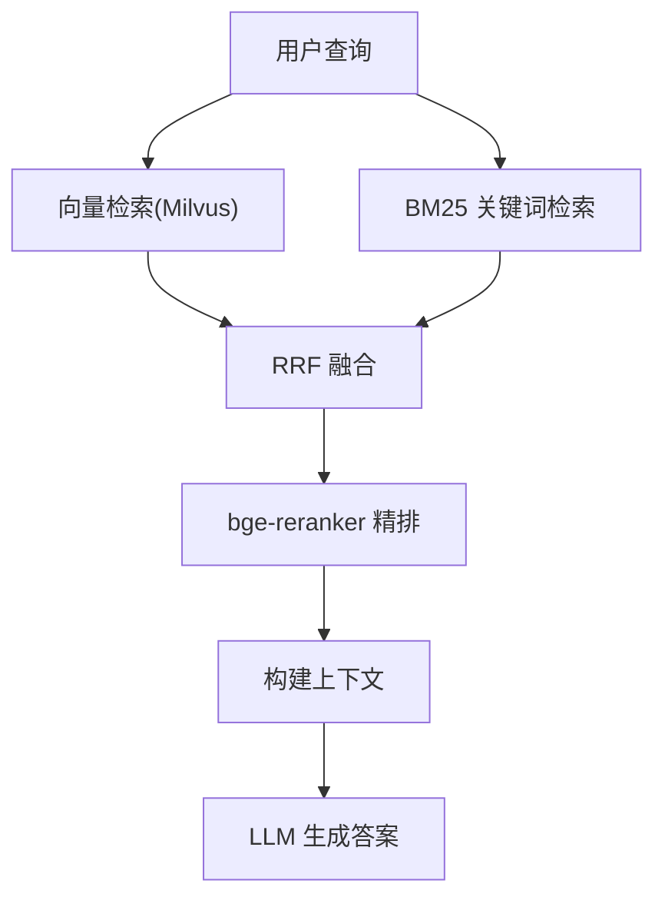
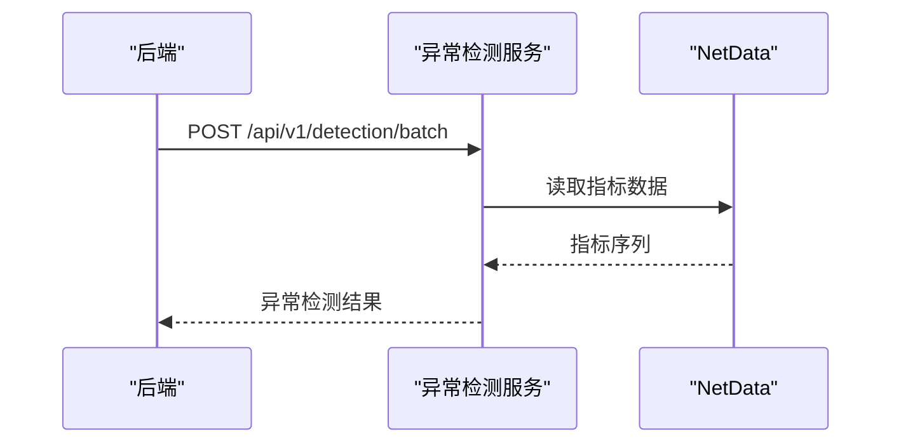
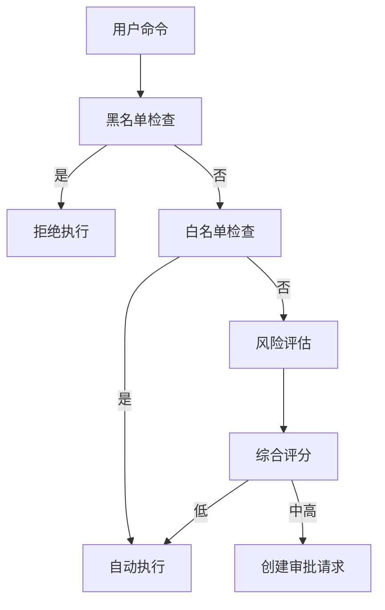
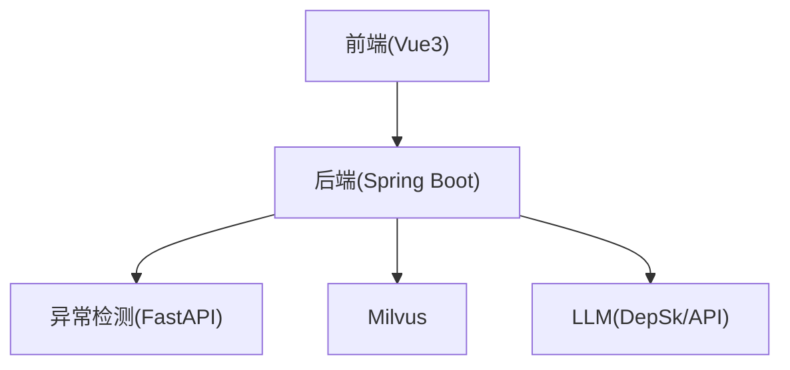

# 项目概述

<cite>
**本文档引用的文件**
- [PROJECT_CONTEXT.md](file://PROJECT_CONTEXT.md)
- [开题报告_修改版.md](file://开题报告_修改版.md)
- [system_architecture.md](file://docs/system_architecture.md)
- [deployment_guide.md](file://docs/deployment_guide.md)
- [docker-compose.yml](file://docker-compose.yml)
- [NetDataOpsApplication.java](file://netdata-ai-backend/src/main/java/com/netdata/ops/NetDataOpsApplication.java)
- [application.yml](file://netdata-ai-backend/src/main/resources/application.yml)
- [OrchestratorAgent.java](file://netdata-ai-backend/src/main/java/com/netdata/ops/core/agent/OrchestratorAgent.java)
- [QueryAgent.java](file://netdata-ai-backend/src/main/java/com/netdata/ops/core/agent/QueryAgent.java)
- [AnalysisAgent.java](file://netdata-ai-backend/src/main/java/com/netdata/ops/core/agent/AnalysisAgent.java)
- [ExecutionAgent.java](file://netdata-ai-backend/src/main/java/com/netdata/ops/core/agent/ExecutionAgent.java)
- [README.md（异常检测服务）](file://anomaly-detection-service/README.md)
- [pyproject.toml（异常检测服务）](file://anomaly-detection-service/pyproject.toml)
</cite>

## 目录
1. [简介](#简介)
2. [项目结构](#项目结构)
3. [核心组件](#核心组件)
4. [架构总览](#架构总览)
5. [详细组件分析](#详细组件分析)
6. [依赖分析](#依赖分析)
7. [性能考量](#性能考量)
8. [故障排查指南](#故障排查指南)
9. [结论](#结论)
10. [附录](#附录)

## 简介
本项目面向 NetData 监控数据，构建一个“智能运维问答与执行系统”。系统以多 Agent 协同为核心，围绕三条主线能力展开：
- 自然语言问答：基于混合检索 RAG 的运维知识问答
- 智能故障诊断：异常检测 + ReAct 推理的根因分析
- 命令执行：风险评估 + 人工审批 + 审计记录的 Human-in-the-Loop 执行

系统采用 Orchestrator-Subagent 模式，由编排智能体统一接收用户输入或告警事件，识别意图后路由到 Query/Analysis/Execution 三个子 Agent，并汇总结果。系统还集成了异常检测服务（Python）、向量数据库（Milvus）、关系数据库（MySQL）、缓存（Redis）以及 LLM（DeepSeek/Ollama）等基础设施。

项目目标与价值：
- 将运维从“被动告警”升级为“主动分析”，从“人工处置”升级为“自主决策”
- 通过 RAG 与 ReAct 提升问答与诊断的准确性与可解释性
- 通过人机协同与安全基线保障系统安全与可审计

章节来源
- [PROJECT_CONTEXT.md:16-61](file://PROJECT_CONTEXT.md#L16-L61)
- [开题报告_修改版.md:117-127](file://开题报告_修改版.md#L117-L127)

## 项目结构
项目采用前后端分离与微服务化架构，核心目录如下：
- netdata-ai-backend：Java Spring Boot 后端，包含多 Agent 协同、RAG、鉴权、WebSocket 等
- anomaly-detection-service：Python FastAPI 异常检测微服务
- netdata-ai-frontend：Vue3 前端，聊天与运维工单界面
- docs：系统架构、部署指南、提示词等文档
- docker-compose.yml：一键启动 Milvus、MySQL、Redis、Ollama 等基础服务
- sql：初始化数据库表结构
- config：Milvus 集合配置等

图表来源
- [docker-compose.yml:23-540](file://docker-compose.yml#L23-L540)
- [application.yml:14-283](file://netdata-ai-backend/src/main/resources/application.yml#L14-L283)

章节来源
- [PROJECT_CONTEXT.md:120-149](file://PROJECT_CONTEXT.md#L120-L149)
- [deployment_guide.md:398-563](file://docs/deployment_guide.md#L398-L563)

## 核心组件
- 多 Agent 协同层
  - 编排智能体：意图识别、任务路由、结果聚合
  - 问答智能体：RAG 检索 + LLM 生成
  - 诊断智能体：ReAct 循环 + 工具调用
  - 执行智能体：命令提取、风险评估、审批与执行
- RAG 知识库：语义分块 + 向量检索 + BM25 关键词检索 + RRF 融合 + reranker 精排
- 异常检测服务：离线批量 + 在线流式检测，对接 NetData 指标
- 基础设施：Spring Boot、Milvus、MySQL、Redis、LLM

章节来源
- [开题报告_修改版.md:195-342](file://开题报告_修改版.md#L195-L342)
- [system_architecture.md:169-544](file://docs/system_architecture.md#L169-L544)

## 架构总览
系统采用“用户交互层 → API 网关层 → Multi-Agent 协调层 → 核心服务层 → 外部服务层 → 数据存储层”的分层架构。数据流从用户输入进入后端，经编排智能体识别意图，路由到对应子 Agent，子 Agent 通过 RAG/工具调用/LLM/异常检测服务获取信息，最终聚合为统一响应返回前端。

图表来源
- [system_architecture.md:23-165](file://docs/system_architecture.md#L23-L165)
- [OrchestratorAgent.java:108-175](file://netdata-ai-backend/src/main/java/com/netdata/ops/core/agent/OrchestratorAgent.java#L108-L175)
- [QueryAgent.java:43-79](file://netdata-ai-backend/src/main/java/com/netdata/ops/core/agent/QueryAgent.java#L43-L79)
- [AnalysisAgent.java:56-103](file://netdata-ai-backend/src/main/java/com/netdata/ops/core/agent/AnalysisAgent.java#L56-L103)
- [ExecutionAgent.java:80-129](file://netdata-ai-backend/src/main/java/com/netdata/ops/core/agent/ExecutionAgent.java#L80-L129)

章节来源
- [system_architecture.md:136-165](file://docs/system_architecture.md#L136-L165)

## 详细组件分析

### 多 Agent 协同架构
- 编排智能体负责意图识别与路由，支持单一意图与混合意图处理；当置信度不足时，引导用户提供更清晰的输入。
- 问答智能体通过 RAG 检索知识库，构建上下文并生成答案，附带来源引用。
- 诊断智能体采用 ReAct 推理循环，按“思考→行动→观察”迭代，调用工具（历史指标、异常检测、知识库）逐步定位根因，并生成结构化诊断报告与建议命令。
- 执行智能体对用户命令进行提取与解析，黑名单直接拒绝，白名单自动执行，灰名单进入审批流程，记录审计日志。

图表来源
- [OrchestratorAgent.java:31-235](file://netdata-ai-backend/src/main/java/com/netdata/ops/core/agent/OrchestratorAgent.java#L31-L235)
- [QueryAgent.java:34-107](file://netdata-ai-backend/src/main/java/com/netdata/ops/core/agent/QueryAgent.java#L34-L107)
- [AnalysisAgent.java:40-290](file://netdata-ai-backend/src/main/java/com/netdata/ops/core/agent/AnalysisAgent.java#L40-L290)
- [ExecutionAgent.java:37-335](file://netdata-ai-backend/src/main/java/com/netdata/ops/core/agent/ExecutionAgent.java#L37-L335)

章节来源
- [OrchestratorAgent.java:10-235](file://netdata-ai-backend/src/main/java/com/netdata/ops/core/agent/OrchestratorAgent.java#L10-L235)
- [QueryAgent.java:11-107](file://netdata-ai-backend/src/main/java/com/netdata/ops/core/agent/QueryAgent.java#L11-L107)
- [AnalysisAgent.java:11-290](file://netdata-ai-backend/src/main/java/com/netdata/ops/core/agent/AnalysisAgent.java#L11-L290)
- [ExecutionAgent.java:9-335](file://netdata-ai-backend/src/main/java/com/netdata/ops/core/agent/ExecutionAgent.java#L9-L335)

### RAG 检索与混合检索
- 文档切分：语义分块优先，固定长度回退，最小块长与重叠配置
- 检索策略：向量检索（Milvus，BGE-M3 1024 维）+ BM25 关键词检索
- 融合与精排：RRF 融合 + bge-reranker 精排，返回 Top-K 注入 LLM 上下文
- 配置要点：向量维度固定、Top-K、相似度阈值、RRF 衰减参数

图表来源
- [system_architecture.md:348-407](file://docs/system_architecture.md#L348-L407)
- [application.yml:114-137](file://netdata-ai-backend/src/main/resources/application.yml#L114-L137)

章节来源
- [system_architecture.md:322-407](file://docs/system_architecture.md#L322-L407)
- [application.yml:114-137](file://netdata-ai-backend/src/main/resources/application.yml#L114-L137)

### 异常检测服务
- 技术栈：FastAPI + PyOD（Isolation Forest、LOF、KNN）+ PySAD（Half-Space Trees、xStream）
- 能力：离线批量检测 + 在线流式检测，支持从 NetData API 获取指标
- 部署：独立服务，后端通过 REST 调用

图表来源
- [AnalysisAgent.java:184-205](file://netdata-ai-backend/src/main/java/com/netdata/ops/core/agent/AnalysisAgent.java#L184-L205)
- [README.md（异常检测服务）:24-42](file://anomaly-detection-service/README.md#L24-L42)

章节来源
- [README.md（异常检测服务）:1-42](file://anomaly-detection-service/README.md#L1-L42)
- [pyproject.toml:1-55](file://anomaly-detection-service/pyproject.toml#L1-L55)

### Human-in-the-Loop 执行流程
- 命令提取：从用户输入中抽取命令
- 安全基线：黑名单（直接拒绝）、白名单（自动执行）、灰名单（人工审批）
- 风险评估：四维加权打分（命令类型、影响范围、可逆性、执行频率）
- 审批与执行：生成审批请求，审批通过后执行并记录审计日志

图表来源
- [ExecutionAgent.java:94-129](file://netdata-ai-backend/src/main/java/com/netdata/ops/core/agent/ExecutionAgent.java#L94-L129)
- [ExecutionAgent.java:163-188](file://netdata-ai-backend/src/main/java/com/netdata/ops/core/agent/ExecutionAgent.java#L163-L188)
- [ExecutionAgent.java:273-305](file://netdata-ai-backend/src/main/java/com/netdata/ops/core/agent/ExecutionAgent.java#L273-L305)

章节来源
- [ExecutionAgent.java:10-335](file://netdata-ai-backend/src/main/java/com/netdata/ops/core/agent/ExecutionAgent.java#L10-L335)

## 依赖分析
- 技术栈选择
  - 后端：Spring Boot 3.3.x + Spring AI 1.0.x（ChatClient）
  - 异常检测：Python FastAPI + PyOD + PySAD
  - 向量数据库：Milvus 2.4（BGE-M3 1024 维）
  - LLM：DeepSeek-V3 API（生产）+ Ollama（开发）
  - 前端：Vue3 + Element Plus
  - 数据库：MySQL 8.0 + Redis 7.x
- 组件耦合
  - 后端与异常检测服务通过 REST 通信
  - 后端与 Milvus 通过向量检索交互
  - 后端与 LLM 通过 Spring AI ChatClient 交互
  - 前后端通过 REST API 与 WebSocket 通信

图表来源
- [application.yml:103-109](file://netdata-ai-backend/src/main/resources/application.yml#L103-L109)
- [application.yml:90-99](file://netdata-ai-backend/src/main/resources/application.yml#L90-L99)
- [docker-compose.yml:402-540](file://docker-compose.yml#L402-L540)

章节来源
- [PROJECT_CONTEXT.md:25-40](file://PROJECT_CONTEXT.md#L25-L40)
- [application.yml:14-283](file://netdata-ai-backend/src/main/resources/application.yml#L14-L283)

## 性能考量
- 响应延迟：端到端延迟目标 P95 < 1s，通过缓存、异步与合理的检索 Top-K 控制
- 检索性能：Milvus 向量索引（IVF_FLAT/COSINE）、RRF 融合与 reranker 精排
- 并发与限流：基于 Redis 的限流与 Spring Boot 的限流配置
- 异步处理：线程池异步执行对话与批量向量化

章节来源
- [system_architecture.md:731-794](file://docs/system_architecture.md#L731-L794)
- [application.yml:190-194](file://netdata-ai-backend/src/main/resources/application.yml#L190-L194)

## 故障排查指南
- 环境与服务
  - 使用 docker-compose 一键启动基础服务，检查各容器健康状态
  - 前端访问 http://localhost，后端 Swagger：http://localhost:8080/swagger-ui.html
- 配置问题
  - LLM 切换：通过 Spring Profile 切换 DeepSeek API 与 Ollama
  - Milvus 向量维度固定为 1024，创建 Collection 后不可更改
- 常见错误
  - Python 与 Java 通信超时：调整异常检测服务超时与重试
  - RAG 检索不准确：调整 Top-K、相似度阈值、RRF 衰减参数
  - 执行被拒绝：检查命令是否命中黑名单或灰名单

章节来源
- [deployment_guide.md:27-59](file://docs/deployment_guide.md#L27-L59)
- [deployment_guide.md:402-563](file://docs/deployment_guide.md#L402-L563)
- [PROJECT_CONTEXT.md:110-117](file://PROJECT_CONTEXT.md#L110-L117)

## 结论
本项目以多 Agent 协同为核心，结合 RAG 与 ReAct 推理，构建了面向 NetData 监控数据的智能运维问答与执行系统。通过 Orchestrator-Subagent 模式实现意图识别与任务路由，借助混合检索与 LLM 提升问答与诊断质量，配合 Human-in-the-Loop 的安全执行机制保障系统安全与可审计。项目在技术选型、架构设计与工程落地方面均体现了较强的系统性与可扩展性，具备良好的工程价值与学术意义。

## 附录
- 系统入口与启动
  - 后端主类：NetDataOpsApplication
  - 配置文件：application.yml（Profile、数据库、Redis、Milvus、RAG、LLM、安全、WebSocket 等）
- 开发与部署
  - Docker Compose 编排 Milvus、MySQL、Redis、Ollama
  - 前后端分别构建镜像并运行

章节来源
- [NetDataOpsApplication.java:1-36](file://netdata-ai-backend/src/main/java/com/netdata/ops/NetDataOpsApplication.java#L1-L36)
- [application.yml:14-283](file://netdata-ai-backend/src/main/resources/application.yml#L14-L283)
- [docker-compose.yml:1-358](file://docker-compose.yml#L1-L358)