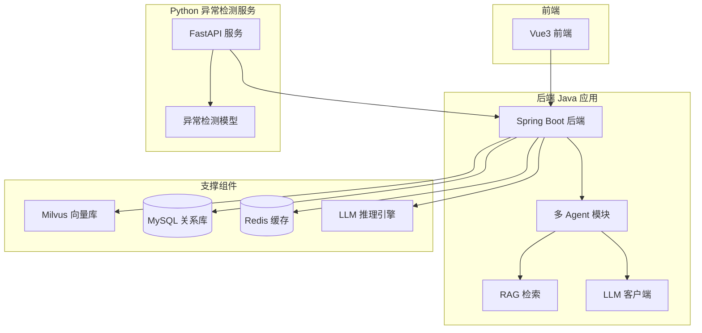
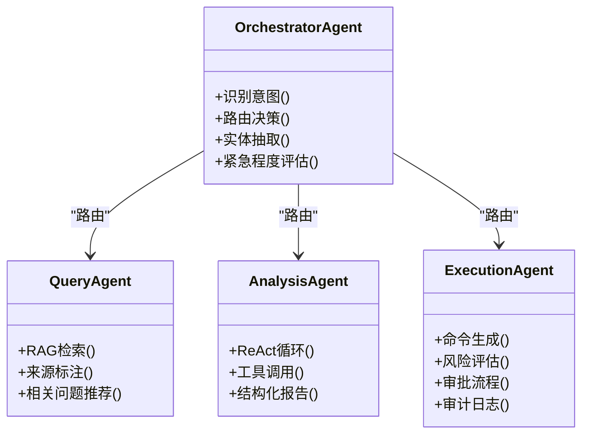
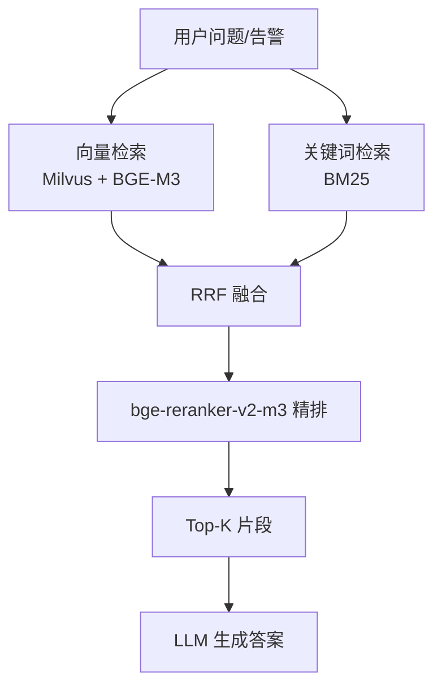
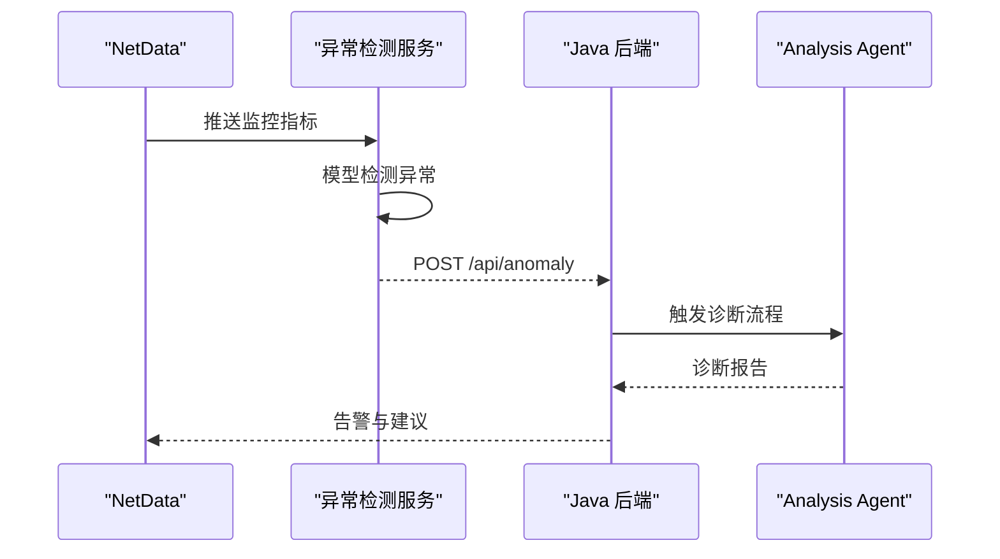
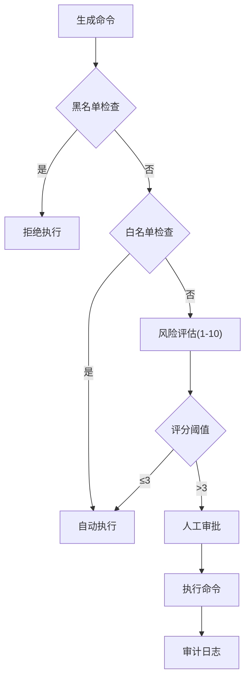
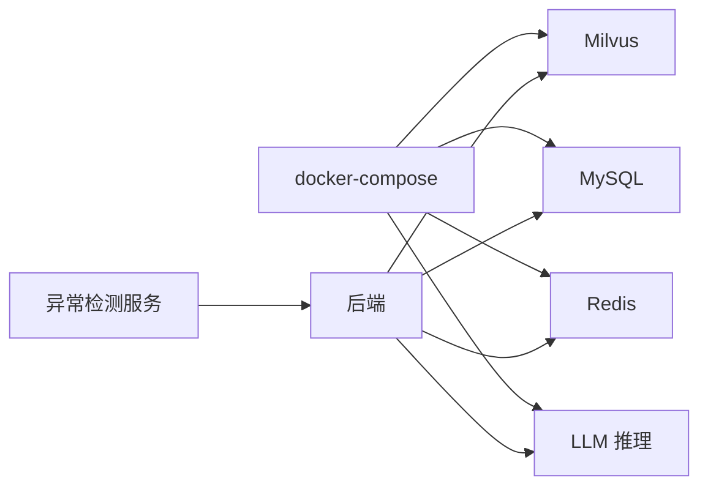

# 项目概述

<cite>
**本文档引用的文件**
- [PROJECT_CONTEXT.md](file://PROJECT_CONTEXT.md)
- [开题报告_精简版.md](file://开题报告_精简版.md)
- [docker-compose.yml](file://docker-compose.yml)
- [config/milvus_collection.yaml](file://config/milvus_collection.yaml)
- [scripts/init_milvus.py](file://scripts/init_milvus.py)
- [docs/prompts/orchestrator-system-prompt.md](file://docs/prompts/orchestrator-system-prompt.md)
- [docs/prompts/query-agent-system-prompt.md](file://docs/prompts/query-agent-system-prompt.md)
- [docs/prompts/analysis-agent-system-prompt.md](file://docs/prompts/analysis-agent-system-prompt.md)
- [docs/prompts/execution-agent-system-prompt.md](file://docs/prompts/execution-agent-system-prompt.md)
- [docs/prompts/shared-safety-constraints.md](file://docs/prompts/shared-safety-constraints.md)
- [sql/init.sql](file://sql/init.sql)
- [scripts/verify-env.ps1](file://scripts/verify-env.ps1)
- [scripts/verify-env.sh](file://scripts/verify-env.sh)
- [文献/文献知识库_完整版.md](file://文献/文献知识库_完整版.md)
</cite>

## 目录
1. [简介](#简介)
2. [项目结构](#项目结构)
3. [核心组件](#核心组件)
4. [架构总览](#架构总览)
5. [详细组件分析](#详细组件分析)
6. [依赖分析](#依赖分析)
7. [性能考虑](#性能考虑)
8. [故障排查指南](#故障排查指南)
9. [结论](#结论)
10. [附录](#附录)

## 简介
本项目面向 NetData 监控数据，构建一个“智能运维问答与执行系统”，旨在通过多 Agent 协同实现“自然语言问答、智能故障诊断、命令执行”的一体化运维能力。系统以 NetData 的高频监控数据为基础，结合异常检测、RAG 知识检索与 LLM 推理，形成“感知-认知-执行”的闭环，显著提升故障定位与处置效率，降低运维成本。

- **核心目标**：将运维经验与大模型能力结合，实现“可解释、可追踪、可执行”的智能运维。
- **技术特色**：Orchestrator-Subagent 多 Agent 架构、混合检索 RAG、ReAct 诊断流程、Human-in-the-Loop 执行审批。
- **业务价值**：缩短故障定位时间、减少误操作风险、沉淀知识资产、提升自动化水平。

**章节来源**
- [PROJECT_CONTEXT.md:16-22](file://PROJECT_CONTEXT.md#L16-L22)
- [开题报告_精简版.md:15-36](file://开题报告_精简版.md#L15-L36)

## 项目结构
项目采用前后端分离与多服务容器化部署的结构，核心分为后端 Java 应用、Python 异常检测服务、Vue3 前端、以及支撑组件（Milvus、MySQL、Redis、Ollama）。通过 docker-compose 统一编排，确保开发与部署的一致性。

**图表来源**
- [docker-compose.yml:23-357](file://docker-compose.yml#L23-L357)
- [PROJECT_CONTEXT.md:120-149](file://PROJECT_CONTEXT.md#L120-L149)

**章节来源**
- [PROJECT_CONTEXT.md:120-149](file://PROJECT_CONTEXT.md#L120-L149)
- [docker-compose.yml:23-357](file://docker-compose.yml#L23-L357)

## 核心组件
- **Orchestrator Agent（编排代理）**：识别用户意图，路由到 Query/Analysis/Execution Agent，汇总结果并输出。
- **Query Agent（问答代理）**：基于混合检索与 rerank 的 RAG 流程，回答运维知识问题。
- **Analysis Agent（诊断代理）**：采用 ReAct 循环，结合工具调用进行根因分析，输出结构化诊断报告。
- **Execution Agent（执行代理）**：生成命令、风险评估、人工审批、执行与审计，确保安全可控。
- **异常检测服务（Python FastAPI）**：使用 PyOD/PySAD 进行异常检测，将结果推送至 Java 后端。
- **RAG 知识库**：Milvus 向量检索 + BM25 关键词检索 + Rerank 精排，构建运维知识库。
- **前端界面（Vue3）**：提供聊天界面、告警看板、知识库浏览、执行审批等交互。

**章节来源**
- [PROJECT_CONTEXT.md:43-61](file://PROJECT_CONTEXT.md#L43-L61)
- [开题报告_精简版.md:118-152](file://开题报告_精简版.md#L118-L152)
- [docs/prompts/orchestrator-system-prompt.md:1-137](file://docs/prompts/orchestrator-system-prompt.md#L1-L137)
- [docs/prompts/query-agent-system-prompt.md:1-95](file://docs/prompts/query-agent-system-prompt.md#L1-L95)
- [docs/prompts/analysis-agent-system-prompt.md:1-45](file://docs/prompts/analysis-agent-system-prompt.md#L1-L45)
- [docs/prompts/execution-agent-system-prompt.md:17-58](file://docs/prompts/execution-agent-system-prompt.md#L17-L58)

## 架构总览
系统采用“Orchestrator-Subagent”多 Agent 架构，围绕三条主线展开：
- **自然语言问答**：用户通过前端输入问题，Orchestrator 识别意图后路由至 Query Agent，结合 RAG 检索与 LLM 推理生成答案。
- **智能故障诊断**：异常检测服务将异常事件推送到后端，Orchestrator 路由至 Analysis Agent，采用 ReAct 循环进行根因分析，输出结构化报告。
- **命令执行**：Analysis Agent 或用户触发的执行请求，经 Execution Agent 风险评估与审批，最终执行并记录审计。

```mermaid
sequenceDiagram
participant U as "用户"
participant FE as "前端"
participant OR as "Orchestrator Agent"
participant QA as "Query Agent"
participant AA as "Analysis Agent"
participant EA as "Execution Agent"
participant RAG as "RAG 检索"
participant LLM as "LLM 推理"
U->>FE : 输入问题/告警
FE->>OR : 提交请求
OR->>OR : 意图识别与路由
alt 知识问答
OR->>QA : 路由到问答代理
QA->>RAG : 混合检索 + 精排
RAG-->>QA : Top-K 知识片段
QA->>LLM : 生成答案
LLM-->>QA : 结构化回答
QA-->>OR : 回答 + 来源
OR-->>FE : 统一回复
else 故障诊断
OR->>AA : 路由到诊断代理
AA->>AA : ReAct 循环思考→行动→观察
AA->>RAG : 查询知识库
AA->>LLM : 结构化诊断报告
AA-->>OR : 诊断结论
OR-->>FE : 诊断结果
else 命令执行
OR->>EA : 路由到执行代理
EA->>EA : 命令生成 + 风险评估
EA->>EA : 人工审批可选
EA->>EA : 执行命令 + 审计记录
EA-->>OR : 执行结果
OR-->>FE : 执行反馈
end
```

**图表来源**
- [PROJECT_CONTEXT.md:43-61](file://PROJECT_CONTEXT.md#L43-L61)
- [docs/prompts/orchestrator-system-prompt.md:37-58](file://docs/prompts/orchestrator-system-prompt.md#L37-L58)
- [docs/prompts/query-agent-system-prompt.md:16-25](file://docs/prompts/query-agent-system-prompt.md#L16-L25)
- [docs/prompts/analysis-agent-system-prompt.md:16-35](file://docs/prompts/analysis-agent-system-prompt.md#L16-L35)
- [docs/prompts/execution-agent-system-prompt.md:60-95](file://docs/prompts/execution-agent-system-prompt.md#L60-L95)

## 详细组件分析

### Orchestrator-Subagent 模式与 Agent 能力
- **Orchestrator Agent**：负责意图识别、路由决策、实体抽取与紧急程度评估，确保请求被正确分派到对应子 Agent。
- **Query Agent**：基于 RAG 的问答能力，支持来源标注、相关问题推荐与知识缺口记录。
- **Analysis Agent**：ReAct 循环，结合指标查询、统计分析、告警关联、知识库检索与服务状态检查，输出结构化诊断报告。
- **Execution Agent**：命令黑名单/白名单/灰名单策略、风险评分算法、审批流程与审计日志，确保安全可控。

**图表来源**
- [docs/prompts/orchestrator-system-prompt.md:16-137](file://docs/prompts/orchestrator-system-prompt.md#L16-L137)
- [docs/prompts/query-agent-system-prompt.md:16-95](file://docs/prompts/query-agent-system-prompt.md#L16-L95)
- [docs/prompts/analysis-agent-system-prompt.md:16-186](file://docs/prompts/analysis-agent-system-prompt.md#L16-L186)
- [docs/prompts/execution-agent-system-prompt.md:17-192](file://docs/prompts/execution-agent-system-prompt.md#L17-L192)

**章节来源**
- [docs/prompts/orchestrator-system-prompt.md:26-137](file://docs/prompts/orchestrator-system-prompt.md#L26-L137)
- [docs/prompts/query-agent-system-prompt.md:22-95](file://docs/prompts/query-agent-system-prompt.md#L22-L95)
- [docs/prompts/analysis-agent-system-prompt.md:129-186](file://docs/prompts/analysis-agent-system-prompt.md#L129-L186)
- [docs/prompts/execution-agent-system-prompt.md:121-229](file://docs/prompts/execution-agent-system-prompt.md#L121-L229)

### RAG 检索与知识库
- **混合检索**：向量检索（Milvus + BGE-M3 1024 维）+ 关键词检索（BM25），通过 RRF 融合与 bge-reranker-v2-m3 精排，Top-K 注入 Prompt。
- **文档切分**：采用语义切分（Semantic Chunking），避免固定长度带来的语义割裂。
- **向量库配置**：Collection 名称、字段定义、索引类型（IVF_FLAT）、nlist/nprobe、Top-K 等参数均在配置文件中明确。

**图表来源**
- [开题报告_精简版.md:191-221](file://开题报告_精简版.md#L191-L221)
- [config/milvus_collection.yaml:22-101](file://config/milvus_collection.yaml#L22-L101)
- [scripts/init_milvus.py:133-242](file://scripts/init_milvus.py#L133-L242)

**章节来源**
- [开题报告_精简版.md:191-221](file://开题报告_精简版.md#L191-L221)
- [config/milvus_collection.yaml:22-186](file://config/milvus_collection.yaml#L22-L186)
- [scripts/init_milvus.py:133-320](file://scripts/init_milvus.py#L133-L320)

### 异常检测与告警联动
- **异常检测服务**：使用 FastAPI 暴露 detect/train/health 接口，结合 PyOD/PySAD 进行无监督/流式异常检测。
- **告警联动**：异常检测结果通过 REST 推送至 Java 后端，触发 Analysis Agent 进行根因分析与建议生成。

**图表来源**
- [开题报告_精简版.md:163-189](file://开题报告_精简版.md#L163-L189)

**章节来源**
- [开题报告_精简版.md:163-189](file://开题报告_精简版.md#L163-L189)

### 执行审批与安全约束
- **命令黑名单/白名单/灰名单**：严格区分禁止、可自动执行与需审批的命令类别。
- **风险评估与审批流程**：1-10 分评分，映射到 LOW/MEDIUM/HIGH/CRITICAL，不同风险等级采用不同审批策略。
- **审计日志**：记录命令生成、审批、执行全过程，满足合规与追溯需求。

**图表来源**
- [docs/prompts/execution-agent-system-prompt.md:19-95](file://docs/prompts/execution-agent-system-prompt.md#L19-L95)
- [docs/prompts/execution-agent-system-prompt.md:100-171](file://docs/prompts/execution-agent-system-prompt.md#L100-L171)
- [docs/prompts/shared-safety-constraints.md:29-127](file://docs/prompts/shared-safety-constraints.md#L29-L127)

**章节来源**
- [docs/prompts/execution-agent-system-prompt.md:19-229](file://docs/prompts/execution-agent-system-prompt.md#L19-L229)
- [docs/prompts/shared-safety-constraints.md:29-396](file://docs/prompts/shared-safety-constraints.md#L29-L396)

## 依赖分析
- **容器编排**：docker-compose 统一管理 Milvus、MySQL、Redis、Ollama 等基础服务，便于开发与部署。
- **数据与检索**：MySQL 存储用户、对话、命令审计、告警与配置；Milvus 存储知识库向量；Redis 用于缓存与分布式锁。
- **模型与推理**：BGE-M3 1024 维嵌入模型，DeepSeek-V3 API（主）+ Ollama（本地调试）双 LLM 方案，通过 Spring AI ChatClient 统一接入。

**图表来源**
- [docker-compose.yml:23-357](file://docker-compose.yml#L23-L357)
- [PROJECT_CONTEXT.md:25-40](file://PROJECT_CONTEXT.md#L25-L40)

**章节来源**
- [docker-compose.yml:23-357](file://docker-compose.yml#L23-L357)
- [PROJECT_CONTEXT.md:25-40](file://PROJECT_CONTEXT.md#L25-L40)

## 性能考虑
- **RAG 检索性能**：通过 IVF_FLAT 索引与合理的 nlist/nprobe 参数平衡精度与速度；Top-K 控制在 5 左右，降低 LLM 上下文长度。
- **异常检测延迟**：Python 服务与 Java 服务通过 REST 通信，需设置合理超时与重试策略，避免大数据量下的超时。
- **系统吞吐**：前端聊天与审批界面采用 WebSocket/长连接，后端通过异步任务与缓存（Redis）提升并发处理能力。
- **资源分配**：Milvus 对内存敏感，建议 Docker 分配至少 8GB 内存；Ollama 本地推理需 GPU 支持以提升响应速度。

**章节来源**
- [开题报告_精简版.md:327-334](file://开题报告_精简版.md#L327-L334)
- [config/milvus_collection.yaml:54-101](file://config/milvus_collection.yaml#L54-L101)
- [开题报告_精简版.md:337-348](file://开题报告_精简版.md#L337-L348)

## 故障排查指南
- **环境检查**：使用 verify-env.ps1（Windows）或 verify-env.sh（Linux/macOS）检查 Docker、端口占用、配置文件与服务健康状态。
- **服务健康**：通过 docker-compose logs 查看各容器日志，关注 Milvus、MySQL、Redis、Ollama 的启动与健康状态。
- **RAG 初始化**：使用 init_milvus.py 初始化 Milvus Collection、创建索引、加载数据并进行搜索测试。
- **数据库初始化**：首次启动时自动执行 sql/init.sql，创建用户、对话、命令审计、告警、异常检测与配置表。

**章节来源**
- [scripts/verify-env.ps1:1-251](file://scripts/verify-env.ps1#L1-L251)
- [scripts/verify-env.sh:1-318](file://scripts/verify-env.sh#L1-L318)
- [scripts/init_milvus.py:457-516](file://scripts/init_milvus.py#L457-L516)
- [sql/init.sql:18-246](file://sql/init.sql#L18-L246)

## 结论
本项目通过“Orchestrator-Subagent”多 Agent 架构，将自然语言问答、智能故障诊断与安全执行有机结合，借助混合检索 RAG、ReAct 诊断与 Human-in-the-Loop 审批，形成可解释、可追踪、可执行的智能运维闭环。项目采用 Spring Boot、Spring AI、Python FastAPI、Vue3 等技术栈，既满足学术研究的深度，也兼顾工程落地的可维护性与扩展性。

**章节来源**
- [PROJECT_CONTEXT.md:16-22](file://PROJECT_CONTEXT.md#L16-L22)
- [开题报告_精简版.md:305-323](file://开题报告_精简版.md#L305-L323)

## 附录
- **技术栈选择理由**：
  - Spring Boot：企业级微服务框架，生态完善，易于集成。
  - Spring AI：统一 LLM 客户端抽象，ChatClient 替代废弃的 AiClient。
  - Python FastAPI：高性能异步服务，适合异常检测与工具服务。
  - Vue3 + Element Plus：现代化前端开发体验，组件丰富。
  - Milvus：成熟的向量数据库，支持高维向量检索与索引。
  - MySQL/Redis：关系型与缓存数据库，满足审计与性能需求。
  - LLM：DeepSeek-V3 API 主用，Ollama 本地调试，支持 Profile 切换。
- **应用场景与业务价值**：
  - 适用于企业 IT 基础设施与云原生环境，覆盖告警分析、知识问答、自动化修复等场景。
  - 通过 RAG 知识库缓解“幻觉”，通过安全策略与审批流程降低误操作风险。
- **学习与实践建议**：
  - 从环境搭建与容器编排入手，逐步实现异常检测、RAG 检索与 Agent 能力。
  - 注重 Prompt 管理、安全约束与审计日志设计，确保系统可维护与可审计。

**章节来源**
- [PROJECT_CONTEXT.md:25-40](file://PROJECT_CONTEXT.md#L25-L40)
- [开题报告_精简版.md:95-112](file://开题报告_精简版.md#L95-L112)
- [PROJECT_CONTEXT.md:110-117](file://PROJECT_CONTEXT.md#L110-L117)