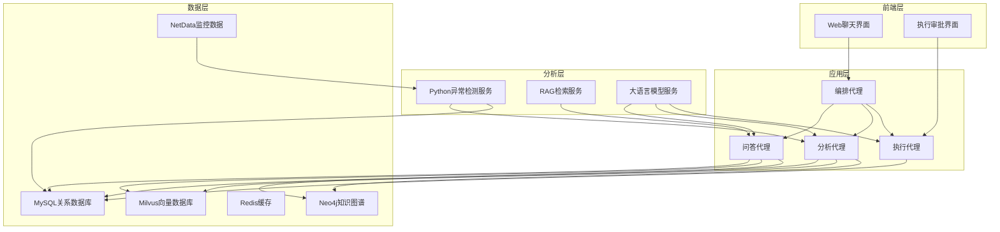
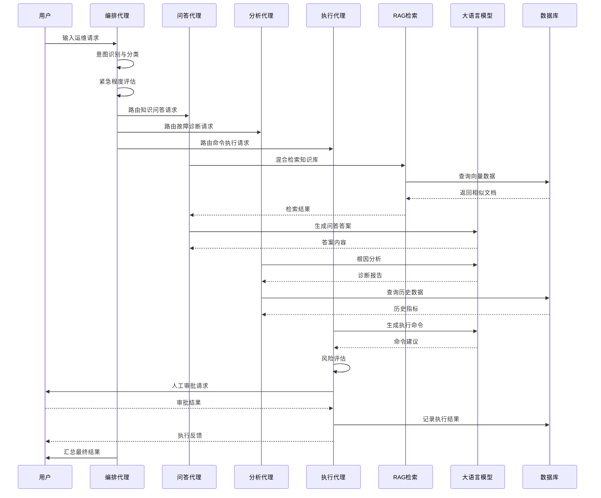
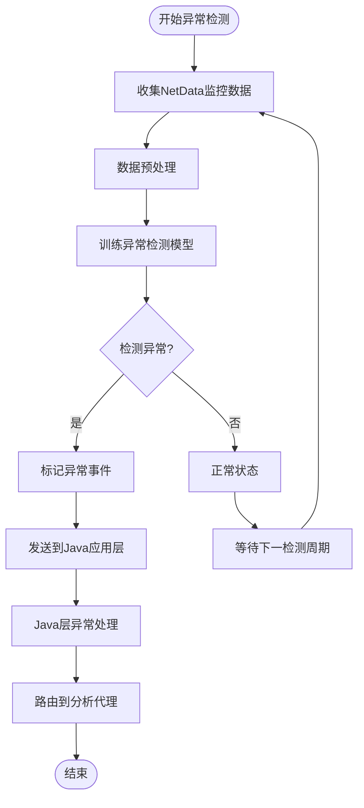
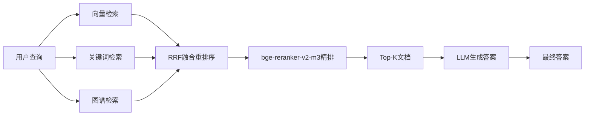
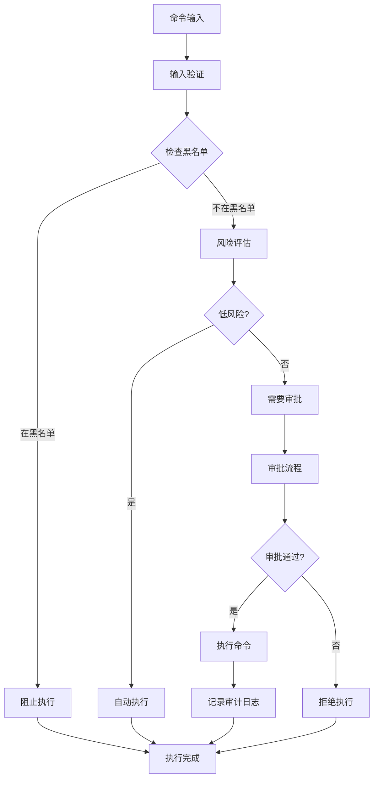
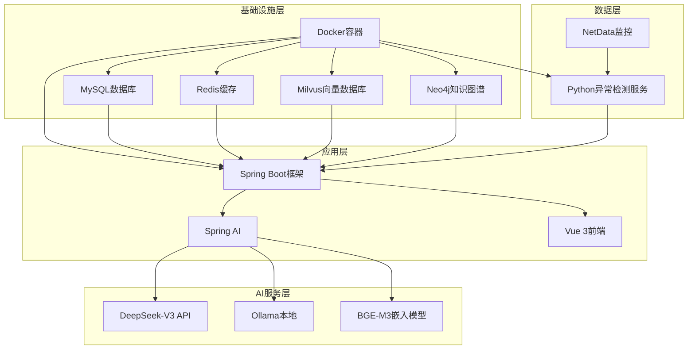

# 项目背景与意义

<cite>
**本文引用的文件**
- [开题报告_精简版.md](file://开题报告_精简版.md)
- [PROJECT_CONTEXT.md](file://PROJECT_CONTEXT.md)
- [docker-compose.yml](file://docker-compose.yml)
- [orchestrator-system-prompt.md](file://docs/prompts/orchestrator-system-prompt.md)
- [shared-safety-constraints.md](file://docs/prompts/shared-safety-constraints.md)
- [文献综述汇编.md](file://文献/文献综述汇编.md)
- [文献知识库_完整版.md](file://文献/文献知识库_完整版.md)
</cite>

## 目录
1. [引言](#引言)
2. [项目结构](#项目结构)
3. [核心组件](#核心组件)
4. [架构概览](#架构概览)
5. [详细组件分析](#详细组件分析)
6. [依赖分析](#依赖分析)
7. [性能考虑](#性能考虑)
8. [故障排除指南](#故障排除指南)
9. [结论](#结论)
10. [附录](#附录)

## 引言

本项目旨在构建一个面向 NetData 监控数据的智能运维问答与执行系统，通过多 Agent 协同架构，将传统运维模式从"被动告警"升级为"主动分析"，从"人工处置"演进为"自主决策"。该项目不仅解决了当前运维工作的四大核心痛点——故障复杂性与定位难度的矛盾、响应时效性与人工效率的矛盾、知识传承与人员流动的矛盾，以及传统运维方式的局限性，更是为智能运维（AIOps）的发展提供了可落地的实践路径。

### 当前运维工作的痛点与挑战

**第一，故障复杂性与定位难度的矛盾。** 分布式系统的故障往往具有跨域传播、级联影响的特点。一个底层网络故障可能导致上层多个应用服务异常，而表现层的性能下降可能源于深层的数据库瓶颈。传统基于规则的告警关联分析方法难以捕捉这种复杂的故障传播模式，导致故障根因定位困难。

**第二，响应时效性与人工效率的矛盾。** 在7×24小时不间断运行的互联网服务场景下，任何延迟的故障响应都可能导致严重的业务损失。然而，人工运维受限于工作时间和响应速度，无法实现真正意义上的实时故障检测和快速响应。

**第三，知识传承与人员流动的矛盾。** 运维工作高度依赖专家经验，资深运维工程师积累的故障处理知识往往以非结构化的形式存储在个人笔记或大脑中。当这些专家离职或转岗时，宝贵的运维知识随之流失，新入职的运维人员需要漫长的学习周期才能独立处理复杂故障。

**第四，传统运维方式的局限性。** 传统运维模式依赖人工经验，效率低、响应慢，且容易受到主观因素影响。面对海量监控数据和复杂的故障场景，人工运维已经难以满足现代企业对运维效率和质量的要求。

### 基于 NetData 监控数据构建智能运维平台的必要性

NetData 作为一款轻量级开源实时性能监控解决方案，自2016年发布以来，凭借其独特的技术优势，迅速成为智能运维系统感知层的理想基础设施选择。NetData的核心技术优势体现在以下几个方面：

**超低资源占用特性。** NetData采用C语言编写，经过精心优化的数据采集引擎实现了极致的资源效率。在典型的生产环境中，NetData的CPU占用率低于1%，内存消耗仅数十MB，磁盘I/O占用几乎可以忽略不计。这种超低资源占用的特性使得NetData可以在生产服务器上直接部署，而不会对被监控系统的性能产生明显影响。

**高频数据采集能力。** NetData支持1秒级的高频数据采集，能够捕获传统分钟级采集工具无法发现的瞬时性能波动。这对于检测短时的CPU峰值、内存泄漏、网络抖动等瞬态异常具有重要意义。高频采集能力为智能运维系统提供了高保真、低延迟的时序指标数据，是实现实时异常检测和快速故障响应的数据基础。

**多源异构数据兼容。** NetData内置了数百种数据收集插件，支持操作系统（Linux、Windows、macOS）、容器（Docker、Kubernetes）、数据库（MySQL、PostgreSQL、MongoDB等）、Web服务器（Nginx、Apache等）、消息队列（Kafka、RabbitMQ等）等各类基础设施和中间件的监控。这种广泛的数据源兼容性使得NetData可以作为统一的监控数据采集平台，避免了多工具并存带来的数据孤岛问题。

**实时可视化与告警能力。** NetData提供了丰富的实时可视化仪表盘，运维人员可以通过Web界面实时查看各项指标的变化趋势。同时，NetData支持基于阈值的告警配置，当指标超出预设范围时，可以通过邮件、Slack、PagerDuty等多种渠道发送告警通知。

**边缘部署友好性。** NetData的轻量级特性使其特别适合在边缘节点部署。在物联网、工业互联网等边缘计算场景中，边缘设备的计算资源往往非常有限，传统的重量级监控工具难以部署运行。NetData的超低资源占用使其可以在电力网关、变电站设备、网络交换机等边缘节点上稳定运行，为边缘智能运维提供数据采集能力。

### 项目的创新价值与技术特色

本项目通过多 Agent 协同架构，将自然语言问答、智能故障诊断、命令执行等核心能力有机整合，形成了完整的智能运维解决方案。项目的主要创新价值体现在以下几个方面：

**NetData+LLM 的首次结合。** 现有研究多针对通用监控数据或特定行业的专用数据，缺乏针对 NetData 这一特定监控平台的智能 Agent 设计。本系统针对 NetData 的高频采集、超低资源占用特性，设计了专门的 Python+Java 混合架构。

**国内生态适配。** IncidentFox 基于 Slack，本系统适配国内生态（微信/企业微信），更适合国内企业使用。

**自动化执行。** IncidentFox 只提供建议，本系统不仅可以提供建议，还能自动执行修复命令（在安全范围内）。

**RAG 增强。** 构建运维知识库，缓解大模型"幻觉"问题，提升回答准确性。

## 项目结构

本项目采用分层架构设计，通过 Docker Compose 实现服务编排，构建了一个完整的智能运维生态系统。项目结构清晰，职责分明，便于维护和扩展。

**图表来源**
- [docker-compose.yml:23-357](file://docker-compose.yml#L23-L357)
- [PROJECT_CONTEXT.md:120-149](file://PROJECT_CONTEXT.md#L120-L149)

### 技术栈与组件

项目采用现代化的技术栈，确保了系统的高性能、可扩展性和易维护性：

**后端框架：** Spring Boot 3.3.x（Java 主语言），提供企业级的微服务架构支持

**AI 框架：** Spring AI 1.0.x，统一抽象接口，简化大语言模型集成

**异常检测：** Python FastAPI + PyOD + PySAD，专门的异常检测微服务

**向量数据库：** Milvus 2.4，支持向量检索和相似度计算

**LLM：** DeepSeek-V3 API（主）+ Ollama 本地作为开发调试备用

**嵌入模型：** BGE-M3 本地，维度 1024，早期固定不能更换

**前端：** Vue 3 + Element Plus，现代化的用户界面

**关系数据库：** MySQL 8.0，存储结构化数据

**缓存：** Redis 7.x，提供高速缓存和会话管理

**知识图谱：** Neo4j（可选），用于复杂关系建模

**容器编排：** Docker Compose，简化服务部署和管理

**章节来源**
- [PROJECT_CONTEXT.md:25-40](file://PROJECT_CONTEXT.md#L25-L40)

## 核心组件

### 编排代理（Orchestrator Agent）

编排代理是整个多 Agent 系统的中枢神经，负责意图识别、任务路由和结果汇总。它扮演着资深运维架构师和智能调度专家的角色，具备精准识别用户意图、智能路由至专业子代理、汇总多代理结果生成连贯回复的核心能力。

**意图识别与分类：**
- 知识问答（KNOWLEDGE_QUERY）：如"如何配置NetData的内存监控阈值？"
- 故障诊断（FAULT_DIAGNOSIS）：如"CPU使用率突然飙升到95%，帮我排查"
- 命令执行（COMMAND_EXECUTE）：如"帮我重启nginx服务"
- 混合意图（HYBRID）：同时包含多个类型的复杂请求

**路由决策规则：**
编排代理采用智能路由策略，根据意图类型和紧急程度选择最优的执行路径。单一意图采用直接路由，混合意图遵循特定的执行顺序：诊断 + 执行 → Analysis → Execution，问答 + 诊断 → Query → Analysis，诊断 + 问答 + 执行 → Query → Analysis → Execution。

**紧急程度评估：**
系统建立了完善的紧急程度评估体系，从低到高分为 LOW、MEDIUM、HIGH、CRITICAL 四个等级，确保关键问题得到优先处理。

**章节来源**
- [orchestrator-system-prompt.md:1-137](file://docs/prompts/orchestrator-system-prompt.md#L1-L137)

### 问答代理（Query Agent）

问答代理专注于基于 RAG（检索增强生成）的知识问答能力，通过混合检索策略实现精准的答案生成。该代理能够处理各种运维相关的知识查询，提供准确、及时的运维指导。

**混合检索策略：**
- 向量检索（Milvus，BGE-M3 Embedding）：基于语义相似度的深度匹配
- 关键词检索（BM25）：基于关键词匹配的传统方法
- RRF 融合重排序：平衡不同检索方法的结果
- bge-reranker-v2-m3 精排：进一步提升检索质量

**文档切分策略：**
采用按语义切分（Semantic Chunking）而非固定长度的方法，确保每个知识片段具有完整的意义和上下文。

**章节来源**
- [PROJECT_CONTEXT.md:64-82](file://PROJECT_CONTEXT.md#L64-L82)

### 分析代理（Analysis Agent）

分析代理采用 ReAct（推理-行动-反思）模式，通过多步工具调用实现结构化的故障诊断报告。该代理能够处理复杂的故障分析任务，提供深入的根因分析和趋势预测。

**ReAct 模式特点：**
- 思考（Reason）：分析问题本质和可能的根因
- 行动（Act）：调用各种工具进行数据收集和分析
- 观察（Observe）：评估行动结果并调整分析策略
- 再思考（Reflect）：基于新信息重新评估和优化方案

**工具调用能力：**
分析代理能够调用多种工具进行综合分析，包括但不限于：指标数据分析、日志分析、配置检查、网络诊断等。

**章节来源**
- [PROJECT_CONTEXT.md:59-60](file://PROJECT_CONTEXT.md#L59-L60)

### 执行代理（Execution Agent）

执行代理负责生成命令、风险评估、人工审批和执行记录的全流程管理。该代理确保所有运维操作都在严格的安全控制下进行，实现从建议到执行的完整闭环。

**安全执行机制：**
- 命令黑名单：绝对禁止的危险命令
- 审批流程：根据风险等级实施分级审批
- 审计日志：完整记录所有操作过程
- 回滚机制：提供操作失败时的自动回滚

**风险评估体系：**
系统建立了完善的风险评估体系，将操作风险分为低、中、高、极高四个等级，对应不同的审批流程和安全措施。

**章节来源**
- [shared-safety-constraints.md:29-127](file://docs/prompts/shared-safety-constraints.md#L29-L127)

## 架构概览

本项目采用 Orchestrator-Subagent 模式的多 Agent 架构，通过清晰的职责分工和高效的通信机制，实现了智能运维的全流程自动化。

**图表来源**
- [PROJECT_CONTEXT.md:43-61](file://PROJECT_CONTEXT.md#L43-L61)
- [orchestrator-system-prompt.md:16-23](file://docs/prompts/orchestrator-system-prompt.md#L16-L23)

### Agent 协同工作机制

多 Agent 系统通过消息队列实现松耦合的协同工作。感知 Agent 负责持续监控和异常检测，一旦发现异常立即通知分析 Agent；分析 Agent 进行根因分析并将结果推送给决策 Agent；决策 Agent 生成建议并执行或等待人工确认。执行结果反馈给感知 Agent 进行效果验证，形成感知-分析-决策-执行的闭环。

**通信协议：**
系统采用 REST API 和消息队列相结合的方式，确保 Agent 间的高效通信。对于实时性要求高的场景使用消息队列，对于同步操作使用 REST API。

**结果融合机制：**
多 Agent 的输出通过编排代理进行统一汇总，确保用户获得连贯、一致的回复体验。

**章节来源**
- [PROJECT_CONTEXT.md:59-61](file://PROJECT_CONTEXT.md#L59-L61)

## 详细组件分析

### 异常检测模块

异常检测模块是智能运维系统的核心感知组件，负责实时监控系统状态并及时发现异常情况。该模块采用 Python FastAPI 构建，集成了 PyOD 和 PySAD 两种异常检测算法，实现了无监督和流式数据的双重检测能力。

**图表来源**
- [开题报告_精简版.md:163-169](file://开题报告_精简版.md#L163-L169)

**算法选择策略：**
- PyOD：用于无监督异常检测，适用于历史数据驱动的离线分析
- PySAD：用于流式数据异常检测，适用于实时在线监控场景

**检测精度优化：**
通过合理的数据预处理、特征工程和模型参数调优，确保异常检测的准确性和可靠性。

**章节来源**
- [开题报告_精简版.md:163-169](file://开题报告_精简版.md#L163-L169)

### RAG 知识检索模块

RAG（检索增强生成）模块是问答代理的核心能力，通过混合检索策略实现精准的知识问答。该模块构建了完整的运维知识库，支持向量检索、关键词检索和多模态检索的融合。

**混合检索架构：**

**图表来源**
- [PROJECT_CONTEXT.md:64-82](file://PROJECT_CONTEXT.md#L64-L82)

**文档切分策略：**
采用按语义切分（Semantic Chunking）而非固定长度的方法，确保每个知识片段具有完整的意义和上下文。这种方法能够更好地保持知识的完整性，提高检索的准确性。

**检索优化技术：**
- RRF（Reciprocal Rank Fusion）：平衡不同检索方法的结果
- bge-reranker-v2-m3：基于语义相似度的精排算法
- 多模态融合：结合文本、结构化数据和图像信息

**章节来源**
- [PROJECT_CONTEXT.md:64-82](file://PROJECT_CONTEXT.md#L64-L82)

### 安全执行模块

安全执行模块是整个系统最重要的安全保障，确保所有运维操作都在严格的控制下进行。该模块建立了完善的权限控制、风险评估和审计追踪体系。

**安全约束体系：**

**图表来源**
- [shared-safety-constraints.md:29-127](file://docs/prompts/shared-safety-constraints.md#L29-L127)

**权限控制矩阵：**
系统定义了完整的角色权限矩阵，从普通查看者到超级管理员，每个角色都有明确的操作权限范围。权限控制贯穿整个系统，确保最小权限原则的实施。

**审计追踪机制：**
所有操作都被完整记录，包括操作人、时间、内容、结果等信息。审计日志不仅用于合规要求，更重要的是为故障排查和系统优化提供数据支持。

**章节来源**
- [shared-safety-constraints.md:233-259](file://docs/prompts/shared-safety-constraints.md#L233-L259)

## 依赖分析

### 技术依赖关系

本项目的技术依赖关系呈现明显的分层特征，从基础设施到应用层形成了完整的依赖链条。

**图表来源**
- [docker-compose.yml:23-357](file://docker-compose.yml#L23-L357)
- [PROJECT_CONTEXT.md:25-40](file://PROJECT_CONTEXT.md#L25-L40)

### 外部依赖管理

项目对外部依赖采用了严格的版本管理和安全控制策略：

**版本锁定策略：**
- Spring Boot 3.3.x：确保框架稳定性
- Spring AI 1.0.x：避免频繁的API变更
- Milvus 2.4：稳定的向量数据库版本
- BGE-M3 1024维：固定的嵌入模型维度

**安全更新策略：**
定期审查依赖包的安全漏洞，及时更新到安全版本。对于关键依赖采用手动更新策略，确保更新的可控性。

**依赖冲突解决：**
通过 Maven 和 Python 的依赖管理工具，自动解决版本冲突问题，确保系统的稳定运行。

**章节来源**
- [PROJECT_CONTEXT.md:110-117](file://PROJECT_CONTEXT.md#L110-L117)

## 性能考虑

### 系统性能优化策略

智能运维系统需要在实时性、准确性、可扩展性之间找到平衡点。本项目采用了多层次的性能优化策略，确保系统能够在高负载环境下稳定运行。

**实时性优化：**
- NetData 1秒级数据采集，确保监控数据的实时性
- 异步处理机制，避免阻塞关键路径
- 缓存策略优化，减少重复计算和数据库访问

**准确性保障：**
- 多模型融合：结合统计模型和机器学习模型提高检测准确性
- 上下文感知：利用历史数据和上下文信息提高分析准确性
- 不确定性量化：对检测结果提供置信度评估

**可扩展性设计：**
- 微服务架构：各组件独立部署，便于水平扩展
- 无状态设计：减少服务间的耦合，提高系统的弹性
- 容器化部署：利用Docker的编排能力实现动态扩缩容

### 性能监控与调优

系统内置了完善的性能监控机制，能够实时跟踪关键性能指标：

**关键性能指标：**
- 响应时间：从用户请求到结果返回的总时间
- 吞吐量：单位时间内处理的请求数量
- 异常率：系统错误和异常的比例
- 资源利用率：CPU、内存、存储等系统资源的使用情况

**监控告警机制：**
建立多层次的监控告警机制，包括系统级告警、业务级告警和性能告警，确保问题能够被及时发现和处理。

## 故障排除指南

### 常见问题诊断

**Agent 通信问题：**
- 检查 Docker 网络配置是否正确
- 验证服务间的端口映射和防火墙设置
- 确认消息队列的可用性和配置

**性能问题：**
- 监控系统资源使用情况，识别瓶颈所在
- 检查数据库连接池配置和索引优化
- 分析日志文件，查找异常和错误信息

**数据一致性问题：**
- 验证数据同步机制的正确性
- 检查事务处理和回滚机制
- 确认数据备份和恢复策略的有效性

### 系统维护最佳实践

**定期维护：**
- 清理过期数据和日志文件
- 更新模型和算法参数
- 优化数据库性能和索引

**安全加固：**
- 定期更新系统和依赖包的安全补丁
- 审计用户权限和访问日志
- 测试应急响应预案的有效性

**监控改进：**
- 根据实际使用情况调整监控阈值
- 扩展监控覆盖范围，包括新的业务场景
- 优化告警策略，减少误报和漏报

**章节来源**
- [shared-safety-constraints.md:360-387](file://docs/prompts/shared-safety-constraints.md#L360-L387)

## 结论

本智能运维问答与执行系统通过多 Agent 协同架构，成功地将传统运维模式升级为智能化、自动化的运维体系。项目不仅解决了当前运维工作的四大核心痛点，更为智能运维（AIOps）的发展提供了可落地的实践路径。

### 技术价值总结

**技术创新性：** 项目首次将 NetData 监控数据与大语言模型相结合，构建了专门的智能运维 Agent 架构，具有重要的技术创新价值。

**实用性价值：** 系统能够直接提升运维效率，包括故障检测更实时、故障诊断更智能、故障处置更自动化、运维知识自动沉淀等方面。

**可扩展性：** 采用微服务架构和容器化部署，为系统的横向扩展和功能扩展提供了良好的基础。

### 社会意义与教育价值

**行业推动作用：** 项目为智能运维技术的发展提供了实践经验，有助于推动整个行业向智能化转型。

**人才培养价值：** 项目涵盖了现代软件工程的各个方面，包括微服务架构、容器化部署、AI集成、安全控制等，具有重要的教学和培训价值。

**职业发展意义：** 对于学习 Agent 开发和准备大厂面试的开发者而言，该项目提供了宝贵的学习资源和实践机会，有助于提升技术水平和就业竞争力。

### 未来发展方向

**技术演进：** 随着大语言模型和人工智能技术的不断发展，系统将持续优化和升级，提升智能化水平。

**应用场景扩展：** 系统的设计具有良好的通用性，可以扩展到更多的应用场景和行业领域。

**生态建设：** 项目将促进智能运维生态的建设，包括工具链完善、标准制定、人才培养等方面。

通过本项目的实施，我们相信智能运维技术将得到更好的应用和发展，为数字化转型和智能化升级提供强有力的技术支撑。

## 附录

### 参考文献

本项目的研究和开发得到了大量国内外相关文献的支持，涵盖了智能运维、多 Agent 系统、RAG 检索等多个领域的前沿研究成果。

**国内研究进展：**
- 裴丹等提出的智能运维架构，为本项目提供了理论基础
- 江洁等基于大模型的多智能体 API 网关监控系统，为系统设计提供了参考
- 多篇关于大模型 Agent 驱动的运维合规异常处理的研究成果

**国际研究现状：**
- 多个国际会议和期刊上发表的智能运维相关论文
- 基于多 Agent 的故障诊断和根因分析研究
- RAG 增强的智能问答系统相关技术

**技术标准与规范：**
- 相关的运维标准和最佳实践
- 安全和隐私保护的技术规范
- 性能优化和系统设计的标准

**章节来源**
- [文献综述汇编.md:1-800](file://文献/文献综述汇编.md#L1-L800)
- [文献知识库_完整版.md:1-623](file://文献/文献知识库_完整版.md#L1-L623)